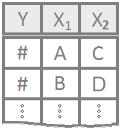

<script type="text/javascript">
 function showhide(id) {
    var e = document.getElementById(id);
    e.style.display = (e.style.display == 'block') ? 'none' : 'block';
 }
 
 function openTab(evt, tabName) {
    var i, tabcontent, tablinks;
    tabcontent = document.getElementsByClassName("tabcontent");
    for (i = 0; i < tabcontent.length; i++) {
        tabcontent[i].style.display = "none";
    }
    tablinks = document.getElementsByClassName("tablinks");
    for (i = 0; i < tablinks.length; i++) {
        tablinks[i].className = tablinks[i].className.replace(" active", "");
    }
    document.getElementById(tabName).style.display = "block";
    evt.currentTarget.className += " active";
 }
</script>


----

An ANOVA is for testing the equality of several means simultaneously. A single *quantitative* response variable is required with one or more *qualitative* explanatory variables, i.e., factors. 

<div style="font-size:0.8em;">Note: A factor is defined as a qualitative variable containing at least two categories. The categories of the factor are referred to as the "levels" of the factor.</div>

----


### One-way ANOVA {.tabset .tabset-fade .tabset-pills}

<div style="float:left;width:125px;" align=center>

</div>

Each experimental unit is assigned to exactly one factor-level combination. Another way to say this is "one measurement per individual" (no repeated measures) and "equal numbers of individuals per group".

#### Overview

<div style="padding-left:125px;">
An ANOVA is only appropriate when all of the following are satisfied.

1. The sample(s) of data can be considered to be representative of their population(s).

2. The data is normally distributed in each group. (This can safely be assumed to be satisfied when the *residuals* from the ANOVA can be assumed to be normally distributed when seen in a Q-Q Plot.)

3. The population variance of each group can be assumed to be the same. (This can be safely assumed to be satisfied when the *residuals* from the ANOVA show constant variance, i.e., are similarly vertically spread out in a Residuals versus fitted-values plot.)

**Hypotheses**

For a One-way ANOVA

$$
  H_0: \mu_1 = \mu_2 = \ldots = \mu
$$
$$
  H_a: \mu_i \neq \mu \ \text{for at least one} \ i
$$


**Mathematical Model**

A typical model for a one-way ANOVA is of the form
$$
  Y_{ij} = \mu_i + \epsilon_{ij}
$$
where $\mu_i$ is the mean for level (group) $i$, and $\epsilon_{ij} \sim N(0,\sigma^2)$ is the error term for each point $j$ within level (group) $i$. 


----

</div>


#### R Instructions

<div style="padding-left:125px;">

**Console** Help Command: `?aov()`

* `myaov` is some name you come up with to store the results of the `aov()` test.
* `Y` must be a "numeric" vector of the quantitative response variable.
* `X` is a qualitative variable (should have `class(X)` equal to `factor` or `character`. If it does not, use `as.factor(X)` inside the `aov(Y ~ as.factor(X),...)` command.
* `YourDataSet` is the name of your data set.


**Perform the ANOVA**

`myaov <- aov(Y ~ X, data=YourDataSet)` 

`summary(myaov)` 


**Diagnose ANOVA Assumptions**  

`par(mfrow=c(1,2))`

`plot(myaov, which=1:2)` 


<br/>


**Example Code** 

Hover your mouse over the example codes to learn more.


*Perform the ANOVA*

<a href="javascript:showhide('oneWayAnova')">
<div class="hoverchunk">
<span class="tooltipr">
chick.aov&nbsp;<-&nbsp; 
  <span class="tooltiprtext"> Saves the results of the ANOVA test as an object named 'chick.aov'.</span>
</span><span class="tooltipr">
aov(
  <span class="tooltiprtext">'aov()' is a function in R used to perform the ANOVA.</span>
</span><span class="tooltipr">
weight
  <span class="tooltiprtext">Y is 'weight', which is a numeric variable from the chickwts dataset.</span>
</span><span class="tooltipr">
&nbsp;~&nbsp;
  <span class="tooltiprtext">'~' is the tilde symbol used to separate the Y and X in a model formula.</span>
</span><span class="tooltipr">
feed, 
  <span class="tooltiprtext">X is 'feed', which is a qualitative variable in the chickwts dataset, or more specifically, a factor with six levels: "casein", "horsebean", and so on... Use str(chickwts) to see this. </span>
</span><span class="tooltipr">
&nbsp;data&nbsp;=&nbsp;chickwts)
  <span class="tooltiprtext"> 'chickwts' is a dataset in R.</span>
  </span><br><span class="tooltipr">
summary(
  <span class="tooltiprtext"> 'summary()' shows the results of the ANOVA.</span>
  </span><span class="tooltipr">
chick.aov)
  <span class="tooltiprtext"> 'chick.aov' is the name of the ANOVA.</span>
  </span><span class="tooltipr">
&nbsp;&nbsp;&nbsp;&nbsp;  
  <span class="tooltiprtext">Press Enter to run the code if you have typed it in yourself. You can also click here to view the output.</span>
</span><span class="tooltipr" style="float:right;font-size:.8em;">
&nbsp;Click to View Output&nbsp; 
  <span class="tooltiprtext">Click to View Output.</span>
</span>
</div>
</a>
<div id="oneWayAnova" style="display:none;">
```{r, echo=FALSE}
chick.aov <- aov(weight ~ feed, data=chickwts)
summary(chick.aov)
```

</div>
<br/>


*Diagnose the ANOVA*

<a href="javascript:showhide('oneWayAnovaCheck')">
<div class="hoverchunk">
<span class="tooltipr">
par(
<span class="tooltiprtext">'par' is a R function that can be used to set or query graphical parameters.</span>
</span><span class="tooltipr">
mfrow&nbsp;=&nbsp;c(1,2))
<span class="tooltiprtext">The `mfrow` parameter controls "multiple frames on a row". In this case, the c(1,2) specifies 1 row of 2 plots. This will cause the two diagnostic plots to be placed side-by-side. </span>
</span><br><span class="tooltipr">
plot(
<span class="tooltiprtext">'plot' is a R function for the plotting of R objects.</span>
</span><span class="tooltipr">
chick.aov,
  <span class="tooltiprtext">'chick.aov' is the name of the ANOVA.</span>
</span><span class="tooltipr">
&nbsp;which&nbsp;=&nbsp;1:2)
  <span class="tooltiprtext">The `which=1:2` selects "which" of 6 available plots we want to have graphed. In this case, 1 shows the Residuals vs Fitted, and 2 shows the Normal QQ-plot. Both are needed to check the ANOVA assumptions.</span>
  </span><span class="tooltipr" style="float:right;font-size:.8em;">
&nbsp;Click to View Output&nbsp; 
  <span class="tooltiprtext">Click to View Output.</span>
</span>
</div>
</a>
<div id="oneWayAnovaCheck" style="display:none;">
```{r, echo=FALSE}
par(mfrow=c(1,2))
plot(chick.aov, which=1:2)
```

</div>


----

</div>


#### Explanation

<div style="padding-left:125px;">


Analysis of variance (ANOVA) is often applied to the scenario of testing for the equality of three or more means from (possibly) separate normal distributions of data. The normality assumption is required. No matter the sample size. If the distributions are skewed then a nonparametric test should be applied instead of ANOVA.

<br />

##### One-Way ANOVA

One-way ANOVA is when a completely randomized design is used with a single factor of interest. A typical mathematical model for a one-way ANOVA is of the form
$$
  Y_{ik} = \mu_i + \epsilon_{ik} \quad (\text{sometimes written}\ Y_{ik} = \mu + \alpha_i + \epsilon_{ik})
$$
where $\mu_i$ is the mean of each group (or level) $i$ of a factor, and $\epsilon_{ik}\sim N(0,\sigma^2)$ is the error term. The plot below demonstrates what these symbols represent. Note that the notation $\epsilon_{ik}\sim N(0,\sigma^2)$ states that we are assuming the error term $\epsilon_{ik}$ is normally distributed with a mean of 0 and a standard deviation of $\sigma$.


```{r, include=FALSE}
library(mosaic)
```

```{r, echo=FALSE}
set.seed(15)
y <- data.frame(yi = rnorm(30,rep(c(12,14,18),each=10),2), g = rep(1:3,each=10)) 

plot(yi~g, data=y, pch=16, xaxt='n', xlim=c(0.25,3.75), ylab=expression(y[ik]), xlab="", cex=.8, main="Visualizing the Mathematical Model", yaxt='n')
axis(1, at=c(1,2,3), labels=paste("Group",1:3))

mu <- mean(c(12,14,18))
myi <- mean(y$yi)
mai <- mean(yi ~ g, data=y)
ai <- c(12,14,18)
yval <- seq(7,23, length.out=100)

dy1 <- dnorm(yval, 12, 2)
dy2 <- dnorm(yval, 14, 2)
dy3 <- dnorm(yval, 18, 2)
lines(dy1+1, yval, col='darkgray')
lines(rep(1,100), yval, col='darkgray')

lines(dy2+2, yval, col='darkgray')
lines(rep(2,100), yval, col='darkgray')

lines(dy3+3, yval, col='darkgray')
lines(rep(3,100), yval, col='darkgray')

#lines(c(.75,3.5), rep(mu, 2), lty=2)
#text(.65,mu, expression(mu))

#lines(rep(1+.21,2), c(ai[1],mu), lty=2, col='firebrick')
lines(c(1-.2,1+.21), rep(ai[1],2), lty=2)
text(1-.4,ai[1], expression(mu[1]))
#text(1+.21, (ai[1]+mu)/2, expression(alpha[1]), pos=4, cex=0.8)

#lines(rep(2+.21,2), c(ai[2],mu), lty=2, col='firebrick')
lines(c(2-.2,2+.21), rep(ai[2],2), lty=2)
text(2-.4,ai[2], expression(mu[2]))
#text(2+.21, (ai[2]+mu)/2, expression(alpha[2]), pos=4, cex=0.8)

#lines(rep(3+.21,2), c(ai[3],mu), lty=2, col='firebrick')
lines(c(3-.2,3+.21), rep(ai[3],2), lty=2)
text(3-.4,ai[3], expression(mu[3]))
#text(3+.21, (ai[3]+mu)/2, expression(alpha[3]), pos=4, cex=0.8)

lines(rep(3-.1,2), c(ai[3],y$yi[25]), lty=2, col='firebrick')
lines(c(3-.2,3), rep(y$yi[25],2), lty=2)
text(3-.21,y$yi[25], expression(y[3][","][5] == mu[3]+epsilon[3][","][5]), pos=2, cex=0.8)
text(3-.1, (y$yi[25]+ai[3])/2, expression(epsilon[3][","][5]), pos=2, cex=0.8)

```

```{r, include=FALSE, eval=FALSE}
set.seed(15)
y <- data.frame(yi = rnorm(30,rep(c(12,14,18),each=10),2), g = rep(1:3,each=10)) 

plot(yi~g, data=y, pch=16, xaxt='n', xlim=c(0.25,3.75), ylab=expression(y[ik]), xlab="", cex=.8, main="Visualizing the Mathematical Model", yaxt='n')
axis(1, at=c(1,2,3), labels=paste("Group",1:3))

mu <- mean(c(12,14,18))
myi <- mean(y$yi)
mai <- mean(yi ~ g, data=y)
ai <- c(12,14,18)
yval <- seq(7,23, length.out=100)

dy1 <- dnorm(yval, 12, 2)
dy2 <- dnorm(yval, 14, 2)
dy3 <- dnorm(yval, 18, 2)
lines(dy1+1, yval, col='darkgray')
lines(rep(1,100), yval, col='darkgray')

lines(dy2+2, yval, col='darkgray')
lines(rep(2,100), yval, col='darkgray')

lines(dy3+3, yval, col='darkgray')
lines(rep(3,100), yval, col='darkgray')

lines(c(.75,3.5), rep(mu, 2), lty=2)
text(.65,mu, expression(mu))

lines(rep(1+.21,2), c(ai[1],mu), lty=2, col='firebrick')
lines(c(1-.2,1+.21), rep(ai[1],2), lty=2)
text(1-.4,ai[1], expression(mu+alpha[1]))
text(1+.21, (ai[1]+mu)/2, expression(alpha[1]), pos=4, cex=0.8)

lines(rep(2+.21,2), c(ai[2],mu), lty=2, col='firebrick')
lines(c(2-.2,2+.21), rep(ai[2],2), lty=2)
text(2-.4,ai[2], expression(mu+alpha[2]))
text(2+.21, (ai[2]+mu)/2, expression(alpha[2]), pos=4, cex=0.8)

lines(rep(3+.21,2), c(ai[3],mu), lty=2, col='firebrick')
lines(c(3-.2,3+.21), rep(ai[3],2), lty=2)
text(3-.4,ai[3], expression(mu+alpha[3]))
text(3+.21, (ai[3]+mu)/2, expression(alpha[3]), pos=4, cex=0.8)

lines(rep(3-.1,2), c(ai[3],y$yi[25]), lty=2, col='firebrick')
lines(c(3-.2,3), rep(y$yi[25],2), lty=2)
text(3-.21,y$yi[25], expression(y[3][","][5] == mu+alpha[3]+epsilon[3][","][5]), pos=2, cex=0.8)
text(3-.1, (y$yi[25]+ai[3])/2, expression(epsilon[3][","][5]), pos=2, cex=0.8)

```

###### Hypotheses

The aim of ANOVA is to determine which hypothesis is more plausible, that the means of the different distributions are all equal (the null), or that at least one group mean differs (the alternative). Mathematically,
$$
  H_0: \mu_1 = \mu_2 = \ldots = \mu_m = \mu 
$$
$$
  H_a: \mu_i \neq \mu \quad \text{for at least one}\ i\in\{1,\ldots,m\}.
$$
In other words, the goal is to determine if it is more plausible that each of the $m$ different samples (where each sample is of size $n$) came from the same normal distribution (this is what the null hypothesis claims) or that at least one of the samples (and possibly several or all) come from different normal distributions (this is what the alternative hypothesis claims). 

###### Visualizing the Hypotheses

The first figure below demonstrates what a given scenario might look like when all $m=3$ samples of data are from the same normal distribution. In this case, the null hypothesis $H_0$ is true. Notice that the variability of the sample means is smaller than the variability of the points.

```{r, echo=FALSE}
x <- seq(9,21, length.out=500)
sig <- 2.1
mu1 <- 15
mu2 <- 15
mu3 <- 15
y1 <- dnorm(x, mu1, sig)
plot(x, y1, type='l', lty=2, lwd=1, col='darkgray', yaxt='n', xaxt='n',
     ylab=' ', xlab='', ylim=c(-.05,max(y1)+.03), main="Three Samples from the Same Distribution")
abline(h=0, col='gray')
lines(c(mu1,mu1),c(-0.015,dnorm(mu1,mu1,sig)), lty=2, col='darkgray')


set.seed(23)
s1 <- rnorm(10, mu1, sig)
points(s1, rep(0.0025,length(s1)), pch=16, col='skyblue', cex=0.8)
s2 <- rnorm(10, mu2, sig)
points(s2, rep(-0.0025,length(s2)), pch=16, col='coral2', cex=0.8)
s3 <- rnorm(10, mu3, sig)
points(s3, rep(0,length(s3)), pch=16, col='lemonchiffon4', cex=0.8)

text(mu1,-0.04, expression(paste(mu[1] == mu[2], .== mu[3])), col='darkgray')
sbar1 <- mean(s1)
sbar2 <- mean(s2)
sbar3 <- mean(s3)
lines(c(sbar1,sbar1), c(-0.01,0.015), col='skyblue', lwd=2)
lines(c(sbar2,sbar2), c(-0.01,0.015), col='coral2', lwd=2)
lines(c(sbar3,sbar3), c(-0.01,0.015), col='lemonchiffon4', lwd=2)
text(sbar1, 0.028, expression(bar(x)[1]), col='skyblue')
text(sbar2-.05, 0.028, expression(bar(x)[2]), col='coral2')
text(sbar3+.15, 0.028, expression(bar(x)[3]), col='lemonchiffon4')
```

The figure below shows what a given scenario might look like for $m=3$ samples of data from three different normal distributions. In this case, the alternative hypothesis $H_a$ is true. Notice that the variability of the sample means, i.e., $(\bar{x}_1,\bar{x}_2,\bar{x}_3)$, is greater than the variability of the points. 

```{r, echo=FALSE}
x.1 <- seq(9,21, length.out=500)
sig.1 <- .8
mu1.1 <- 12
mu2.1 <- 15
mu3.1 <- 18
y1.1 <- dnorm(x.1, mu1.1, sig.1)
plot(x.1, y1.1, type='l', lty=2, lwd=1, col='skyblue', yaxt='n', xaxt='n',
     ylab=' ', xlab='', ylim=c(-.05,max(y1.1)+.03),
     main="Three Samples from Three Different Distributions")
abline(h=0, col='gray')
lines(c(mu1.1,mu1.1),c(-0.015,dnorm(mu1.1,mu1.1,sig.1)), lty=2, col='skyblue')

y2.1 <- dnorm(x.1, mu2.1, sig.1)
lines(x.1, y2.1, type='l', lty=2, lwd=1, col='coral2', yaxt='n', xaxt='n', ylab=' ', xlab='', ylim=c(-.05,max(y2.1)+.03))
lines(c(mu2.1,mu2.1),c(-0.015,dnorm(mu2.1,mu2.1,sig.1)), lty=2, col='coral2')

y3.1 <- dnorm(x.1, mu3.1, sig.1)
lines(x.1, y3.1, type='l', lty=2, lwd=1, col='lemonchiffon4', yaxt='n', xaxt='n',
     ylab=' ', xlab='', ylim=c(-.05,max(y3.1)+.03))
lines(c(mu3.1,mu3.1),c(-0.015,dnorm(mu3.1,mu3.1,sig.1)), lty=2, col='lemonchiffon4')


set.seed(23)
s1.1 <- rnorm(10, mu1.1, sig.1)
points(s1.1, rep(0.0025,length(s1.1)), pch=16, col='skyblue', cex=0.8)
s2.1 <- rnorm(10, mu2.1, sig.1)
points(s2.1, rep(-0.0025,length(s2.1)), pch=16, col='coral2', cex=0.8)
s3.1 <- rnorm(10, mu3.1, sig.1)
points(s3.1, rep(0,length(s3.1)), pch=16, col='lemonchiffon4', cex=0.8)

text(mu1.1,-0.04, expression(mu[1]), col='darkgray')
text(mu2.1,-0.04, expression(mu[2]), col='darkgray')
text(mu3.1,-0.04, expression(mu[3]), col='darkgray')

sbar1.1 <- mean(s1.1)
sbar2.1 <- mean(s2.1)
sbar3.1 <- mean(s3.1)
lines(c(sbar1.1,sbar1.1), c(-0.01,0.015), col='skyblue', lwd=2)
lines(c(sbar2.1,sbar2.1), c(-0.01,0.015), col='coral2', lwd=2)
lines(c(sbar3.1,sbar3.1), c(-0.01,0.015), col='lemonchiffon4', lwd=2)
text(sbar1.1, 0.04, expression(bar(x)[1]), col='skyblue')
text(sbar2.1-.05, 0.04, expression(bar(x)[2]), col='coral2')
text(sbar3.1+.15, 0.04, expression(bar(x)[3]), col='lemonchiffon4')
```


###### Explaining the Name

The above plots are useful in understanding the mathematical details behind ANOVA and why it is called *analysis of variance*. Recall that variance is a measure of the spread of data. When data is very spread out, the variance is large. When the data is close together, the variance is small. ANOVA utilizes two important variances, the between groups variance and the within groups variance.

* **Between groups variance**--a measure of the variability in the sample means, the $\bar{x}$'s.

* **Within groups variance**--a combined measure of the variability of the points within each sample. 

The plot below combines the information from the previous plots for ease of reference. It emphasizes the fact that when the null hypothesis is true, the points should have a large variance (be really spread out) while the sample means are relatively close together. On the other hand, when the points are relative close together *within* each sample and the sample means have a large variance (are really spread out) then the alternative hypothesis is true. This is the theory behind analysis of variance, or ANOVA.

```{r, echo=FALSE}
#par(mfrow=c(1,2), mai=c(.25,.5,.75,.25))
#stripchart(c(s1,s2,s3) ~ rep(c(1,2,3), each=length(s1)), 
#           col=c('skyblue', 'coral2', 'lemonchiffon4'), 
#           pch=16, 
#           vertical=TRUE, 
#           xlim=c(0,4),
#           xaxt='n',
#           yaxt='n')
#mtext("Three Samples",3,line=.25)
#mtext("One Distribution",3,line=1.25)
#stripchart(c(s1.1,s2.1,s3.1) ~ rep(c(1,2,3), each=length(s1)), 
#           col=c('skyblue', 'coral2', 'lemonchiffon4'), 
#           pch=16, 
#           vertical=TRUE, 
#           xlim=c(0,4), 
#           xaxt='n',
#           yaxt='n')
#mtext("Three Samples",3,line=.25)
#mtext("Three Distributions",3,line=1.25)

plot(x, 0*y1, type='l', lwd=1, col='darkgray', yaxt='n', xaxt='n', ylab=' ', xlab='', ylim=c(-.1,.4), main="Combined Plots of Three Samples from...")
abline(h=0, col='darkgray')

text(x[20],.33, "...Three Separate Distributions", pos=4)
text(x[50],.29, expression(paste("Points close together.  Sample means far apart.  ", H[a], " true.")), col='darkgray', cex=0.8, pos=4)
points(s1, rep(0.0025,length(s1)), pch=16, col='skyblue', cex=0.8)
points(s2, rep(-0.0025,length(s2)), pch=16, col='coral2', cex=0.8)
points(s3, rep(0,length(s3)), pch=16, col='lemonchiffon4', cex=0.8)
lines(c(sbar1,sbar1), c(-0.01,0.015), col='skyblue', lwd=2)
lines(c(sbar2,sbar2), c(-0.01,0.015), col='coral2', lwd=2)
lines(c(sbar3,sbar3), c(-0.01,0.015), col='lemonchiffon4', lwd=2)
text(sbar1, 0.028, expression(bar(x)[1]), col='skyblue')
text(sbar2-.05, 0.028, expression(bar(x)[2]), col='coral2')
text(sbar3+.15, 0.028, expression(bar(x)[3]), col='lemonchiffon4')

text(x[20],.12, "...One Distribution", pos=4)
text(x[50],.08, expression(paste("Points far apart.  Sample means close together.  ", H[0], " true.")), col='darkgray', cex=0.8, pos=4)
abline(h=0.2, col='darkgray')
points(s1.1, rep(0.2,length(s1.1)), pch=16, col='skyblue', cex=0.8)
points(s2.1, rep(0.2,length(s2.1)), pch=16, col='coral2', cex=0.8)
points(s3.1, rep(0.2,length(s3.1)), pch=16, col='lemonchiffon4', cex=0.8)

lines(c(sbar1.1,sbar1.1), 0.2+c(-0.01,0.015), col='skyblue', lwd=2)
lines(c(sbar2.1,sbar2.1), 0.2+c(-0.01,0.015), col='coral2', lwd=2)
lines(c(sbar3.1,sbar3.1), 0.2+c(-0.01,0.015), col='lemonchiffon4', lwd=2)
text(sbar1.1, 0.2+0.04, expression(bar(x)[1]), col='skyblue')
text(sbar2.1-.05, 0.2+0.04, expression(bar(x)[2]), col='coral2')
text(sbar3.1+.15, 0.2+0.04, expression(bar(x)[3]), col='lemonchiffon4')
```


###### Calculating the Test Statistic, $F$

The ratio of the "between groups variation" to the "within groups variation" provides the test statistic for ANOVA. Note that the test statistic of ANOVA is an $F$ statistic. 

$$
  F = \frac{\text{Between groups variation}}{\text{Within groups variation}}
$$

It would be good to take a minute and [review the $F$ distribution](MakingInference.html#fdist). The $p$-value for ANOVA thus comes from an $F$ distribution with parameters $p_1 = m-1$ and $p_2 = n-m$ where $m$ is the number of samples and $n$ is the total number of data points.


<br />

###### A Deeper Look at Variance

It is useful to take a few minutes and explain the word *variance* as well as mathematically define the terms "*within group variance*" and "*between groups variance*."

Variance is a statistical measure of the *variability* in data. The square root of the variance is called the *standard deviation* and is by far the more typical measure of spread. This is because standard deviation is easier to interpret. However, mathematically speaking, the variance is the more important measurement. 

As mentioned previously, the variance turns out to be the key to determining which hypothesis is the most plausible, $H_0$ or $H_a$, when several means are under consideration. There are two variances that are important for ANOVA, the "within groups variance" and the "between groups variance." 

Recall that the formula for computing a [sample variance](NumericalSummaries.html#variance) is given by
$$
  s^2 = \frac{\sum_{i=1}^n(x_i - \bar{x})^2}{n-1} \quad\leftarrow \frac{\text{sum of squares}}{\text{degrees of freedom}}
$$
This formula has a couple of important pieces that are so important they have been given special names. The $n-1$ in the denominator of the formula is called the "degrees of freedom." The other important part of this formula is the $\sum_{i=1}^n(x_i - \bar{x})^2$, which is called the "sum of squared errors" or sometimes just the "sum of squares" or "SS" for short. Thus, the sample variance is calculated by computing a "sum of squares" and dividing this by the "degrees of freedom." 

It turns out that this general approach works for many different contexts. Specifically, it allows us to compute the "within groups variance" and the "between groups variance." To introduce the mathematical definitions of these two variances, we need to introduce some new notation. 

<div style="padding-left:15px;">

Let $\bar{y}_{i\bullet}$ represent the sample mean of group $i$ for $i=1,\ldots,m$. 

Let $n_i$ denote the sample size in group $i$. 

Let $\bar{y}_{\bullet\bullet}$ represent the sample mean of all $n = n_1+n_2+\cdots+n_m$ data points. 

</div>

The mathematical calculations for each of these variances is given as follows.
$$
  \text{Between groups variance} = \frac{\sum_{i=1}^m (\bar{y}_{i\bullet}-\bar{y}_{\bullet\bullet})^2}{m-1} \leftarrow \frac{\text{Between groups sum of squares}}{\text{Between groups degrees of freedom}}
$$
$$
  \text{Within groups variance} = \frac{\sum_{i=1}^m\sum_{k=1}^{n_i}(y_{ik}-\bar{y}_{i\bullet})^2}{n-m} \leftarrow \frac{\text{Within groups sum of squares}}{\text{Within groups degrees of freedom}}
$$

<br />

###### A Fabricated Example

The following table provides three samples of data: **A**, **B**, and **C**. These samples were randomly generated from normal distributions using a computer. The true means $\mu_1, \mu_2$, and $\mu_3$ of the normal distributions are thus known, but withheld from you at this point of the example. 

```{r, echo=FALSE, results='asis'}
s1 <- c(13.15457, 12.65225, 13.73061, 14.43471, 13.79728, 
        13.88599, 12.77753, 13.81536, 13.03635, 14.26062)
s2 <- c(13.17463, 12.16277, 12.76905, 13.38524, 12.02690, 
        13.24651, 12.58386, 12.64615, 12.52055, 14.03566)
s3 <- c(16.66831, 15.54719, 16.63074, 15.06726, 15.57534, 
        15.99915, 15.58995, 16.99429, 15.47153, 16.13330)
Sample <- data.frame(A=s1,B=s2,C=s3)
knitr::kable(Sample)
```


An ANOVA will be performed with the sample data to determine which hypothesis is more plausible:
$$
  H_0: \mu_1 = \mu_2 = \mu_3 = \mu
$$
$$
  H_a: \mu_i \neq \mu \ \text{for at least one} \ i \in \{1,\ldots,m\}
$$


To perform an ANOVA, we must compute the between groups variance and the within groups variance. This requires the Between groups sums of squares, within groups sums of squares, between groups degrees of freedom, and the within groups degrees of freedom. Note that to get the sums of squares, we first had to calculate $\bar{y}_{1\bullet}$, $\bar{y}_{2\bullet}$, $\bar{y}_{3\bullet}$, and $\bar{y}_{\bullet\bullet}$ where the 1, 2, 3 corresponds to Samples A, B, and C, respectively. After some work, we find these values to be
$$
  \bar{y}_{1\bullet} = 13.55, \quad \bar{y}_{2\bullet} = 12.86 \quad \bar{y}_{3\bullet} = 15.97
$$
and
$$
  \bar{y}_{\bullet\bullet} = \frac{13.55+12.86+15.97}{3} = 14.13
$$
Using these values we can then compute the between groups sum of squares and the within groups sum of squares according to the formulas stated previously. This process is very tedious and will not be demonstrated. Only the results are shown in the following table which summarizes all the important information.

| &nbsp; | Degrees of Freedom | Sum of Squares | Variance | F-value | p-value |
|--------|--------------------|----------------|----------|---------|---------|
| Between groups | 2  | 53.3 | 26.67 | 70.2 | 2e-11 |
| Within groups  | 27 | 10.3 | 0.38  |      |       |


###### ANOVA Table

In general, the ANOVA table is created by

| &nbsp; | Degrees of Freedom | Sum of Squares | Variance | F-value | p-value |
|--------|--------------------|----------------|----------|---------|---------|
| Between groups | $m-1$  | $\sum_{i=1}^m n_i(\bar{y}_{i\bullet}-\bar{y}_{\bullet\bullet})^2$ | $\frac{\text{sum of squares}}{\text{degrees of freedom}}$ | $\frac{\text{Between groups variance}}{\text{Within groups variance}}$ | $F$-distribution tail probability |
| Within groups  | $n-m$ | $\sum_{i=1}^m\sum_{k=1}^{n_i}(y_{ik}-\bar{y}_{i\bullet})^2$ | $\frac{\text{sum of squares}}{\text{degrees of freedom}}$   |      |       |

<br />

##### ANOVA Assumptions{#residuals}

The requirements for an analysis of variance (the assumptions of the test) are two-fold and concern only the error terms, the $\epsilon_{ik}$. 

1. The errors are normally distributed.

2. The variance of the errors is constant.

Both of these assumptions were stated in the mathematical model where we assumed that $\epsilon_{ik}\sim N(0,\sigma^2)$.

###### Checking ANOVA Assumptions

To check that the ANOVA assumptions are satisfied, it is required to check the data in each group for normality using QQ-Plots. Also, the sample variance of each group must be relatively constant. The fastest way to check these two assumptions is by analyzing the *residuals*.

* An ANOVA **residual** is defined as the difference between the observed value of $y_{ik}$ and the mean $\bar{y}_{i\bullet}$. Mathematically,
$$
  r_{ik} = y_{ik} - \bar{y}_{i\bullet}
$$
One QQ-Plot of the residuals will provide the necessary evidence to decide if it is reasonable to assume that the error terms are normally distributed. Also, the constant variance can be checked visually by using what is known as a residuals versus fitted values plot. For the **Fabricated Example** above, the QQ-Plot and residuals versus fitted values plots show the two assumptions of ANOVA appear to be satisfied.

```{r, echo=FALSE}
Sample2 <- reshape(Sample,
                   v.names = "values",
                   varying = c("A","B","C"),
                   new.row.names = 1:30,
                   direction="long")
tmp <- aov(values ~ as.factor(time), data=Sample2)
par(mfrow=c(1,2))
plot(tmp, which=1:2, pch=16)
```

<br />


----

</div>


### 

<div style="padding-left:125px;">

**Examples:** [chickwts](./Analyses/ANOVA/Examples/chickwtsOneWayANOVA.html) (One-way)
</div>


----

### Two-way ANOVA {.tabset .tabset-fade .tabset-pills}

<div style="float:left;width:125px;" align=center>

</div>


#### Overview 

<div style="padding-left:125px;">

A two-way ANOVA is only appropriate when all of the following are satisfied.

1. The sample(s) of data can be considered to be representative of their population(s).

2. The data is normally distributed in each group. (This can safely be assumed to be satisfied when the *residuals* from the ANOVA are normally distributed.)

3. The population variance of each group can be assumed to be the same. (This can be safely assumed to be satisfied when the *residuals* from the ANOVA show constant variance, i.e., are similarly vertically spread out.)

**Hypotheses**

With a two-way ANOVA there are three sets of hypotheses. Writing out the hypotheses can be very involved depending on whether you use the official "effects model" notation (very mathematically correct) or a simplified "means model" notation (which isn't very mathematically correct, but gets the idea across in an acceptable way).


<div class="tab">
  <button class="tablinks" onclick="openTab(event, 'meansModel')">Means Model</button>
  <button class="tablinks" onclick="openTab(event, 'effectsModel')">Effects Model</button>
</div>

<div id="meansModel" class="tabcontent" style="display:block;">
  <p>

1. The first set of hypotheses are a "one-way" set of hypotheses for the first *factor* of the ANOVA. Factor: `X1` with say, levels $A$ and $B$.

$$
  H_0: \mu_A = \mu_B = \mu
$$
$$
  H_a: \mu_A \neq \mu_B 
$$

2. The second set of hypotheses are also a "one-way" set of hypotheses, but for the second *factor* of the ANOVA. Factor: `X2` with say, levels $C$, $D$, and $E$.
$$
  H_0: \mu_C = \mu_D = \mu_E = \mu
$$
$$
  H_a: \mu_i \neq \mu \ \text{for at least one}\ i\in\{1=C,2=D,3=E\}
$$

3. The third set of hypotheses are the most interesting hypotheses in a two-way ANOVA. These are called the *interaction hypotheses*. They test to see if the levels of one of the factors, say $X1$, impact $Y$ differently for the differing levels of the other factor, $X2$. The hypotheses read formally as

$$
  H_0: \text{The effect of the first factor on Y} \\ \text{is the same for all levels of the second factor.}
$$
$$
  H_a: \text{The effect of the first factor on Y is not the same} \\ \text{for all levels of the second factor.}
$$

</p>
</div>

<div id="effectsModel" class="tabcontent">
  <p>

A mathematically correct way to state the two-way ANOVA model is with the equation
$$
  Y_{ijk} = \mu + \alpha_i + \beta_j + \alpha\beta_{ij} + \epsilon_{ijk}
$$
In this model, $\mu$ is the grand mean (which is the average Y-value ignoring all information contained in the factors); $\alpha_i$ is the first factor $X1$ with levels $A$ and $B$ (though there could be more levels in $X1$ depending on your data); $\beta_j$ is the second factor with levels $C$, $D$, and $E$ (though there could be fewer or more levels to this factor depending on your data); $\alpha\beta_{ij}$ is the interaction of the two factors which has $2\times3=6$ (may differ for your data) levels; and $\epsilon_{ijk} \sim N(0,\sigma^2)$ is the normally distributed error term for each point $k$ found within level $i$ of $X1$ and level $j$ of $X2$. 

This model allows us to more formally state the hypotheses as

1. First factor $X1$ having say, levels $A$ and $B$.
$$
  H_0: \alpha_A = \alpha_B = 0
$$
$$
  H_a: \alpha_i \neq 0 \ \text{for at least one}\ i\in\{1=A,2=B\}
$$

2. Second factor $X2$ with say, levels $C$, $D$, and $E$.
$$
  H_0: \beta_C = \beta_D = \beta_E = 0
$$
$$
  H_a: \beta_j \neq 0 \ \text{for at least one}\ j\in\{1=C,2=D,3=E\}
$$

3. Does the effect of the first factor ($X1$) change for the different levels of the second factor ($X2$)? In other words, is there an interaction between the two factors $X1$ and $X2$?

$$
  H_0: \alpha\beta_{ij} = 0 \ \text{for all } i,j
$$
$$
  H_a: \alpha\beta_{ij} \neq 0 \ \text{for at least one } i,j
$$

</p>
</div>


----

</div>

#### R Instructions
<div style="padding-left:125px;">

**Console** Help Command: `?aov()`


`myaov <- aov(Y ~ X1+X2+X1:X2, data=YourDataSet)` **Perform the ANOVA**

`summary(myaov)` **View the ANOVA Results**

`plot(myaov, which=1:2)` **Check ANOVA assumptions**


* `myaov` is some name you come up with to store the results of the `aov()` test.
* `Y` must be a "numeric" vector of the quantitative response variable.
* `X1` is a qualitative variable (should have `class(X1)` equal to `factor` or `character`. If it does not, use `as.factor(X1)` inside the `aov()` command.
* `X2` is a second qualitative variable that should also be either a `factor` or a `character` vector.
* Note that factors `X3`, `X4`, and so on could also be added `+` to the model if desired, but this would create a three-way, or four-way ANOVA model, and so on.
* `X1:X2` denotes the interaction of the factors `X1` and `X2`. It is not required, but is usually included.
* `YourDataSet` is the name of your data set.


**Example Code** 

Hover your mouse over the example codes to learn more.

<a href="javascript:showhide('twoWayAnova')">
<div class="hoverchunk">
<span class="tooltipr">
warp.aov&nbsp;<-&nbsp; 
  <span class="tooltiprtext"> Saves the results of the ANOVA test as an object named 'warp.aov'.</span>
</span><span class="tooltipr">
aov(
  <span class="tooltiprtext">'aov()' is a function in R used to perform the ANOVA.</span>
</span><span class="tooltipr">
breaks
  <span class="tooltiprtext">$Y$ is 'breaks', which is a numeric variable from the warpbreaks dataset.</span>
</span><span class="tooltipr">
&nbsp;~&nbsp;
  <span class="tooltiprtext">'~' is the tilde symbol used to separate the left- and right-hand side in a model formula.</span>
</span><span class="tooltipr">
wool&nbsp; 
  <span class="tooltiprtext">The first factor $X1$ is 'wool', which is a qualitative variable in the warpbreaks dataset. In this case, `wool` is a factor with two levels. Use str(warpbreaks) to see this. </span>
</span><span class="tooltipr">
+&nbsp;tension&nbsp; 
  <span class="tooltiprtext">The second factor $X2$ is 'tension', which is another qualitative variable in the warpbreaks dataset. In this case, `tension` is a factor with three levels. Use str(warpbreaks) to see this.</span>
</span><span class="tooltipr">
+&nbsp;wool:tension, 
  <span class="tooltiprtext"> The interaction of the two factors: wool and tension. </span>
</span><span class="tooltipr">
&nbsp;data&nbsp;=&nbsp;warpbreaks)
  <span class="tooltiprtext"> 'warpbreaks' is a dataset in R.</span>
  </span><br><span class="tooltipr">
summary(
  <span class="tooltiprtext"> 'summary()' shows the results of the ANOVA.</span>
  </span><span class="tooltipr">
warp.aov)
  <span class="tooltiprtext"> 'warp.aov' is the name of the ANOVA.</span>
  </span><span class="tooltipr">
&nbsp;&nbsp;&nbsp;&nbsp;  
  <span class="tooltiprtext">Press Enter to run the code if you have typed it in yourself. You can also click here to view the output.</span>
</span><span class="tooltipr" style="float:right;font-size:.8em;">
&nbsp;Click to View Output&nbsp; 
  <span class="tooltiprtext">Click to View Output.</span>
</span>
</div>
</a>
<div id="twoWayAnova" style="display:none;">
```{r, echo=FALSE}
warp.aov <- aov(breaks ~ wool + tension + wool:tension, data=warpbreaks)
summary(warp.aov)
```

</div>


<a href="javascript:showhide('twoWayAnovaCheck')">
<div class="hoverchunk">
<span class="tooltipr">
par(
<span class="tooltiprtext">'par' is a R function that can be used to set or query graphical parameters.</span>
</span><span class="tooltipr">
mfrow&nbsp;=&nbsp;c(1,2))
<span class="tooltiprtext">Parameter is being set. The first item inside the combine function c() is the number of rows and the second is the number of columns. </span>
</span><br><span class="tooltipr">
plot(
<span class="tooltiprtext">'plot' is a R function for the plotting of R objects.</span>
</span><span class="tooltipr">
warp.aov,
  <span class="tooltiprtext">'warp.aov' is the name of the ANOVA.</span>
</span><span class="tooltipr">
&nbsp;which&nbsp;=&nbsp;1:2)
  <span class="tooltiprtext">Will show the Residuals vs Fitted and the Normal QQ-plot to check the ANOVA assumptions.</span>
  </span><span class="tooltipr" style="float:right;font-size:.8em;">
&nbsp;Click to View Output&nbsp; 
  <span class="tooltiprtext">Click to View Output.</span>
</span>
</div>
</a>
<div id="twoWayAnovaCheck" style="display:none;">
```{r, echo=FALSE}
par(mfrow=c(1,2))
plot(warp.aov, which=1:2)
```

</div>

----

</div>

#### Explanation

<div style="padding-left:125px;">

##### Hypotheses in Two-way ANOVA

The hypotheses that can be tested in a two-way ANOVA that includes an interaction term are three-fold. 

Hypotheses about $\alpha$ where $\alpha$ has $m$ levels.
$$
  H_0: \alpha_1 = \alpha_2 = \ldots = \alpha_m = 0
$$
$$
  H_a: \alpha_i \neq 0\ \text{for at least one}\ i\in\{1,\ldots,m\}
$$

Hypotheses about $\beta$ where $\beta$ has $q$ levels.
$$
  H_0: \beta_1 = \beta_2 = \ldots = \beta_q = 0
$$
$$
  H_a: \beta_j \neq 0\ \text{for at least one}\ i\in\{1,\ldots,q\}
$$

Hypotheses about the interaction term $\alpha\beta$.
$$
  H_0: \text{the effect of one factor is the same across all levels of the other factor}
$$
$$
  H_a: \text{the effect of one factor differs for at least one level of the other factor}
$$

##### Expanding the ANOVA Model{#expanding}

It turns out that more can be done with ANOVA than simply checking to see if the means of several groups differ. Reconsider the mathematical model of two-way ANOVA.
$$
  Y_{ijk} = \mu + \alpha_i + \beta_j + \alpha\beta_{ij} + \epsilon_{ijk}
$$
This model could be expanded to include any number of new terms in the model. The power of this approach is in the several questions (hypotheses) that can be posed to data simultaneously.


----


</div>

###

<div style="padding-left:125px;">

**Examples:** [warpbreaks](./Analyses/ANOVA/Examples/warpbreaksTwoWayANOVA.html) (Two-way), [CO2](./Analyses/ANOVA/Examples/CO2ThreeWayANOVA.html)  (three-way)
</div>

----

### Block Design {.tabset .tabset-fade .tabset-pills}

<div style="float:left;width:125px;" align=center>

</div>

Repeated measures or other factors that group individuals into similar groups (blocks) are included in the study design.

#### Overview

<div style="padding-left:125px;">
A typical model for a block design is of the form
$$
  Y_{lijk} = \mu + B_l + \alpha_i + \beta_j + \alpha\beta_{ij} + \epsilon_{ijlk}
$$
where $\mu$ is the grand mean, $B_l$ is the blocking factor, $\alpha_i$ is one factor with at least two levels, $\beta_j$ is another factor with at least two levels, $\alpha\beta_{ij}$ is the interaction of the two factors, and $\epsilon_{ijlk} \sim N(0,\sigma^2)$ is the error term. 

Only one block and one factor is required. Multiple blocks and multiple factors are allowed. It is not required to include interaction terms. The error term is always required.

----

</div>


#### R Instructions

<div style="padding-left:125px;">

**Console** Help Command: `?aov()`

`myaov <- aov(Y ~ Block+X1+X2+X1:X2, data=YourDataSet)` **Perform the test**

`summary(myaov)` **View the ANOVA Results**

`plot(myaov, which=1:2)` **Check ANOVA assumptions**


* `myaov` is some name you come up with to store the results of the `aov()` test.
* `Y` must be a "numeric" vector of the quantitative response variable.
* `Block` is a qualitative variable that is not of direct interest, but is included in the model to account for variability in the data. It should have `class(Block)` equal to either factor or character. Use `as.factor()` if it does not.
* `X1` is a qualitative variable (should have `class(X1)` equal to `factor` or `character`. If it does not, use `as.factor(X1)` inside the `aov()` command.
* `X2` is a second qualitative variable that should also be either a `factor` or a `character` vector. If it does not, use `as.factor(X2)`.
* Note that factors `C`, `D`, and so on could also be added `+` to the model if desired.
* `X1:X2` denotes the interaction of the factors `X1` and `X2`. It is not required and should only be included if the interaction term is of interest.
* `YourDataSet` is the name of your data set.


----

</div>


###

<div style="padding-left:125px;">
**Examples**: [ChickWeight](./Analyses/ANOVA/Examples/ChickWeightANOVABlock.html)

</div>

----

<footer></footer>