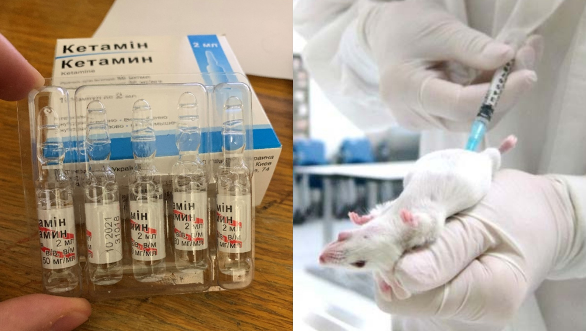

<script type="text/javascript">
 function showhide(id) {
    var e = document.getElementById(id);
    e.style.display = (e.style.display == 'block') ? 'none' : 'block';
 }
 
 function openTab(evt, tabName) {
    var i, tabcontent, tablinks;
    tabcontent = document.getElementsByClassName("tabcontent");
    for (i = 0; i < tabcontent.length; i++) {
        tabcontent[i].style.display = "none";
    }
    tablinks = document.getElementsByClassName("tablinks");
    for (i = 0; i < tablinks.length; i++) {
        tablinks[i].className = tablinks[i].className.replace(" active", "");
    }
    document.getElementById(tabName).style.display = "block";
    evt.currentTarget.className += " active";
 }
</script>


```{r, include=FALSE}
library(mosaic)
library(ResourceSelection) 
library(car)
library(pander)
library(DT) 
library(tidyverse)
library(dplyr)
library(plotly)

Analysis <- read_csv("LogisticRegression - Original.csv")
Analysis2 <- filter(Analysis, CoefficientK > 2)
Analysis2<- select(Analysis2, "Mouse", "CoefficientK", "Death")

myglm<-glm(Death~CoefficientK, data = Analysis2, family=binomial)
pander(summary(myglm))

```

## Background {.tabset .tabset-fade}


### Overview

In scientific research, animals are frequently used for testing certain hypotheses and getting answers to important questions. Many times an animal will have to undergo a surgery or a stereotaxic injection to get insight into an existing problem. When that happens, the Animal Welfare Act (AWA)[^1] requires the use of anesthesia during such procedures. Not only it is a morally good idea for an animal to not feel pain, but it is also often imperative that an animal does not move during the procedure so that certain precision could be achieved. However, as with any medical procedures, certain risks come with the use of anesthesia that could vary from mild swelling at the injection site or to a severe shock or death. 

One of the many reasons an animal can die from an anesthetic is an overdose. An animal will not always be knocked out by the first dosage of an analgesic drug, either due to some tolerance to the drug or due to poor quality of the anesthetic itself (sometimes the quality is not good even though the expiration date or a manufacturer does not indicate so). As such, one of the most widely used anesthetic agents on animals is a mix of Ketamine[^2] and Xylozine[^3]. If an animal is not knocked out after the first dosage of the Ketamine-Xylozine mix (which is suggested to be 75‐150 mg/kg and 16‐20 mg/kg respectively)[^4], an additional 25-50% of the initial Ketamine dose needs to be administrated as is suggested by [JAALAS](https://www.ncbi.nlm.nih.gov/pmc/articles/PMC4253583/). However, the question remains, when should one stop after the first dosage was injected to administer the drug to prevent death if it is obvious that it is not working on that animal? The data coming from my notes during my internship in a research lab in Ukraine was taken to answer that question (click on "The Data" tab for further details). 


<br/>
<center>

</center>
<br/>


### The Data {.tabset .tabset-fade}

In the lab, we used the suggested amount of Ketamine and Xylazine based on a bodyweight of a mouse to knock it out before the neurosurgical procedures. A mouse would not always get unconscious by the first dosage of analgesia, so a recommended 50% of the initial Ketamine–Xylazine dose would be administered again after some time. However, there were a few instances when a mouse would die either right after the exposure of the first dose of anesthetic or right after the additional administrations. 

#### Original Data 

Note that because we are interested only in deaths caused by analgesia, the 'Death' column is composed of only those deaths that were observed right after the exposure of anesthetic.

Thus, in the "Death" column, '0' indicates no death is observed right after the administration of Ketamine/Xylazine cocktail and '1' represents the observed death right after the exposure to the anesthetic.

"CofficientK" column represents the coefficient of Ketamine by which the weight of a mouse was multiplied when getting the amount of Ketamine to be injected into a mouse. This coefficient would almost always start at 2 (the first dosage) and then go up by about 50% of the initial dosage with each additional dose in case the mouse was not knocked out after the first injection.

"CofficientX" column represents the coefficient of Xylozine by which the weight of a mouse was multiplied when getting the amount of Xylozine to be injected into a mouse.

```{r}
datatable(Analysis)
```

#### Filtered Data

Since in this analysis my question is not about the correct initial amount dosage but rather what is a probability of death of a mouse after additional dosages, all of the mice which had only the first dosage administered (CoefficientK = 2) were filtered out. 'CoefficientX' was not taken into account either. Since Xylozine is used for muscle relaxation and not for analgesia, even if additional administration would cause the mouse to not move, it would not prevent it from feeling pain. For this reason, it would not be added repeatedly, in contrast to Ketamine, after the first dosage amount of the Ketamine/Xylazine cocktail has already been administered.

```{r}
Analysis2 <- filter(Analysis, CoefficientK > 2)
Analysis2<- select(Analysis2, "Mouse", "CoefficientK", "Death")
pander(Analysis2)
```


## Hypotheses

Since in this study I am interested in how the probability ($\pi_i$) of death changes given the observed Ketamine dosage coefficient, the following Logistic Regression model is going to be used:

<div style="font-size:0.8em;">Note: "Simple Logistic Regression is used when the response variable is binary ($Y_i=0$ or $1$), and
there is a single explanatory variable $X$ that is typically quantitative but could be qualitative (if $X$ is binary or ordinal)"([Garrett Saunders](https://www.linkedin.com/in/garrett-saunders-337754123)). In our case mouse's death is the binary response variable and the Ketamine dosage coefficient is the quantitative explanatory variable.</div>

$$
  P(Y_i = 1|x_i) = \frac{e^{\beta_0+\beta_1 x_i}}{1+e^{\beta_0 + \beta_1 x_i}} = \pi_i
$$
where for observation $i$: 

* $Y_i = 1$ denotes death for a given Ketamine dosage coefficient, 
* $Y_i=0$ denotes no death for a given Ketamine dosage coefficient, and 
* $x_i$ denotes the Ketamine dosage coefficient administered to a mouse. 

If $\beta_1$ in the above model equals zero, that would mean that $x_i$ gives us no insight about $\pi_i$ (0*$x_i$ = 0, which drops $x_i$ coefficient from the equation completely). Thus we can set the following hypotheses:

$$
  H_0: \beta_1 = 0 \\
  H_a: \beta_1 \neq 0
$$

where, the alternative hypothesis suggests that Ketamine dosage coefficient ($x_i$) can help in calculating the probability of the death of a mouse, and the null that it cannot.

The level of significance is set at $\alpha$ = 0.05 for this study.


## Analysis

Let's first see if our data resembles the Logistic Regression mathematical model and can be used for this test to get an insight into the aforementioned question.

Here is the plot of our data:

```{r}
plot(Death~CoefficientK, data = Analysis2,  pch=16, main = "Institute of Physiology\nAnesthesia of Adult Mice", xlab = "Ketamine Dosage Coefficient for a Body of Weight of a Mouse", ylab = "Probability of Mouse's Death", col ="firebrick")
curve(exp(-2.911+0.4286*x)/(1+exp(-2.911+0.4286*x)), add = TRUE)
```

From the plot above we can see that the dots at the bottom of the plot seem to be closer to the beginning of the x-axis values, whereas the dots at the top of the plot seem to be shifted more towards the end values of the x-axis. This somewhat reminds us of a logistic regression model. To further confirm that the data is appropriate for the Logistic Regression Test, let's run the Hosmer-Lemeshow Goodness of Fit Test (since we have only a few replicated values of each $x_i$) with g (number of groups to run the goodness of fit test on) = 3 (since our sample size is not big (n=27)).


```{r}
pander(hoslem.test(myglm$y, myglm$fitted, g=3))
```


Since p-value > $\alpha$, we have insufficient evidence to reject the null or the statement that the data is a good fit for the logistic regression test. This means that we can conclude that this data is a good fit for this type of test and will give us some valid results.

With that, let's run the Simple Logistic Regression Test:

```{r, include=FALSE}
myglm<-glm(Death~CoefficientK, data = Analysis2, family=binomial)
pander(summary(myglm))
```


---------------------------------------------------------------
      &nbsp;        Estimate   Std. Error   z value   Pr(>|z|) 
------------------ ---------- ------------ --------- ----------
 **(Intercept)**     -11.33      4.678      -2.422    0.01542  

 **CoefficientK**    2.725        1.29       2.112    0.03466  
---------------------------------------------------------------

Table: Simple Logistic Regression Test on Ketamine Dosage for Anesthesia in Adult Mice

Since our p-value = 0.03466<$\alpha$, we can conclude that $\beta_1 \neq 0$. This means that there is a certain association between the probability of a mouse's death and the amount of Ketamine that was injected. In other words, the probability of a mouse's death is higher for certain values of the Ketamine dosage coefficient than for other values of the Ketamine dosage coefficient. In addition, the true probability of death from the additional Ketamine dosages for the whole adult mice population can be computed with the following equation:

$$
  P(Y_i = 1|x_i)\approx \frac{e^{-11.33+2.725 x_i}}{1+e^{-11.33 + 2.725 x_i}} = \hat{\pi}_i
$$
where,

$b_0$ = -11.33 is an estimate of $\beta_0$ of the true equation for the whole population;
$b_1$ = 2.725 is an estimate of $\beta_1$ of the true equation for the whole population;

To get a better idea of what this all means exactly, with the help of some algebra, let's rewrite the above equation slightly: 


$$
    \underbrace{\frac{\pi_i}{1-\pi_i}}_{\text{Odds for}\ Y_i=1} =  e^{-11.33}e^{2.725 x_i}
$$


<a href="javascript:showhide('datatable')">Show how the above equation was found<span style="font-size:8pt;">(click to view)</span></a>

<div id="datatable" style="display:none;">

----

Initial equation:

$$
  \hat{\pi}_i= \frac{e^{-11.33+2.725 x_i}}{1+e^{-11.33 + 2.725 x_i}} 
$$

Multiply both sides by a factor of ${1+e^{-11.33 + 2.725 x_i}}$:

$$
  \hat{\pi}_i({1+e^{-11.33 + 2.725 x_i}})= {e^{-11.33+2.725 x_i}} 
$$

Use the distributive property to get rid of the parentheses:

$$
  \hat{\pi}_i+\hat{\pi}_ie^{-11.33 + 2.725 x_i}= {e^{-11.33+2.725 x_i}} 
$$

Rearrange to be able to factor out the common term of $e^{-11.33 + 2.725 x_i}$:

$$
  \hat{\pi}_i = {e^{-11.33+2.725 x_i}} -\hat{\pi}_ie^{-11.33 + 2.725 x_i}
$$


Factor out ${e^{-11.33+2.725 x_i}}$:


$$
  \hat{\pi}_i = {e^{-11.33+2.725 x_i}}(1 -\hat{\pi}_i)
$$

Divide both sides by $1 -\hat{\pi}_i$:

$$
   \frac{\hat{\pi}_i}{1 -\hat{\pi}_i} =  {e^{-11.33+2.725 x_i}}
$$

Use the 'Product Rule' of exponents: 

$$
    \frac{\hat{\pi}_i}{1 -\hat{\pi}_i} =  e^{-11.33}e^{2.725 x_i}
$$

----


</div>


This equation brings us to a concept of 'odds', so that now we could better interpret what $b_0$ = -11.33 and $b_1$ = 2.725 represent in the above equation. 


<a href="javascript:showhide('datatable1')">Show explanation on 'odds'<span style="font-size:8pt;">(click to view)</span></a>

<div id="datatable1" style="display:none;">

----

Since it is common to have p-value or the probability as a means of describing certain things in statistics, it might be helpful to explain the difference between the probability and the odds.

Probability is usually found by dividing the number of "successes" (or, in other words, the number of desirable events that were observed) by the whole sample size (the number of all events that occurred). The 'odds' is the same as probability, except, the number of "successes" is divided by the number of "failures", instead of the total sample size.

For example, if a coin was flipped 10 times and 7 of those times it was head, the probability of a flipping head is going to be 7/10; whereas, the odds = 7/3 (3 times we failed to get head). This brings us to the idea that we could calculate odds from probability and vice versa.

Let's say the probability of a certain event happening is:

$$
    {\pi_i}=  \frac{success}{n} 
$$

Then the odds could be written as:

$$
    {odds}=  \frac{success}{n-success} 
$$

To find the formula for odds using only a known probability (or the p-value that Logistic Regression test calculates), let's divide both the numerator and the denominator of the last equation by n:

$$
    {odds}=  \frac{(\frac{success}{n})}{(\frac{n-success}{n})}
$$

Now that we have written the equation, let's proceed and perform the division of each factor of the denominator by n:


$$
    {odds}=  \frac{(\frac{success}{n})}{(\frac{n}{n}-\frac{success}{n})}
$$


Which simplifies to:


$$
    {odds}=  \frac{(\frac{success}{n})}{(1-\frac{success}{n})}
$$

Notice at this point $\frac{success}{n}$ is actually the  ${\pi_i}$. So, now let's substitute this into the equation to get:

$$
    {odds}=  \frac{\pi_i}{1-\pi_i}
$$


----


</div>


Using the rewritten Linear Regression equation, if $x_i$ = 0 (meaning no Ketamine was injected into a mouse), the odds of a mouse to die are almost zero:

$$
    odds =  e^{-11.33}e^{2.725 *0} = e^{-11.33}e^{0}=e^{-11.33} *1= 0.000012007 
$$


However, if, for example, the Ketamine dosage coefficient equals 1 then the odds of a mouse's death grow to 0.00018:


$$
    odds =  e^{-11.33}e^{2.725 *1} = e^{-11.33}e^{2.725}=0.000012007 *15.25641=  0.0001831837
$$

This means that the odds of a mouse's death are increasing by a factor of $e^{2.725}$=15.25641 when the Ketamine dosage coefficient goes up by 1. In other words, every one unit increase in $x_i$ increases the odds of death by a factor of 15.25641. So each 1 unit increase in the Ketamine dosage makes a mouse 15 more times likely to die.


## Conclusion

To answer our initial question of when one should stop injecting Ketamine after the first dosage was not enough to knock out a mouse, let's use the Logistic Equation that we found earlier. In my opinion, as soon as the probability exceeded 50%, that's probably the point when we should have stopped injecting more Ketamine and have preserved the animal for other purposes to prevent its pointless death. So, using $\hat{\pi}_i$ = 0.5, we will get the following equation:


$$
   \frac{0.5}{1 -0.5} =  {e^{-11.33+2.725 x_i}}
$$


<a href="javascript:showhide('datatable2')">Show the calculations<span style="font-size:8pt;">(click to view)</span></a>

<div id="datatable2" style="display:none;">

----

Take natural logarithm (log) of both sides:

$$
   log(\frac{0.5}{1 -0.5}) =  log({e^{-11.33+2.725 x_i}})
$$


Using properties of logarithms, we get:

$$
   log(\frac{0.5}{1 -0.5}) =  {-11.33+2.725 x_i}
$$

Move -11.33 to the left:

$$
   log(\frac{0.5}{1 -0.5}) +11.33={2.725 x_i}
$$

Divide both sides by 2.725:

$$
   \frac{log(\frac{0.5}{1 -0.5}) +11.33}{2.725}={x_i}
$$


----


</div>


which will give us $x_i\approx$ 4.16.

If we use R to predict the probability of a mouse's death when $x_i$ = 4.16, we get the following:

```{r}
predict(myglm, data.frame(CoefficientK=4.16), type='response')
```

Which confirms the calculations we did earlier.


From our data, we used a coefficient of 4 or greater only on 4 mice out of 56 total. Only 2 out of those died: 

```{r, include=FALSE}
Analysis3<-filter(Analysis2, CoefficientK >=4)
```

```{r}
pander(Analysis3)
```


If I would not have proceeded with the 3rd repeated injection (CoefficientK=4), I would have been able to save those two. However, I would have put away the other two (mice 5 and 10), although they would have been just fine with the 3rd repeated injection. So, in sum, we are saving two mice's lives and then losing Ketamine we have used for another two in vain in our experiment. However, if the coefficient is slightly greater (4.16>4.0), this puts us at a 100% death rate in our data (mouse 15). So, having a Coefficient that exceeds 4.16 as a stopping point seems to be a good rule of thumb.

Even though this coefficient would have saved just 1 mouse out of 56 during the time of my internship, in the long run, using this rule by all researchers could potentially save thousands, if not millions. Instead of losing both Ketamine and a mouse's life in vain, it would only be Ketamine, which is way cheaper and way less upsetting than losing a mouse too.


[^1]: https://fbresearch.org/animal-care/animal-testing-regulations/

[^2]: https://www.ncbi.nlm.nih.gov/pmc/articles/PMC4258981/

[^3]: https://en.wikipedia.org/wiki/Xylazine

[^4]: https://animalcare.ubc.ca/sites/default/files/documents/Guideline%20-%20Rodent%20Anesthesia%20Analgesia%20Formulary%20%282016%29.pdf