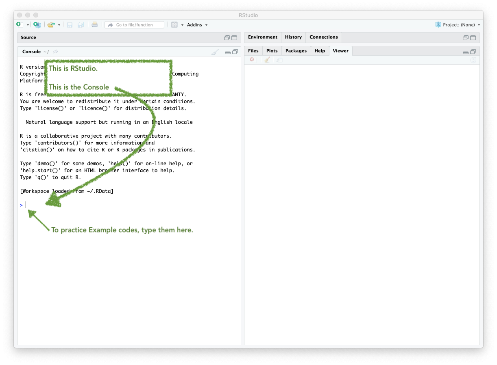
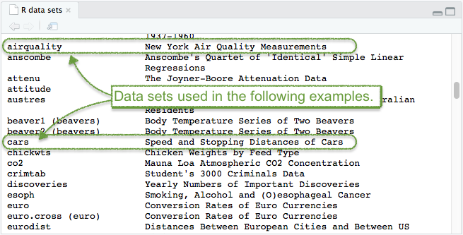
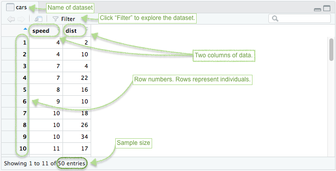
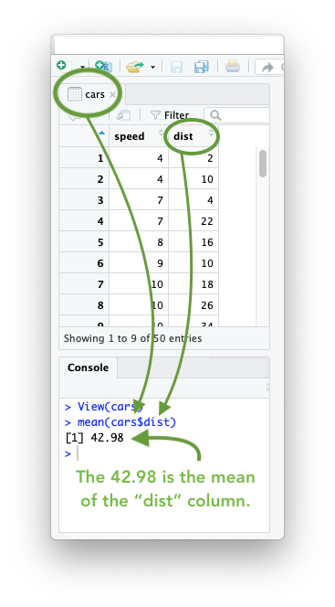

 

Student: "How do I learn R?"

Teacher: "By using it."

Student: "But I don't know how to use it."

Teacher: "Just try it anyway. Suddenly you'll understand."

Most people that are new to using the "R Software" ask the question, "How do I learn R?" The answer is simple: "start using it." Really. Seriously. Just start using it, even when you have no idea what you are doing, and suddenly you will start to learn R. So, here we go. The more you use it, the more you will know.

This textbook (the "Statistics-Notebook") follows a simple learning model: 

1. **Hover** your mouse over `code`Yes, just like that. By hovering over "Codes" you will get instructions on what that code does. to read about it.
2. **Click** on a <a href="javascript:showhide('smileyface')">`line of code`</a>Hovering is a good start, try clicking on this one. to see what it does. 

3. **Try** typing the code into RStudio yourself to actually start learning R. (This is the most important step! Avoid copying and pasting codes, and type them instead. The more you type codes yourself, even though it is slow and prone to mistakes, the more you will learn.)

In summary, the most successful students in Math 325 follow the pattern:

 

**Example Codes** 

For each of the following examples: (1) hover, (2) click, and (3) try.

Before you begin working on these **Example Codes**, ensure you have RStudio open. It should look like this:

*Example 1* 

Remember, "Hover" the code first, then click, then try.

<a href="javascript:showhide('CarsOutput')">

View(
  The "View" R function (with a CAPTIAL 'V' in View) allows us to view a data set. When run, this function will open up a new tab in RStudio showing the data set.  

cars
  `cars` is a data set that is in R. R has datasets that are available for anyone to use. You can see them using the `data()` command. It would be good to explore `View()` for a few different datasets. 

)
  Always be sure to end your function with closing parantheses. 

&nbsp;&nbsp;&nbsp;&nbsp;  
  Press Enter to run the code.

&nbsp;Click to Show Tutorial&nbsp; 
  Click to see a full tutorial on the "View()" command.

</a>

 

Good work clicking on *Example Code 1*. 

But... Did you remember to *first* hover your mouse over the `View(cars)` example code? Good job if you did.

If not, go do that right now before continuing.

 

R allows you to work with data. So, the first step to understanding R is to open a dataset and begin exploring some data. 

If you type the `data()` command into your Console of RStudio you will see a list of "built in" data sets that come with R. Go ahead and type `data()` into your **R Console** (and then press `Return` or `Enter`) right now to try it yourself.

 

The `cars` data set is one of the options that is available within the list from the `data()` command. This is a fun "historic" data set from the 1920's. It shows the `speed` and stopping `dist`ance of cars from the 1920's.

To see the `cars` data set in RStudio, use the `View` command as follows.

**Step 1.** Open RStudio.

**Step 2.** Type the command `View(cars)` into your **Console**.

**Step 3.** Press `Enter` or `Return` and the following output should appear within RStudio.

 

Be sure to **TRY IT** yourself, if you haven't already. Good work if you did. It's the only way to learn R. 

Ask someone for help if you aren't sure how to get started.

Try `View(airquality)` as well.

 
 

 

*Example 2*

<a href="javascript:showhide('meancarsdist')">

mean(
  An R function "mean()" that will compute the mean of a quantitative column of data from a data set.

cars
  `cars` is the name of a data set in R. Any data set can be used instead by simply typing the name of that data set instead of `cars`.

$
  The `$` sign is a powerful operator in R. The `$` sign allows you to access, or "purchase," any column from a data set. Try typing `cars$` into R and notice how a selection menu appears with options `dist` and `speed`.

dist
  `dist` is one of the two columns from the `cars` data set. By typing `cars$dist` we are essentially pulling that column of data out of the data set, and then computing the mean of that column with `mean(cars$dist)`.

)
  Closing parenthesis for the `mean()` function.

&nbsp;&nbsp;&nbsp;&nbsp;  
  Press Enter to run the code.

&nbsp;Click to Show Output&nbsp; 
  Click to see output.

</a>

 

Did you remember to *first* hover your mouse over the `mean(cars$dist)` example code? Good job if you did.

If not, go do that right now before continuing.

 

Recall that you "Viewed" the `cars` data set in the first example code. If you look carefully at this data set, you should notice that there are two columns labeled **speed** and **dist** in this data set. Each row of the data set represents a vehicle that was going a certain **speed** (in miles per hour) and once the breaks were applied, the **dist**ance the vehicle took to stop was also recorded (in feet). This data was recorded for 50 different vehicles. So it might make sense to compute something like the average (or mean) distance it took vehicles to stop. This is done with the `mean( )` function. Notice how the `$` sign is used to access a column called **dist** from the `cars` data set. Think of the data set `cars` as a store, and if you bring your money `$` then you can "buy" the column **dist** from that data set.

You may also be interested in trying any of the following:

* `sd(cars$dist)`
* `var(cars$dist)`
* `median(cars$dist)`
* `min(cars$dist)`
* `max(cars$dist)`
* `length(cars$dist)`
* `sum(cars$dist)`

If you are curious, you can begin exploring the [Numerical Summaries](NumericalSummaries.html) page of your Statistics-Notebook to learn more. But we won't officially get to that as a class until later this week. So you don't need to worry about it for now.

 
 

 

*Example 3*

<a href="javascript:showhide('plotcarsdist')">

plot(
  The `plot(...)` function allows us to create a plot (usually a scatterplot) in R.

dist
   `dist` is the name of a column from the `cars` data set. This is going to be the Y-variable of the plot. The Y-variable always comes first in the plot(Y ~ X) command.

&nbsp;~&nbsp;
   `~` is found on the upper-left key of your keyboard. It is called the "tilde" or "tilda" symbol. It is used to state a relationship between Y and X: `Y ~ X`.

speed
   `speed` is the name of a column. This is going to be the X-variable of the plot. The X-variable always comes after the `~` in the `plot(Y ~ X)` command.

,&nbsp;
   The comma `,` is used to separate each entry within a command.

data=cars
   The `data=` statement is used to tell R which data set the columns of "dist" and "speed" come from. In this case, the `cars` data set.

,&nbsp;
   The comma `,` is used to separate each entry within a command.

col="skyblue"
   The `col=` statement is used to tell R which color to use in the plot. Type `colors()` in your R Console to see what options there are. This code is using the `"skyblue"` color. Color names are always placed in quotes `" "`.

,&nbsp;
   The comma `,` is used to separate each entry within a command.

pch=16
   The `pch=` statement is used to tell R which plotting character to use in the plot. Type `?pch` in your R Console to see what options there are. (You'll need to scroll down in the help file that appears until you get to the `'pch values'` section.

)
  Closing parenthesis for the plot(...) function.

&nbsp;&nbsp;&nbsp;&nbsp;  
  Press Enter to run the code.

&nbsp;Click to Show Output&nbsp; 
  Click to View Output.

</a>

 

Study the image below.

Try changing the `col="skyblue"` statement to `col="firebrick"` instead. What do you notice?

Try changing the `pch=16` statement to `pch=4` or any other number from 1 to 25. What do you notice?

Hint: pressing the "up" arrow on your keyboard brings up the last command you typed into the Console. 

 

Good work! You're all done for now.

**Completion Code:** abc123R

 

[Return to the R Commands](RCommands.html) page of the Statistics-Notebook.

 
 

This is "the end" of the *Getting Started* tutorial. To find the "completion code" you will need to study, and "click open" each of the example codes above.

 
 

