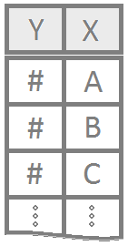

<script type="text/javascript">
 function showhide(id) {
    var e = document.getElementById(id);
    e.style.display = (e.style.display == 'block') ? 'none' : 'block';
 }
</script>

```{r, include=FALSE}
library(tidyverse)
```

----

The nonparametric equivalent to one-way [ANOVA](ANOVA.html).

----

### Kruskal-Wallis Rank Sum Test {.tabset .tabset-fade .tabset-pills}

<div style="float:left;width:125px;" align=center>

</div>

Allows for deciding if several samples come from the same population or if at least one sample comes from a different population. 

#### Overview

<div style="padding-left:125px;">

It is assumed that the various populations are of approximately the same form, but are shifted or translated. 

Can also be used when data is ordered (ordinal) but does not have an exact measurement. 

Best used when the distribution of the data is not normal. ANOVA is appropriate when the data is normal. 

**Hypotheses**

Typically, the hypotheses of the Kruskal-Wallis test are:

$$
  H_0: \text{All samples are from the same distribution.}
$$ 
$$
  H_a: \text{At least one sample's distribution is stochastically different.}
$$

However, according to the original authors, what the alternative to the Kruskal-Wallis test really is, "is a tendency for observations in at least one of the populations to be larger (or smaller) than all the observations together, when paired randomly. In many cases, this is practically equivalent to the mean of at least one population differing from the others." Thus, it could also be appropriate to use the ANOVA style hypotheses

$$
  H_0: \mu_1 = \mu_2 = \ldots = \mu
$$
$$
  H_a: \mu_i \neq \mu \ \text{for at least one} \ i
$$


----

</div>

#### R Instructions

<div style="padding-left:125px;">
**Console** Help Command: `?kruskal.test()`

<div style="padding-left:15px;">

`kruskal.test(x ~ g, data=YourDataSet)` 

* `x` is a numeric vector of data values that represents the quantatitive response variable.
* `g` is a qualitative grouping variable defining which groups each value in `x` belongs to. It must either be a character vector or a factor vector.
* `YourDataSet` is the name of your data set.

**Example Code** 

Hover your mouse over the example codes to learn more.

<a href="javascript:showhide('kruskal')">
<div class="hoverchunk">
<span class="tooltipr">
kruskal.test(
  <span class="tooltiprtext">The function that performs a Kruskal-Wallis rank sum test.</span>
</span><span class="tooltipr">
weight
  <span class="tooltiprtext">'weight' is a numeric variable from the chickwts dataset that represents the quantatitive response variable.</span>
</span><span class="tooltipr">
&nbsp;~&nbsp;
  <span class="tooltiprtext">'~' is the tilde symbol used to separate the left- and right-hand side in a model formula.</span>
</span><span class="tooltipr">
feed, 
  <span class="tooltiprtext"> 'feed' is a qualitative grouping variable in the chickwts dataset. </span>
</span><span class="tooltipr">
&nbsp;data&nbsp;=&nbsp;chickwts)
  <span class="tooltiprtext"> 'chickwts' is a dataset in R.</span>
  </span><span class="tooltipr">
&nbsp;&nbsp;&nbsp;&nbsp;  
  <span class="tooltiprtext">Press Enter to run the code if you have typed it in yourself. You can also click here to view the output.</span>
</span><span class="tooltipr" style="float:right;font-size:.8em;">
&nbsp;Click to View Output&nbsp; 
  <span class="tooltiprtext">Click to View Output.</span>
</span>
</div>
</a>
<div id="kruskal" style="display:none;">
```{r, echo=FALSE}
kruskal.test(weight ~ feed, data=chickwts)
```

</div>
<br>

Alternatively, you could use the following approach as well.

`kruskal.test(list(x, y, z))` 

* `x` is a numeric vector of data values that represents the quantatitive response variable for the first group.
* `y` is a numeric vector of data values that represents the quantatitive response variable for the second group.
* `z` is a numeric vector of data values that represents the quantatitive response variable for the third group.
* Note that more than three vectors of data could be included inside of `list()`.

**Example Code** 

Hover your mouse over the example codes to learn more.

<a href="javascript:showhide('kruskal2')">
<div class="hoverchunk">
<span class="tooltipr">
feed1 <- filter(chickwts, feed == "horsebean")
  <span class="tooltiprtext"> This splits out the first group of feed (horsebean) from the chickwts dataset. </span>
</span><br><span class="tooltipr">
feed2 <- filter(chickwts, feed == "linseed")
<span class="tooltiprtext"> This splits out the second group of feed (linseed) from the chickwts dataset. </span>
</span><br><span class="tooltipr">
feed3 <- filter(chickwts, feed == "soybean")
  <span class="tooltiprtext"> This splits out the third group of feed (soybean) from the chickwts dataset. </span>
</span><br><span class="tooltipr">
feed4 <- filter(chickwts, feed == "sunflower")
  <span class="tooltiprtext"> This splits out the fourth group of feed (sunflower) from the chickwts dataset. </span>
</span><br><span class="tooltipr">
feed5 <- filter(chickwts, feed == "meatmeal")
  <span class="tooltiprtext"> This splits out the fifth group of feed (meatmeal) from the chickwts dataset. </span>
</span><br><span class="tooltipr">
feed6 <- filter(chickwts, feed == "casein")
  <span class="tooltiprtext"> This splits out the sixth group of feed (casein) from the chickwts dataset. </span>
</span><br><span class="tooltipr">
kruskal.test(
  <span class="tooltiprtext">The function that performs a Kruskal-Wallis rank sum test.</span>
</span><span class="tooltipr">
list(feed1\$weight,feed2\$weight,feed3\$weight,feed4\$weight,feed5\$weight,feed6\$weight))
  <span class="tooltiprtext">A list of numeric vecotrs that represent the quantitative response variable for each group.</span>
</span>
</span><span class="tooltipr" style="float:right;font-size:.8em;">
&nbsp;Click to View Output&nbsp; 
  <span class="tooltiprtext">Click to View Output. Load library(tidyverse) to run this code in R.</span>
</span>
</div>
</a>
<div id="kruskal2" style="display:none;">
```{r, echo=FALSE}
feed1 <- filter(chickwts, feed=="horsebean")
feed2 <- filter(chickwts, feed=="linseed")
feed3 <- filter(chickwts, feed=="soybean")
feed4 <- filter(chickwts, feed=="sunflower")
feed5 <- filter(chickwts, feed=="meatmeal")
feed6 <- filter(chickwts, feed=="casein")
kruskal.test(list(feed1$weight, feed2$weight, feed3$weight, feed4$weight, feed5$weight, feed6$weight))
```

</div>

----

</div>

#### Explanation

<div style="padding-left:125px;">


In many cases it is of interest to perform a hypothesis test about whether or not several samples come from the same population. 

The Kruskal-Wallis Rank Sum Test allows for this by extending the idea behind the Wilcoxon Rank Sum Test to allow for more than two samples. 

The following explanation of how the test works comes mainly from the original 1952 article, [Use of Ranks in One-Criterion Variance Analysis, 1952](http://www.jstor.org/stable/2280779?seq=1#page_scan_tab_contents), but is expanded here for increased clarity.

##### Calculating the Test Statistic

The following artificial data will be used to demonstrate how the Kruskal-Wallis Test statistic is calculated. (Taken from the original article.)

<div style="color:#a8a8a8;">

<center>

**Daily Bottle-Cap Production of Three Machines**

  (Artificial data.)

|Standard | Modification1 | Modification2 |
|-----|-----|-----|
| 340 | 339 | 347 |
| 345 | 333 | 343 |
| 330 | 344 | 349 |
| 342 |     | 355 |
| 338 | | |

</center>

</div>

**Step 1**: Obtain $C$ samples, each of size $n_i$. Note that the notation $n_i$ allows for each sample to be a different size. 

<div style="padding-left:30px; color:#a8a8a8;">

In the bottle-cap data, $C=3$ and $n_1 = 5$, $n_2 = 3$, and $n_3 = 4$.

</div>

**Step 2**: Order the $N=n_1 + \cdots + n_C$ values from all samples from smallest to largest. Rank the values from smallest to largest with the ranks $1,\ldots,N$. Award any tied values the average of the ranks of those values that are tied.

<div style="padding-left:30px; color:#a8a8a8;">

In the bottle-cap data we have the following.

| Rank    |   1 |   2 |   3 |   4 |   5 |   6 |   7 |  8 |   9 |   10 |   11 |   12 | |
|---------|----:|----:|----:|----:|----:|----:|----:|----:|----:|----:|----:|----:|--|
| Value   | 330 | 333 | 338 | 339 | 340 | 342 | 343 | 344 | 345 |      347 | 349 | 355 | |
| Machine |   S |  M1 |   S |  M1 |   S |   S | M2 | M1 | S | M2 | M2 | M2 | |

</div>

**Step 3**: Sum the ranks for each sample. Denote the sum of the ranks for sample $i$ by $R_i$.

<div style="padding-left:30px; color:#a8a8a8;">

In the bottle-cap data, 

$R_1 = 1 + 3 + 5 + 6 + 9 = 24$

$R_2 = 2 + 4 + 8 = 14$

$R_3 = 7 + 10 + 11 + 12 = 40$

</div>

**Step 4**: Compute the mean rank for each sample, $\bar{R_i} = \frac{R_i}{n_i}$.

<div style="padding-left:30px; color:#a8a8a8;">

In the bottle-cap data, 

$\bar{R}_1 = \frac{R_1}{n_1} = \frac{24}{5} = 4.8$

$\bar{R}_2 = \frac{R_2}{n_2} = \frac{14}{3} = 4.667$

$\bar{R}_3 = \frac{R_3}{n_3} = \frac{40}{4} = 10.0$

</div>

**Step 5**: If there are no ties, calculate the test statistic $H$ by the formula
$$
  H = \frac{N-1}{N}\sum_{i=1}^C \frac{n_i[\bar{R}_i-\frac{1}{2}(N+1)]^2}{\frac{1}{12}(N^2-1)}
$$

See the original article for the formula to use when there are ties present in the data.

<div style="padding-left:30px; color:#a8a8a8;">

In the bottle-cap data, $H = 5.656$.

</div>

To understand the logic behind the test statistic $H$, note that the null hypothesis assumes that each of the $C$ samples are taken from the same population. Under this assumption, the ranks assigned to each sample should represent a uniform sample of the ranks $1,\ldots,N$. If the null hypothesis were true, we would expect the average of the ranks from each group, the $\bar{R}_i$, to be roughly about the same. More precisely, using the properties of the *discrete uniform distribution* ([see wikipedia](https://en.wikipedia.org/wiki/Uniform_distribution_(discrete))), we expect each $\bar{R}_i$ to be close to $\frac{1}{2}(N+1)$, which is the mean of the discrete uniform distribution. That $\bar{R}_i$ should be close to this value comes from the fact that the mean of a distribution of means is equal to the population mean. Further, the variance of $\bar{R}_i$ is given by the population variance, $\frac{1}{12}(N^2-1)$ in this case, divided by the sample size $n_i$. Finally, the $\frac{N-1}{N}$ is a correction factor that will not be explained here. The full article explains the details about how a multivariate normal distribution is used to uncover the formula for $H$. Thus, understanding $H$ completely will require an advanced degree in statistical theory. However, the short story is that the distribution of the test statistic $H$ is approximately a chi squared distribution with $C-1$ degrees of freedom and has the form of a sum of values consisting of the (observed mean - expected mean)^2/(variance of the observed mean).

**Step 6**: Calculate the p-value of $H$ using a [chi squared distribution](MakingInference.html#chisquared) with $C-1$ degrees of freedom.
$$
  H = \frac{N-1}{N}\sum_{i=1}^C \frac{n_i[\bar{R}_i-\frac{1}{2}(N+1)]^2}{\frac{1}{12}(N^2-1)}
$$

<div style="padding-left:30px; color:#a8a8a8;">

In the bottle-cap data, $p = 0.059$, which represents the probability of $H$ being as extreme or more extreme than the observed value of 5.656, assuming the null hypothesis is true.

</div>

----

</div>


### 

<div style="padding-left:125px;">
**Examples:** [wages](./Analyses/Kruskal-Wallis Test/Examples/wagesKruskal.html), [pigweights](./Analyses/Kruskal-Wallis Test/Examples/pigweightsKruskal.html)
</div>


----


<footer></footer>