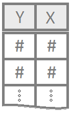
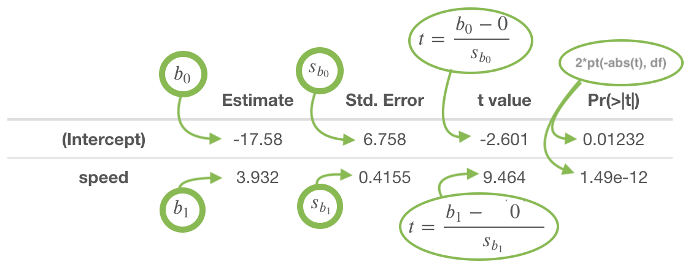
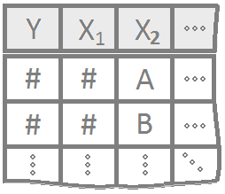
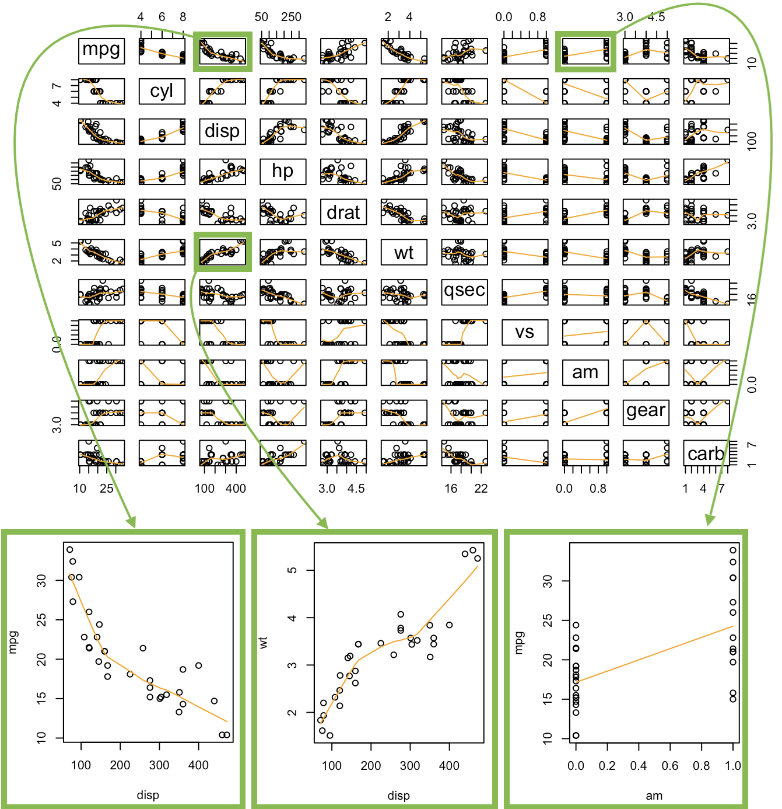
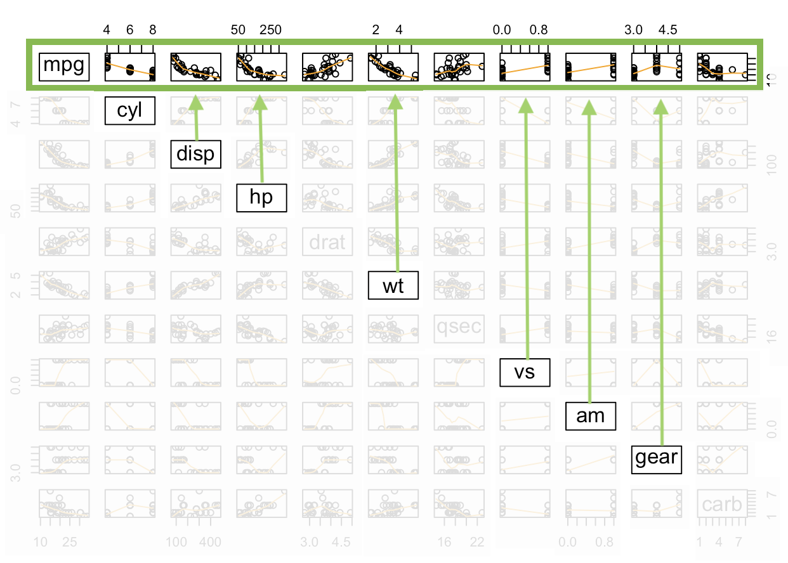
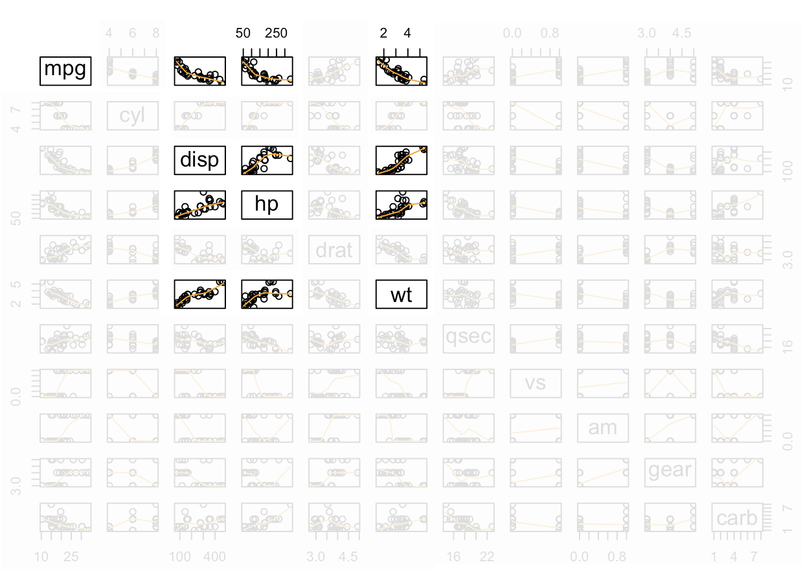

<script type="text/javascript">
 function showhide(id) {
    var e = document.getElementById(id);
    e.style.display = (e.style.display == 'block') ? 'none' : 'block';
 }
 
 function openTab(evt, tabName) {
    var i, tabcontent, tablinks;
    tabcontent = document.getElementsByClassName("tabcontent");
    for (i = 0; i < tabcontent.length; i++) {
        tabcontent[i].style.display = "none";
    }
    tablinks = document.getElementsByClassName("tablinks");
    for (i = 0; i < tablinks.length; i++) {
        tablinks[i].className = tablinks[i].className.replace(" active", "");
    }
    document.getElementById(tabName).style.display = "block";
    evt.currentTarget.className += " active";
 }
</script>

```{r, include=FALSE}
library(car)
library(mosaic)
library(pander)
library(scatterplot3d)
library(plotly)
library(reshape2)
library(RColorBrewer)
```

----

Determine which explanatory variables have a significant effect on the mean of the quantitative response variable.

----

## Simple Linear Regression {.tabset .tabset-fade .tabset-pills}

<div style="float:left;width:125px;" align=center>

</div>

Simple linear regression is a good analysis technique when the data consists of a single quantitative response variable $Y$ and a single quantitative explanatory variable $X$. 

### Overview {.tabset}

<div style="padding-left:125px;">

**Mathematical Model**

The true regression model assumed by a regression analysis is given by


<div style="float:right;font-size:.8em;background-color:lightgray;padding:5px;border-radius:4px;"><a style="color:darkgray;" href="javascript:showhide('simplelinearlatexrcode')">Math Code</a></div>


<div id="simplelinearlatexrcode" style="display:none;">
```{}
$$
  \underbrace{Y_i}_\text{Some Label} = \overbrace{\beta_0}^\text{y-int} + \overbrace{\beta_1}^\text{slope} \underbrace{X_i}_\text{Some Label} + \epsilon_i \quad \text{where} \ \epsilon_i \sim N(0, \sigma^2)
$$
```
</div>

<center>
<span class="tooltipr">
$Y_i$
  <span class="tooltiprtext">The response variable. The "i" denotes that this is the y-value for individual "i", where "i" is 1, 2, 3,... and so on up to $n$, the sample size.</span>
</span><span class="tooltipr">
$=$
  <span class="tooltiprtext">This states that we are assuming $Y_i$ was created, or is "equal to" the formula that will follow on the right-hand-side of the equation.</span>
</span><span class="tooltipr">
$\underbrace{\overbrace{\beta_0}^\text{y-intercept} + \overbrace{\beta_1}^\text{slope} X_i \ }_\text{true regression relation}$
  <span class="tooltiprtext">The true regression relation is a line, a line that is typically unknown in real life. It can be likened to "God's Law" or "Natural Law". Something that governs the way the data behaves, but is unkown to us.</span>
</span><span class="tooltipr">
$+$
  <span class="tooltiprtext">This plus sign emphasizes that the actual data, the $Y_i$, is created by adding together the value from the true line $\beta_0 + \beta_1 X_i$ and an individual error term $\epsilon_i$, which allows each dot in the regression to be off of the line by a certain amount called $\epsilon_i$.</span>
</span><span class="tooltipr">
$\overbrace{\epsilon_i}^\text{error term}$
  <span class="tooltiprtext">Error term for each individual $i$. The error terms are "random" and unique for each individual. This provides the statistical relationship of the regression. It is what allows each dot to be different, while still coming from the same line, or underlying law.</span>
</span><span class="tooltipr">
$\quad \text{where}$
  <span class="tooltiprtext">Some extra comments are needed about $\epsilon_i$...</span>
</span><span class="tooltipr">
$\ \overbrace{\epsilon_i \sim N(0, \sigma^2)}^\text{error term normally distributed}$
  <span class="tooltiprtext">The error terms $\epsilon_i$ are assumed to be normally distributed with constant variance. Pay special note that the $\sigma$ does not have an $i$ in it, so it is the same for each individual. In other words, the variance is constant. The mean of the errors is zero, which causes the dots to be spread out symmetrically both above and below the line.</span>
</span>
</center>

<br/>

The estimated regression line obtained from a regression analysis, pronounced "y-hat", is written as 


<div style="float:right;font-size:.8em;background-color:lightgray;padding:5px;border-radius:4px;"><a style="color:darkgray;" href="javascript:showhide('simplelinearlatexrcodeyhat')">Math Code</a></div>


<div id="simplelinearlatexrcodeyhat" style="display:none;">
```{}
$$
  \underbrace{\hat{Y}_i}_\text{Some Label} = \overbrace{b_0}^\text{est. y-int} + \overbrace{b_1}^\text{est. slope} \underbrace{X_i}_\text{Some Label}
$$
```
</div>

<center>
<span class="tooltipr">
$\hat{Y}_i$
  <span class="tooltiprtext">The estimated average y-value for individual $i$ is denoted by $\hat{Y}_i$. It is important to recognize that $Y_i$ is the actual value for individual $i$, and $\hat{Y}_i$ is the average y-value for all individuals with the same $X_i$ value.</span>
</span><span class="tooltipr">
$=$
  <span class="tooltiprtext">The formula for the average y-value, $\hat{Y}_i$ is equal to what follows...</span>
</span><span class="tooltipr">
$\underbrace{\overbrace{\ b_0 \ }^\text{y-intercept} + \overbrace{b_1}^\text{slope} X_i \ }_\text{estimated regression relation}$
  <span class="tooltiprtext">Two things are important to notice about this equation. First, it uses $b_0$ and $b_1$ instead of $\beta_0$ and $\beta_1$. This is because $b_0$ and $b_1$ are the estimated y-intercept and slope, respectively, not the true y-intercept $\beta_0$ and true slope $\beta_1$. Second, this equation does not include $\epsilon_i$. In other words, it is the estimated regression line, so it only describes the average y-values, not the actual y-values.</span>
</span>
</center>

<br/>

<div style="font-size:0.8em;">
Note: see the **Explanation** tab **The Mathematical Model** for details about these equations.
</div>


**Hypotheses**

<div style="float:right;font-size:.8em;background-color:lightgray;padding:5px;border-radius:4px;"><a style="color:darkgray;" href="javascript:showhide('simplelinearhypecodeslope')">Math Code</a></div>


<div id="simplelinearhypecodeslope" style="display:none;">

```{}
$$
\left.\begin{array}{ll}
H_0: \beta_1 = 0 \\  
H_a: \beta_1 \neq 0
\end{array}
\right\} \ \text{Slope Hypotheses}
$$

$$
\left.\begin{array}{ll}
H_0: \beta_0 = 0 \\  
H_a: \beta_0 \neq 0
\end{array}
\right\} \ \text{Intercept Hypotheses}
$$
```

</div>

<div style="clear:right;"></div>


$$
\left.\begin{array}{ll}
H_0: \beta_1 = 0 \\  
H_a: \beta_1 \neq 0
\end{array}
\right\} \ \text{Slope Hypotheses}^{\quad \text{(most common)}}\quad\quad
$$


$$
\left.\begin{array}{ll}
H_0: \beta_0 = 0 \\  
H_a: \beta_0 \neq 0
\end{array}
\right\} \ \text{Intercept Hypotheses}^{\quad\text{(sometimes useful)}}
$$

<br/>

If $\beta_1 = 0$, then the model reduces to $Y_i = \beta_0 + \epsilon_i$, which is a flat line. This means $X$ does not improve our understanding of the mean of $Y$ if the null hypothesis is true.


If $\beta_0 = 0$, then the model reduces to $Y_i = \beta_1 X + \epsilon_i$, a line going through the origin. This means the average $Y$-value is $0$ when $X=0$ if the null hypothesis is true.

**Assumptions** 

This regression model is appropriate for the data when five assumptions can be made.

1. **Linear Relation**: the true regression relation between $Y$ and $X$ is linear.
    
2. **Normal Errors**: the error terms $\epsilon_i$ are normally distributed with a mean of zero.

3. **Constant Variance**: the variance $\sigma^2$ of the error terms is constant (the same) over all $X_i$ values.

4. **Fixed X**: the $X_i$ values can be considered fixed and measured without error.

5. **Independent Errors**: the error terms $\epsilon_i$ are independent.

<div style="font-size:0.8em;">
Note: see the **Explanation** tab **Residual Plots & Regression Assumptions** for details about checking the regression assumptions.
</div>

**Interpretation**

The slope is interpreted as, "the change in the average y-value for a one unit change in the x-value." It **is not** the average change in y. **It is** the change in the average y-value.

The y-intercept is interpreted as, "the average y-value when x is zero." It is often not meaningful, but is sometimes useful. It just depends if x being zero is meaningful or not within the context of your analysis. For example, knowing the average price of a car with zero miles is useful. However, pretending to know the average height of adult males that weigh zero pounds, is not useful.


----

</div>


### R Instructions

<div style="padding-left:125px;">
**Console** Help Command: `?lm()`

**Perform the Regression**

<a href="javascript:showhide('simplelinearrcode')">
<div class="hoverchunk">
<span class="tooltipr">
mylm
  <span class="tooltiprtext">This is some name you come up with that will become the R object that stores the results of your linear regression `lm(...)` command.</span>
</span><span class="tooltipr">
&nbsp;<-&nbsp;
  <span class="tooltiprtext">This is the "left arrow" assignment operator that stores the results of your `lm()` code into `mylm` name.</span>
</span><span class="tooltipr">
lm(
  <span class="tooltiprtext">lm(...) is an R function that stands for "Linear Model". It performs a linear regression analysis for Y ~ X.</span>
</span><span class="tooltipr">
Y&nbsp;
  <span class="tooltiprtext">Y is your quantitative response variable. It is the name of one of the columns in your data set.</span>
</span><span class="tooltipr">
~&nbsp;
  <span class="tooltiprtext">The tilde symbol ~ is used to tell R that Y should be treated as the response variable that is being explained by the explanatory variable X.</span>
</span><span class="tooltipr">
X,
  <span class="tooltiprtext">X is the quantitative explanatory variable (at least it is typically quantitative but could be qualitative) that will be used to explain the average Y-value.</span>
</span><span class="tooltipr">
&nbsp;data = NameOfYourDataset 
  <span class="tooltiprtext">NameOfYourDataset is the name of the dataset that contains Y and X. In other words, one column of your dataset would be your response variable Y and another column would be your explanatory variable X.</span>
</span><span class="tooltipr">
)
  <span class="tooltiprtext">Closing parenthesis for the lm(...) function.</span>
</span><br/><span class="tooltipr">
summary(mylm)
  <span class="tooltiprtext">The `summary` command allows you to print the results of your linear regression that were previously saved in `mylm` name.</span>
</span><span class="tooltipr" style="float:right;font-size:.8em;">
&nbsp;Click to Show Output&nbsp; 
  <span class="tooltiprtext">Click to View Output.</span>
</span>
</div>
</a>

<div id="simplelinearrcode" style="display:none;">

Example output from a regression. Hover each piece to learn more.

<table class="rconsole">
<tr>
<td>
<span class="tooltiprout">
  Call:<br/>
  lm(formula = dist ~ speed, data = cars)
    <span class="tooltiprouttext">This is simply a statement of your original lm(...) "call" that you made when performing your regression. It allows you to verify that you ran what you thought you ran in the lm(...).</span>
</span>
</td>
</tr>
</table>
      

<br/>

<table class="rconsole">
<tr>
<td colspan="2">
  <span class="tooltiprout">
    Residuals:
      <span class="tooltiprouttext">Residuals are the vertical difference between each point and the line, $Y_i - \hat{Y}_i$. The residuals are supposed to be normally distributed, so a quick glance at their five-number summary can give us insight about any skew present in the residuals.
  </span>
</td>
</tr>
<tr>
<td align="right">
  <span class="tooltiprout">
    min<br/>
    &nbsp; -29.069
      <span class="tooltiprouttext">"min" gives the value of the residual that is furthest below the regression line. Ideally, the magnitude of this value would be about equal to the magnitude of the largest positive residual (the max) because the hope is that the residuals are normally distributed around the line.</span>
  </span>
</td><td align="right">   
  <span class="tooltiprout">
    1Q<br/>
    &nbsp; -9.525
      <span class="tooltiprouttext">"1Q" gives the first quartile of the residuals, which will always be negative, and ideally would be about equal in magnitude to the third quartile.</span>
  </span>
</td><td align="right"> 
  <span class="tooltiprout">
    Median<br/>
    &nbsp; -2.272
      <span class="tooltiprouttext">"Median" gives the median of the residuals, which would ideally would be about equal to zero. Note that because the regression line is the least squares line, the mean of the residuals will ALWAYS be zero, so it is never included in the output summary. This particular median value of -2.272 is a little smaller than zero than we would hope for and suggests a right skew in the data because the mean (0) is greater than the median (-2.272) witnessing the residuals are right skewed. This can also be seen in the maximum being much larger in magnitude than the minimum.</span>
  </span>
</td><td align="right">
  <span class="tooltiprout">
    3Q<br/>
    &nbsp; 9.215
      <span class="tooltiprouttext">"3Q" gives the third quartile of the residuals, which would ideally would be about equal in magnitude to the first quartile. In this case, it is pretty close, which helps us see that the first quartile of residuals on either side of the line is behaving fairly normally.</span>
  </span>
</td><td align="right">
  <span class="tooltiprout">
    Max</br>
    &nbsp; 43.201
      <span class="tooltiprouttext">"Max" gives the maximum positive residuals, which would ideally would be about equal in magnitude to the minimum residual. In this case, it is much larger than the minimum, which helps us see that the residuals are likely right skewed.</span>
  </span>
</td>
</tr>
</table>

<br/>


<table class="rconsole">
<tr>
<td colspan="2">
  <span class="tooltiprout">
    Coefficients:
      <span class="tooltiprouttext">Notice that in your lm(...) you used only $Y$ and $X$. You did type out any coefficients, i.e., the $\beta_0$ or $\beta_1$ of the regression model. These coefficients are estimated by the lm(...) function and displayed in this part of the output along with standard errors, t-values, and p-values.</span>
  </span>
</td>
</tr><tr>
<td align="left"></td>
<td align="right">
  <span class="tooltiprout">
    &nbsp; Estimate
      <span class="tooltiprouttext">To learn more about the "Estimates" of the "Coefficients" see the "Explanation" tab, "Estimating the Model Parameters" section for details.</span>
</td><td align="right">
  <span class="tooltiprout">
    &nbsp; Std. Error
      <span class="tooltiprouttext">To learn more about the "Standard Errors" of the "Coefficients" see the "Explanation" tab, "Inference for the Model Parameters" section.</span>
  </span>    
</td><td align="right">
  <span class="tooltiprout">
    &nbsp; t value 
      <span class="tooltiprouttext">To learn more about the "t value" of the "Coefficients" see the "Explanation" tab, "Inference for the Model Parameters" section.</span>
  </span>
</td><td align="right">
  <span class="tooltiprout">
    &nbsp; Pr(>|t|)
      <span class="tooltiprouttext">The "Pr" stands for "Probability" and the "(> |t|)" stands for "more extreme than the observed t-value". Thus, this is the p-value for the hypothesis test of each coefficient being zero.<br/> To learn more about the "p-value" of the "Coefficients" see the "Explanation" tab, "Inference for the Model Parameters" section. </span>
  </span>
</td>
</tr><tr>
<td align="left">
  <span class="tooltiprout">
    (Intercept)
      <span class="tooltiprouttext">This always says "Intercept" for any lm(...) you run in R. That is because R always assumes there is a y-intercept for your regression function.</span>
  </span>
</td><td align="right">
  <span class="tooltiprout">
    &nbsp; -17.5791
      <span class="tooltiprouttext">This is the estimate of the y-intercept, $\beta_0$. It is called $b_0$. It is the average y-value when X is zero.</span>
  </span>
</td><td align="right">
  <span class="tooltiprout">
    &nbsp; 6.7584
      <span class="tooltiprouttext">This is the standard error of $b_0$. It tells you how much $b_0$ varies from sample to sample. The closer to zero, the better.</span>
  </span>
</td><td align="right">
  <span class="tooltiprout">
    -2.601
      <span class="tooltiprouttext">This is the test statistic t for the test of $\beta_0 = 0$. It is calculated by dividing the "Estimate" of the intercept (-17.5791) by its standard error (6.7584). It gives the "number of standard errors" away from zero that the "estimate" has landed. In this case, the estimate of -17.5791 is -2.601 standard errors (6.7584) from zero, which is a fairly surprising distance as shown by the p-value.</span>
  </span>
</td><td align="right">
  <span class="tooltiprout">
    0.0123
      <span class="tooltiprouttext">This is the p-value of the test of the hypothesis that $\beta_0 = 0$. It measures the probability of observing a t-value as extreme as the one observed. To compute it yourself in R, use `pt(-abs(your t-value), df of your regression)*2`.</span>
  </span>
</td><td align="left">
  <span class="tooltiprout">
    *
      <span class="tooltiprouttext">This is called a "star". One star means significant at the 0.1 level of $\alpha$.</span>
  </span>
</td>
</tr><tr>
<td align="left">
  <span class="tooltiprout">
    speed
      <span class="tooltiprouttext">This is always the name of your X-variable in your lm(Y ~ X, ...).</span>
  </span>
</td><td align="right">
  <span class="tooltiprout">
    &nbsp; 3.9324
      <span class="tooltiprouttext">This is the estimate of the slope, $\beta_1$. It is called $b_1$. It is the change in the average y-value as X is increased by 1 unit.</span>
  </span>
</td><td align="right">
  <span class="tooltiprout">
    &nbsp; 0.4155
      <span class="tooltiprouttext">This is the standard error of $b_1$. It tells you how much $b_1$ varies from sample to sample. The closer to zero, the better.</span>
  </span>
</td><td align="right">
  <span class="tooltiprout">
    9.464
      <span class="tooltiprouttext">This is the test statistic t for the test of $\beta_1 = 0$. It is calculated by dividing the "Estimate" of the slope (3.9324) by its standard error (0.4155). It gives the "number of standard errors" away from zero that the "estimate" has landed. In this case, the estimate of 3.9324 is 9.464 standard errors (0.4155) from zero, which is a really surprising distance as shown by the smallness of the p-value.</span>
  </span>
</td><td align="right">
  <span class="tooltiprout">
    1.49e-12
      <span class="tooltiprouttext">This is the p-value of the test of the hypothesis that $\beta_1 = 0$. To compute it yourself in R, use `pt(-abs(your t-value), df of your regression)*2`</span>
  </span>
</td><td align="left">
<span class="tooltiprout">
    \*\*\*
      <span class="tooltiprouttext">This is called a "star". Three stars means significant at the 0.01 level of $\alpha$.</span>
  </span>
</td>
</tr>
</table>

<table class="rconsole">
<tr>
<td>
  <span>
  \-\-\-
  </span>
</td>
</tr>
</table>

<table class="rconsole">
<tr>
<td>
  <span class="tooltiprout">
    Signif. codes:  0 ‘\*\*\*’ 0.001 ‘\*\*’ 0.01 ‘*’ 0.05 ‘.’ 0.1 ‘ ’ 1
      <span class="tooltiprouttext">These "codes" explain what significance level the p-value is smaller than based on how many "stars" * the p-value is labeled with in the Coefficients table above.</span>
  </span>
</td>
</tr>
</table>

<br/>

<table class="rconsole">
<tr>
<td>
  <span class="tooltiprout">
    Residual standard error:
      <span class="tooltiprouttext">This is the estimate of $\sigma$ in the regression model $Y_i = \beta_0 + \beta_1 X_i + \epsilon_i$ where $\epsilon_i \sim N(0,\sigma^2)$. It is the square root of the MSE.</span>
  </span>
</td><td align="right">
  <span class="tooltiprout">
    &nbsp;15.38
      <span class="tooltiprouttext">For this particular regression, the estimate of $\sigma$ is 15.38. Squaring this number gives you the MSE, which is the estimate of $\sigma^2$.</span>
  </span>    
</td><td align="right">
  <span class="tooltiprout">
    &nbsp;on 48 degrees of freedom 
      <span class="tooltiprouttext">This is $n-p$ where $n$ is the sample size and $p$ is the number of parameters in the regression model. In this case, there is a sample size of 50 and two parameters, $\beta_0$ and $\beta_1$, so 50-2 = 48.</span>
  </span> 
</td> 
</tr>
</table>

<table class="rconsole">
<tr>
<td>
  <span class="tooltiprout">
    Multiple R-squared:
      <span class="tooltiprouttext">This is $R^2$, the percentage of variation in $Y$ that is explained by the regression model. It is equal to the SSR/SSTO or, equivalently, 1 - SSE/SSTO.</span>
  </span>
</td><td align="right">
  <span class="tooltiprout">
    &nbsp;0.6511,
      <span class="tooltiprouttext">In this particular regression, 65.11% of the variation in stopping distance `dist` is explained by the regression model using speed of the car.</span>
  </span>    
</td><td align="right">
  <span class="tooltiprout">
    &nbsp;Adjusted R-squared:
      <span class="tooltiprouttext">The adjusted R-squared will always be at least slightly smaller than $R^2$. The closer to R-squared that it is, the better. When it differs dramatically from $R^2$, it is a sign that the regression model is over-fitting the data.</span>
  </span> 
</td><td align="right">
  <span class="tooltiprout">
    &nbsp;0.6438
      <span class="tooltiprouttext">In this case, the value of 0.6438 is quite close to the original $R^2$ value, so there is no fear of over-fitting with this particular model. That is good.</span>
  </span>   
</td> 
</tr>
</table>

<table class="rconsole">
<tr>
<td>
  <span class="tooltiprout">
    F-statistic:
      <span class="tooltiprouttext">The F-statistic is found as the ratio of the MSR/MSE where MSR = SSR/(p-1) and MSE = SSE/(n-p) where n is the sample size and p is the number of parameters in the regression model.</span>
  </span>
</td><td align="right">
  <span class="tooltiprout">
    &nbsp;89.57
      <span class="tooltiprouttext">This is the value of the F-statistic for the lm(dist ~ speed, data=cars) regression. Note that SSE = sum( cars.lm\$res^2 ) = 11353.52 with n - p = 50 - 2 = 48 degrees of freedom for this data. Further, SSR = sum( (cars.lm\$fit - mean(cars$dist))^2 ) = 21185.46 with p - 1 = 1 degree of freedom. So MSR = 21185.46 and MSE = 11353.52 / 48 = 236.5317. So MSR / MSE = 21185.46 / 236.5317 = 89.56711.</span>
  </span>    
</td><td align="right">
  <span class="tooltiprout">
    &nbsp;on 1 and 48 DF, 
      <span class="tooltiprouttext">The 1 degree of freedom is the SSR degrees of freedom (p-1). The 48 is the SSE degrees of freedom (n-p).</span>
  </span> 
</td><td align="right">
  <span class="tooltiprout">
    &nbsp;p-value: 1.49e-12 
      <span class="tooltiprouttext">The p-value for an F-statistic is found by the code pf(89.56711, 1, 48, lower.tail=FALSE), which gives the probability of being more extreme than the observed F-statistic in an F distribution with 1 and 48 degrees of freedom.</span>
  </span>
</td>
</tr>
</table>


</div>

<br/>


**Check Assumptions 1, 2, 3, and 5**

<a href="javascript:showhide('assumptionplots')">
<div class="hoverchunk"><span class="tooltipr">
par(
  <span class="tooltiprtext">The par(...) command stands for "Graphical PARameters". It allows you to control various aspects of graphics in Base R.</span>
</span><span class="tooltipr">
mfrow=
  <span class="tooltiprtext">This stands for "multiple frames filled by row", which means, put lots of plots on the same row, starting with the plot on the left, then working towards the right as more plots are created.</span>
</span><span class="tooltipr">
c(
  <span class="tooltiprtext">The combine function c(...) is used to specify how many rows and columns of graphics should be placed together.</span>
</span><span class="tooltipr">
1,
  <span class="tooltiprtext">This specifies that 1 row of graphics should be produced.</span>
</span><span class="tooltipr">
3
  <span class="tooltiprtext">This states that 3 columns of graphics should be produced.</span>
</span><span class="tooltipr">
)
  <span class="tooltiprtext">Closing parenthesis for c(...) function.</span>
</span><span class="tooltipr">
)
  <span class="tooltiprtext">Closing parenthesis for par(...) function.</span>
</span><br/><span class="tooltipr">
plot(
  <span class="tooltiprtext">This version of plot(...) will actually create several regression diagnostic plots by default.</span>
</span><span class="tooltipr">
mylm,
  <span class="tooltiprtext">This is the name of an lm object that you created previously.</span>
</span><span class="tooltipr">
which=
  <span class="tooltiprtext">This allows you to select "which" regression diagnostic plots should be drawn.</span>
</span><span class="tooltipr">
1
  <span class="tooltiprtext">Selecting 1, would give the residuals vs. fitted values plot only.</span>
</span><span class="tooltipr">
:
  <span class="tooltiprtext">The colon allows you to select more than just one plot.</span>
</span><span class="tooltipr">
2
  <span class="tooltiprtext">Selecting 2 also gives the Q-Q Plot of residuals. If you wanted to instead you could just use which=1 to get the residuals vs fitted values plot, then you could use qqPlot(mylm\$residuals) to create a fancier Q-Q Plot of the residuals.</span>
</span><span class="tooltipr">
)
  <span class="tooltiprtext">Closing parenthesis for plot(...) function.</span>
</span><br/><span class="tooltipr">
plot(
  <span class="tooltiprtext">This version of plot(...) will be used to create a time-ordered plot of the residuals. The order of the residuals is the original order of the x-values in the original data set. If the original data set doesn't have an order, then this plot is not interesting.</span>
</span><span class="tooltipr">
mylm
  <span class="tooltiprtext">The lm object that you created previously.</span>
</span><span class="tooltipr">
$
  <span class="tooltiprtext">This allows you to access various elements from the regression that was performed.</span>
</span><span class="tooltipr">
residuals
  <span class="tooltiprtext">This grabs the residuals for each observation in the regression.</span>
</span><span class="tooltipr">
)
  <span class="tooltiprtext">Closing parenthesis for plot(...) function.</span> 
</span><span class="tooltipr" style="float:right;font-size:.8em;">
&nbsp;Click to Show Output&nbsp; 
  <span class="tooltiprtext">Click to View Output.</span>
</span>
</div>
</a>

<div id="assumptionplots" style="display:none;">
```{r, echo=FALSE, fig.height=3}
mylm <- lm(dist ~ speed, data = cars)
par(mfrow=c(1,3))
plot(mylm, which=1:2)
plot(mylm$residuals)
```
</div>
<br/>

**Plotting the Regression Line**

<div class="tab">
  <button class="tablinks" onclick="openTab(event, 'BaseScatterplot')">Base R</button>
  <button class="tablinks" onclick="openTab(event, 'ggplotScatterplot')">ggplot2</button>
</div>

<div id="BaseScatterplot" class="tabcontent">
  <p>


To add the regression line to a scatterplot use the `abline(...)` command:

<a href="javascript:showhide('regressionline')">
<div class="hoverchunk"><span class="tooltipr">
plot(
  <span class="tooltiprtext">The plot(...) function is used to create a scatterplot with a y-axis (the vertical axis) and an x-axis (the horizontal axis).</span>
</span><span class="tooltipr">
Y&nbsp;
  <span class="tooltiprtext">This is the "response variable" of your regression. The thing you are interested in predicting. This is the name of a "numeric" column of data from the data set called YourDataSet.</span>
</span><span class="tooltipr">
~&nbsp;
  <span class="tooltiprtext">The tilde "~" is used to relate Y to X and can be found on the top-left key of your keyboard.</span>
</span><span class="tooltipr">
X,&nbsp;
  <span class="tooltiprtext">This is the explanatory variable of your regression. It is the name of a "numeric" column of data from YourDataSet. .</span>
</span><span class="tooltipr">
data=
  <span class="tooltiprtext">The data= statement is used to specify the name of the data set where the columns of "X" and "Y" are located.</span>
</span><span class="tooltipr">
YourDataSet
  <span class="tooltiprtext">This is the name of your data set, like KidsFeet or cars or airquality.</span>
</span><span class="tooltipr">
)
  <span class="tooltiprtext">Closing parenthesis for plot(...) function.</span>
</span><br/><span class="tooltipr">
abline(
  <span class="tooltiprtext">This stands for "a" (intercept) "b" (slope) line. It is a function that allows you to add a line to a plot by specifying just the intercept and slope of the line.</span>
</span><span class="tooltipr">
mylm
  <span class="tooltiprtext">This is the name of an lm(...) that you created previoiusly. Since mylm contains the slope and intercept of the estimated line, the abline(...) function will locate these two values from within mylm and use them to add a line to your current plot(...).</span>
</span><span class="tooltipr">
)
  <span class="tooltiprtext">Closing parenthesis for abline(...) function.</span>
</span><span class="tooltipr" style="float:right;font-size:.8em;">
&nbsp;Click to Show Output&nbsp; 
  <span class="tooltiprtext">Click to View Output.</span>
</span>
</div>
</a>

<div id="regressionline" style="display:none;">
```{}
mylm <- lm(dist ~ speed, data = cars)
plot(dist ~ speed, data = cars)
abline(mylm)
```

```{r, echo=FALSE}
mylm <- lm(dist ~ speed, data = cars)
plot(dist ~ speed, data = cars)
abline(mylm)
```
</div>


You can customize the look of the regression line with

<a href="javascript:showhide('regressionlinecolor')">
<div class="hoverchunk"><span class="tooltipr">
abline(
  <span class="tooltiprtext">This stands for "a" (intercept) "b" (slope) line. It is a function that allows you to add a line to a plot by specifying just the intercept and slope of the line.</span>
</span><span class="tooltipr">
mylm,
  <span class="tooltiprtext">This is the name of an lm(...) that you created previoiusly. Since mylm contains the slope and intercept of the estimated line, the abline(...) function will locate these two values from within mylm and use them to add a line to your current plot(...).</span>
</span><span class="tooltipr">
lty=
  <span class="tooltiprtext">The lty= stands for "line type" and allows you to select between 0=blank, 1=solid (default), 2=dashed, 3=dotted, 4=dotdash, 5=longdash, 6=twodash.</span>
</span><span class="tooltipr">
1,
  <span class="tooltiprtext">This creates a solid line. Remember, other options include: 0=blank, 1=solid (default), 2=dashed, 3=dotted, 4=dotdash, 5=longdash, 6=twodash.</span>
</span><span class="tooltipr">
lwd=
  <span class="tooltiprtext">The lwd= allows you to specify the width of the line. The default width is 1. Using lwd=2 would double the thickness, and so on. Any positive value is allowed.</span>
</span><span class="tooltipr">
1,
  <span class="tooltiprtext">Default line width. To make a thicker line, us 2 or 3... To make a thinner line, try 0.5, but 1 is already pretty thin.</span>
</span><span class="tooltipr">
col=
  <span class="tooltiprtext">This allows you to specify the color of the line using either a name of a color or rgb(.5,.2,.3,.2) where the format is rgb(percentage red, percentage green, percentage blue, percent opaque).</span>
</span><span class="tooltipr">
"someColor"
  <span class="tooltiprtext">Type colors() in R for options.</span>
</span><span class="tooltipr">
)
  <span class="tooltiprtext">Closing parenthesis for abline(...) function.</span>
</span><span class="tooltipr" style="float:right;font-size:.8em;">
&nbsp;Click to Show Output&nbsp; 
  <span class="tooltiprtext">Click to View Output.</span>
</span>
</div>
</a>

<div id="regressionlinecolor" style="display:none;">
```{}
mylm <- lm(dist ~ speed, data = cars)
plot(dist ~ speed, data = cars)
abline(mylm, lty=1, lwd=1, col="firebrick")
```
```{r, echo=FALSE}
mylm <- lm(dist ~ speed, data = cars)
plot(dist ~ speed, data = cars)
abline(mylm, lty=1, lwd=1, col="firebrick")
```
</div>


You can add points to the regression with...

<a href="javascript:showhide('regressionaddpoints')">
<div class="hoverchunk"><span class="tooltipr">
points(
  <span class="tooltiprtext">This is like plot(...) but adds points to the current plot(...) instead of creating a new plot.</span>
</span><span class="tooltipr">
newY&nbsp;
  <span class="tooltiprtext">newY should be a column of values from some data set. Or, use points(newX, newY) to add a single point to a graph.</span>
</span><span class="tooltipr">
~&nbsp;
  <span class="tooltiprtext">This links Y to X in the plot.</span>
</span><span class="tooltipr">
newX,&nbsp;
  <span class="tooltiprtext">newX should be a column of values from some data set. It should be the same length as newY. If just a single value, use points(newX, newY) instead.</span>
</span><span class="tooltipr">
data=YourDataSet,&nbsp;
  <span class="tooltiprtext">If newY and newX come from a dataset, then use data= to tell the points(...) function what data set they come from. If newY and newX are just single values, then data= is not needed.</span>
</span><span class="tooltipr">
col="skyblue",
  <span class="tooltiprtext">This allows you to specify the color of the points using either a name of a color or rgb(.5,.2,.3,.2) where the format is rgb(percentage red, percentage green, percentage blue, percent opaque).</span>
</span><span class="tooltipr">
pch=16
  <span class="tooltiprtext">This allows you to specify the type of plotting symbol to be used for the points. Type ?pch and scroll half way down in the help file that appears to learn about other possible symbols.</span>
</span><span class="tooltipr">
)
  <span class="tooltiprtext">Closing parenthesis for points(...) function.</span>
</span><span class="tooltipr" style="float:right;font-size:.8em;">
&nbsp;Click to Show Output&nbsp; 
  <span class="tooltiprtext">Click to View Output.</span>
</span>
</div>
</a>

<div id="regressionaddpoints" style="display:none;">
```{}
mylm <- lm(dist ~ speed, data = cars)
plot(dist ~ speed, data = cars)
points(7,40, pch=16, col="skyblue", cex=2)
text(7,40, "New Dot", pos=3, cex=0.5)
points(dist ~ speed, data=filter(cars, mylm$res > 2), cex=.8, col="red")
abline(mylm, lty=1, lwd=1, col="firebrick")
```
```{r, echo=FALSE}
mylm <- lm(dist ~ speed, data = cars)
plot(dist ~ speed, data = cars)
points(7,40, pch=16, col="skyblue", cex=2)
text(7,40, "New Dot", pos=3, cex=0.5)
points(dist ~ speed, data=filter(cars, mylm$res > 2), cex=.8, col="red")
abline(mylm, lty=1, lwd=1, col="firebrick")
```
</div>


  </p>
</div>

<div id="ggplotScatterplot" class="tabcontent">
  <p>
  
To add the regression line to a scatterplot using the ggplot2 approach, first ensure:

`library(ggplot2)` or `library(tidyverse)`

is loaded. Then, use the `geom_smooth(method = lm)` command:
  
<a href="javascript:showhide('ggplot')">
<div class="hoverchunk"><span class="tooltipr">
ggplot(
  <span class="tooltiprtext">Every ggplot2 graphic begins with the ggplot() command, which creates a framework, or coordinate system, that you can add layers to. Without adding any layers, ggplot() produces a blank graphic.</span>
</span><span class="tooltipr">
YourDataSet,&nbsp;
  <span class="tooltiprtext">This is simply the name of your data set, like KidsFeet or starwars.</span>
</span><span class="tooltipr">
aes(
  <span class="tooltiprtext">aes stands for aesthetic. Inside of aes(), you place elements that you want to map to the coordinate system, like x and y variables.</span>
</span><span class="tooltipr">
x =&nbsp;
  <span class="tooltiprtext">"x =&nbsp;" declares which variable will become the x-axis of the graphic, your explanatory variable. Both "x=&nbsp;" and "y=&nbsp;" are optional phrasesin the ggplot2 syntax.</span>
</span><span class="tooltipr">
X,
  <span class="tooltiprtext">This is the explanatory variable of the regression: the variable used to *explain* the mean of y. It is the name of the "numeric" column of YourDataSet.</span>
</span><span class="tooltipr">
&nbsp;y =&nbsp;
  <span class="tooltiprtext">"y=&nbsp;" declares which variable will become the y-axis of the graphic.</span>
</span><span class="tooltipr">
Y
  <span class="tooltiprtext">This is the response variable of the regression: the variable that you are interested in predicting. It is the name of a "numeric" column of YourDataSet.</span>
</span><span class="tooltipr">
)
  <span class="tooltiprtext">Closing parenthesis for aes(...) function.</span>
</span><span class="tooltipr">
)
  <span class="tooltiprtext">Closing parenthesis for ggplot(...) function.</span>
</span><span class="tooltipr">
+
  <span class="tooltiprtext">The + allows you to add more layers to the framework provided by ggplot(). In this case, you use + to add a geom_point() layer on the next line.</span>
</span><br/><span class="tooltipr">
&nbsp;&nbsp;geom_point()
  <span class="tooltiprtext">geom_point() allows you to add a layer of points, a scatterplot, over the ggplot() framework. The x and y coordinates are received from the previously specified x and y variables declared in the ggplot() aesthetic.</span>
</span><span class="tooltipr">
+
  <span class="tooltiprtext">Here the + is used to add yet another layer to ggplot().</span>
</span><br/><span class="tooltipr">
&nbsp;&nbsp;geom_smooth(
  <span class="tooltiprtext">geom_smooth() is a smoothing function that you can use to add different lines or curves to ggplot(). In this case, you will use it to add the least-squares regression line to the scatterplot.</span>
</span><span class="tooltipr">
method =&nbsp;
  <span class="tooltiprtext">Use "method =&nbsp;" to tell geom_smooth() that you are going to declare a specific smoothing function, or method, to alter the line or curve..</span>
</span><span class="tooltipr">
"lm",
  <span class="tooltiprtext">lm stands for linear model. Using method = "lm" tells geom_smooth() to fit a least-squares regression line onto the graphic. The regression line is modeled using y ~ x, which variables were declared in the initial ggplot() aesthetic. There are several other methods that could be used here.</span>
</span><span class="tooltipr">
&nbsp;formula = y~x,
  <span class="tooltiprtext">This tells geom_smooth to place a simple linear regression line on the plot. Other formula statements can be used in the same way as lm(...) to place more complicated models on the plot.</span>
</span><span class="tooltipr">
&nbsp;se = FALSE
  <span class="tooltiprtext">se stands for "standard error". Specifying FALSE turns this feature off. When TRUE, a gray band showing the "confidence band" for the regression is shown. Unless you know how to interpret this confidence band, leave it turned off.</span>
</span><span class="tooltipr">
)
  <span class="tooltiprtext">Closing parenthesis for the geom_smooth() function.</span>
</span><span class="tooltipr" style="float:right;font-size:.8em;">
&nbsp;Click to Show Output&nbsp; 
  <span class="tooltiprtext">Click to View Output.</span>
</span>
</div>
</a>

<div id="ggplot" style="display:none;">
```{}
ggplot(cars, aes(x = speed, y = dist)) +
  geom_point() +
  geom_smooth(method = "lm", formula=y~x, se=FALSE)
```
```{r, echo=FALSE}
ggplot(cars, aes(x = speed, y = dist)) +
  geom_point() +
  geom_smooth(method = "lm", formula=y~x, se=FALSE)
```
</div>


There are a number of ways to customize the appearance of the regression line:

<a href="javascript:showhide('ggplotline')">
<div class="hoverchunk"><span class="tooltipr">
ggplot(
  <span class="tooltiprtext">Every ggplot2 graphic begins with the ggplot() command, which creates a framework, or coordinate system, that you can add layers to. Without adding any layers, ggplot() produces a blank graphic.</span>
</span><span class="tooltipr">
cars,&nbsp;
  <span class="tooltiprtext">This is simply the name of your data set, like KidsFeet or starwars.</span>
</span><span class="tooltipr">
aes(
  <span class="tooltiprtext">aes stands for aesthetic. Inside of aes(), you place elements that you want to map to the coordinate system, like x and y variables.</span>
</span><span class="tooltipr">
x =&nbsp;
  <span class="tooltiprtext">"x =&nbsp;" declares which variable will become the x-axis of the graphic, your explanatory variable. Both "x=&nbsp;" and "y=&nbsp;" are optional phrasesin the ggplot2 syntax.</span>
</span><span class="tooltipr">
speed,&nbsp;
  <span class="tooltiprtext">This is the explanatory variable of the regression: the variable used to *explain* the mean of y. It is the name of the "numeric" column of YourDataSet.</span>
</span><span class="tooltipr">
y =&nbsp;
  <span class="tooltiprtext">"y=&nbsp;" declares which variable will become the y-axis of the grpahic.</span>
</span><span class="tooltipr">
dist
  <span class="tooltiprtext">This is the response variable of the regression: the variable that you are interested in predicting. It is the name of a "numeric" column of YourDataSet.</span>
</span><span class="tooltipr">
)
  <span class="tooltiprtext">Closing parenthesis for aes(...) function.</span>
</span><span class="tooltipr">
)
  <span class="tooltiprtext">Closing parenthesis for ggplot(...) function.</span>
</span><span class="tooltipr">
&nbsp;+
  <span class="tooltiprtext">The + allows you to add more layers to the framework provided by ggplot(). In this case, you use + to add a geom_point() layer on the next line.</span>
</span><br/><span class="tooltipr">
&nbsp;&nbsp;geom_point()
  <span class="tooltiprtext">geom_point() allows you to add a layer of points, a scatterplot, over the ggplot() framework. The x and y coordinates are received from the previously specified x and y variables declared in the ggplot() aesthetic.</span>
</span><span class="tooltipr">
&nbsp;+
  <span class="tooltiprtext">Here the + is used to add yet another layer to ggplot().</span>
</span><br/><span class="tooltipr">
&nbsp;&nbsp;geom_smooth(
  <span class="tooltiprtext">geom_smooth() is a smoothing function that you can use to add different lines or curves to ggplot(). In this case, you will use it to add the least-squares regression line to the scatterplot.</span>
</span><span class="tooltipr">
method =&nbsp;
  <span class="tooltiprtext">Use "method =&nbsp;" to tell geom_smooth() that you are going to declare a specific smoothing function, or method, to alter the line or curve..</span>
</span><span class="tooltipr">
"lm",
  <span class="tooltiprtext">lm stands for linear model. Using method = "lm" tells geom_smooth() to fit a least-squares regression line onto the graphic. The regression line is modeled using y ~ x, which variables were declared in the initial ggplot() aesthetic.</span>
</span><span class="tooltipr">
&nbsp;formula = y~x,
  <span class="tooltiprtext">This tells geom_smooth to place a simple linear regression line on the plot. Other formula statements can be used in the same way as lm(...) to place more complicated models on the plot.</span>
</span><span class="tooltipr">
&nbsp;se = FALSE,
  <span class="tooltiprtext">se stands for "standard error". Specifying FALSE turns this feature off. When TRUE, a gray band showing the "confidence band" for the regression is shown. Unless you know how to interpret this confidence band, leave it turned off.</span>
</span><span class="tooltipr">
&nbsp;size = 2,
  <span class="tooltiprtext">Use *size = 2* to adjust the thickness of the line to size 2.</span>
</span><span class="tooltipr">
&nbsp;color = "orange",
  <span class="tooltiprtext">Use *color = "orange"* to change the color of the line to orange.</span>
</span><br><span class="tooltipr">
&nbsp;&nbsp;linetype = "dashed"
  <span class="tooltiprtext">Use *linetype = "dashed"* to change the solid line to a dashed line. Some linetype options include "dashed", "dotted", "longdash", "dotdash", etc.</span>
</span><span class="tooltipr">
)
  <span class="tooltiprtext">Closing parenthesis for the geom_smooth() function.</span>
</span><span class="tooltipr" style="float:right;font-size:.8em;">
&nbsp;Click to Show Output&nbsp; 
  <span class="tooltiprtext">Click to View Output.</span>
</span>
</div>
</a>

<div id="ggplotline" style="display:none;">

```{r, echo=FALSE}
ggplot(cars, aes(x = speed, y = dist)) +
  geom_point() +
  geom_smooth(method = lm, formula=y~x, se=FALSE, size = 2, color = "orange", linetype = "dashed")
```
</div>

In addition to customizing the regression line, you can customize the points, add points, add lines, and much more.

<a href="javascript:showhide('ggplotpoints')">
<div class="hoverchunk"><span class="tooltipr">
ggplot(
  <span class="tooltiprtext">Every ggplot2 graphic begins with the ggplot() command, which creates a framework, or coordinate system, that you can add layers to. Without adding any layers, ggplot() produces a blank graphic.</span>
</span><span class="tooltipr">
cars,&nbsp;
  <span class="tooltiprtext">This is simply the name of your data set, like KidsFeet or starwars.</span>
</span><span class="tooltipr">
aes(
  <span class="tooltiprtext">aes stands for aesthetic. Inside of aes(), you place elements that you want to map to the coordinate system, like x and y variables.</span>
</span><span class="tooltipr">
x =&nbsp;
  <span class="tooltiprtext">"x =&nbsp;" declares which variable will become the x-axis of the graphic, your explanatory variable. Both "x=&nbsp;" and "y=&nbsp;" are optional phrasesin the ggplot2 syntax.</span>
</span><span class="tooltipr">
speed,&nbsp;
  <span class="tooltiprtext">This is the explanatory variable of the regression: the variable used to *explain* the mean of y. It is the name of the "numeric" column of YourDataSet.</span>
</span><span class="tooltipr">
y =&nbsp;
  <span class="tooltiprtext">"y=&nbsp;" declares which variable will become the y-axis of the grpahic.</span>
</span><span class="tooltipr">
dist
  <span class="tooltiprtext">This is the response variable of the regression: the variable that you are interested in predicting. It is the name of a "numeric" column of YourDataSet.</span>
</span><span class="tooltipr">
)
  <span class="tooltiprtext">Closing parenthesis for aes(...) function.</span>
</span><span class="tooltipr">
)
  <span class="tooltiprtext">Closing parenthesis for ggplot(...) function.</span>
</span><span class="tooltipr">
&nbsp;+
  <span class="tooltiprtext">The + allows you to add more layers to the framework provided by ggplot(). In this case, you use + to add a geom_point() layer on the next line.</span>
</span><br/><span class="tooltipr">
&nbsp;&nbsp;geom_point(
  <span class="tooltiprtext">geom_point() allows you to add a layer of points, a scatterplot, over the ggplot() framework. The x and y coordinates are received from the previously specified x and y variables declared in the ggplot() aesthetic.</span>
</span><span class="tooltipr">
size = 1.5,
  <span class="tooltiprtext">Use *size = 1.5* to change the size of the points.</span>
</span><span class="tooltipr">
&nbsp;color = "skyblue" 
  <span class="tooltiprtext">Use *color = "skyblue"* to change the color of the points to Brother Saunders' favorite color.</span>
</span><span class="tooltipr">
&nbsp;alpha = 0.5
  <span class="tooltiprtext">Use *alpha = 0.5* to change the transparency of the points to 0.5.</span>
</span><span class="tooltipr">
)
  <span class="tooltiprtext">Closing parenthesis of geom_point() function. </span>
</span><span class="tooltipr">
&nbsp;+
  <span class="tooltiprtext">The + allows you to add more layers to the framework provided by ggplot().</span>
</span><br><span class="tooltipr">
&nbsp;&nbsp;geom_smooth(
  <span class="tooltiprtext">geom_smooth() is a smoothing function that you can use to add different lines or curves to ggplot(). In this case, you will use it to add the least-squares regression line to the scatterplot.</span>
</span><span class="tooltipr">
method =&nbsp;
  <span class="tooltiprtext">Use "method =&nbsp;" to tell geom_smooth() that you are going to declare a specific smoothing function, or method, to alter the line or curve..</span>
</span><span class="tooltipr">
"lm",
  <span class="tooltiprtext">lm stands for linear model. Using method = "lm" tells geom_smooth() to fit a least-squares regression line onto the graphic.</span>
</span><span class="tooltipr">
&nbsp;formula = y~x,
  <span class="tooltiprtext">This tells geom_smooth to place a simple linear regression line on the plot. Other formula statements can be used in ways similar to lm(...) to place more complicated models on the plot.</span>
</span><span class="tooltipr">
&nbsp;se = FALSE,
  <span class="tooltiprtext">se stands for "standard error". Specifying FALSE turns this feature off. When TRUE, a gray band showing the "confidence band" for the regression is shown. Unless you know how to interpret this confidence band, leave it turned off.</span>
</span><span class="tooltipr">
&nbsp;color = "navy",
  <span class="tooltiprtext">Use *color = "navy"* to change the color of the line to navy blue.</span>
</span><span class="tooltipr">
&nbsp;size = 1.5
  <span class="tooltiprtext">Use *size = 1.5* to adjust the thickness of the line to 1.5.</span>
</span><span class="tooltipr">
)
  <span class="tooltiprtext">Closing parenthesis of geom_smooth() function.</span>
</span><span class="tooltipr">
&nbsp;+
  <span class="tooltiprtext">The + allows you to add more layers to the framework provided by ggplot().</span>
</span><br><span class="tooltipr">
&nbsp;&nbsp;geom_hline(
  <span class="tooltiprtext">Use geom_hline() to add a horizontal line at a specified y-intercept. You can also use geom_vline(xintercept = some_number) to add a vertical line to the graph.</span>
</span><span class="tooltipr">
yintercept =
  <span class="tooltiprtext">Use "yintercept =" to tell geom_hline() that you are going to declare a y intercept for the horizontal line.</span>
</span><span class="tooltipr">
&nbsp;75
  <span class="tooltiprtext">75 is the value of the y-intercept.</span>
</span><span class="tooltipr">
, color = "firebrick"
  <span class="tooltiprtext">Use *color = "firebrick"* to change the color of the horizontal line to firebrick red.</span>
</span><span class="tooltipr">
, size = 1,
  <span class="tooltiprtext">Use *size = 1* to adjust the thickness of the horizontal line to size 1.</span>
</span><br><span class="tooltipr">
&nbsp;&nbsp;&nbsp;&nbsp;&nbsp;&nbsp;&nbsp;&nbsp;&nbsp;&nbsp;&nbsp;&nbsp;&nbsp;linetype = "longdash"
  <span class="tooltiprtext">Use *linetype = "longdash"* to change the solid line to a dashed line with longer dashes. Some linetype options include "dashed", "dotted", "longdash", "dotdash", etc.</span>
</span><span class="tooltipr">
, alpha = 0.5
  <span class="tooltiprtext">Use *alpha = 0.5* to change the transparency of the horizontal line to 0.5.</span>
</span><span class="tooltipr">
)
  <span class="tooltiprtext">Closing parenthesis of geom_hline function.</span>
</span><span class="tooltipr">
&nbsp;+
  <span class="tooltiprtext">The + allows you to add more layers to the framework provided by ggplot().</span>
</span><br><span class="tooltipr">
&nbsp;&nbsp;geom_segment(
  <span class="tooltiprtext">geom_segment() allows you to add a line segment to ggplot() by using specified start and end points.</span>
</span><span class="tooltipr">
x =
  <span class="tooltiprtext">"x =" tells geom_segment() that you are going to declare the x-coordinate for the starting point of the line segment.</span>
</span><span class="tooltipr">
&nbsp;14,
  <span class="tooltiprtext">14 is a number on the x-axis of your graph. It is the x-coordinate of the starting point of the line segment.</span>
</span><span class="tooltipr">
&nbsp;y =  
<span class="tooltiprtext">"y =" tells geom_segment() that you are going to declare the y-coordinate for the starting point of the line segment.</span>
</span><span class="tooltipr">
&nbsp;75, 
  <span class="tooltiprtext">75 is a number on the y-axis of your graph. It is the y-coordinate of the starting point of the line segment.</span>
</span><span class="tooltipr">
&nbsp;xend =
  <span class="tooltiprtext">"xend =" tells geom_segment() that you are going to declare the x-coordinate for the end point of the line segment.</span>
</span><span class="tooltipr">
&nbsp;14,
  <span class="tooltiprtext">14 is a number on the x-axis of your graph. It is the x-coordinate of the end point of the line segment.</span>
</span><span class="tooltipr">
&nbsp;yend =
  <span class="tooltiprtext">"yend =" tells geom_segment() that you are going to declare the y-coordinate for the end point of the line segment.</span>
</span><span class="tooltipr">
&nbsp;38,
  <span class="tooltiprtext">38 is a number on the y-axis of your graph. It is the y-coordinate of the end point of the line segment.</span>
</span><br><span class="tooltipr">
&nbsp;&nbsp;&nbsp;&nbsp;&nbsp;&nbsp;&nbsp;&nbsp;&nbsp;&nbsp;&nbsp;&nbsp;&nbsp;&nbsp;&nbsp;size = 1
  <span class="tooltiprtext">Use *size = 1* to adjust the thickness of the line segment.</span>
</span><span class="tooltipr">
, color = "lightgray"
  <span class="tooltiprtext">Use *color = "lightgray"* to change the color of the line segment to light gray.</span>
</span><span class="tooltipr">
, linetype = "longdash"
  <span class="tooltiprtext">Use *linetype = "longdash* to change the solid line segment to a dashed one. Some linetype options include "dashed", "dotted", "longdash", "dotdash", etc.</span>
</span><span class="tooltipr">
)
  <span class="tooltiprtext">Closing parenthesis for geom_segment() function.</span>
</span><span class="tooltipr">
&nbsp;+
  <span class="tooltiprtext">The + allows you to add more layers to the framework provided by ggplot().</span>
</span><br><span class="tooltipr">
&nbsp;&nbsp;geom_point(
  <span class="tooltiprtext">geom_point() can also be used to add individual points to the graph. Simply declare the x and y coordinates of the point you want to plot.</span>
</span><span class="tooltipr">
x =
  <span class="tooltiprtext">"x =" tells geom_point() that you are going to declare the x-coordinate for the point.</span>
</span><span class="tooltipr">
&nbsp;14,
  <span class="tooltiprtext">14 is a number on the x-axis of your graph. It is the x-coordinate of the point.</span>
</span><span class="tooltipr">
&nbsp;y =
  <span class="tooltiprtext">"y =" tells geom_point() that you are going to declare the y-coordinate for the point.</span>
</span><span class="tooltipr">
&nbsp;75
  <span class="tooltiprtext">75 is a number on the y-axis of your graph. It is the y-coordinate of the point.</span>
</span><span class="tooltipr">
, size = 3
  <span class="tooltiprtext">Use *size = 3* to make the point stand out more.</span>
</span><span class="tooltipr">
, color = "firebrick"
  <span class="tooltiprtext">Use *color = "firebrick"* to change the color of the point to firebrick red.</span>
</span><span class="tooltipr">
)
  <span class="tooltiprtext">Closing parenthesis of the geom_point() function.</span>
</span><span class="tooltipr">
&nbsp;+
  <span class="tooltiprtext">The + allows you to add more layers to the framework provided by ggplot().</span>
</span><br><span class="tooltipr">
&nbsp;&nbsp;geom_text(
  <span class="tooltiprtext">geom_text() allows you to add customized text anywhere on the graph. It is very similar to the base R equivalent, text(...).</span>
</span><span class="tooltipr">
x = 
  <span class="tooltiprtext">"x =" tells geom_text() that you are going to declare the x-coordinate for the text.</span>
</span><span class="tooltipr">
&nbsp;14, 
<span class="tooltiprtext">14 is a number on the x-axis of your graph. It is the x-coordinate of the text.</span>
</span><span class="tooltipr">
 &nbsp;y =
  <span class="tooltiprtext">"y =" tells geom_text() that you are going to declare the y-coordinate for the text.</span>
</span><span class="tooltipr">
&nbsp;84,
  <span class="tooltiprtext">84 is a number on the y-axis of your graph. It is the y-coordinate of the text.</span>
</span><span class="tooltipr">
&nbsp;label =
  <span class="tooltiprtext">"label =" tells geom_text() that you are going to give it the label.</span>
</span><span class="tooltipr">
&nbsp;"My Point (14, 75)",
  <span class="tooltiprtext">*"My Point (14, 75)"* is the text that will appear on the graph.</span>
</span><br><span class="tooltipr">
&nbsp;&nbsp;&nbsp;&nbsp;&nbsp;&nbsp;&nbsp;&nbsp;&nbsp;&nbsp;&nbsp;&nbsp;color = "navy"
  <span class="tooltiprtext">Use *color = "navy"* to change the color of the text to navy blue.</span>
</span><span class="tooltipr">
, size = 3
  <span class="tooltiprtext">Use *size = 3* to change the size of the text.</span>
</span><span class="tooltipr">
)
  <span class="tooltiprtext">Closing parenthesis of the geom_text() function.</span>
</span><span class="tooltipr">
&nbsp;+
  <span class="tooltiprtext">The + allows you to add more layers to the framework provided by ggplot().</span>
</span><br><span class="tooltipr">
&nbsp;&nbsp;theme_minimal()
  <span class="tooltiprtext">Add a minimalistic theme to the graph. There are many other themes that you can try out.</span>
</span><span class="tooltipr" style="float:right;font-size:.8em;">
&nbsp;Click to Show Output&nbsp; 
  <span class="tooltiprtext">Click to View Output.</span>
</span>
</div>
</a>

<div id="ggplotpoints" style="display:none;">

```{r, echo=FALSE}
ggplot(cars, aes(x = speed, y = dist)) +
  geom_point(size = 1.5, color = "skyblue", alpha = 0.5) +
  geom_smooth(method = lm, color = "navy", size = 1.5, se = FALSE) +
  geom_hline(yintercept = 75, color = "firebrick", size = 1,
             linetype = "longdash", alpha = 0.5) +
  geom_segment(x = 14, y = 75, xend = 14, yend = 38,
               size = 1, color = "lightgray", linetype = "longdash") +
  geom_point(x = 14, y = 75, size = 3, color = "firebrick") +
  geom_text(x = 14, y = 84, label = "My Point (14, 75)",
            color = "navy", size = 3) +
  theme_minimal()
```
</div>

  </p>
</div>

<br/>


**Accessing Parts of the Regression**

Finally, note that the `mylm` object contains the `names(mylm)` of

<a href="javascript:showhide('coeff')">
<div class="hoverchunk">
<span class="tooltipr">
mylm\$coefficients
  <span class="tooltiprtext">Contains two values. The first is the estimated $y$-intercept. The second is the estimated slope.</span>
</span>
</div>
</a>

<div id="coeff" style="display:none;">
```{r, echo=FALSE}
mylm <- lm(dist ~ speed, data = cars)
mylm$coefficients
```
</div>

<a href="javascript:showhide('resid')">
<div class="hoverchunk">
<span class="tooltipr">
mylm\$residuals
  <span class="tooltiprtext">Contains the residuals from the regression in the same order as the actual dataset.</span>
</span>
</div>
</a>

<div id="resid" style="display:none;">
```{r, echo=FALSE}
mylm <- lm(dist ~ speed, data = cars)
mylm$residuals
```
</div>

<a href="javascript:showhide('fit')">
<div class="hoverchunk">
<span class="tooltipr">
mylm\$fitted.values
  <span class="tooltiprtext">The values of $\hat{Y}$ in the same order as the original dataset.</span>
</span>
</div>
</a>

<div id="fit" style="display:none;">
```{r, echo=FALSE}
mylm <- lm(dist ~ speed, data = cars)
mylm$fitted.values
```
</div>

<div class="hoverchunk">
<span class="tooltipr">
mylm\$...
  <span class="tooltiprtext">several other things that will not be explained here.</span>
</span>
</div>
<br/>

**Making Predictions**

<a href="javascript:showhide('prediction')">
<div class="hoverchunk"><span class="tooltipr">
predict(
  <span class="tooltiprtext">The R function predict(...) allows you to use an lm(...) object to make predictions for specified x-values.</span>
</span><span class="tooltipr">
mylm,
  <span class="tooltiprtext">This is the name of a previously performed lm(...) that was saved into the name `mylm <- lm(...)`.</span>
</span><span class="tooltipr">
&nbsp;data.frame(
  <span class="tooltiprtext">To specify the values of $x$ that you want to use in the prediction, you have to put those x-values into a data set, or more specifally, a data.frame(...).</span>
</span><span class="tooltipr">
X=
  <span class="tooltiprtext">The value for `X=` should be whatever x-variable name was used in the original regression. For example, if `mylm <- lm(dist ~ speed, data=cars)` was the original regression, then this code would read `speed = ` instead of `X=`... Further, the value of $Xh$ should be some specific number, like `speed=12` for example.</span>
</span><span class="tooltipr">
Xh
  <span class="tooltiprtext">The value of $Xh$ should be some specific number, like `12`, as in `speed=12` for example.</span>
</span><span class="tooltipr">
)
  <span class="tooltiprtext">Closing parenthesis for the data.frame(...) function.</span>
</span><span class="tooltipr">
)
  <span class="tooltiprtext">Closing parenthesis for the predict(...) function.</span>
</span>
</div>
</a>

<div id="prediction" style="display:none;">

`mylm <- lm(dist ~ speed, data = cars)`

`predict(mylm, data.frame(speed = 12))`

<table class="rconsole">
<tr>
<td align="right">
  <span class="tooltiprout">
    1<br/>
    &nbsp; 29.60981
      <span class="tooltiprouttext">The value given is the "fitted-value" or "predicted-value" for the specified x-value. In this case, a car with a speed of 12 is predicted to have a stopping distance of 29.60981 feet.</span>
  </span>
</td>
</tr>
</table>
</div>


<a href="javascript:showhide('predictionInterval')">
<div class="hoverchunk"><span class="tooltipr">
predict(
  <span class="tooltiprtext">The R function predict(...) allows you to use an lm(...) object to make predictions for specified x-values.</span>
</span><span class="tooltipr">
mylm,
  <span class="tooltiprtext">This is the name of a previously performed lm(...) that was saved into the name `mylm <- lm(...)`.</span>
</span><span class="tooltipr">
&nbsp;data.frame(
  <span class="tooltiprtext">To specify the values of $x$ that you want to use in the prediction, you have to put those x-values into a data set, or more specifally, a data.frame(...).</span>
</span><span class="tooltipr">
X=
  <span class="tooltiprtext">The value for `X=` should be whatever x-variable name was used in the original regression. For example, if `mylm <- lm(dist ~ speed, data=cars)` was the original regression, then this code would read `speed = ` instead of `X=`... Further, the value of $Xh$ should be some specific number, like `speed=12` for example.</span>
</span><span class="tooltipr">
Xh
  <span class="tooltiprtext">The value of $Xh$ should be some specific number, like `12`, as in `speed=12` for example.</span>
</span><span class="tooltipr">
),
  <span class="tooltiprtext">Closing parenthesis for the data.frame(...) function.</span>
</span><span class="tooltipr">
&nbsp;interval=
  <span class="tooltiprtext">This optional command allows you to specify if the predicted value should be accompanied by either a confidence interval or a prediction interval.</span>
</span><span class="tooltipr">
"prediction"
  <span class="tooltiprtext">This specifies that a prediction interval will be included with the predicted value. A prediction interval gives you a 95% confidence interval that captures 95% of the data, or $Y_i$ values for the specific $X$-value specified in the prediction.</span>
</span><span class="tooltipr">
)
  <span class="tooltiprtext">Closing parenthesis of the predict(...) function.</span>
</span>
</div>
</a>

<div id="predictionInterval" style="display:none;">

`mylm <- lm(dist ~ speed, data = cars)`

`predict(mylm, data.frame(speed = 12), interval = "prediction")`

<table class="rconsole">
<tr>
<td align="right">
  <span class="tooltiprout">
    &nbsp; fit
      <span class="tooltiprouttext">The "fit" is the predicted value.</span>
  </span>
</td><td align="right">
  <span class="tooltiprout">
    &nbsp; lwr
      <span class="tooltiprouttext">The "lwr" is the lower bound.</span>
</td><td align="right">
  <span class="tooltiprout">
    &nbsp; upr
      <span class="tooltiprouttext">The "upr" is the upper bound.</span>
  </span>    
</td>
</tr><tr>
<td align="left">
  <span class="tooltiprout">
    1 29.60981
      <span class="tooltiprouttext">In this case, a car with a speed of 12 mph is predicted to have a stopping distance of 29.60981 feet. However, we are wise enough to recognize that the stopping distance for individual cars will vary anywhere from -1.749529 (or 0 because distance can't go negative) feet to 60.96915 feet.</span>
  </span>
</td><td align="left">
  <span class="tooltiprout">
    -1.749529
      <span class="tooltiprouttext">This is the lower bound of the prediction interval. While we predict a stopping distance of 29.60981 feet, this prediction interval reminds us the stopping distance could be as quick as -1.749529 feet (or 0 because distance can't go negative).</span>
  </span>
</td><td align="left">
  <span class="tooltiprout">
    60.96915
      <span class="tooltiprouttext">This is the upper bound of the prediction interval. While we predict a stopping distance of 29.60981 feet, this prediction interval reminds us that the actual stopping distance could be as high as 60.96915 feet.</span>
  </span>
</td>
</tr>
</table>
</div>


<a href="javascript:showhide('predictionConfidence')">
<div class="hoverchunk"><span class="tooltipr">
predict(
  <span class="tooltiprtext">The R function predict(...) allows you to use an lm(...) object to make predictions for specified x-values.</span>
</span><span class="tooltipr">
mylm,
  <span class="tooltiprtext">This is the name of a previously performed lm(...) that was saved into the name `mylm <- lm(...)`.</span>
</span><span class="tooltipr">
&nbsp;data.frame(
  <span class="tooltiprtext">To specify the values of $x$ that you want to use in the prediction, you have to put those x-values into a data set, or more specifally, a data.frame(...).</span>
</span><span class="tooltipr">
X=
  <span class="tooltiprtext">The value for `X=` should be whatever x-variable name was used in the original regression. For example, if `mylm <- lm(dist ~ speed, data=cars)` was the original regression, then this code would read `speed = ` instead of `X=`... Further, the value of $Xh$ should be some specific number, like `speed=12` for example.</span>
</span><span class="tooltipr">
Xh
  <span class="tooltiprtext">The value of $Xh$ should be some specific number, like `12`, as in `speed=12` for example.</span>
</span><span class="tooltipr">
),
  <span class="tooltiprtext">Closing parenthesis for the data.frame(...) function.</span>
</span><span class="tooltipr">
&nbsp;interval=
  <span class="tooltiprtext">This optional command allows you to specify if the predicted value should be accompanied by either a confidence interval or a prediction interval.</span>
</span><span class="tooltipr">
"confidence"
  <span class="tooltiprtext">This specifies that a confidence interval for the prediction should be provided. This is of use whenever your interest is in just estimating the average y-value, not the actual y-values.</span>
</span><span class="tooltipr">
)
  <span class="tooltiprtext">Closing parenthesis of the predict(...) function.</span>
</span>
</div>
</a>

<div id="predictionConfidence" style="display:none;">

`mylm <- lm(dist ~ speed, data = cars)`

`predict(mylm, data.frame(speed = 12), interval = "confidence")`

<table class="rconsole">
<tr>
<td align="right">
  <span class="tooltiprout">
    &nbsp; fit
      <span class="tooltiprouttext">The "fit" is the predicted value.</span>
  </span>
</td><td align="right">
  <span class="tooltiprout">
    &nbsp; lwr
      <span class="tooltiprouttext">The "lwr" is the lower bound.</span>
</td><td align="right">
  <span class="tooltiprout">
    &nbsp; upr
      <span class="tooltiprouttext">The "upr" is the upper bound.</span>
  </span>    
</td>
</tr><tr>
<td align="left">
  <span class="tooltiprout">
    1 29.60981
      <span class="tooltiprouttext">In this case, cars with a speed of 12 mph are predicted to have an average stopping distance of 29.60981 feet, where the average could be anywhere from 24.39514 feet to 34.82448 feet.</span>
  </span>
</td><td align="left">
  <span class="tooltiprout">
    24.39514
      <span class="tooltiprouttext">This is the lower bound of the confidence interval. We are 95% confident that the average stopping distance of cars going 12 mph is greater than this value.</span>
  </span>
</td><td align="left">
  <span class="tooltiprout">
    34.82448
      <span class="tooltiprouttext">This is the upper bound of the confidence interval. We are 95% confident that the average stopping distance of cars going 12 mph is less than this value.</span>
  </span>
</td>
</tr>
</table>
</div>


<br/>

**Finding Confidence Intervals for Model Parameters**

<a href="javascript:showhide('confint')">
<div class="hoverchunk"><span class="tooltipr">
confint(
  <span class="tooltiprtext">The R function confint(...) allows you to use an lm(...) object to compute confidence intervals for one or more parameters (like $\beta_0$ or $\beta_1$) in your model.</span>
</span><span class="tooltipr">
mylm,
  <span class="tooltiprtext">This is the name of a previously performed lm(...) that was saved into the name `mylm <- lm(...)`.</span>
</span><span class="tooltipr">
&nbsp;level = 
  <span class="tooltiprtext">"level =" tells the confint(...) function that you are going to declare at what level of confidence you want the interval. The default is "level = 0.95." If you want to find 95% confidence intervals for your parameters, then just run `confint(mylm)`.</span>
</span><span class="tooltipr">
&nbsp;someConfidenceLevel
  <span class="tooltiprtext">someConfidenceLevel is simply a confidence level you choose when you want something other than a 95% confidence interval. Some examples of appropriate levels include 0.90 and 0.99.</span>
</span><span class="tooltipr">
)
  <span class="tooltiprtext">Closing parenthesis for confint(..) function.</span>
</span>
</div>
</a>

<div id="confint" style="display:none;">

`mylm <- lm(dist ~ speed, data = cars)`

`confint(mylm, level = 0.90)`


<table class="rconsole">
<tr>
<td align="left">
&nbsp;
</td>
<td align="right">
  <span class="tooltiprout">
    &nbsp; 5 %
      <span class="tooltiprouttext">The lower bound of a 90% confidence interval occurs at the 5th percentile. This is because at 90% confidence, 10% is left in the tails, with 5% on each end. The upper bound will thus end at the 95th percentile, hence the 5% and 95% as the column names.</span>
  </span>
</td><td align="right">
  <span class="tooltiprout">
    &nbsp; 95 %
      <span class="tooltiprouttext">The upper bound of a 90% confidence interval ends at the 95th percentile.</span>
  </span>
</td>
</tr><tr>
<td align="left">
  <span class="tooltiprout">
    (Intercept)
      <span class="tooltiprouttext">This row of output specifies a confidence interval for $\beta_0$, the true y-intercept.</span>
  </span>
</td><td align="left">
  <span class="tooltiprout">
    -28.914514
      <span class="tooltiprouttext">This is the lower bound for the confidence interval of the y-intercept, $\beta_0$. In this example, the confidence interval for the y-intercept does not make sense because you cannot have negative distance.</span>
  </span>
</td><td align="left">
  <span class="tooltiprout">
    -6.243676
      <span class="tooltiprouttext">This is the upper bound for the confidence interval for $\beta_0$, the y-intercpet. In this example, the confidence interval for the y-intercept does not make sense because you cannot have negative distance.</span>
  </span>
</td>
</tr><tr>
<td align="left">
  <span class="tooltiprout">
    speed 
      <span class="tooltiprouttext">This row of the output provides the upper and lower bound for the confidence interval for $\beta_1$, the true slope. In this case, you can be 90% confident that the true slope lies between 3.235501 and 4.629317.</span>
  </span>
</td><td align="right">
  <span class="tooltiprout">
   3.235501
      <span class="tooltiprouttext">This is the lower bound of the confidence interval. In this case, you can be 90% confident that the slope lies between 3.235501 and 4.629317.</span>
  </span>
</td><td align="right">
  <span class="tooltiprout">
    4.629317
      <span class="tooltiprouttext">This is the upper bound of the confidence interval. In this case, you can be 90% confident that the slope lies between 3.235501 and 4.629317.</span>
  </span>
</td>
</td>
</tr>
</table>


<br/>
<br/>

`mylm <- lm(dist ~ speed, data = cars)`

`confint(mylm, level = 0.95)`


<table class="rconsole">
<tr>
<td align="left">
&nbsp;
</td>
<td align="right">
  <span class="tooltiprout">
    &nbsp; 2.5 %
      <span class="tooltiprouttext">The lower bound of a 95% confidence interval occurs at the 2.5th percentile. This is because at 95% confidence, 5% is left in the tails, with 2.5% on each end. The upper bound will thus end at the 97.5th percentile, hence the 2.5% and 97.5% as the column names for the lower and upper bounds, respectively.</span>
  </span>
</td><td align="right">
  <span class="tooltiprout">
    &nbsp; 97.5 %
      <span class="tooltiprouttext">The upper bound of a 95% confidence interval ends at the 97.5th percentile.</span>
  </span>
</td>
</tr><tr>
<td align="left">
  <span class="tooltiprout">
    (Intercept)
      <span class="tooltiprouttext">This row of output specifies a confidence interval for $\beta_0$, the true y-intercept.</span>
  </span>
</td><td align="left">
  <span class="tooltiprout">
    -31.167850
      <span class="tooltiprouttext">This is the lower bound for the confidence interval of the y-intercept, $\beta_0$. In this example, the confidence interval for the y-intercept does not make sense because you cannot have negative distance.</span>
  </span>
</td><td align="left">
  <span class="tooltiprout">
    -3.990340
      <span class="tooltiprouttext">This is the upper bound for the confidence interval for $\beta_0$, the y-intercpet. In this example, the confidence interval for the y-intercept does not make sense because you cannot have negative distance.</span>
  </span>
</td>
</tr><tr>
<td align="left">
  <span class="tooltiprout">
    speed 
      <span class="tooltiprouttext">This row of the output provides the upper and lower bound for the confidence interval for $\beta_1$, the true slope. In this case, you can be 90% confident that the true slope lies between 3.096964 and 4.767853.</span>
  </span>
</td><td align="right">
  <span class="tooltiprout">
   3.096964
      <span class="tooltiprouttext">This is the lower bound of the confidence interval. In this case, you can be 90% confident that the slope lies between 3.096964 and 4.767853</span>
  </span>
</td><td align="right">
  <span class="tooltiprout">
    4.767853
      <span class="tooltiprouttext">This is the upper bound of the confidence interval. In this case, you can be 95% confident that the slope lies between 3.096964 and 4.767853</span>
  </span>
</td>
</td>
</tr>
</table>

</div>

----

</div>

### Explanation


<div style="padding-left:125px;">

Linear regression has a rich mathematical theory behind it. This is because it uses a mathematical function and a random error term to describe the regression relation between a response variable $Y$ and an explanatory variable called $X$.

<div style="padding-left:30px;color:darkgray;">
Expand each element below to learn more.
</div>

<span style="color:steelblue;font-size:.8em;padding-left:160px;">Regression Cheat Sheet</span> <a href="javascript:showhide('regressioncheatsheet')" style="font-size:.6em;color:skyblue;">(Expand)</a>

<div id="regressioncheatsheet" style="display:none;font-size:.7em;">

| Term | Pronunciation | Meaning | Math  | R Code | 
|------|----------------|-------|--------|---------|
| <span class="tooltipr">$Y_i$<span class="tooltiprtext"> `$Y_i$`</span> </span><span class="tooltipr">| "why-eye"      | The data | <span class="tooltipr"> $Y_i = \beta_0 + \beta_1 X_i + \epsilon_i \quad \text{where} \ \epsilon_i \sim N(0, \sigma^2)$<span class="tooltiprtext"> `$Y_i = \beta_0 + \beta_1 X_i +` `\epsilon_i \quad \text{where} \` `\epsilon_i \sim N(0, \sigma^2)$`</span> </span><span class="tooltipr"> |`YourDataSet$YourYvariable` |
| <span class="tooltipr">$\hat{Y}_i$<span class="tooltiprtext"> `$\hat{Y}_i$`</span> </span><span class="tooltipr"> | "why-hat-eye" | The fitted line |<span class="tooltipr"> $\hat{Y}_i = b_0 + b_1 X_i$<span class="tooltiprtext"> `$\hat{Y}_i = b_0 + b_1 X_i$`</span> | `lmObject$fitted.values` |
| <span class="tooltipr">$E\{Y_i\}$<span class="tooltiprtext"> `$E\{Y_i\}$`</span> </span><span class="tooltipr"> | "expected value of why-eye" | True mean y-value | <span class="tooltipr">$E\{Y_i\} = \beta_0 + \beta_1 X_i$<span class="tooltiprtext"> `$E\{Y_i\} = \beta_0 + \beta_1 X_i$`</span> | `<none>` |
| <span class="tooltipr">$\beta_0$<span class="tooltiprtext"> `$\beta_0$`</span> </span><span class="tooltipr"> | "beta-zero" | True y-intercept | `<none>` | `<none>` |
| <span class="tooltipr">$\beta_1$<span class="tooltiprtext"> `$\beta_1$`</span> </span><span class="tooltipr"> | "beta-one" | True slope | `<none>` | `<none>` |
| <span class="tooltipr">$b_0$<span class="tooltiprtext"> `$b_0$`</span> </span><span class="tooltipr"> | "b-zero" | Estimated y-intercept | <span class="tooltipr">$b_0 = \bar{Y} - b_1\bar{X}$<span class="tooltiprtext"> `$b_0 = \bar{Y} - b_1\bar{X}`</span> | `b_0 <- mean(Y) - b_1*mean(X)$` |
| <span class="tooltipr">$b_1$<span class="tooltiprtext"> `$b_1$`</span> </span><span class="tooltipr"> | "b-one" | Estimated slope |<span class="tooltipr">$b_1 = \frac{\sum X_i(Y_i - \bar{Y})}{\sum(X_i - \bar{X})^2}$<span class="tooltiprtext"> `$b_1 = \frac{\sum X_i(Y_i - \bar{Y})}` `{\sum(X_i - \bar{X})^2}$`</span> | `b_1 <- sum( X*(Y - mean(Y)) ) / sum( (X - mean(X))^2 )` |
| <span class="tooltipr">$\epsilon_i$<span class="tooltiprtext"> `$\epsilon_i$`</span> </span><span class="tooltipr"> | "epsilon-eye" | Distance of dot to true line | <span class="tooltipr">$\epsilon_i = Y_i - E\{Y_i\}$<span class="tooltiprtext"> `$\epsilon_i = Y_i - E\{Y_i\}$`</span> | `<none>` |
| <span class="tooltipr">$r_i$<span class="tooltiprtext"> `$r_i$`</span> </span><span class="tooltipr"> | "r-eye" or "residual-eye" | Distance of dot to estimated line | <span class="tooltipr">$r_i = Y_i - \hat{Y}_i$<span class="tooltiprtext"> `$r_i = Y_i - \hat{Y}_i$`</span> | `lmObject$residuals` |
| <span class="tooltipr">$\sigma^2$<span class="tooltiprtext"> `$\sigma^2$`</span> </span><span class="tooltipr"> | "sigma-squared" | Variance of the $\epsilon_i$ |<span class="tooltipr">$Var\{\epsilon_i\} = \sigma^2$<span class="tooltiprtext">`$Var\{\epsilon_i\} = \sigma^2$`</span> | `<none>` |
| <span class="tooltipr">$MSE$<span class="tooltiprtext"> `$MSE$`</span> </span><span class="tooltipr"> | "mean squared error" | Estimate of $\sigma^2$ | <span class="tooltipr">$MSE = \frac{SSE}{n-p}$<span class="tooltiprtext">`$MSE = \frac{SSE}{n-p}$`</span> | `sum( lmObject$res^2 ) / (n - p)` |
| <span class="tooltipr">$SSE$<span class="tooltiprtext"> `$SSE$`</span> </span><span class="tooltipr"> | "sum of squared error" (residuals) | Measure of dot's total deviation from the line |<span class="tooltipr">$SSE = \sum_{i=1}^n (Y_i - \hat{Y}_i)^2$<span class="tooltiprtext">`$SSE = \sum_{i=1}^n` `(Y_i - \hat{Y}_i)^2$`</span> | `sum( lmObject$res^2 )` |
| <span class="tooltipr">$SSR$<span class="tooltiprtext"> `$SSR$`</span> </span><span class="tooltipr"> | "sum of squared regression error" | Measure of line's deviation from y-bar | <span class="tooltipr"> $SSR = \sum_{i=1}^n (\hat{Y}_i - \bar{Y})^2$<span class="tooltiprtext">`$SSR = \sum_{i=1}^n` `(\hat{Y}_i - \bar{Y})^2$`</span> | `sum( (lmObject$fit - mean(YourData$Y))^2 )` |
| <span class="tooltipr">$SSTO$<span class="tooltiprtext"> `$SSTO$`</span> </span><span class="tooltipr"> | "total sum of squares" | Measure of total variation in Y | <span class="tooltipr">$SSR + SSE = SSTO = \sum_{i=1}^n (Y_i - \bar{Y})^2$<span class="tooltiprtext">`$SSR + SSE = SSTO = \sum_{i=1}^n` `(Y_i - \bar{Y})^2$`</span> | `sum( (YourData$Y - mean(YourData$Y))^2 )` |
| <span class="tooltipr">$R^2$<span class="tooltiprtext"> `$R^2$`</span> </span><span class="tooltipr"> | "R-squared" | Proportion of variation in Y explained by the regression | <span class="tooltipr">$R^2 = \frac{SSR}{SSTO} = 1 - \frac{SSE}{SSTO}$<span class="tooltiprtext">`$R^2 = \frac{SSR}{SSTO} = 1` `- \frac{SSE}{SSTO}$`</span> | `SSR/SSTO` |
| <span class="tooltipr">$r$<span class="tooltiprtext"> `$r$`</span> </span><span class="tooltipr"> | "r" | Correlation between X and Y. | <span class="tooltipr">$r = \sqrt{R^2}$<span class="tooltiprtext">`$r = \sqrt{R^2}$`</span> | `sqrt(R^2)` |
| <span class="tooltipr">$\hat{Y}_h$<span class="tooltiprtext"> `$\hat{Y}_h$`</span></span> | "why-hat-aitch" | Estimated mean y-value for some x-value called $X_h$ | <span class="tooltipr">$\hat{Y}_h = b_0 + b_1 X_h$<span class="tooltiprtext">`$\hat{Y}_h = b_0 + b_1 X_h$`</span></span> | `predict(lmObject, data.frame(XvarName=#))` |
| <span class="tooltipr">$X_h$<span class="tooltiprtext"> `$X_h$`</span> </span> | "ex-aitch" | Some x-value, not necessarily one of the $X_i$ values used in the regression | <span class="tooltipr">$X_h =$ some number<span class="tooltiprtext">`$X_h = $`</span></span> | `Xh = #` |
| Confidence Interval | "confidence interval" | Estimated bounds at a certain level of confidence for a parameter | <span class="tooltipr">$b_0 \pm t^* \cdot s_{b_0}$<span class="tooltiprtext">`b_0 \pm t^* \cdot s_{b_0}`</span></span> or <span class="tooltipr">$b_1 \pm t^* \cdot s_{b_1}$<span class="tooltiprtext">`b_1 \pm t^* \cdot s_{b_1}`</span></span> | `confint(mylm, level = someConfidenceLevel)` |


| Parameter | Estimate |
|-----------|----------|
| $\beta_0$ | $b_0$    |
| $\beta_1$ | $b_1$    |
| $\epsilon_i$ | $r_i$ |
| $\sigma^2$ | $MSE$ |
| $\sigma$ | $\sqrt{MSE}$, the Residual standard error |


</div>

<br />


#### The Mathematical Model <a href="javascript:showhide('mathmodel1')" style="font-size:.6em;color:skyblue;">(Expand)</a>

<span class="expand-caption">$Y_i$, $\hat{Y}_i$, and $E\{Y_i\}$...</span>

<div id="mathmodel1" style="display:none;">

There are three main elements to the mathematical model of regression. Each of these three elements is pictured below in the "Regression Relation Diagram." 

<div style="padding-left:60px;color:darkgray;font-size:.8em;">
Study both the three bullet points and their visual representations in the plot below for a clearer understanding.
</div>

1. The **true line**, i.e., the regression relation: 

<div style="padding-left:60px;color:darkgray;">
<div style="color:steelblue;">
$\underbrace{E\{Y\}}_{\substack{\text{true mean} \\ \text{y-value}}} = \underbrace{\overbrace{\beta_0}^\text{y-intercept} + \overbrace{\beta_1}^\text{slope} X}_\text{equation of a line}$
</div>

<a href="javascript:showhide('readmoretrueline')" style="font-size:.8em;color:skyblue;">(Read more...)</a>

<div id="readmoretrueline" style="display:none;">
The true line is shown by the dotted line in the graph pictured below. This is typically unobservable. Think of it as "natural law" or "God's law". It is some true line that is unknown to us.

The regression relation $E\{Y\} = \beta_0 + \beta_1 X$ creates the line of regression where $\beta_0$ is the $y$-intercept of the line and $\beta_1$ is the slope of the line. The regression relationship provides the average $Y$-value, denoted $E\{Y_i\}$, for a given $X$-value, denoted by $X_i$. 

Note: $E\{Y\}$ is pronounced "the expected value of y" because, well... the mean is the typical, average, or "expected" value.
</div>
</div>


2. The **dots**, i.e., the regression relation plus an error term:

<div style="padding-left:60px;color:darkgray;">
<div style="color:steelblue;">
$Y_i = \underbrace{\beta_0 + \beta_1 X_i}_{E\{Y_i\}} + \underbrace{\epsilon_i}_\text{error term} \quad \text{where} \ \epsilon_i\sim N(0,\sigma^2)$
</div>

<a href="javascript:showhide('readmoredots')" style="font-size:.8em;color:skyblue;">(Read more...)</a>

<div id="readmoredots" style="display:none;">
This is shown by the dots in the graph below. This is the data. In regression, the assumption is that the y-value for individual $i$, denoted by $Y_i$, was "created" by adding an error term $\epsilon_i$ to each individual's "expected" value $\beta_0 + \beta_1 X_i$. Note the "order of creation" would require first knowing an indivual's x-value, $X_i$, then their expected value from the regression relation $E\{Y_i\} = \beta_0 + \beta_1 X_i$ and then adding their $\epsilon_i$ value to the result. The $\epsilon_i$ allows each individual to deviate from the line. Some individuals deviate dramatically, some deviate only a little, but all dots vary some distance $\epsilon_i$ from the line.

Note: $Y_i$ is pronounced "why-eye" because it is the y-value for individual $i$. Sometimes also called "why-sub-eye" because $i$ is in the subscript of $Y$.
</div>
</div>


3. The **estimated line**, i.e., the line we get from a sample of data.

<div style="padding-left:60px;color:darkgray;">

<div style="color:steelblue;">
$\underbrace{\hat{Y}_i}_{\substack{\text{estimated mean} \\ \text{y-value}}} = \underbrace{b_0 + b_1 X_i}_\text{estimated regression equation}$
</div>

<a href="javascript:showhide('readmoreestimatedline')" style="font-size:.8em;color:skyblue;">(Read more...)</a>

<div id="readmoreestimatedline" style="display:none;">
The estimated line is shown by the solid line in the graph below. $\hat{Y}$ is the estimated regression equation obtained from the sample of data. It is the estimator of the true regression equation $E\{Y\}$. So $\hat{Y}$ is interpreted as the estimated average (or mean) $Y$-value for any given $X$-value. Thus, $b_0$ is the estimated y-intercept and $b_1$ is the estimated slope. The b's are sample statistics, like $\bar{x}$ and the $\beta$'s are population parameters like $\mu$. The $b$'s estimate the $\beta$'s.

Note: $\hat{Y}_i$ is pronounced "why-hat-eye" and is known as the "estimated y-value" or "fitted y-value" because it is the y-value you get from $b_0 + b_1 X_i$. It is always different from $Y_i$ because dots are rarely if ever exactly on the estimated regression line.

</div>
</div>


This graphic depicts the true, but typically unknown, regression relation (dotted line). It also shows how a sample of data from the true regression relation (the dots) can be used to obtain an estimated regression equation (solid line) that is fairly close to the truth (dotted line).

```{r, echo=FALSE}
set.seed(6)
beta0 <- 5
beta1 <- 0.8
N <- 100
epsilon <- rnorm(N,sd=0.5)
x <- rbeta(N,5,5)*10 
y <- beta0 + beta1*x + epsilon
plot(x,y, pch=20, xlab="", ylab="", main="Regression Relation Diagram", xaxt='n', yaxt='n', xlim=c(1,8), ylim=c(5,13))
tmp <- legend("topleft", lty=c(2,0,1), legend=c(expression(paste(E, group("{",Y,"}"), " is the true regression relation (usually unknown)")), expression(paste(Y[i], " is the observed data")), expression(paste(hat(Y), " is the estimated regression relation"))), bty='n', cex=0.8, y.intersp=1.3)
points(.5*tmp$text$x[1]+.5*tmp$rect$left[1], tmp$text$y[2], pch=20)
abline(beta0,beta1, lty=2)
xylm <- lm(y ~ x)
abline(xylm)
```

Something to ponder: The true line, when coupled with the error terms, "creates" the data. The estimated (or fitted) line uses the sampled data to try to "re-create" the true line.

We could loosely call this the "order of creation" as shown by the following diagram.

```{r, fig.height=3}
par(mfrow=c(1,3), mai=c(.2,.2,.4,.1))
plot(y ~ x, col="white",  main="A Law is Given", yaxt='n', xaxt='n')
curve(beta0 + beta1*x, add=TRUE, lty=2)
plot(y ~ x, pch=16, main="Data is Created", xaxt='n', yaxt='n')
curve(beta0 + beta1*x, add=TRUE, lty=2)
plot(y ~ x, pch=16, xaxt='n', yaxt='n', main="The Law is Estimated")
curve(xylm$coef[1] + xylm$coef[2]*x, add=TRUE, yaxt='n', xaxt='n')
curve(beta0 + beta1*x, add=TRUE, lty=2)
```

| A Law is Given     | Data is Created     | The Law is Estimated     |
|--------------------|---------------------|--------------------------|
| $E\{Y_i\} = \beta_0 + \beta_1 X_i$ | $Y_i = E\{Y_i\} + \epsilon_i$ | $\hat{Y}_i = b_0 + b_1 X_i$ |
| The true line is the "law". | The $Y_i$ are created by adding $\epsilon_i$ to $E\{Y_i\}$ where $E\{Y_i\} = \beta_0 + \beta_1 X_i$. | The law is estimated with $\hat{Y}_i$ which is given with `lm(...)`. |

Click open the "Code" buttom below to the right to find code that runs a simulation demonstrating this "order of creation".

```{r simulatingTheRegressionModel, eval=FALSE}
## Simulating Data from a Regression Model
## This R-chunk is meant to be played in your R Console.
## It allows you to explore how the various elements
## of the regression model combine together to "create"
## data and then use the data to "re-create" the line.

set.seed(101) #Allows us to always get the same "random" sample
              #Change to a new number to get a new sample

  n <- 3 #set the sample size

  X_i <- runif(n, 15, 45) #Gives n random values from a uniform distribution between 15 to 45.

  beta0 <- 3 #Our choice for the y-intercept. 

  beta1 <- .1 #Our choice for the slope. 

  sigma <- 12.5 #Our choice for the std. deviation of the error terms.

  epsilon_i <- rnorm(n, 0, sigma) #Gives n random values from a normal distribution with mean = 0, st. dev. = sigma.

  Y_i <- beta0 + beta1*X_i + epsilon_i #Create Y using the normal error regression model

  fabData <- data.frame(y=Y_i, x=X_i) #Store the data as data

  View(fabData) 
  
  #In the real world, we begin with data (like fabData) and try to recover the model that (we assume) was used to created it.

  fab.lm <- lm(y ~ x, data=fabData) #Fit an estimated regression model to the fabData.

  summary(fab.lm) #Summarize your model. 

  plot(y ~ x, data=fabData) #Plot the data.

  abline(fab.lm) #Add the estimated regression line to your plot.

# Now for something you can't do in real life... but since we created the data...

  abline(beta0, beta1, lty=2) #Add the true regression line to your plot using a dashed line (lty=2). 

  legend("topleft", legend=c("True Line", "Estimated Line"), lty=c(2,1), bty="n") #Add a legend to your plot specifying which line is which.
  

```


</div>

<br />


#### Interpreting the Model Parameters <a href="javascript:showhide('interpretingparameters')" style="font-size:.6em;color:skyblue;">(Expand)</a>

<span class="expand-caption">$\beta_0$ (intercept) and $\beta_1$ (slope), estimated by $b_0$ and $b_1$, interpreted as...</span>

<div id="interpretingparameters" style="display:none;">

The interpretation of $\beta_0$ is only meaningful if $X=0$ is in the scope of the model. If $X=0$ is in the scope of the model, then the intercept is interpreted as the average y-value, denoted $E\{Y\}$, when $X=0$. 

The interpretation of $\beta_1$ is the amount of increase (or decrease) in the average y-value, denoted $E\{Y\}$, per unit change in $X$. It is often misunderstood to be the "average change in y" or just "the change in y" but it is more correctly referred to as the "change in the average y". 

To better see this, consider the three graphics shown below. 

```{r, fig.height=3}
par(mfrow=c(1,3))
hist(mtcars$mpg, main="Gas Mileage of mtcars Vehicles", ylab="Number of Vehicles", xlab="Gas Mileage (mpg)", col="skyblue")
boxplot(mpg ~ cyl, data=mtcars, border="skyblue", boxwex=0.5, main="Gas Mileage of mtcars Vehicles", ylab="Gas Mileage (mpg)", xlab="Number of Cylinders of Engine (cyl)")
plot(mpg ~ qsec, data=subset(mtcars, am==0), pch=16, col="skyblue", main="Gas Mileage of mtcars Vehicles", ylab="Gas Mileage (mpg)", xlab="Quarter Mile Time (qsec)")
abline(lm(mpg ~ qsec, data=subset(mtcars, am==0)), col="darkgray")
mtext(side=3, text="Automatic Transmissions Only (am==0)", cex=0.5)
abline(v = seq(16,22,2), h=seq(10,30,5), lty=3, col="gray")
```

| The Histogram | The Boxplot | The Scatterplot |
|-------------------|-------------------|----------------------|
| The **histogram** on the left shows gas mileages of vehicles from the mtcars data set. The average gas mileage is `r round(mean(mtcars$mpg),2)`. | The **boxplot** in the middle shows that if we look at gas mileage for 4, 6, and 8 cylinder vehicles separately, we find the means to be 26.66, 19.74, and 15.1, respectively. If we wanted to, we could talk about the change in the means across cylinders, and would see that the mean is decreasing, first by $26.66 - 19.74 = 6.92$ mpg, then by $19.74 - 15.1 = 4.64$ mpg. | The **scatterplot** on the right shows that the average gas mileage (for just automatic transmission vehicles) increases by a slope of `r round(coef(lm(mpg ~ qsec, data=subset(mtcars, am==0)))[2],2)` for each 1 second increase in quarter mile time. In other words, the line gives the average y-value for any x-value. Thus, the slope of the line is the change in the average y-value.|


</div>

<br />


#### Residuals and Errors <a href="javascript:showhide('residualsanderrors')" style="font-size:.6em;color:skyblue;">(Expand)</a>

<span class="expand-caption">$r_i$, the residual, estimates $\epsilon_i$, the true error...</span>

<div id="residualsanderrors" style="display:none;">


Residuals are the difference between the observed value of $Y_i$ (the point) and the predicted, or estimated value, for that point called $\hat{Y_i}$. The errors are the true distances between the observed $Y_i$ and the actual regression relation for that point, $E\{Y_i\}$.

We will denote a **residual** for individual $i$ by $r_i$,
$$
  r_i = \underbrace{Y_i}_{\substack{\text{Observed} \\ \text{Y-value}}} - \underbrace{\hat{Y}_i}_{\substack{\text{Predicted} \\ \text{Y-value}}} \quad \text{(residual)}
$$
The residual $r_i$ estimates the true **error** for individual $i$, $\epsilon_i$, 
$$
  \epsilon_i = \underbrace{Y_i}_{\substack{\text{Observed} \\ \text{Y-value}}} - \underbrace{E\{Y_i\}}_{\substack{\text{True Mean} \\ \text{Y-value}}} \quad \text{(error)}
$$

In summary...

<div style="padding-left:30px;">

| Residual $r_i$ | Error $\epsilon_i$ |
|----------------|--------------------|
| Distance between the dot $Y_i$ and the estimated line $\hat{Y}_i$ | Distance between the dot $Y_i$ and the true line $E\{Y_i\}$. |
| $r_i = Y_i - \hat{Y}_i$ | $\epsilon_i = Y_i - E\{Y_i\}$ |
| Known | Typically Unknown |

</div>

As shown in the graph below, the residuals are known values and they estimate the unknown (but true) error terms.

```{r, echo=FALSE}
set.seed(19)
x <- c(1, 2, 3, 4, 5, 6)
sigma <- 0.9
epsilon <- rnorm(6, 0, sigma)
beta_0 <- 2
beta_1 <- 0.35
y <- beta_0 + beta_1*x + epsilon
lmr <- lm(y ~ x)
plot(y ~ x, pch=16, col="skyblue3", xlim=c(0,7), cex=2, yaxt='n', xaxt='n', xlab="", ylab="", main="Visual Comparison of Residuals and Errors")
for (i in 1:6){
  lines(rep(x[i]-0.02, 2), c(y[i], sum(lmr$coef*c(1,x[i]-0.02))), col="skyblue", lty=1, lwd=2)  
  lines(rep(x[i]+0.02, 2), c(y[i], beta_0 + beta_1*(x[i]+0.02)), col="darkgray", lty=2)  
}
points(y ~ x, pch=16, col="skyblue3", xlim=c(0,7), cex=2)
abline(lmr, col="skyblue", lwd=2)
abline(beta_0, beta_1, col="darkgray", lty=2)
legend("topleft", bty='n', lwd=2, lty=c(1,2), legend=c("Estimated Line & Residuals (known)", "True Line & Errors (typically unknown)"), col=c("skyblue","gray"))
text(x[2], y[2]-.2, expression(r[i]), col="skyblue", pos=2, cex=1.2)
text(x[2], y[2]-.15, expression(epsilon[i]), col="gray", pos=4, cex=1.2)

```

Keep in mind the idea that the errors $\epsilon_i$ "created" the data and that the residuals $r_i$ are computed after using the data to "re-create" the line.

Residuals have many uses in regression analysis. They allow us to 

1. diagnose the regression assumptions, 

<div style="padding-left:60px;color:darkgray;font-size:.8em;">
See the "Assumptions" section below for more details.
</div>

2. estimate the regression relation, 

<div style="padding-left:60px;color:darkgray;font-size:.8em;">
See the "Estimating the Model Parameters" section below for more details.
</div>

3. estimate the variance of the error terms, 

<div style="padding-left:60px;color:darkgray;font-size:.8em;">
See the "Estimating the Model Variance" section below for more details.
</div>

4. and assess the fit of the regression relation.

<div style="padding-left:60px;color:darkgray;font-size:.8em;">
See the "Assessing the Fit of a Regression" section below for more details.
</div>

</div>

<br />


#### Assessing the Fit of a Regression  <a href="javascript:showhide('assessingthefit')" style="font-size:.6em;color:skyblue;">(Expand)</a>

<span class="expand-caption">$R^2$, SSTO, SSR, and SSE...</span>

<div id="assessingthefit" style="display:none;">

Not all regressions are created equally as the three plots below show. Sometimes the dots are a clustered very tightly to the line. At other times, the dots spread out fairly dramatically from the line.

```{r, fig.height=2}
par(mfrow=c(1,3), mai=c(.1,.1,.5,.1))
set.seed(2)
x <- runif(30,0,20)
y1 <- 2 + 3.5*x + rnorm(30,0,2)
y2 <- 2 + 3.5*x + rnorm(30,0,8)
y3 <- 2 + 3.5*x + rnorm(30,0,27)
plot(y1 ~ x, pch=16, col="darkgray", xlim=c(-1,21), yaxt='n', xaxt='n', ylim=c(-10,100), main="Excellent Fit")
abline(lm(y1 ~ x), col="gray")
plot(y2 ~ x, pch=16, col="darkgray", xlim=c(-1,21), yaxt='n', xaxt='n', ylim=c(-10,100), main="Good Fit")
abline(lm(y2 ~ x), col="gray")
plot(y3 ~ x, pch=16, col="darkgray", xlim=c(-1,21), yaxt='n', xaxt='n', ylim=c(-10,100), main="Poor Fit")
abline(lm(y3 ~ x), col="gray")
```

A common way to measure the fit of a regression is with [correlation](NumericalSummaries.html#correlation). While this can be a useful measurement, there is greater insight in using the square of the correlation, called $R^2$. (If you are a Math 325 student, just stick with correlation for now and skip on to the next section of this Explanation tab. If you are a Math 425 student, it is critical that you come to understand $R^2$ deeply, so read on.) 

Before you can understand $R^2$, you must understand three important "sums of squares".

<div style="padding-left:30px;">
<a href="javascript:showhide('sumsofsquaresread')" style="font-size:.8em;color:skyblue;">(Read more about sums...)</a>

<div id="sumsofsquaresread" style="display:none;">

A sum is just a fancy word for adding things together.
$$
  1 + 2 + 3 + 4 + 5 + 6 = 21
$$

Long sums get tedious to write out by hand. So we use the symbol $\Sigma$ to denote the word "sum". Further, we use a subscript $\Sigma_{i=1}$ to state what value the sum is beginning with, and a superscript $\Sigma_{i=1}^6$ to state the value we are ending at. This gives
$$
  \sum_{i=1}^6 i = 1 + 2 + 3 + 4 + 5 + 6 = 21
$$

Test your knowledge, do you see why the answer is 6 to the sum below?
$$
  \sum_{i=1}^3 i = 6
$$

Computing sums in R is fairly easy. Type the following codes in your R Console.

`sum(1:6) #gives the answer of 21`

`sum(1:3) #gives the answer of 6`
  
However, sums really become useful when used with a data set. 

Each row of a data set represents an "individual's" data. We can reference each individual with a row number. In the data below, individual 3, denoted by $i=3$, has a `speed` of 7 and a `dist` of 4.

```{r}
pander(head(cbind(Individual = 1:50, cars), 6), emphasize.strong.rows=3)
```

To compute the sum of the **speed** column, use `sum(speed)`. If we divided this sum by 6, we would get the mean of speed `mean(speed)`. In fact, the two most used statistics `mean(...)` and `sd(...)` both use sums. Take a moment to review the formulas for [mean](NumericalSummaries.html#mean) and [standard deviation](NumericalSummaries.html#standard-deviation). It is strongly recommended that you study the Explanation tab for both as well. We'll wait. See you back here shortly.

...

Welcome back.

Suppose we let `X = speed` and `Y = dist`. Then $X_3 = 7$ and $Y_3 = 4$ because we are accessing row 3 of both the $X$ (or speed) column and $Y$ (or dist) column. (Remember from the above discussion that for individual \#3, the speed was 7 and the dist was 4.) Further, `sum(speed)` would be written mathematically as $\sum_{i=1}^6 X_i$ and `sum(dist)` would be written as $\sum_{i=1}^6 Y_i$.


</div>
</div>


| **Sum of Squared Errors** | **Sum of Squares Regression** | **Total Sum of Squares** |
|---------------------------|-------------------------------|--------------------------|
| $\text{SSE} = \sum_{i=1}^n \left(Y_i - \hat{Y}_i\right)^2$ | $\text{SSR} = \sum_{i=1}^n \left(\hat{Y}_i - \bar{Y}\right)^2$ | $\text{SSTO} = \sum_{i=1}^n \left(Y_i - \bar{Y}\right)^2$ |
|Measures how much the residuals deviate from the line. | Measures how much the regression line deviates from the average y-value. | Measures how much the y-values deviate from the average y-value.|
| Equals SSTO - SSR | Equals SSTO - SSE | Equals SSE + SSR |
| `sum( (Y - mylm$fit)^2 )` | `sum( (mylm$fit - mean(Y))^2 )` | `sum( (Y - mean(Y))^2 )` |
| | | |

```{r, echo=FALSE, fig.height=2.5}
set.seed(19)
x <- c(1, 2, 3, 4, 5, 6)
sigma <- 0.9
epsilon <- rnorm(6, 0, sigma)
beta_0 <- 2
beta_1 <- 0.35
y <- beta_0 + beta_1*x + epsilon
lmr <- lm(y ~ x)
par(mfrow=c(1,3), mai=c(.01,.4,.4,.01))

plot(y ~ x, pch=16, col="skyblue3", xlim=c(0,7), cex=2, yaxt='n', xaxt='n', xlab="", ylab="", main="SSE")
for (i in 1:6){
  lines(rep(x[i]-0.02, 2), c(y[i], sum(lmr$coef*c(1,x[i]-0.02))), col="skyblue", lty=1, lwd=3)  
}
points(y ~ x, pch=16, col="skyblue3", xlim=c(0,7), cex=2)
abline(lmr, col="skyblue", lwd=2)

plot(y ~ x, pch=16, col="gray100", xlim=c(0,7), cex=2, yaxt='n', xaxt='n', xlab="", ylab="", main="SSR")
for (i in 1:6){
  lines(rep(x[i]-0.06, 2), c(mean(y),sum(coef(lmr)*c(1,x[i]-0.06))), col="lightslategray", lty=1, lwd=2) 
}
abline(h=mean(y), col="gray", lty=2, lwd=2)
abline(lmr, col="skyblue", lwd=2)

plot(y ~ x, pch=16, col="skyblue3", xlim=c(0,7), cex=2, yaxt='n', xaxt='n', xlab="", ylab="", main="SSTO")
for (i in 1:6){
  lines(rep(x[i]+0.02, 2), c(mean(y),y[i]), col="gray", lty=2, lwd=2) 
}
abline(h=mean(y), col="gray", lty=2, lwd=2)


```


<hr style="border-color:#d5d5d5; border-style:solid;"/>

```{r, echo=FALSE}
set.seed(19)
x <- c(1, 2, 3, 4, 5, 6)
sigma <- 0.9
epsilon <- rnorm(6, 0, sigma)
beta_0 <- 2
beta_1 <- 0.35
y <- beta_0 + beta_1*x + epsilon
lmr <- lm(y ~ x)
plot(y ~ x, pch=16, col="skyblue3", xlim=c(0,7), cex=2, yaxt='n', xaxt='n', xlab="", ylab="", main="Comparison of Sums of Squares")
for (i in 1:6){
  lines(rep(x[i]-0.02, 2), c(y[i], sum(lmr$coef*c(1,x[i]-0.02))), col="skyblue", lty=1, lwd=3)  
  lines(rep(x[i]+0.02, 2), c(mean(y),y[i]), col="gray", lty=2, lwd=2)  
  lines(rep(x[i]-0.06, 2), c(mean(y),sum(coef(lmr)*c(1,x[i]-0.06))), col="lightslategray", lty=1, lwd=2) 
}
points(y ~ x, pch=16, col="skyblue3", xlim=c(0,7), cex=2)
abline(lmr, col="skyblue", lwd=2)
abline(h=mean(y), col="gray", lty=2, lwd=2)
legend("topleft", bty='n', lwd=2, lty=c(1,2), legend=c(expression(hat(Y)), expression(bar(Y))), col=c("skyblue","gray"), text.col = c("skyblue","gray"))
text(2,4.8, expression(SSE == sum((Y[i]-hat(Y)[i])^2, i==1, n)), col="skyblue", pos=1, cex=.8)
text(2,4.4, expression(SSR == sum((hat(Y)[i]-bar(Y))^2, i==1, n)), col="lightslategray", pos=1, cex=.8)
text(2,4, expression(SSTO == sum((Y[i]-bar(Y))^2, i==1, n)), col="darkgray", pos=1, cex=.8)

```

It is important to remember that SSE and SSR split up SSTO, so that
$$
  \text{SSTO} = \text{SSE} + \text{SSR}
$$
This implies that if SSE is large (close to SSTO) then SSR is small (close to zero) and visa versa. The following three graphics demonstrate how this works.

```{r, echo=FALSE, fig.height=2.5}

ymax <- 6
set.seed(19)
x <- c(1, 2, 3, 4, 5, 6)
sigma <- 0.4
epsilon <- rnorm(6, 0, sigma)
beta_0 <- 2
beta_1 <- 0.25
Y <- beta_0 + beta_1*x + epsilon
lmR <- lm(Y ~ x)


par(mfrow=c(1,3), mai=c(.1,.1,.4,.1))
y <- lmR$fitted.values + lmR$residuals*.8
lmr <- lm(y ~ x)
plot(y ~ x, pch=16, col="skyblue3", xlim=c(0,7), cex=2, yaxt='n', xaxt='n', xlab="", ylab="", main="SSE small SSR large", ylim=c(0,ymax))
for (i in 1:6){
  lines(rep(x[i]-0.02, 2), c(y[i], sum(lmr$coef*c(1,x[i]-0.02))), col="skyblue", lty=1, lwd=3)  
  lines(rep(x[i]+0.02, 2), c(mean(y),y[i]), col="gray", lty=2, lwd=2)  
}
points(y ~ x, pch=16, col="skyblue3", xlim=c(0,7), cex=2)
abline(lmr, col="skyblue", lwd=2)
abline(h=mean(y), col="gray", lty=2, lwd=2)
legend("topleft", bty='n', lwd=2, lty=c(1,2), legend=c(expression(hat(Y)), expression(bar(Y))), col=c("skyblue","gray"), text.col = c("skyblue","gray"))
text(3,5.8, paste("SSE =", round(sum(lmr$res^2),2)), col="skyblue", pos=1, cex=.8)
text(3,5.4, paste("SSR =", round(sum((lmr$fit - mean(y))^2),2)), col="lightslategray", pos=1, cex=.8)
text(3,5, paste("SSTO =", round(sum((y - mean(y))^2),2)), col="lightslategray", pos=1, cex=.8)
text(4,1, "Dots Close to Line", cex=1, col="darkgray")
mtext(side=3, text="Excellent Fit", cex=0.7)


y <- lmR$fitted.values + lmR$residuals*1.9
lmr <- lm(y ~ x)
plot(y ~ x, pch=16, col="skyblue3", xlim=c(0,7), cex=2, yaxt='n', xaxt='n', xlab="", ylab="", main="SSE medium SSR medium", ylim=c(0,ymax))
for (i in 1:6){
  lines(rep(x[i]-0.02, 2), c(y[i], sum(lmr$coef*c(1,x[i]-0.02))), col="skyblue", lty=1, lwd=3)  
  lines(rep(x[i]+0.02, 2), c(mean(y),y[i]), col="gray", lty=2, lwd=2)  
}
points(y ~ x, pch=16, col="skyblue3", xlim=c(0,7), cex=2)
abline(lmr, col="skyblue", lwd=2)
abline(h=mean(y), col="gray", lty=2, lwd=2)
legend("topleft", bty='n', lwd=2, lty=c(1,2), legend=c(expression(hat(Y)), expression(bar(Y))), col=c("skyblue","gray"), text.col = c("skyblue","gray"))
text(3,5.8, paste("SSE =", round(sum(lmr$res^2),2)), col="skyblue", pos=1, cex=.8)
text(3,5.4, paste("SSR =", round(sum((lmr$fit - mean(y))^2),2)), col="lightslategray", pos=1, cex=.8)
text(3,5, paste("SSTO =", round(sum((y - mean(y))^2),2)), col="lightslategray", pos=1, cex=.8)
text(4,1, "Dots Somewhat Away from Line", cex=1, col="darkgray")
mtext(side=3, text="Good Fit", cex=0.7)


y <- lmR$fitted.values + lmR$residuals*4
lmr <- lm(y ~ x)
plot(y ~ x, pch=16, col="skyblue3", xlim=c(0,7), cex=2, yaxt='n', xaxt='n', xlab="", ylab="", main="SSE large SSR small", ylim=c(0,ymax))
for (i in 1:6){
  lines(rep(x[i]-0.02, 2), c(y[i], sum(lmr$coef*c(1,x[i]-0.02))), col="skyblue", lty=1, lwd=3)  
  lines(rep(x[i]+0.02, 2), c(mean(y),y[i]), col="gray", lty=2, lwd=2)  
}
points(y ~ x, pch=16, col="skyblue3", xlim=c(0,7), cex=2)
abline(lmr, col="skyblue", lwd=2)
abline(h=mean(y), col="gray", lty=2, lwd=2)
legend("topleft", bty='n', lwd=2, lty=c(1,2), legend=c(expression(hat(Y)), expression(bar(Y))), col=c("skyblue","gray"), text.col = c("skyblue","gray"))
text(3,5.8, paste("SSE =", round(sum(lmr$res^2),2)), col="skyblue", pos=1, cex=.8)
text(3,5.4, paste("SSR =", round(sum((lmr$fit - mean(y))^2),2)), col="lightslategray", pos=1, cex=.8)
text(3,5, paste("SSTO =", round(sum((y - mean(y))^2),2)), col="lightslategray", pos=1, cex=.8)
text(4,1, "Dots Far from Line", cex=1, col="darkgray")
mtext(side=3, text="Poor Fit", cex=0.7)

```

The above graphs reveal that the idea of correlation is tightly linked with sums of squares. In fact, the correlation squared is equal to SSR/SSTO. And this fraction, SSR/SSTO is called $R^2$ ("r-squared"). 

**R-Squared ($R^2$)**
$$
  \underbrace{R^2 = \frac{SSR}{SSTO} = 1 - \frac{SSE}{SSTO}}_\text{Interpretation: Proportion of variation in Y explained by the regression.}
$$

The smallest $R^2$ can be is zero, and the largest it can be is 1. This is because $SSR$ must be between 0 and SSTO, inclusive.

</div>

<br />


#### Residual Plots & Regression Assumptions <a href="javascript:showhide('assumptions1')" style="font-size:.6em;color:skyblue;">(Expand)</a>

<span class="expand-caption">Residuals vs. fitted-values, Q-Q Plot of the residuals, and residuals vs. order plots...</span>

<div id="assumptions1" style="display:none;">

There are five assumptions that should be met for the mathematical model of simple linear regression to be appropriate. 

<div style="padding-left:60px;color:darkgray;font-size:.8em;">
Each assumption is labeled in the regression equation below.
</div>

1. The regression relation between $Y$ and $X$ is linear.
2. The error terms are normally distributed with $E\{\epsilon_i\}=0$.
3. The variance of the error terms is constant over all $X$ values.
4. The $X$ values can be considered fixed and measured without error.
5. The error terms are independent.

<span style="color:darkgray;">Regression Equation</span>
$$
  Y_i = \underbrace{\beta_0 + \beta_1 \overbrace{X_i}^\text{#4}}_{\text{#1}} + \epsilon_i \quad \text{where} \ \overbrace{\epsilon_i \sim}^\text{#5} \overbrace{N(0}^\text{#2}, \overbrace{\sigma^2}^\text{#3})
$$


Residuals are used to diagnose departures from the regression assumptions. 

<a href="javascript:showhide('moreassumptionsdetail')" style="font-size:.8em;color:skyblue;">(Read more...)</a>

<div id="moreassumptionsdetail" style="display:none;">

As shown above, the regression equation makes several claims, or assumptions, about the error terms $\epsilon_i$, specifically 2, 3, and 5 of the regression assumptions are hidden inside the statement $\epsilon_i \sim N(0, \sigma^2)$ as shown here
$$
  \epsilon_i \underbrace{\sim}_{\substack{\text{Independent} \\ \text{Errors}}} \overbrace{N}^{\substack{\text{Normally} \\ \text{distributed}}}(\underbrace{0}_{\substack{\text{mean of} \\ \text{zero}}}, \underbrace{\sigma^2}_{\substack{\text{Constant} \\ \text{Variance}}})
$$

While the actual error terms ($\epsilon_i$) are unknown in real life, the residuals ($r_i$) are known. Thus, we can use the residuals to check if the assumptions of the regression appear to be satisfied or not.

</div>


<br />

<div style="padding-left:15px;">

##### Residuals versus Fitted-values Plot: Checks Assumptions \#1 and \#3

<table width=90%>
<tr><td with=15%>

```{r, fig.height=1.25, fig.width=1.5, echo=FALSE}
set.seed(18)
tmp0 <- rnorm(30)
par(mai=c(.3,.3,0,.2), mgp=c(.2,0,0))
plot(tmp0 ~ rnorm(30), pch=20, cex=0.5, 
     ylab="Residuals",
     xlab="Fitted Values", xaxt='n', yaxt='n',
     cex.lab = 0.7)
abline(h=0, lty=3, col='gray')
```

</td>
<td width=75%>

The linear relationship and constant variance assumptions can be diagnosed using a residuals versus fitted-values plot. The fitted values are the $\hat{Y}_i$.  The residuals are the $r_i$. This plot compares the residual to the magnitude of the fitted-value. No discernable pattern in this plot is desirable.

 | <a href="javascript:showhide('residualsvsfittedvalues')" style="font-size:.8em;color:steelblue2;">Show Examples</a> |

</td>
</tr>
</table>

<div id="residualsvsfittedvalues" style="display:none;">

<a href="javascript:showhide('residualsvsfittedvaluesread')" style="font-size:.8em;color:skyblue;">(Read more...)</a>

<div id="residualsvsfittedvaluesread" style="display:none;">

The residuals versus fitted values plot checks for departures from the linear relation assumption and the constant variance assumption. 

* The linear relation is assumed to be satisfied if there are no apparent trends in the plot. 

* The constant variance assumption is assumed to be satisfied if the vertical spread of the residuals remains roughly consistent across all fitted values.

The left column of plots below show scenarios that would be considered not linear. The right column of plots show scenarios that would be considered linear, but lacking constant variance. The middle column of plots shows scenarios that would satisfy both assumptions, linear and constant variance. 

</div>

```{r}
set.seed(2)
X <- rnorm(30,15,3)
notLin <- data.frame(X = X, Y = 500-X^2+rnorm(30,1,8))
notLin.lm <- lm(Y~X, data=notLin)
set.seed(15)
Lin <- data.frame(X=X, Y = 5+1.8*X+rnorm(30,2,1.3))
Lin.lm <- lm(Y~X, data=Lin)
par(mfrow=c(3,3),  mai=c(.25,.25,.25,.25), mgp=c(1,.75,0))
  plot(notLin.lm$fitted.values,notLin.lm$residuals, pch=20,
       xlab="Fitted Values", ylab="Residuals", 
       main="Not Linear", cex.main=0.95,
       xaxt='n', yaxt='n', col="firebrick")
  mycurve <- lowess(notLin.lm$fitted.values,notLin.lm$residuals)
  mycurveOrder <- order(mycurve$x)
  mycurve$x <- mycurve$x[mycurveOrder]
  mycurve$y <- mycurve$y[mycurveOrder]
  polygon(c(mycurve$x,rev(mycurve$x)), c(mycurve$y+10, rev(mycurve$y-10)), col=rgb(.7,.7,.7,.2), border=NA) 
  abline(h=0)
  plot(Lin.lm$fitted.values,Lin.lm$residuals, pch=20, 
       xlab="Fitted Values", ylab="Residuals", 
       main="Good: Linear, Constant Variance", 
       cex.main=0.95, xaxt='n', yaxt='n', col="skyblue")
  abline(h=0)

  set.seed(6)
notCon <- data.frame(X = X, Y = 5+1.8*X + rnorm(30,2,X^1.5))
notCon.lm <- lm(Y~X, data=notCon)
LinO <- data.frame(X=X, Y = 5+1.8*X+rnorm(30,2,1.3))
LinO[1] <- LinO[1]^2
LinO.lm <- lm(Y~X, data=LinO)
  plot(notCon.lm$fitted.values,notCon.lm$residuals, pch=20, xlab="Fitted Values", ylab="Residuals", main="Unconstant Variance", cex.main=0.95, yaxt='n', xaxt='n', col="firebrick")
  polygon(c(rep(min(notCon.lm$fit),2), rep(max(notCon.lm$fit), 2)), c(-30,30,1.2*max(notCon.lm$res),1.2*min(notCon.lm$res)), col=rgb(.7,.7,.7,.2), border=NA) 
  abline(h=0)
#  plot(LinO.lm$fitted.values,LinO.lm$residuals, pch=20, xlab="Fitted Values", ylab="Residuals", main="Outliers", cex.main=0.95)
#  abline(h=0)

  
  tmp <- lm(height ~ age, data=Loblolly)
  plot(tmp$residuals ~ tmp$fitted.values, pch=20,
       xlab="Fitted Values", ylab="Residuals", 
       main="", cex.main=0.95,
       xaxt='n', yaxt='n', col="firebrick")
  mycurve <- lowess(tmp$fitted.values,tmp$residuals)
  mycurveOrder <- order(mycurve$x)
  mycurve$x <- mycurve$x[mycurveOrder]
  mycurve$y <- mycurve$y[mycurveOrder]
  polygon(c(mycurve$x,rev(mycurve$x)), c(mycurve$y+3, rev(mycurve$y-1)), col=rgb(.7,.7,.7,.2), border=NA) 
  abline(h=0)
  
  tmp <- lm(Girth ~ Volume, data=trees[-31,])
  plot(tmp$residuals ~ tmp$fitted.values, pch=20,
       xlab="Fitted Values", ylab="Residuals", 
       main="", cex.main=0.95,
       xaxt='n', yaxt='n', col="skyblue")
  abline(h=0)

  tmp <- lm(Height ~ Volume, data=trees)
  plot(tmp$residuals ~ tmp$fitted.values, pch=20,
       xlab="Fitted Values", ylab="Residuals", 
       main="", cex.main=0.95,
       xaxt='n', yaxt='n', col="firebrick")
  polygon(c(rep(min(tmp$fit), 2), max(tmp$fit)), c(1.3*max(tmp$res),1.2*min(tmp$res),0), col=rgb(.8,.8,.8,.2), border=NA) 
  abline(h=0)
  
  
  
  
  tmp <- lm(mpg ~ disp, data=mtcars)
  plot(tmp$residuals ~ tmp$fitted.values, pch=20,
       xlab="Fitted Values", ylab="Residuals", 
       main="", cex.main=0.95,
       xaxt='n', yaxt='n', col="firebrick")
  mycurve <- lowess(tmp$fitted.values,tmp$residuals, f=.4)
  mycurveOrder <- order(mycurve$x)
  mycurve$x <- mycurve$x[mycurveOrder]
  mycurve$y <- mycurve$y[mycurveOrder]
  polygon(c(mycurve$x,rev(mycurve$x)), c(mycurve$y+3.5, rev(mycurve$y-2)), col=rgb(.7,.7,.7,.2), border=NA) 
  abline(h=0) 
  
  
  tmp <- lm(weight ~ repwt, data=Davis[-12,])
  plot(tmp$residuals ~ tmp$fitted.values, pch=20,
       xlab="Fitted Values", ylab="Residuals", 
       main="", cex.main=0.95,
       xaxt='n', yaxt='n', col="skyblue")
  abline(h=0) 

  tmp <- lm(weight ~ repht, data=Davis[-12,])
  plot(tmp$residuals ~ tmp$fitted.values, pch=20,
       xlab="Fitted Values", ylab="Residuals", 
       main="", cex.main=0.95,
       xaxt='n', yaxt='n', col="firebrick")
  polygon(c(min(tmp$fit),rep(max(tmp$fit), 2)), c(2,max(tmp$res),1.6*min(tmp$res)), col=rgb(.85,.85,.85,.2), border=NA) 
  abline(h=0) 
  
```


</div>


<br />

##### Q-Q Plot of the Residuals: Checks Assumption \#2

<table width=90%>
<tr><td with=15%>
```{r, fig.height=1.25, fig.width=1.5, echo=FALSE}
par(mai=c(.3,.3,0,.2), mgp=c(.2,0,0))
qqnorm(tmp0, pch=20, cex=0.5, 
       xaxt='n', yaxt='n',
       cex.lab = 0.7, main="")
qqline(tmp0)
```
</td>
<td width=75%>

The normality of the error terms can be assessed by considering a normal probability plot (Q-Q Plot) of the residuals. If the residuals appear to be normal, then the error terms are also considered to be normal. If the residuals do not appear to be normal, then the error terms are also assumed to violate the normality assumption.


 | <a href="javascript:showhide('qqplots')" style="font-size:.8em;color:steelblue2;">Show Examples</a> |

</td>
</tr>
</table>

<div id="qqplots" style="display:none;">

<a href="javascript:showhide('qqplotsread')" style="font-size:.8em;color:skyblue;">(Read more...)</a>

<div id="qqplotsread" style="display:none;">


There are four main trends that occur in a normal probability plot. Examples of each are plotted below with a histogram of the data next to the normal probability plot.

Often the plot is called a Q-Q Plot, which stands for quantile-quantile plot. The idea is to compare the observed distribution of data to what the distribution should look like in theory if it was normal. Q-Q Plots are more general than normal probability plots because they can be used with any theoretical distribution, not just the normal distribution.  

</div>

```{r}

par(mfrow=c(2,2),  mai=c(.5,.5,.25,.25), mgp=c(1,.75,0))

set.seed(123)

  tmp <- rnorm(100)
  qqnorm(tmp, pch=20, ylab="Observed", xaxt='n', yaxt='n', col="skyblue")
  qqline(tmp)
  hist(tmp, xlab="", xaxt='n', yaxt='n', main="Normal", col="skyblue")
  
  tmp <- Davis$weight
  qqnorm(tmp, pch=20, ylab="Observed", xaxt='n', yaxt='n', col="firebrick")
  qqline(tmp)
  hist(tmp, xlab="", xaxt='n', yaxt='n', main="Right-skewed",
       breaks=15, col="firebrick")
  
par(mfrow=c(2,2),  mai=c(.5,.5,.25,.25), mgp=c(1,.75,0))

  tmp <- rbeta(100, 5,1)
  qqnorm(tmp, pch=20, ylab="Observed", xaxt='n', yaxt='n', col="firebrick")
  qqline(tmp)
  hist(tmp, xlab="", xaxt='n', yaxt='n', main="Left-skewed",
       breaks=seq(min(tmp),max(tmp), length.out=13), col="firebrick")
  
  tmp <- rbeta(100,2,2)
  qqnorm(tmp, pch=20, ylab="Observed", xaxt='n', yaxt='n', col="firebrick")
  qqline(tmp)
  hist(tmp, xlab="", xaxt='n', yaxt='n', main="Heavy-tailed", col="firebrick")

  
  
```

</div>


<br />

##### Residuals versus Order Plot: Checks Assumption \#5

<table width=90%>
<tr><td with=15%>
```{r, fig.height=1.25, fig.width=1.5, echo=FALSE}
par(mai=c(.3,.3,0,.2), mgp=c(.2,0,0))
plot(tmp0, pch=20, cex=0.5, 
       xaxt='n', yaxt='n',
       cex.lab = 0.7, main="", ylab="Residuals", xlab="Order")
abline(h=0, lty=3, col='gray')
```
</td>
<td width=75%>

When the data is collected in a specific order, or has some other important ordering to it, then the independence of the error terms can be assessed. This is typically done by plotting the residuals against their order of occurrance. If any dramatic trends are visible in the plot, then the independence assumption is violated. 

 | <a href="javascript:showhide('resorderplots')" style="font-size:.8em;color:steelblue2;">Show Examples</a> |

</td>
</tr>
</table>

<div id="resorderplots" style="display:none;">

<a href="javascript:showhide('resorderplotsread')" style="font-size:.8em;color:skyblue;">(Read more...)</a>

<div id="resorderplotsread" style="display:none;">

Plotting the residuals against the order in which the data was collected provides insight as to whether or not the observations can be considered independent. If the plot shows no trend, then the error terms are considered independent and the regression assumption satisfied. If there is a visible trend in the plot, then the regression assumption is likely violated.

</div>

```{r}
par(mfrow=c(2,2),  mai=c(.5,.5,.25,.25), mgp=c(1,.75,0))

  tmp <- lm(mpg ~ disp, data=mtcars)
  plot(tmp$residuals, pch=20,
       xlab="Order", ylab="Residuals", 
       main="Good: No Trend", cex.main=0.95,
       xaxt='n', yaxt='n', col="skyblue")

  tmp <- lm(height ~ age, data=Loblolly)
  plot(tmp$residuals, pch=20,
       xlab="Order", ylab="Residuals", 
       main="Questionable: General Trend", cex.main=0.95,
       xaxt='n', yaxt='n', col="orangered")

  tmp <- lm(hp ~ qsec, data=mtcars)
  plot(tmp$residuals, pch=20,
       xlab="Order", ylab="Residuals", 
       main="Questionable: Interesting Patterns", cex.main=0.95,
       xaxt='n', yaxt='n', col="orangered")
  
  tmp <- lm(hp ~ drat, data=mtcars[order(mtcars$cyl),])
  plot(tmp$residuals, pch=20,
       xlab="Order", ylab="Residuals", 
       main="Bad: Obvious Trend", cex.main=0.95,
       xaxt='n', yaxt='n', col="firebrick")
  
```


</div>

</div>

<br />

##### Problems from Failed Assumptions

There are various problems that can arise when certain of the regression assupmtions are not satisfied.

**Lack of Linearity**

When the linearity assumption is violated, pretty much everything we obtain from the regression summary is no longer meaningful. 

* The y-intercept estimate can be drastically off from its actual true value. 
* Important model information is lost by trying to use a simple slope term $\beta_1$ to describe the model with respect to $X$. 

* The residual standard error will be much higher than it otherwise would be because of curvature patterns in the data that the line cannot capture. Thus, R-squared will be lower than it otherwise should be. 

* P-values can become non-significant, when in fact there is a strong pattern in the data, but that pattern just cannot be captured by a simple line.

*Normality of the errors is often put into question as well when a simplified line is used to try to capture a more complicated curved model.

The plot below demonstrate these difficulties. 

```{r, fig.height=7}
# Create Data from a True Model

n <- 30                           #sample size

beta_0 <- 14.2                    #True y-intercept

beta_1 <- 7.5                     #True slope

beta_2 <- -0.25                   #True bend

X_i <- runif(n, 0, 20)            #Sample of X-values

sigma <- 2.5                      #True standard deviation

epsilon_i <- rnorm(n, 0, sigma)   #normally distributed errors

Y_i <- beta_0 + beta_1*X_i + beta_2*X_i^2 + epsilon_i 
                                  #Sample of Y-values from model


# Plot the Data and Fitted Model

mylm <- lm(Y_i ~ X_i)            #Fit Model to Data


layout(matrix(c(1,1,1,2,3,4), 2, 3, byrow = TRUE), 
   widths=c(2,2,2), heights=c(4,2,2))
                                 #create plot panel


plot(Y_i ~ X_i,                  #Plot the data
     pch=16, 
     col="darkgray", 
     xlim=c(0,20), 
     ylim=c(0,100),
     main="Non-Linear Relation")

abline(mylm, col="gray")         #Add fitted line to plot

curve(beta_0 + beta_1*x + beta_2*x^2, col="gray", lty=2, add=TRUE) 
                                 #Add True line to plot
      

                                 #Add summary to plot
legend("topleft", legend=c(paste("Y-Intercept:", round(mylm$coef[[1]], 3), "  (True value:", beta_0, ")"),
                           paste("Slope:", round(mylm$coef[[2]], 3), "  (True value:", beta_1, ")"),
                           paste("Sigma:", round(summary(mylm)$sigma, 3), "  (True value:", sigma, ")")), bty='n')

                                 #Draw diagnostic plots
plot(mylm, which=1:2)
plot(mylm$residuals, ylab="Residuals")
mtext("Residuals vs Order", side=3)
```


<br/>


**Non-normal Error Terms**

When the normality assumption for the error terms is violated, not all is lost. In fact, the estimate of the slope and intercept are still often fairly meaningful. However, it is unwise to put too much trust in the residual standard error as an estimate of the standard deviation $\sigma$. This is because the standard deviation in skewed distributions does not carry the same meaning it has in normal distributions.

```{r, fig.height=7}
# Create Data from a True Model

n <- 30                           #sample size

beta_0 <- 14.2                    #True y-intercept

beta_1 <- 3.5                     #True slope

X_i <- runif(n, 0, 20)            #Sample of X-values

sigma <- 2.5                      #True standard deviation

epsilon_i <- rchisq(n, 1)*3 - 1 #non-normally distributed errors

Y_i <- beta_0 + beta_1*X_i + epsilon_i 
                                  #Sample of Y-values from model


# Plot the Data and Fitted Model

mylm <- lm(Y_i ~ X_i)            #Fit Model to Data


layout(matrix(c(1,1,1,2,3,4), 2, 3, byrow = TRUE), 
   widths=c(2,2,2), heights=c(4,2,2))
                                 #create plot panel


plot(Y_i ~ X_i,                  #Plot the data
     pch=16, 
     col="darkgray", 
     xlim=c(0,20), 
     ylim=c(0,100),
     main="Normality Assumption Violated")

abline(mylm, col="gray")         #Add fitted line to plot

abline(beta_0, beta_1,           #Add True line to plot
       col="gray", lty=2)


                                 #Add summary to plot
legend("topleft", legend=c(paste("Y-Intercept:", round(mylm$coef[[1]], 3), "  (", beta_0, ")"),
                           paste("Slope:", round(mylm$coef[[2]], 3), "  (", beta_1, ")"),
                           paste("Sigma:", round(summary(mylm)$sigma, 3), "  (", sigma, ")")), bty='n')


                                 #Draw diagnostic plots
plot(mylm, which=1:2)
plot(mylm$residuals, ylab="Residuals")
mtext("Residuals vs Order", side=3)
```


**Unconstant Variance**

When variance of the error term changes across the regression, the regression approximates the "average variance" of the errors because the regression is still assuming the variance is constant across the regression. The estimates of the slope and intercept are still typically quite good, and can be used for interpretation. The residual standard error however should not be considered to be meaningful as it will be too large on one end of the regression and too small on the other end. 

```{r, fig.height=7}
# Create Data from a True Model

n <- 30                           #sample size

beta_0 <- 14.2                    #True y-intercept

beta_1 <- 3.5                     #True slope

X_i <- runif(n, 0, 20)            #Sample of X-values

sigma <- 2.5                      #True standard deviation

epsilon_i <- rnorm(n, 0, sigma + X_i)   
                                  #normally distributed errors
                                  #with increasing variance

Y_i <- beta_0 + beta_1*X_i + epsilon_i 
                                  #Sample of Y-values from model


# Plot the Data and Fitted Model

mylm <- lm(Y_i ~ X_i)            #Fit Model to Data


layout(matrix(c(1,1,1,2,3,4), 2, 3, byrow = TRUE), 
   widths=c(2,2,2), heights=c(4,2,2))
                                 #create plot panel


plot(Y_i ~ X_i,                  #Plot the data
     pch=16, 
     col="darkgray", 
     xlim=c(0,20), 
     ylim=c(0,100),
     main="Variance Varies (Non-Constant)")

abline(mylm, col="gray")         #Add fitted line to plot

abline(beta_0, beta_1,           #Add True line to plot
       col="gray", lty=2)

                                 #Summarize the Model Fit
pander(rbind(`Y-Intercept` = c(True = beta_0, Estimated = mylm$coef[[1]]),
      Slope = c(True = beta_1, Estimated = mylm$coef[[2]]),
      Sigma = c(True = sigma, Estimated = summary(mylm)$sigma)))

                                 #Add summary to plot
legend("topleft", legend=c(paste("Y-Intercept:", round(mylm$coef[[1]], 3), "  (", beta_0, ")"),
                           paste("Slope:", round(mylm$coef[[2]], 3), "  (", beta_1, ")"),
                           paste("Sigma:", round(summary(mylm)$sigma, 3), "  (", round(mean(sigma + X_i), 2), ", mean)")), bty='n')

                                 #Draw diagnostic plots
plot(mylm, which=1:2)
plot(mylm$residuals, ylab="Residuals")
mtext("Residuals vs Order", side=3)
```


**Normality Violated**

As silly as it sounds, if the only problem with the regression is the lack of normality of the error terms, it isn't all that big of a problem. Depending on how non-normal the residuals appear, there could be some skewing to the residual standard error, but otherwise, the slope and intercept are still interpretable and meaningful.


```{r, fig.height=7}
# Create Data from a True Model

n <- 30                           #sample size

beta_0 <- 14.2                    #True y-intercept

beta_1 <- 3.5                     #True slope

X_i <- runif(n, 0, 20)            #Sample of X-values

sigma <- 2.5                      #True standard deviation

epsilon_i <- runif(n, -sqrt(12*sigma^2)/2, sqrt(12*sigma^2)/2) #non-normally distributed errors

Y_i <- beta_0 + beta_1*X_i + epsilon_i 
                                  #Sample of Y-values from model


# Plot the Data and Fitted Model

mylm <- lm(Y_i ~ X_i)            #Fit Model to Data


layout(matrix(c(1,1,1,2,3,4), 2, 3, byrow = TRUE), 
   widths=c(2,2,2), heights=c(4,2,2))
                                 #create plot panel


plot(Y_i ~ X_i,                  #Plot the data
     pch=16, 
     col="darkgray", 
     xlim=c(0,20), 
     ylim=c(0,100),
     main="Normality Assumption Violated")

abline(mylm, col="gray")         #Add fitted line to plot

abline(beta_0, beta_1,           #Add True line to plot
       col="gray", lty=2)


                                 #Summarize the Model Fit
pander(rbind(`Y-Intercept` = c(True = beta_0, Estimated = mylm$coef[[1]]),
      Slope = c(True = beta_1, Estimated = mylm$coef[[2]]),
      Sigma = c(True = sigma, Estimated = summary(mylm)$sigma)))


                                 #Add summary to plot
legend("topleft", legend=c(paste("Y-Intercept:", round(mylm$coef[[1]], 3), "  (", beta_0, ")"),
                           paste("Slope:", round(mylm$coef[[2]], 3), "  (", beta_1, ")"),
                           paste("Sigma:", round(summary(mylm)$sigma, 3), "  (", sigma, ")")), bty='n')


                                 #Draw diagnostic plots
plot(mylm, which=1:2)
plot(mylm$residuals, ylab="Residuals")
mtext("Residuals vs Order", side=3)
```


**Independence Assumption Violated**

While the slope and intercept are often still meaningful when the independence assumption is violated, the residual standard error is unnecessarily large in this case.


```{r, fig.height=7}
# Create Data from a True Model

n <- 30                           #sample size

beta_0 <- 14.2                    #True y-intercept

beta_1 <- 3.5                     #True slope

X_i <- runif(n, 0, 20)            #Sample of X-values

sigma <- 2.5                      #True standard deviation

epsilon_i <- rnorm(n, 0, 2.5) + (1:n -n/2)*.5
                                #normal, but correlated errors

Y_i <- beta_0 + beta_1*X_i + epsilon_i 
                                  #Sample of Y-values from model


# Plot the Data and Fitted Model

mylm <- lm(Y_i ~ X_i)            #Fit Model to Data


layout(matrix(c(1,1,1,2,3,4), 2, 3, byrow = TRUE), 
   widths=c(2,2,2), heights=c(4,2,2))
                                 #create plot panel


plot(Y_i ~ X_i,                  #Plot the data
     pch=16, 
     col="darkgray", 
     xlim=c(0,20), 
     ylim=c(0,100),
     main="Independence Assumption Violated")

abline(mylm, col="gray")         #Add fitted line to plot

abline(beta_0, beta_1,           #Add True line to plot
       col="gray", lty=2)


                                 #Summarize the Model Fit
pander(rbind(`Y-Intercept` = c(True = beta_0, Estimated = mylm$coef[[1]]),
      Slope = c(True = beta_1, Estimated = mylm$coef[[2]]),
      Sigma = c(True = sigma, Estimated = summary(mylm)$sigma)))


                                 #Add summary to plot
legend("topleft", legend=c(paste("Y-Intercept:", round(mylm$coef[[1]], 3), "  (", beta_0, ")"),
                           paste("Slope:", round(mylm$coef[[2]], 3), "  (", beta_1, ")"),
                           paste("Sigma:", round(summary(mylm)$sigma, 3), "  (", sigma, ")")), bty='n')


                                 #Draw diagnostic plots
plot(mylm, which=1:2)
plot(mylm$residuals, ylab="Residuals")
mtext("Residuals vs Order", side=3)
```


**Outliers Present**

While outliers do not violate any of the regression assumptions, they do pose substantial difficulties for the least squares regression estimates of the slope and intercept. 


```{r, fig.height=7}
# Create Data from a True Model

n <- 30                           #sample size

beta_0 <- 14.2                    #True y-intercept

beta_1 <- 3.5                     #True slope

X_i <- runif(n, 0, 20)            #Sample of X-values

sigma <- 2.5                      #True standard deviation

epsilon_i <- rnorm(n, 0, sigma)   #normally distributed errors


epsilon_i[3] <- ifelse(X_i[3] < 10, runif(1,25,35), -runif(1,25,35))
                                  #create outlier

Y_i <- beta_0 + beta_1*X_i + epsilon_i 
                                  #Sample of Y-values from model


# Plot the Data and Fitted Model

mylm <- lm(Y_i ~ X_i)            #Fit Model to Data


layout(matrix(c(1,1,1,2,3,4), 2, 3, byrow = TRUE), 
   widths=c(2,2,2), heights=c(4,2,2))
                                 #create plot panel


plot(Y_i ~ X_i,                  #Plot the data
     pch=16, 
     col="darkgray", 
     xlim=c(0,20), 
     ylim=c(0,100),
     main="An Outlier Present")

abline(mylm, col="gray")         #Add fitted line to plot

abline(beta_0, beta_1,           #Add True line to plot
       col="gray", lty=2)

                                 #Summarize the Model Fit
pander(rbind(`Y-Intercept` = c(True = beta_0, Estimated = mylm$coef[[1]]),
      Slope = c(True = beta_1, Estimated = mylm$coef[[2]]),
      Sigma = c(True = sigma, Estimated = summary(mylm)$sigma)))

                                 #Add summary to plot
legend("topleft", legend=c(paste("Y-Intercept:", round(mylm$coef[[1]], 3), "  (", beta_0, ")"),
                           paste("Slope:", round(mylm$coef[[2]], 3), "  (", beta_1, ")"),
                           paste("Sigma:", round(summary(mylm)$sigma, 3), "  (", sigma, ")")), bty='n')

                                 #Draw diagnostic plots
plot(mylm, which=1:2)
plot(mylm$residuals, ylab="Residuals")
mtext("Residuals vs Order", side=3)

```


</div>

<br />


----

<br/>

*The material below this section is meant for Math 425 students only.*

<br/>


#### Estimating the Model Parameters  <a href="javascript:showhide('estimatingparameters')" style="font-size:.6em;color:skyblue;" id="estMod">(Expand)</a>

<span class="expand-caption">How to get $b_0$ and $b_1$: least squares & maximum likelihood...</span>

<div id="estimatingparameters" style="display:none;">

There are two approaches to estimating the parameters $\beta_0$ and $\beta_1$ in the regression model. The oldest and most tradiational approach is using the idea of least squares. A more general approach uses the idea of maximum likelihood (see below). Fortunately, for simple linear regression, the estimates for $\beta_0$ and $\beta_1$ obtained from either method are identical. The estimates for the true parameter values $\beta_0$ and $\beta_1$ are typically denoted by $b_0$ and $b_1$, respectively, and are given by the following formulas.


| Parameter Estimate | Mathematical Formula | R Code |
|--------------------|----------------------|--------|
| Slope | $b_1 = \frac{\sum X_i(Y_i-\bar{Y})}{\sum(X_i-\bar{X})^2}$ | `b_1 <- sum( X*(Y - mean(Y)) ) / sum( (X - mean(X))^2 )`
| Intercept   | $b_0 = \bar{Y} - b_1\bar{X}$ | `b_0 <- mean(Y) - b_1*mean(X)` |

It is important to note that these estimates are entirely determined from the observed data $X$ and $Y$. When the regression equation is written using the estimates instead of the parameters, we use the notation $\hat{Y}$, which is the estimator of $E\{Y\}$. Thus, we write
\begin{equation}
  \hat{Y}_i = b_0 + b_1 X_i
\end{equation}
which is directly comparable to the true, but unknown values
\begin{equation}
  E\{Y_i\} = \beta_0 + \beta_1 X_i. 
  \label{exp}
\end{equation}


##### Least Squares{#leastSquares}

To estimate the model parameters $\beta_0$ and $\beta_1$ using least squares, we start by defining the function $Q$ as the sum of the squared errors, $\epsilon_i$.
\[
  Q = \sum_{i=1}^n \epsilon_i^2 = \sum_{i=1}^n (Y_i - (\beta_0 + \beta_1 X_i))^2
\]
Then we use the function Q as if it were a function of $\beta_0$ and $\beta_1$. Ironically, the values of $Y$ and $X$ are considered fixed. However, this makes sense because once a particular data set has been observed, these values are all known for that data set. What we don't know are the values of $\beta_0$ and $\beta_1$. 

This [least squares applet](https://phet.colorado.edu/sims/html/least-squares-regression/latest/least-squares-regression_en.html) is a good way to explore how various choices of the slope and intercept yield different values of the "sum of squared residuals". But it turns out that there is one "best" choice of the slope and intercept that yields a "smallest" value of the "sum of squared residuals." This best choice can actually be found using calculus by taking the partial derivatives of $Q$ with respect to both $\beta_0$ and $\beta_1$. 
\[
  \frac{\partial Q}{\partial \beta_0} = -2\sum (Y_i - \beta_0 - \beta_1X_i)
\]
\[
  \frac{\partial Q}{\partial \beta_1} = -2\sum X_i(Y_i-\beta_0-\beta_1X_i)
\]
Setting these partial derivatives to zero, and solving the resulting system of equations provides the values of the parameters which minimize $Q$ for a given set of data. After all the calculations are completed we find the values of the parameter estimators $b_0$ and $b_1$ (of $\beta_0$ and $\beta_1$, respectively) are as stated previously.


##### Maximum Likelihood{#mle}

The idea of maximum likelihood estimation is opposite that of least squares. Instead of choosing those values of $\beta_0$ and $\beta_1$ which minime the least squares $Q$ function, we choose the values of $\beta_0$ and $\beta_1$ which maximize the likelihood function. The likelihood function is created by first determining the joint distribution of the $Y_i$ for all observations $i=1,\ldots,n$. We can do this rather simply by using the assumption that the errors, $\epsilon_i$ are independently normally distributed. When events are independent, their joint probability is simply the product of their individual probabilities. Thus, if $f(Y_i)$ denotes the probability density function for $Y_i$, then the joint probability density for all $Y_i$, $f(Y_1,\ldots,Y_n)$ is given by
\[
  f(Y_1,\ldots,Y_n) = \prod_{i=1}^n f(Y_i) 
\]
Since each $Y_i$ is assumed to be normally distributed with mean $\beta_0 + \beta_1 X_i$ and variance $\sigma^2$ (see model (\ref{model})) we have that
\[
  f(Y_i) = \frac{1}{\sqrt{2\pi}\sigma}\exp{\left[-\frac{1}{2}\left(\frac{Y_i-\beta_0-\beta_1X_i}{\sigma}\right)^2\right]}
\]
which provides the joint probability as
\[
  f(Y_1,\ldots,Y_n) = \prod_{i=1}^n f(Y_i) = \frac{1}{(2\pi\sigma^2)^{n/2}}\exp{\left[-\frac{1}{2\sigma^2}\sum_{i=1}^n(Y_i-\beta_0-\beta_1X_i)^2\right]}
\]
The likelihood function $L$ is then given by consider the $Y_i$ and $X_i$ fixed and the parameters $\beta_0$, $\beta_1$ and $\sigma^2$ as the variables in the function. 
\[
  L(\beta_0,\beta_1,\sigma^2) = \frac{1}{(2\pi\sigma^2)^{n/2}}\exp{\left[-\frac{1}{2\sigma^2}\sum_{i=1}^n(Y_i-\beta_0-\beta_1X_i)^2\right]}
\]
Instead of taking partial derivatives of $L$ directly (with respect to all parameters) we take the partial derivatives of the $\log$ of $L$, which is easier to work with. In a similar, but more difficult calculation, to that of minimizing $Q$, we obtain the values of $\beta_0$, $\beta_1$, and $\sigma^2$ which maximize the log of $L$, and which therefore maximize $L$. (This is not an obvious result, but can be verified after some intense calculations.) The additional result that maximimum likelihood estimation provides that the least squares estimates did not give us is the estimate $\hat{\sigma}^2$ of $\sigma^2$.
\[
  \hat{\sigma}^2 = \frac{\sum(Y_i-\hat{Y}_i)^2}{n}
\]

</div>

<br />


#### Estimating the Model Variance  <a href="javascript:showhide('estimatingvariance')" style="font-size:.6em;color:skyblue;" id="varEst">(Expand)</a>

<span class="expand-caption">Estimating $\sigma^2$ with MSE...</span>

<div id="estimatingvariance" style="display:none;">

As shown previously in the "Estimating Model Parameters" section of this page, we can obtain estimates for the model parameters $\beta_0$ and $\beta_1$ by using either least squares estimation or maximum likelihood estimation. Those estimates were given by the formulas

$$
b_1 = \frac{\sum X_i(Y_i-\bar{Y})}{\sum(X_i-\bar{X})^2} \quad \text{(Unbiased Estimate of $\beta_1$)}
$$

$$
b_0 = \bar{Y} - b_1\bar{X} \quad \text{(Unbiased Estimate of $\beta_0$)}
$$

It turns out that these estimates for $\beta_0$ and $\beta_1$ are nice in the sense that on average they provide the correct estimate of the true parameter, i.e., they are unbiased estimators. Unfortunately, this is not the case for the maximum likelihood estimate $\widehat{\sigma}^2$ of the model variance $\sigma^2$. This estimate turns out to be a biased estimator. This means that it is consistently wrong in its estimates of $\sigma^2$. If we left the estimator alone, our estimates for $\sigma^2$ would always be wrong. This is bad. Fortunately, there is a way to fix it, and this corrected version of the estimator is what we will actually use in practice to estimate $\sigma^2$.

Without going into all the details, to "fix" the biased estimator of $\sigma^2$ that is given to us through maximum likelihood estimation, we need to correct its denominator so that it properly represent the degrees of freedom associated with the numerator, which it does not currently. To find the correct degrees of freedom, we have to notice that the $\hat{Y}_i$ in the numerator of $\widehat{\sigma}^2$ is defined by
\begin{equation}
  \widehat{Y}_i = b_0 + b_1X_i
  \label{hatY}
\end{equation}
From this equation, we notice that two means, $\bar{X}$ and $\bar{Y}$, were estimated from the data in order to obtain $\hat{Y}_i$. (See the formulas for $b_0$ and $b_1$ above, and note how they use both $\bar{X}$ and $\bar{Y}$ in their calculation.) Anytime a mean is estimated from the data we lose a degree of freedom. Hence, the denominator for $\hat{\sigma}^2$ should be $n-2$ instead of $n$. Some incredibly long calculations will show that the "fixed" estimator
\begin{equation}
  s^2 = MSE = \frac{\sum(Y_i-\hat{Y}_i)^2}{n-2} \quad \text{(Unbiased Estimator of $\sigma^2$)}
\end{equation}
is an unbiased estimator of $\sigma^2$. Here $MSE$ stands for **m**ean **s**quared **e**rror, which is the most obvious name for a formula that squares the errors $Y_i-\hat{Y}_i$ then adds them up and divides by their degrees of freedom. Similarly, we call the numerator $\sum(Y_i-\hat{Y}_i)^2$ the sum of the squared errors, denoted by $SSE$. It is also important to note that the errors are often denoted by $r_i = Y_i-\hat{Y}_i$, the residuals. Putting this all together we get the following equivalent statements for $MSE$.
\begin{equation}
  s^2 = MSE = \frac{SSE}{n-2} = \frac{\sum(Y_i-\widehat{Y}_i)^2}{n-2} = \frac{\sum r_i^2}{n-2}
\end{equation}
As a final note, even though the expected value $E\{MSE\} = \sigma^2$, which shows $MSE$ is an unbiased estimator of $\sigma^2$, it unfortunately isn't true that $\sqrt{MSE}$ is an unbiased estimator of $\sigma$. This presents a few problems later on, but these are minimal enough that we can overlook the issue and move forward.

</div>

<br />


#### Transformations  <a href="javascript:showhide('transformations')" style="font-size:.6em;color:skyblue;">(Expand)</a>

<span class="expand-caption">$Y'$, $X'$, and returning to the original space...</span>

<div id="transformations" style="display:none;">

Y transformations are denoted by y-prime, written $Y'$, and consist of raising $Y$ to some power called $\lambda$.

$$
  Y' = Y^\lambda \quad \text{(Y Transformation)}
$$

| Value of $\lambda$ | Transformation to Use  | R Code     |
|:------------------:|------------------------|------------|
| -2                 |  $Y' = Y^{-2} = 1/Y^2$ | `lm(Y^-2 ~ X)` |
| -1                 |  $Y' = Y^{-1} = 1/Y$   | `lm(Y^-1 ~ X)` |
|  0                 |  $Y' = \log(Y)$        | `lm(log(Y) ~ X)` |
|  0.25              |  $Y' = \sqrt(\sqrt(Y))$| `lm(sqrt(sqrt(Y)) ~ X)` |
|  0.5               |  $Y' = \sqrt(Y)$       | `lm(sqrt(Y) ~ X)` |
|  1                 |  $Y' = Y$              | `lm(Y ~ X)` |
|  2                 |  $Y' = Y^2$            | `lm(Y^2 ~ X)` |

Using "maximum-likelihood" estimation, the Box-Cox procedure can actually automatically detect the "optimal" value of $\lambda$ to consider for a Y-transformation. Keep in mind however, that simply accepting a suggested Y-transformation without considering the scatterplot and diagnostic plots first, is unwise.

<div class="tab">
  <button class="tablinks" onclick="openTab(event, 'ScatterplotView')">Scatterplot Recognition</button>
  <button class="tablinks" onclick="openTab(event, 'BoxCoxView')">Box-Cox Suggestion</button>
  <button class="tablinks" onclick="openTab(event, 'YTransExample')">An Example</button>
</div>

<div id="ScatterplotView" class="tabcontent" style="display:block;">
  <p>
  
###### Scatterplot Recognition

The following panel of scatterplots can give you a good feel for when to try different values of $\lambda$.

```{r}
set.seed(15)
N <- 300
X <- runif(N, 5, 50)
Y <- 25 + 3.5*X + rnorm(N, 0, 20)

Ya <- 1/sqrt(Y)   #1/Y^2   Lam = -2
Yb <- 1/Y         #1/Y     Lam = -1
Yc <- exp(.02*Y)  #log(Y)  Lam =  0
Yd <- Y^2         #sqrt(Y) Lam =  0.5
Ye <- Y           #Y       Lam =  1
Yf <- sqrt(Y)     #Y^2     Lam =  2


par(mfrow=c(2,3), mai=c(.4,.4,.3,.2), mgp=c(0.5,0.5,0))

plot(Ya ~ X, main=expression(paste("Use ", lambda == -2)), ylab="Y in Original Units", pch=16, col="gray45", cex=0.9, yaxt='n', xaxt='n', xlab="X in Original Units")
b <- coef(lm(Ya^-2 ~ X))
curve(1/sqrt(b[1] + b[2]*x), add=TRUE, col="green", lwd=2)


plot(Yb ~ X, main=expression(paste("Use ", lambda == -1)), ylab="Y in Original Units", pch=16, col="gray45", cex=0.9, yaxt='n', xaxt='n', xlab="X in Original Units")
b <- coef(lm(Yb^-1 ~ X))
curve(1/(b[1] + b[2]*x), add=TRUE, col="green", lwd=2)

plot(Yc ~ X, main=expression(paste("Use ", lambda == 0, " i.e., log(...)")), ylab="Y in Original Units", pch=16, col="gray45", cex=0.9, yaxt='n', xaxt='n', xlab="X in Original Units")
b <- coef(lm(log(Yc) ~ X))
curve(exp(b[1] + b[2]*x), add=TRUE, col="green", lwd=2)


plot(Yd ~ X, main=expression(paste("Use ", lambda == 0.5)), ylab="Y in Original Units", pch=16, col="gray45", cex=0.9, yaxt='n', xaxt='n', xlab="X in Original Units")
b <- coef(lm(sqrt(Yd) ~ X))
curve((b[1] + b[2]*x)^2, add=TRUE, col="green", lwd=2)

plot(Ye ~ X, main=expression(paste("Use ", lambda == 1, " (No Transformation)")), ylab="Y in Original Units", pch=16, col="gray45", cex=0.9, yaxt='n', xaxt='n', xlab="X in Original Units")
b <- coef(lm(Ye ~ X))
curve((b[1] + b[2]*x), add=TRUE, col="green", lwd=2)

plot(Yf ~ X, main=expression(paste("Use ", lambda == 2)), 
ylab="Y in Original Units", pch=16, col="gray45", cex=0.9, yaxt='n', xaxt='n', xlab="X in Original Units")
b <- coef(lm(Yf^2 ~ X))
curve(sqrt(b[1] + b[2]*x), add=TRUE, col="green", lwd=2)

```

</p>
</div>

<div id="BoxCoxView" class="tabcontent">
  <p>

###### Box-Cox Suggestion


The `boxCox(...)` function in `library(car)` can also be helpful on finding values of $\lambda$ to try.

```{r}

par(mfrow=c(2,3), mai=c(.4,.4,.3,.2), mgp=c(2,0.5,0))

boxCox(lm(Ya ~ X))
mtext(side=3, text=expression(paste("Use ", lambda == -2)), line=.5)

boxCox(lm(Yb ~ X))
mtext(side=3, text=expression(paste("Use ", lambda == -1)), line=.5)

boxCox(lm(Yc ~ X))
mtext(side=3, text=expression(paste("Use ", lambda == 0, " i.e., log(...)")), line=.5)

boxCox(lm(Yd ~ X))
mtext(side=3, text=expression(paste("Use ", lambda == 0.5)), line=.5)

boxCox(lm(Ye ~ X))
mtext(side=3, text=expression(paste("Use ", lambda == 1, " (No Transformation)")), line=.5)

boxCox(lm(Yf ~ X))
mtext(side=3, text=expression(paste("Use ", lambda == 2)), line=.5)

```

</p>
</div>

<div id="YTransExample" class="tabcontent">
  <p>

###### An Example

Suppose we were running a simple linear regression on the `cars` dataset.

This would be done with the code

`cars.lm <- lm(dist ~ speed, data=cars)`

`summary(cars.lm)`

Notice the line doesn't quite fit the data as well as we would hope. Instead, the data looks a little curved.

```{r}
cars.lm <-lm(dist ~ speed,data=cars)
plot(dist ~ speed, data=cars, pch=20, col="firebrick", cex=1.2, las=1,
     xlab="Speed of the Vehicle (mph) \n the Moment the Brakes were Applied", ylab="Distance (ft) it took the Vehicle to Stop",
     main="Don't Step in front of a Moving 1920's Vehicle...")
mtext(side=3, text="...they take a few feet to stop.", cex=0.7, line=.5)
legend("topleft", legend="Stopping Distance Experiment", bty="n")

abline(cars.lm, col="gray")
```

Using the `boxCox(...)` function from `library(car)` we would compute the following to determine which Y-transformation would be most meaningful.

`library(car)`

`boxCox(cars.lm)`

The output from the `boxCox(...)` function looks as follows.

```{r, echo=FALSE}
cars.lm <-lm(dist ~ speed,data=cars)
boxCox(cars.lm)
```

This plot tells use to use the $\lambda = 0.5$ transformation, so that $Y' = Y^0.5 = \sqrt{Y}$. (To see this yourself, click on the "Box-Cox Suggestion" tab above, as well as on the "Scatterplot Recognition" tab.)

Now, a transformation regression is performed using `sqrt(Y)` in place of `Y` as follows:

`cars.lm.t <- lm(sqrt(dist) ~ speed, data=cars)`

`summary(cars.lm.t)` 

|  &nbsp; |  Estimate |  Std. Error |  t value  |  Pr(>|t|) |
|---------|-----------|-------------|-----------|----------|
| **(Intercept)** |   1.277   |    0.4844    |  2.636    | 0.01126 |  
|    **speed**    |    0.3224   |  0.02978    |  10.83   | 1.773e-14 |

Then,

$$
  \widehat{Y}_i' = 1.277 + 0.3224 X_i
$$

And replacing $\hat{Y}_i' = \sqrt{\hat{Y}_i}$ we have

$$
  \sqrt{\widehat{Y}_i} = 1.277 + 0.3224 X_i
$$

Solving for $\hat{Y}_i$ gives

$$
  \widehat{Y}_i = (1.277 + 0.3224 X_i)^2
$$

Which, using `curve((1.277 + 0.3224*x)^2, add=TRUE)` (see code for details) looks like this:

```{r}
plot(dist ~ speed, data=cars, pch=20, col="firebrick", cex=1.2, las=1,
     xlab="Speed of the Vehicle (mph) \n the Moment the Brakes were Applied", ylab="Distance (ft) it took the Vehicle to Stop",
     main="Don't Step in front of a Moving 1920's Vehicle...")
mtext(side=3, text="...they take a few feet to stop.", cex=0.7, line=.5)
legend("topleft", legend="Stopping Distance Experiment", bty="n")

curve( (1.277 + 0.3224*x)^2, add=TRUE, col="firebrick")
```


  
</p>
</div>

<br />

##### X-Transformations

X-transformations are more difficult to recognize than y-transformations. This is partially because there is no Box-Cox method to automatically search for them.

The best indicator that you should consider an x-transformation is when the variance of the residuals is constant across all fitted-values, but linearity is clearly violated.

The following panel of scatterplots can give you a good feel for when to try different values of an x-transformation.

```{r}
set.seed(15)
N <- 300
X <- runif(N, 5, 50)
Y <- 25 + 3.5*X + rnorm(N, 0, 20)

Xa <- 1/sqrt(X)   #1/X^2   Lam = -2
Xb <- 1/X         #1/X     Lam = -1
Xc <- exp(.02*X)  #log(X)  Lam =  0
Xd <- X^2         #sqrt(X) Lam =  0.5
Xe <- X           #X       Lam =  1
Xf <- sqrt(X)     #X^2     Lam =  2


par(mfrow=c(2,3), mai=c(.4,.4,.3,.2), mgp=c(0.5,0.5,0))

plot(Y ~ Xa, main=expression(paste("Use ", X*minute == X^-2)), ylab="Y in Original Units", pch=16, col="gray45", cex=0.9, yaxt='n', xaxt='n', xlab="X in Original Units")
b <- coef(lm(Y ~ I(Xa^-2)))
curve(b[1] + b[2]*x^-2, add=TRUE, col="green", lwd=2)


plot(Y ~ Xb, main=expression(paste("Use ", X*minute == X^-1)), ylab="Y in Original Units", pch=16, col="gray45", cex=0.9, yaxt='n', xaxt='n', xlab="X in Original Units")
b <- coef(lm(Y ~ I(Xb^-1)))
curve(b[1] + b[2]*x^-1, add=TRUE, col="green", lwd=2)

plot(Y ~ Xc, main=expression(paste("Use ", X*minute == log(X))), ylab="Y in Original Units", pch=16, col="gray45", cex=0.9, yaxt='n', xaxt='n', xlab="X in Original Units")
b <- coef(lm(Y ~ log(Xc)))
curve(b[1] + b[2]*log(x), add=TRUE, col="green", lwd=2)


plot(Y ~ Xd, main=expression(paste("Use ", X*minute == sqrt(X))), ylab="Y in Original Units", pch=16, col="gray45", cex=0.9, yaxt='n', xaxt='n', xlab="X in Original Units")
b <- coef(lm(Y ~ sqrt(Xd)))
curve(b[1] + b[2]*sqrt(x), add=TRUE, col="green", lwd=2)

plot(Y ~ Xe, main=expression(paste("Use ", X*minute == X, " (No Transformation)")), ylab="Y in Original Units", pch=16, col="gray45", cex=0.9, yaxt='n', xaxt='n', xlab="X in Original Units")
b <- coef(lm(Y ~ Xe))
curve((b[1] + b[2]*x), add=TRUE, col="green", lwd=2)

plot(Y ~ Xf, main=expression(paste("Use ", X*minute == X^2)), 
ylab="Y in Original Units", pch=16, col="gray45", cex=0.9, yaxt='n', xaxt='n', xlab="X in Original Units")
b <- coef(lm(Y ~ I(Xf^2)))
curve(b[1] + b[2]*x^2, add=TRUE, col="green", lwd=2)

```


</div>


<br />


#### Inference for the Model Parameters <a href="javascript:showhide('inference1')" style="font-size:.6em;color:skyblue;" id="infModelParam">(Expand)</a>

<span class="expand-caption">t test formulas, sampling distributions, confidence intervals, and F tests...</span>

<div id="inference1" style="display:none;">

When fitting the regression model given by the equation

$$
  Y_i = \beta_0 + \beta_1 X_i + \epsilon_i \quad \text{where} \ \epsilon_i \sim N(0, \sigma^2)
$$
to a sample of data, we typically test hypotheses about the parameters $\beta_0$, $\beta_1$, or both.


<table class="fancytable">
<tr>
  <th> <strong>Hypotheses</strong> </th><th> <strong>Test Statistic</strong> </th><th> <strong>P-value</strong> </th>
</tr><tr>
  <td style="text-align:center;width:25%;">
  $H_0: \beta_0 =$ <span class="tooltiprbold">
$\underbrace{0}_\text{a number}$
  <span class="tooltiprtext">This could be any number, not just 0. However, the default summar(mylm) output in R only shows the test statistic and p-value for the test that uses 0. To test a different value, you would need to compute the test statistic and p-value by hand using the formula shown.</span>
</span>

  $H_a: \beta_0$<span class="tooltiprbold">
$\,\neq\,$
  <span class="tooltiprtext">You could use $>$ or $<$ instead of $\neq$ for the alternative hypothesis. By default, the p-value from summary(mylm) in R uses $\neq$.</span>
</span><span class="tooltiprbold">
$\underbrace{0}_\text{a number}$
  <span class="tooltiprtext">This could be any number, not just 0. However, the default summar(mylm) output in R only shows the test statistic and p-value for the test that uses 0. To test a different value, you would need to compute the test statistic and p-value by hand using the formula shown.</span>
</span>

  </td><td style="text-align:center;width:25%;">
  <span class="tooltiprbold">
$$t = \frac{b_0 - \overbrace{0}^\text{a number}}{s_{b_0}}$$
  <span class="tooltiprtext">This is the formula for the test statistic. It measures how far the estimated y-intercept $b_0$ is from the null hypothesis for $\beta_0$ in units of "standard errors of $b_0$". Thus the division by $s_{b_0}$. Though the hypothesized value of $\beta_0$ is typically 0, it could be any number.</span>
</span>

  </td><td style="text-align:center;width:50%;">
  
<a href="https://byuimath.com/apps/normprobwitht.html" target="_blank" title="Go to t applet">

```{r, fig.height=3, echo=FALSE}
par(mgp=c(1,1,0), mai=c(.5,0,0,0))
curve(dt(x, 48), from=-4.2, to=4.2, yaxt='n', lwd=2, col="forestgreen", bty='n', ylab="", xlab="", ylim=c(0,.4))
abline(h=0, col="darkgray")
myxlo <- seq(-4.5,-1.8,.01)
myxhi <- seq(1.8,4.5,.01)
polygon(c(myxlo,rev(myxlo)), c(dt(myxlo,48),rep(0,length(myxlo))), col=rgb(.133,.545,.133,.2))
lines(c(-1.8,-1.8), c(0,dt(-1.8,48)+.1), col="steelblue", lwd=2)
text(-2,dt(-1.8,48)+.1, "observed\n t-value", pos=3, cex=1)
polygon(c(myxhi,rev(myxhi)), c(dt(myxhi,48),rep(0,length(myxhi))), col=rgb(.133,.545,.133,.2))
```

</a>
  </td>
</tr><tr>
  <td style="text-align:center;width:25%;">
  $H_0: \beta_1 =$ <span class="tooltiprbold">
$\underbrace{0}_\text{a number}$
  <span class="tooltiprtext">This could be any number, not just 0. However, the default summar(mylm) output in R only shows the test statistic and p-value for the test that uses 0. To test a different value, you would need to compute the test statistic and p-value by hand using the formula shown.</span>
</span>

  $H_a: \beta_1$<span class="tooltiprbold">
$\,\neq\,$
  <span class="tooltiprtext">You could use $>$ or $<$ instead of $\neq$ for the alternative hypothesis. By default, the p-value from summary(mylm) in R uses $\neq$.</span>
</span><span class="tooltiprbold">
$\underbrace{0}_\text{a number}$
  <span class="tooltiprtext">This could be any number, not just 0. However, the default summar(mylm) output in R only shows the test statistic and p-value for the test that uses 0. To test a different value, you would need to compute the test statistic and p-value by hand using the formula shown.</span>
</span>

  </td><td style="text-align:center;width:25%;">
  <span class="tooltiprbold">
$$t = \frac{b_1 - \overbrace{0}^\text{a number}}{s_{b_1}}$$
  <span class="tooltiprtext">This is the formula for the test statistic. It measures how far the estimated slope $b_1$ is from the null hypothesis for $\beta_1$ in units of "standard errors of $b_1$". Thus the division by $s_{b_1}$. Though the hypothesized value of $\beta_1$ is typically 0, it could be any number.</span>
</span>

  </td><td>
  Left-tailed p-value = `pt(-abs(tvalue), degrees of freedom)`. 
  
  Double it to get the two-sided p-value.
  </td>
</tr>
</table>

<br>

In R, these values correspond to the output summary of an lm as follows.

<br>




<a href="javascript:showhide('ttestexample')" style="font-size:.9em;color:skyblue;">(Show Example)</a>

<div id="ttestexample" style="display:none;">

Consider the `cars` data in R. Suppose we used the regression model given by

$$
  \underbrace{Y_i}_\text{Feet to Stop} = \beta_0 + \beta_1 \underbrace{X_{i}}_\text{mph} + \epsilon_i \quad \text{where} \ \epsilon_i \quad \sim N(0,\sigma^2)
$$
to model the feet a vehicle (from the 1920's) takes to stop when traveling at a certain speed (in miles per hour, mph) prior to stopping. When the regression is performed and summarized in R, it is always testing the following two hypotheses:

$$
 H_0: \beta_0 = 0 \quad\quad H_0: \beta_1 = 0 \\
 H_a: \beta_0 \neq 0 \quad\quad H_a: \beta_1 \neq 0
$$

To perform the test of these hypotheses for the regression stated above, we would run the following codes in R. 

`cars.lm <- lm(dist ~ speed, data=cars)`

`pander(summary(cars.lm)$coefficients)`

These would produce summary output like the following, but the following output has been labeled with the math notation corresponding to each value.


Let's emphasize what is happening in this summary output table. 

First, here is how the "t value" is calculated for the "(Intercept)" in the summary table above.

$$
t = \frac{b_0-0}{s_{b_0}} = \frac{-17.58 - 0}{6.758} = -2.601
$$
Second, here is a visual representation of how the P-value, the "Pr(>|t|)" as it is called in the summary table above, is calculated for this test statistic. (Click the graph to view an interactive applet showing this calculation.) Notice both ends of the t-distribution are being shaded to compute the P-value because the alternative hypothesis was $H_a: \beta_0 \neq 0$. 

<a href="https://byuimath.com/apps/normprobwitht.html?z=-2.601&df=48" target="_blank" title="Click to View in t Applet">

```{r, fig.height=3, echo=FALSE}
par(mgp=c(1,1,0), mai=c(.5,0,0,0))
curve(dt(x, 48), from=-4.2, to=4.2, yaxt='n', lwd=2, col="forestgreen", bty='n', ylab="", xlab="", ylim=c(0,.4))
abline(h=0, col="darkgray")
myxlo <- seq(-4.5,-2.601,.01)
myxhi <- seq(2.601,4.5,.01)
polygon(c(myxlo,rev(myxlo)), c(dt(myxlo,48),rep(0,length(myxlo))), col=rgb(.133,.545,.133,.2))
lines(c(-2.601,-2.601), c(0,dt(-2.601,48)+.1), col="steelblue", lwd=2)
text(-2.5,dt(-2.601,48)+.1, "observed\n t-value", pos=3, cex=1)
polygon(c(myxhi,rev(myxhi)), c(dt(myxhi,48),rep(0,length(myxhi))), col=rgb(.133,.545,.133,.2))
```

</a>

To compute the P-value in R, we use the "percentile function for the t-distribution" called `pt( )`. This function requires two things, the t-value and the degrees of freedom, in our case `pt(-2.601, 48)`. Note the degrees of freedom (df) are 48 because the sample size is $n=50$ and there are two parameters ($\beta_0$ and $\beta_1$) in our regression model. 

Running this code in R gives: `pt(-2.601, 48)` = `r round(pt(-2.601, 48), 6)`

However, note that this value is only half of the actual P-value of 0.0123. To get the "two-sided" P-value (note that our alternative hypothesis used a $\neq$ symbol) we need to double this left-tailed P-value.

`2*pt(-2.601, 48))` = `r round(2*pt(-2.601, 48), 4)`

Finally, note that the same procedure can be used to test hypotheses that use a value other than 0 in the null and alternative. For example, to test the hypotheses:

$$
H_0: \beta_1 = 3 \\
H_a: \beta_1 \neq 3
$$
Use the t-formula

$$
  t = \frac{b_1 - 3}{s_{b_1}} = \frac{\overbrace{3.932}^{b_1} - \overbrace{3}^{H_0}}{\underbrace{0.4155}_{s_{b_1}}} = 2.243 
$$
then the P-value is calculated in R by

`2*pt(-abs(2.243), 48)` = `r 2*pt(-abs(2.243), 48)`

<hr>


</div>


<br/>

To obtain confidence intervals in R use `confint(mylm)`. 

<table class="fancytable">
<tr>
  <th> <strong>Confidence Interval</strong> </th><th> <strong>Formula</strong> </th><th> <strong>Standard Error</strong> </th>
</tr><tr>
  <td style="text-align:center;">
  $\beta_0$
  </td><td style="text-align:center;">
  $b_0 \pm$<span class="tooltiprbold">
$t^*$
  <span class="tooltiprtext">This is called the "critical value" and denotes the number of standard deviations that are needed to obtain a 95% confidence interval from a t distribution with degrees of freedom $n-p$. Use `qt(0.975, df)` to get $t*$ in R.</span>
</span><span class="tooltiprbold">
$\cdot$
  <span class="tooltiprtext">The critical value is multiplied by the standard error of $b_0$.</span>
</span><span class="tooltiprbold">
$s_{b_0}$
  <span class="tooltiprtext">The standard error of $b_0$, denoted by $s_{b_0}$ is provided in the regression summary output under the column header called "Std. Error" for the "(Intercept)" row of the output. It is calculated using the formula shown below.</span>
</span>
  </td><td style="text-align:center;">
  <span class="tooltiprbold">
$$s^2_{b_0} = MSE\left[\frac{1}{n} + \frac{\bar{X}^2}{\sum(X_i-\bar{X})^2}\right]$$
  <span class="tooltiprtext">This is called the "estimated variance of $b_0$". Taking the square root of this number gives the "standard error of $b_0$".</span>
</span>
  </td>
</tr><tr>
  <td style="text-align:center;">
  $\beta_1$
  </td><td style="text-align:center;">
  $b_1 \pm$<span class="tooltiprbold">
$t^*$
  <span class="tooltiprtext">This is called the "critical value" and denotes the number of standard deviations that are needed to obtain a 95% confidence interval from a t distribution with degrees of freedom $n-p$ (sample size - number of parameters in the regression model). Use `qt(0.975, df)` to get $t*$ in R</span>
</span><span class="tooltiprbold">
$\cdot$
  <span class="tooltiprtext">The critical value is multiplied by the standard error of $b_1$.</span>
</span><span class="tooltiprbold">
$s_{b_1}$
  <span class="tooltiprtext">The standard error of $b_1$, denoted by $s_{b_1}$ is provided in the regression summary output under the column header called "Std. Error". It is calculated using the formula shown below.</span>
</span>
  </td><td style="text-align:center;">
  <span class="tooltiprbold">
$$s^2_{b_1} = \frac{MSE}{\sum(X_i-\bar{X})^2}$$
  <span class="tooltiprtext">This is called the "estimated variance of $b_1$". Taking the square root of this number gives the "standard error of $b_1$".</span>
</span>
  </td>
</tr>
</table>


To be more exact, the types of inference we are interested in are the following.

1. Determine if there is evidence of a meaningful linear relationship in the data. If $\beta_1 = 0$, then there is no relation between $X$ and $E\{Y\}$. Hence we might be interested in testing the hypotheses
$$
  H_0: \beta_1 = 0
$$
$$
  H_a: \beta_1 \neq 0 
$$

2. Determine if the slope is greater, less than, or different from some other hypothesized value. In this case, we would be interested in using hypotheses of the form
$$
  H_0: \beta_1 = \beta_{10}
$$
$$
  H_a: \beta_1 \neq \beta_{10} 
$$
where $\beta_{10}$ is some hypothesized number.

3. To provide a confidence interval for the true value of $\beta_1$.

<br />

Before we discuss how to test the hypotheses listed above or construct a confidence interval, we must understand the **sampling distribution** of the estimate $b_1$ of the parameter $\beta_1$. And, while we are at it, we may as well come to understand the sampling distribution of the estimate $b_0$ of the parameter $\beta_0$. 

<div style="padding-left:30px;color:darkgray;font-size:.8em;">
Review [sampling distributions](http://statistics.byuimath.com/index.php?title=Lesson_6:_Distribution_of_Sample_Means_%26_The_Central_Limit_Theorem#Introduction_to_Sampling_Distributions) from Math 221.
</div>

Since $b_1$ is an estimate, it will vary from sample to sample, even though the truth, $\beta_1$, remains fixed. (The same holds for $b_0$ and $\beta_0$.) It turns out that the sampling distribution of $b_1$ (where the $X$ values remain fixed from study to study) is normal with mean and variance:
$$
  \mu_{b_1} = \beta_1
$$
$$
  \sigma^2_{b_1} = \frac{\sigma^2}{\sum(X_i-\bar{X})^2}
$$


```{r}
## Simulation to Show relationship between Standard Errors

##-----------------------------------------------
## Edit anything in this area... 

n <- 100 #sample size
Xstart <- 30 #lower-bound for x-axis
Xstop <- 100 #upper-bound for x-axis

beta_0 <- 2 #choice of true y-intercept
beta_1 <- 3.5 #choice of true slope
sigma <- 13.8 #choice of st. deviation of error terms

## End of Editable area.
##-----------------------------------------------


# Create X, which will be used in the next R-chunk.
X <- rep(seq(Xstart,Xstop, length.out=n/2), each=2) 

## After playing this chunk, play the next chunk as well.
```

To see that this is true, consider the regression model with values specified for each parameter as follows.

$$
  Y_i = \overbrace{\beta_0}^{`r beta_0`} + \overbrace{\beta_1}^{`r beta_1`} X_i + \epsilon_i \quad \text{where} \ \epsilon_i \sim N(0, \overbrace{\sigma^2}^{\sigma=`r sigma`})
$$

Using the equations above for $\mu_{b_1}$ and $\sigma^2_{b_1}$ we obtain that the mean of the sampling distribution of $b_1$ will be 

$\mu_{b_1} = \beta_1 = `r beta_1`$ 

Further, we see that the variance of the sampling distribution of $b_1$ will be 

$\sigma^2_{b_1} = \frac{\sigma^2}{\sum(X_i-\bar{X})^2} = \frac{`r sigma`^2}{`r sum((X-mean(X))^2)`}$ 

Taking the square root of the variance, the standard deviation of the sampling distribution of $b_1$ will be 

$\sigma_{b_1} = `r round(sqrt(sigma^2/sum((X-mean(X))^2)),3)`$.

That's very nice. But to really believe it, let's run a simulation ourselves. The "Code" below is worth studying. It runs a simulation that (1) takes a sample of data from the true regression relation, (2) fits the sampled data with an estimated regression equation (gray lines in the plot), and (3) computes the estimated values of $b_1$ and $b_0$ for that regression. 

After doing this many, many times, the results of every single regression are plotted (in gray lines, which creates a gray shaded region because there are so many lines) in the scatterplot below. Further, each obtained estimate of $b_0$ is plotted in the histogram on the left (below the scatterplot) and each obtained estimate of $b_1$ is plotted in the histogram on the right. Looking at the histograms carefully, it can be seen that the mean of each histogram is very close to the true parameter value of $\beta_0$ or $\beta_1$, respectively. Also, the "Std. Error" of each histogram is incredibly close (if not exact to 3 decimal places) to the computed value of $\sigma_{b_0}$ and $\sigma_{b_1}$, respectively. Amazing!


```{r, fig.height=10, fig.width=8}
N <- 5000 #number of times to pull a random sample
storage_b0 <- storage_b1 <- storage_rmse <- rep(NA, N)
for (i in 1:N){
  Y <- beta_0 + beta_1*X + rnorm(n, 0, sigma) #Sample Y from true model
  mylm <- lm(Y ~ X)
  storage_b0[i] <- coef(mylm)[1]
  storage_b1[i] <- coef(mylm)[2]
  storage_rmse[i] <- summary(mylm)$sigma
}


layout(matrix(c(1,1,2,3), 2, 2, byrow = TRUE), widths=c(2,2), heights=c(3,3))

Ystart <- 0 #min(0,min(Y)) 
Ystop <- 500 #max(max(Y), 0)
Yrange <- Ystop - Ystart

plot(Y ~ X, xlim=c(min(0,Xstart-2), max(0,Xstop+2)), 
     ylim=c(Ystart, Ystop), pch=16, col="gray",
     main="Regression Lines from many Samples (gray lines) \n Plus Residual Standard Deviation Lines (green lines)")
text(Xstart, Ystop, bquote(sigma == .(sigma)), pos=1)
text(Xstart, Ystop-.1*Yrange, bquote(sum ((x[i]-bar(x))^2, i==1, n) == .(var(X)*(n-1))), pos=1)
text(Xstart, Ystop-.25*Yrange, bquote(sqrt(MSE) == .(mean(storage_rmse))), pos=1)


for (i in 1:N){
  abline(storage_b0[i], storage_b1[i], col="darkgray")  
}
abline(beta_0, beta_1, col="green", lwd=3)
abline(beta_0+sigma, beta_1, col="green", lwd=2)
abline(beta_0-sigma, beta_1, col="green", lwd=2)
abline(beta_0+2*sigma, beta_1, col="green", lwd=1)
abline(beta_0-2*sigma, beta_1, col="green", lwd=1)
abline(beta_0+3*sigma, beta_1, col="green", lwd=.5)
abline(beta_0-3*sigma, beta_1, col="green", lwd=.5)

par(mai=c(1,.6,.5,.01))

  addnorm <- function(m,s, col="firebrick"){
    curve(dnorm(x, m, s), add=TRUE, col=col, lwd=2)
    lines(c(m,m), c(0, dnorm(m,m,s)), lwd=2, col=col)
    lines(rep(m-s,2), c(0, dnorm(m-s, m, s)), lwd=2, col=col)
    lines(rep(m-2*s,2), c(0, dnorm(m-2*s, m, s)), lwd=2, col=col)
    lines(rep(m-3*s,2), c(0, dnorm(m-3*s, m, s)), lwd=2, col=col)
    lines(rep(m+s,2), c(0, dnorm(m+s, m, s)), lwd=2, col=col)
    lines(rep(m+2*s,2), c(0, dnorm(m+2*s, m, s)), lwd=2, col=col)
    lines(rep(m+3*s,2), c(0, dnorm(m+3*s, m, s)), lwd=2, col=col)
    legend("topleft", legend=paste("Std. Error = ", round(s,3)), cex=0.7, bty="n")
  }

  h0 <- hist(storage_b0, 
             col="skyblue3", 
             main="Sampling Distribution\n Y-intercept",
             xlab=expression(paste("Estimates of ", beta[0], " from each Sample")),
             freq=FALSE, yaxt='n', ylab="")
  m0 <- mean(storage_b0)
  s0 <- sd(storage_b0)
  addnorm(m0,s0, col="green")
  
  h1 <- hist(storage_b1, 
             col="skyblue3", 
             main="Sampling Distribution\n Slope",
             xlab=expression(paste("Estimates of ", beta[1], " from each Sample")),
             freq=FALSE, yaxt='n', ylab="")
  m1 <- mean(storage_b1)
  s1 <- sd(storage_b1)
  addnorm(m1,s1, col="green")


```


<div style="padding-left:15px;">

##### t Tests{#tTests}

Using the information above about the sampling distributions of $b_1$ and $b_0$, an immediate choice of statistical test to test the hypotheses 
$$
  H_0: \beta_1 = \beta_{10} 
$$
$$
  H_a: \beta_1 \neq \beta_{10} 
$$
where $\beta_{10}$ can be zero, or any other value, is a t test given by
$$
  t = \frac{b_1 - \beta_{10}}{s_{b_1}}
$$
where $s^2_{b_1} = \frac{MSE}{\sum(X_i-\bar{X})^2}$. (You may want to review the section "Estimating the Model Variance" of this file to know where MSE came from.) With quite a bit of work it has been shown that $t$ is distributed as a $t$ distribution with $n-2$ degrees of freedom. The nearly identical test statistic for testing
$$
  H_0: \beta_0 = \beta_{00}
$$
$$
  H_a: \beta_0 \neq \beta_{00} 
$$
is given by
$$
  t = \frac{b_0 - \beta_{00}}{s_{b_0}}
$$
where $s^2_{b_0} = MSE\left[\frac{1}{n}+\frac{\bar{X}^2}{\sum(X_i-\bar{X})^2}\right]$. This version of $t$ has also been shown to be distributed as a $t$ distribution with $n-2$ degrees of freedom. 

##### Confidence Intervals

Creating a confidence interval for either $\beta_1$ or $\beta_0$ follows immediately from these results using the formulas
$$
  b_1 \pm t^*_{n-2}\cdot s_{b_1}
$$
$$
  b_0 \pm t^*_{n-2}\cdot s_{b_0}
$$
where $t^*_{n-2}$ is the critical value from a t distribution with $n-2$ degrees of freedom corresponding to the chosen confidence level.

<br />

##### F tests{#Ftests}

Another way to test the hypotheses
$$
  H_0: \beta_1 = \beta_{10}  \quad\quad \text{or} \quad\quad H_0: \beta_0 = \beta_{00}
$$
$$
  H_a: \beta_1 \neq \beta_{10} \quad\quad \ \ \quad \quad H_a: \beta_0 \neq \beta_{00}
$$
is with an $F$ Test. One downside of the F test is that we cannot construct confidence intervals. Another is that we can only perform two-sided tests, we cannot use one-sided alternatives with an F test. The upside is that an $F$ test is very general and can be used in many places that a t test cannot. 

In its most general form, the $F$ test partitions the sums of squared errors into different pieces and compares the pieces to see what is accounting for the most variation in the data. To test the hypothesis that $H_0:\beta_1=0$ against the alternative that $H_a: \beta_1\neq 0$, we are essentially comparing two models against each other. If $\beta_1=0$, then the corresponding model would be $E\{Y_i\} = \beta_0$. If $\beta_1\neq0$, then the model remains $E\{Y_i\}=\beta_0+\beta_1X_i$. We call the model corresponding to the null hypothesis the reduced model because it will always have fewer parameters than the model corresponding to the alternative hypothesis (which we call the full model). This is the first requirement of the $F$ Test, that the null model (reduced model) have fewer "free" parameters than the alternative model (full model). To demonstrate what we mean by "free" parameters, consider the following example. 

Say we wanted to test the hypothesis that $H_0:\beta_1 = 2.5$ against the alternative that $\beta_1\neq2.5$. Then the null, or reduced model, would be $E\{Y_i\}=\beta_0+2.5X_i$. The alternative, or full model, would be $E\{Y_i\}=\beta_0+\beta_1X_i$. Thus, the null (reduced) model contains only one "free" parameter because $\beta_1$ has been fixed to be 2.5 and is no longer free to be estimated from the data. The alternative (full) model contains two "free" parameters, both are to be estimated from the data. The null (reduced) model must contain fewer free parameters than the alternative (full) model.

Once the null and alternative models have been specified, the General Linear Test is performed by appropriately partitioning the squared errors into pieces corresponding to each model. In the first example where we were testing $H_0: \beta_1=0$ against $H_a:\beta_1\neq0$ we have the partition 
$$
  \underbrace{Y_i-\bar{Y}}_{Total} = \underbrace{\hat{Y}_i - \bar{Y}}_{Regression} + \underbrace{Y_i-\hat{Y}_i}_{Error}
$$
The reason we use $\bar{Y}$ for the null model is that $\bar{Y}$ is the unbiased estimator of $\beta_0$ for the null model, $E\{Y_i\} = \beta_0$. Thus we would compute the following sums of squares:
$$
  SSTO = \sum(Y_i-\bar{Y})^2
$$
$$
  SSR = \sum(\hat{Y}_i-\bar{Y})^2
$$
$$
  SSE = \sum(Y_i-\hat{Y}_i)^2
$$
and note that $SSTO = SSR + SSE$. Important to note is that $SSTO$ uses the difference between the observations $Y_i$ and the null (reduced) model. The $SSR$ uses the diffences between the alternative (full) and null (reduced) model. The $SSE$ uses the differences between the observations $Y_i$ and the alternative (full) model. From these we could set up a General $F$ table of the form

| &nbsp; | Sum Sq | Df | Mean Sq | F Value |
|--------|--------|----|---------|---------|
| Model Error |  $SSR$ | $df_R-df_F$ | $\frac{SSR}{df_R-df_F}$ | $\frac{SSR}{df_R-df_F}\cdot\frac{df_F}{SSE}$ |
|    Residual Error | $SSE$ | $df_F$ | $\frac{SSE}{df_F}$ | |
|    Total Error | $SSTO$ | $df_R$ | | |

</div>

</div>

<br />


#### Prediction and Confidence Intervals for $\hat{Y}_h$ <a href="javascript:showhide('predictionintervals')" style="font-size:.6em;color:skyblue;">(Expand)</a>

<span class="expand-caption">predict(..., interval="prediction")... </span>

<div id="predictionintervals" style="display:none;">
It is a common mistake to assume that averages (means) describe individuals. They do not. So, when providing predictions on individuals, it is crucial to capture the variability of individuals around the line.

| Interval | R Code | Math Equation | When to Use |
|----------|--------|---------------|-------------|
| Prediction | <span style="font-size:.8em;">`predict(..., interval="prediction")`</span> | $\hat{Y}_i \pm t^* \cdot s_{\text{Pred}\ Y}$ | Predict an individual's value. |
| Confidence | <span style="font-size:.8em;">`predict(..., interval="confidence")`</span> | $\hat{Y}_i \pm t^* \cdot s_{\hat{Y}}$ | Estimate location of the mean y-value. |

`predict(mylm, data.frame(XvarName = number), interval=...)` 

<br />
<br />

For example, consider this graph. Then <a href="javascript:showhide('predictionintervalsgraph')" style="color:skyblue;">click here</a>
 to read about the graph.

<div style="padding-left:30px;padding-right:30px;font-size:.9em;display:none;" id="predictionintervalsgraph">

Notice the three dots above 15 mph in the graph. Each of these dots show a car that was going 15 mph when it applied the brakes. However, stopping distances of the three individual cars differ with one at 20 feet, one at 26 feet and one at 54 feet. 

The regression line represents the average stopping distance of cars. In this case, cars going 15 mph are estimated to have an average stopping distance of about 40 feet, as shown by the line. But individual vehicles, all going the same speed of 15 mph, varied from stopping distances of 20 feet up to 54 feet! 

So, to predict that a car going 15 mph will take 41.4 feet to stop, doesn't tell the whole story. Far more revealing is the complete statement, "Cars going 15 mph are predicted to take anywhere from 10.2 to 72.6 feet to stop, with an average stopping distance of 41.4 feet." This is called the "prediction interval" and is shown in the graph in blue. It is obtained in R with the codes:

`cars.lm <- lm(dist ~ speed, data=cars)`

`predict(cars.lm, data.frame(speed=15), interval="prediction")`

```{r}
cars.lm <- lm(dist ~ speed, data=cars)
pander(predict(cars.lm, data.frame(speed=15), interval="prediction"))
```


</div>

```{r}
plot(dist ~ speed, data=cars, pch=20, col="firebrick", cex=1.2, las=1,
     xlab="Speed of the Vehicle (mph) \n the Moment the Brakes were Applied", ylab="Distance (ft) it took the Vehicle to Stop",
     main="Don't Step in front of a Moving 1920's Vehicle...")
mtext(side=3, text="...they take a few feet to stop.", cex=0.7, line=.5)
legend("topleft", legend="Stopping Distance Experiment", bty="n")
points(dist ~ speed, data=subset(cars, speed==15), pch=20, col="firebrick2", cex=1.5)

cars.lm <- lm(dist ~ speed, data=cars)
abline(cars.lm, lwd=2, col=rgb(.689,.133,.133, .3))
abline(h=seq(0,120,20), v=seq(5,25,5), lty=2, col=rgb(.2,.2,.2,.2))
abline(v=15, lty=2, col="firebrick")

preds <- predict(cars.lm, data.frame(speed=15), interval="prediction")
lines(c(15,15), preds[2:3] - c(-.5,.5), col=rgb(.529,.8078,.9216,.4), lwd=12)
lines(c(0,15), preds[c(2,2)], col=rgb(.529,.8078,.9216,.8))
lines(c(0,15), preds[c(3,3)], col=rgb(.529,.8078,.9216,.8))
```


Now, for the details behind prediction intervals and confidence intervals.

Let's begin by recalling some details (from the section "Inference for the Model Parameters") about the standard error of the y-intercept, $b_0$. Recall that the y-intercept is the average y-value for the given x-value of $x=0$. Recall further that the formula for the standard error of $b_0$ is given by the formula

$$
  s^2_{b_0} = MSE\left[\frac{1}{n} + \frac{\bar{X}^2}{\sum(X_i-\bar{X})^2}\right]
$$

If we wanted to be more exact with this formula, we would write it as

$$
  s^2_{b_0} = MSE\left[\frac{1}{n} + \frac{(0-\bar{X})^2}{\sum(X_i-\bar{X})^2}\right]
$$

Did you notice the addition of $(0 - \bar{X})^2$ instead of just $\bar{X}^2$ in the numerator of the right-most part of the equation? This more complete statement obviously would reduce to just $\bar{X}^2$, but that is only because $X=0$ when we are working with the y-intercept, $b_0$. We could be working with other values of $X$ than just zero.

<div class="note">
Let's take a quick detour and talk notation for a second. Typically, $X_i$ and $Y_i$ are used to denote the x-value and y-value of points that are contained in our data set. When we want to reference a point that wasn't within our original data set, we use the notation $X_h$ and $Y_h$. (The letter h is close to i, but different from i, so why not. There is really no other reason to use h.) Thus, $Y_h$ is the y-value for the $X_h$ x-value, neither of which were included in our original regression of $X_i$'s and $Y_i$'s.
</div>

Now, back to the previous discussion. If $X_h = 0$, then $\hat{Y}_h$ is the y-intercept, so $\hat{Y}_h = b_0$ when $X_h=0$. So, we could write,

$$
  s^2_{\hat{Y}_h} = MSE\left[\frac{1}{n} + \frac{(X_h-\bar{X})^2}{\sum(X_i-\bar{X})^2}\right]
$$

Did you notice how the $b_0$ in $s_{b_0}$ was replaced with $\hat{Y}_h$ to get $s_{\hat{Y}_h}$ and the 0 in $(0 - \bar{X})^2$ was replaced with $X_h$ to get $(X_h - \bar{X})^2$? Interesting. We now have a formula that would give us the standard error of $\hat{Y}_h$ for any $X_h$ value, not just $X_h = 0$, or the y-intercept, $b_0$. That is fantastic. It would look like this if plotted. Notice how the gray region is showing the standard error for each $\hat{Y}_h$ value? (It is technically showing the confidence interval for $E\{Y_h\}$ at every possible $X_h$ value, but that is just $\hat{Y}_h \pm t^* \cdot s_{\hat{Y}_h}$.)

```{r}
ggplot(cars, aes(x=speed, y=dist)) + 
  geom_point() +
  geom_smooth(method="lm", color="skyblue") +
  theme_bw()
```

**Confidence Interval for $\hat{Y}_h$**

$$
  \hat{Y}_h \pm t^* s_{\hat{Y}_h} \quad \text{where} \ s_{\hat{Y}_h}^2 = MSE\left[\frac{1}{n} + \frac{(X_h - \bar{X})^2}{\sum(X_i - \bar{X})^2}\right]
$$


The confidence interval is a wonderful tool for estimating $E\{Y_h\}$, the "true" average y-value for a given x-value of $X_h$. However, it is not valuable for predicting an individual dot, or $Y_h$ value. Notice how few of the dots of the regression are actually contained within the confidence interval band in the plot? The confidence interval does not really predict where the dots will land, just where the average y-value is located for each x-value. 

Remember the 68-95-99.7 Rule of the normal distribution? If not, here is a link back to that concept in the [Math 221](https://byuistats.github.io/BYUI_M221_Book/Lesson05.html#normal-probability-computations) textbook. This rule states that roughly 95% of data, when normally distributed, will be between $z=-2$ and $z=2$ standard deviations from the mean. So, is going two "residual standard errors" to both sides of the regression line enough to capture 95% of the data? The answer is, not quite. The reason for this is because our knowledge of where the true mean lies is uncertain. (Notice the confidence interval band shown in the plot.) However, adding two standard errors to the edges of the confidence band would get us in the right place. In other words, there are two sources of variability at play here, (1) our uncertaintity in where the regression line is sitting, and (2) the natural variability of the data points around the line. Thus, the "prediction interval" requires accounting for both of these sources of variability to produce the following equation.

**Prediction Interval for $Y_h$**

$$
  \hat{Y}_h \pm t^* s_{Pred \hat{Y}_h} \quad \text{where} \ s_{Pred \hat{Y}_h}^2 = MSE\left[\frac{1}{n} + 1 + \frac{(X_h - \bar{X})^2}{\sum(X_i - \bar{X})^2}\right]
$$

This formula provides a useful band for identifying a region where we are 95% confident that a new observation for $Y_h$ will land, given the value of $X_h$.

It looks as follows. Notice the prediction interval is much wider than the confidence interval. This is because data varies far more than do means. Prediction is for where the individual data points will land, confidence is for where the mean will land.

```{r}
cars.lm <- lm(dist ~ speed, data=cars)
predy <- predict(cars.lm, data.frame(speed=15), interval="prediction")

ggplot(cars, aes(x=speed, y=dist)) + 
  geom_point() +
  geom_smooth(method="lm", color="skyblue") +
  geom_segment(aes(x=15, xend=15, y=predy[2], yend=predy[3]), lwd=4, color=rgb(.5,.7,.5,.01)) + 
  geom_point(aes(x=15, y=predy[1]), cex=2, color="skyblue", pch=15) +
  theme_bw()
```


</div>

<br/>


#### Lowess (and Loess) Curves <a href="javascript:showhide('lowesscurves')" style="font-size:.6em;color:skyblue;">(Expand)</a>

<span class="expand-caption">A non-parametric approach to estimating $E\{Y_i\}$... </span>

<div id="lowesscurves" style="display:none;">

Robust **lo**cally **wei**ghted regression and **s**moothing **s**catterplots (LOWESS), is an effective way to visually model the average y-value. 

----

<table>
<tr>
<td>

**Using Base R**

```{r}
air2 <- na.omit(select(airquality, Temp, Ozone))

# Just quickly draw the lowess curve:
plot(Temp ~ Ozone, data=air2, pch=16, col="darkgray")
lines(lowess(air2$Ozone, air2$Temp), col="firebrick")

## OR optionally, 
## allow for predictions as well as the graph:
# plot(Temp ~ Ozone, data=air2, pch=16, col="darkgray")
# air2 <- arrange(air2, desc(Ozone))
# mylo <- loess(Temp ~ Ozone, data=air2, degree=1)
# lines(mylo$fit ~ Ozone, data=air2)
```

</td><td>

**Using ggplot2**

```{r}
air2 <- na.omit(select(airquality, Temp, Ozone))

# Just quickly draw the lowess curve:
ggplot(air2, aes(x=Ozone, y=Temp)) +
  geom_point(color="darkgray") + 
  geom_smooth(se=F, method="loess", method.args = list(degree=1)) + #Note, degree=2 by default.
  theme_bw()

## OR optionally, 
## allow for predictions as well as the graph:
# air2 <- arrange(air2, desc(Ozone))
# mylo <- loess(Temp ~ Ozone, data=air2, degree=1)
# ggplot(air2, aes(x=Ozone, y=Temp)) +
#   geom_point() +
#   geom_line(data=air2, aes(y=mylo$fit, x=Ozone))
```

</td>
</tr>
</table>

----

<br />

| **Advantages** | **Disadvantages** |
|----------------------------------|----------------------------------|
| Quick. Good at ignoring outliers. Good at capturing the general pattern in the data. Good for making predictions within the scope of the data. | No mathematical model. Not interpretable. No p-values. No adjusted R-squared. |

**How it Works**

The Lowess curve localizes the regression model to a "neighborhood" of points, and then joins these localized regressions together into a smooth line. It minimizes the effect of outliers, and let's the data "speak for itself". 

As a downside, it is not interpretable, and has no final way to write the model mathematically. All the same, it is a very powerful tool for identifying an appropriate model, or verifying the fit of a model, or making predictions when no reasonable model does an adequate job.

Study this graphic and the explanations below to learn how it works. 

*Recommendation: run the code in this "Code" chunk to the right in your Console, and flip through the resulting graphics.*

```{r, eval=FALSE}
X <- cars$speed
Y <- cars$dist
X <- X[!is.na(X) & !is.na(Y)]
Y <- Y[!is.na(X) & !is.na(Y)]
f <- 1/2
n <- length(X)

lfit <- rep(NA,n)
for (xh in 1:n){
 xdists <- X - X[xh]
 nn <- floor(n*f)
 r <- sort(abs(xdists))[nn]
 xdists.nbrhd <- which(abs(xdists) < r)
 w <- rep(0, length(xdists))
 w[xdists.nbrhd] <- (1 - abs(xdists[xdists.nbrhd]/r)^3)^3
 plot(Y ~ X, pch=21, bg=rgb(.53,.81,.92, w),   
      col=rgb(.2,.2,.2,.3), cex=1.5, yaxt='n', xaxt='n', xlab="", ylab="")
 points(Y[xh] ~ X[xh], pch=16, col="orange")
 lmc <- lm(Y ~ X, weights=w)
 curve(lmc$coef[1] + lmc$coef[2]*x, from=min(X[xdists.nbrhd]), to=max(X[xdists.nbrhd]), col="orange", add=TRUE)
 lines(lfit[1:xh] ~ X[1:xh], col="gray")
 
 #lines(lowess(X,Y), col=rgb(0.698,0.133,0.133,.2))
 cat("\n\n")
 readline(prompt=paste0("Center point is point #", xh, "... Press [enter] to continue..."))
 

 MADnotThereYet <- TRUE
 count <- 0
 while(MADnotThereYet){
   
      readline(prompt=paste0("\n   Adjusting line to account for outliers in the y-direction... Press [enter] to continue..."))   
   
   curve(lmc$coef[1] + lmc$coef[2]*x, from=min(X[xdists.nbrhd]), to=max(X[xdists.nbrhd]), col="wheat", add=TRUE)

   MAD <- median(abs(lmc$res))
   resm <- lmc$res/(6*MAD)
   resm[resm>1] <- 1
   bisq <- (1-resm^2)^2
   w <- w*bisq
   obs <- coef(lmc)
   lmc <- lm(Y ~ X, weights=w)
 
   curve(lmc$coef[1] + lmc$coef[2]*x, from=min(X[xdists.nbrhd]), to=max(X[xdists.nbrhd]), col="orange", add=TRUE)

   count <- count + 1
   if ( (sum(abs(obs-lmc$coef))<.1) | (count > 3))
     MADnotThereYet <- FALSE
       
 }

   curve(lmc$coef[1] + lmc$coef[2]*x, from=min(X[xdists.nbrhd]), to=max(X[xdists.nbrhd]), col="green", add=TRUE)
   points(lmc$coef[1] + lmc$coef[2]*X[xh] ~ X[xh], pch=16, col="green")
   

  readline(prompt=paste0("\n   Use final line to get fitted value for this point... Press [enter] to continue to next point..."))
 
 lfit[xh] <- predict(lmc, data.frame(X=X[xh]))
 lines(lfit[1:xh] ~ X[1:xh], col="gray")
 

 if (xh == n){
     readline(prompt=paste0("\n  Press [enter] to see actual Lowess curve..."))
    lines(lowess(X,Y, f=f), col="firebrick")
    legend("topleft", bty="n", legend="Actual lowess Curve using lowess(...)", col="firebrick", lty=1)
 }
  
  
}


```

```{r, echo=FALSE}
X <- cars$speed
Y <- cars$dist
X <- X[!is.na(X) & !is.na(Y)]
Y <- Y[!is.na(X) & !is.na(Y)]
f <- 1/2
n <- length(X)

lfit <- rep(NA,n)
for (xh in 1:n){
 xdists <- X - X[xh]
 nn <- floor(n*f)
 r <- sort(abs(xdists))[nn]
 xdists.nbrhd <- which(abs(xdists) < r)
 w <- rep(0, length(xdists))
 w[xdists.nbrhd] <- (1 - abs(xdists[xdists.nbrhd]/r)^3)^3

 lmc <- lm(Y ~ X, weights=w)
 lfit[xh] <- predict(lmc, data.frame(X=X[xh]))

 #lines(lowess(X,Y), col=rgb(0.698,0.133,0.133,.2))
}

 plot(Y ~ X, pch=21, bg=rgb(.53,.81,.92, w),   
      col=rgb(.2,.2,.2,.3), cex=1.5, yaxt='n', xaxt='n', xlab="", ylab="")
 points(Y[xh] ~ X[xh], pch=16, col="orange")
 curve(lmc$coef[1] + lmc$coef[2]*x, from=min(X[xdists.nbrhd]), to=max(X[xdists.nbrhd]), col="orange", add=TRUE)
 lines(lfit[1:xh] ~ X[1:xh], col="gray")
 
```

1. Select a fraction of the data to use for the "neighborhood" of points (shown in blue in the graph above). The `lowess` function in R uses "f=2/3" and the `loess` function uses "span=0.75" for this value, which selects the nearest two-thirds or 75% of the data, respectively, depending on which function you use. For this example, we set the fraction of points at 50%. Both functions can be set to whatever you want.

2. Pick any point in the regression, eventually selecting all points one at a time. The selected point becomes the "center" of a "neighborhood" of points surrounding it. In this example, the center point is in orange, and the neighboring points are in blue.

3. Use the points within the neighborhood to fit a regression line. However, make the regression depend most on points closest to "center" and least on points furthest from "center." This is called a weighted regression. Weights are decided according to what is called the tricubic weight function, so that the weight $w$ given to point $j$ of the neighborhood of points is defined by
$$
  w_j = \left(1- \left( \frac{|X_c - X_j|}{\max_k |X_c - X_k|}\right)^3\right)^3
$$
where $X_c$ is the x-value of the "center" dot and $X_j$ is the x-value of any other dot in the neighborhood. 

4. The fitted-value of $\hat{Y}_c$ is obtained for the center point $X_c$ of the current regression. This point is used as the Lowess (or Loess) curve's value at that particular x-value. Well, almost. It's a first guess at where this value will end up, but there's a little more to the algorithm before we are done. Initial guesses for each of these fitted values are obtained for each point in the regression.

5. Now each local regression for each neighborhood is re-run a few times in such a way the the effect of outliers is minimized. The final line for each neighborhood is obtained by the following steps.

    * Compute all residuals for points in the neighborhood of the current regression, denoted by $r_i$.
    * Then compute the MAD, median absolute deviation, of the residuals $MAD = \text{median} (|r_1|, |r_2|, \ldots)$. 
    * Divide all residuals by 6 times the MAD: $u_i = r_i/(6\cdot MAD)$ (If $r_i > 6\cdot MAD$ then set $u_i = 0$.)
    * Compute what are called bisquare weights using the formula: $b_i = (1 - u_i^2)^2$
    * Perform a regression using the weights $w_i = w_i b_i$
    * Repeat the above process with the new weights $w_i$ until the weights stop changing very much.

6. The final fitted values for each $X$-value in the regression are obtained from the final regression line for each neighborhood. These fitted values make up the Lowess (or loess) curve.

Note that the default of the `loess` function in R is to use quadratic regressions in each neighborhood instead of linear regressions. This can be controlled with the `loess` option of "degree=2" (quadratic fits) or "degree = 1". In the `lowess` function only a linear regression in each neighborhood is allowed.

</div>


<br />

----

</div>


##

<div style="padding-left:125px;">
**Examples:** [bodyweight](./Analyses/Linear Regression/Examples/BodyWeightSLR.html), [cars](./Analyses/Linear Regression/Examples/carsSLR.html) 
</div>


----

## Multiple Linear Regression {.tabset .tabset-fade .tabset-pills}

<div style="float:left;width:125px;" align=center>

</div>

Multiple regression allows for more than one explanatory variable to be included in the modeling of the expected value of the quantitative response variable $Y_i$. There are infinitely many possible multiple regression models to choose from. Here are a few "basic" models that work as building blocks to more complicated models.


### Overview

<div style="padding-left:125px;">

Select a model to see interpretation details, an example, and R Code help.

<div class="tab">
  <button class="tablinks" onclick="openTab(event, 'LearnMoresimpleLinearModel')">Simple</button>
  <button class="tablinks" onclick="openTab(event, 'LearnMoreQuadraticModel')">Quadratic</button>
  <button class="tablinks" onclick="openTab(event, 'LearnMoreCubicModel')">Cubic</button>
  <button class="tablinks" onclick="openTab(event, 'LearnMoreTwoLinesModel')">Two-Lines</button>
  <button class="tablinks" onclick="openTab(event, 'LearnMorethreeDModel')">3D</button>
  <button class="tablinks" onclick="openTab(event, 'LearnMoreHDModel')">HD</button>
</div>

<div id="LearnMoresimpleLinearModel" class="tabcontent" style="display:block;">
  <p>


<table>
  <tr>
  <td>

```{r, fig.width=1.5, fig.height=1.5, echo=FALSE}
par(mai=c(0.1,0.1,0.3,0.1))
plot(Wind ~ Temp, data=airquality, pch=21, bg="gray83", col="skyblue", yaxt='n', xaxt='n', axes=FALSE)
lm.slr <- lm(Wind ~ Temp, data=airquality)
abline(lm.slr, col="orange", lwd=2)
```

  </td><td style="text-align: center;padding-left:15px;">

$$
 Y_i = \overbrace{\underbrace{\beta_0 + \beta_1 X_i}_{E\{Y_i\}}}^\text{Simple Model} + \epsilon_i
$$

  </td>
  </tr>
</table>

<br/>

The Simple Linear Regression model uses a single x-variable once: $X_i$.

| Parameter | Effect |
|-----------|--------|
| $\beta_0$ | Y-intercept of the Model |
| $\beta_1$ | Slope of the line |


</p>
</div>


<div id="LearnMoreQuadraticModel" class="tabcontent">
  <p>
  
<table>
  <tr>
  <td>

```{r, fig.width=1.5, fig.height=1.5, echo=FALSE}
par(mai=c(0.1,0.1,0.3,0.1))
plot(ccf ~ month, data=Utilities, pch=21, bg="gray83", col="skyblue", yaxt='n', xaxt='n', main="", cex.main=1, axes=FALSE)
lm.quad <- lm(ccf ~ month + I(month^2), data=Utilities)
b <- coef(lm.quad)
curve(b[1] + b[2]*x + b[3]*x^2, col="orange", lwd=2, add=TRUE)
```

  </td><td style="text-align: center;padding-left:15px;">

$$
 Y_i = \overbrace{\underbrace{\beta_0 + \beta_1 X_i + \beta_2 X_i^2}_{E\{Y_i\}}}^\text{Quadratic Model} + \epsilon_i
$$

  </td>
  </tr>
</table>

<br/>


The Quadratic model uses the same $X$-variable twice, once with a $\beta_1 X_i$ term and once with a $\beta_2 X_i^2$ term. The $X_i^2$ term is called the "quadratic" term.

| Parameter | Effect |
|-----------|-------------------------------------------------------------------------|
| $\beta_0$ | Y-intercept of the Model. |
| $\beta_1$ | Controls the x-position of the vertex of the parabola by $\frac{-\beta_1}{2\cdot\beta_2}$. |
| $\beta_2$ | Controls the concavity and "steepness" of the Model: negative values face down, positive values face up; large values imply "steeper" parabolas and low values imply "flatter" parabolas. Also involved in the position of the vertex, see $\beta_1$'s explanation. |


**An Example**

Using the `airquality` data set, we run the following "quadratic" regression. Pay careful attention to how the mathematical model for $Y_i = \ldots$ is translated to R-Code inside of `lm(...)`.

$$
  \underbrace{Y_i}_\text{Temp} \underbrace{=}_{\sim} \overbrace{\beta_0}^{\text{y-int}} + \overbrace{\beta_1}^{\stackrel{\text{slope}}{\text{term}}} \underbrace{X_{i}}_\text{Month} \underbrace{+}_{+} \overbrace{\beta_2}^{\stackrel{\text{quadratic}}{\text{term}}}  \underbrace{X_{i}^2}_\text{I(Month^2)} + \epsilon_i
$$


<a href="javascript:showhide('quadraticregressionexamplecode')">
<div class="hoverchunk">
<span class="tooltipr">
lm.quad <- 
  <span class="tooltiprtext">A name we made up for our "quadratic" regression.</span>
</span><span class="tooltipr">
lm(
  <span class="tooltiprtext">R function lm used to perform linear regressions in R. The lm stands for "linear model".</span>
</span><span class="tooltipr">
Temp
  <span class="tooltiprtext">Y-variable, should be quantitative.</span>
</span><span class="tooltipr">
&nbsp;~&nbsp;
<span class="tooltiprtext">The tilde `~` is what lm(...) uses to state the regression equation $Y_i = ...$. Notice that the `~` is not followed by $\beta_0 + \beta_1$ like $Y_i = ...$. Instead, $X_{i}$ (Month in this case) is the first term following `~`. This is because the $\beta$'s are going to be estimated by the lm(...). These "Estimates" can be found using summary(lmObject) and looking at the **Estimates** column in the output.</span>
</span><span class="tooltipr">
Month
  <span class="tooltiprtext">$X_{i}$, should be quantitative.</span>
</span><span class="tooltipr">
&nbsp;+&nbsp;
  <span class="tooltiprtext">The plus `+` is used between each term in the model. Note that only the x-variables are included in the lm(...) from the $Y_i = ...$ model. No beta's are included.</span>
</span><span class="tooltipr">
I(Month^2)
  <span class="tooltiprtext">$X_{i}^2$, where the function I(...) protects the squaring of Month from how lm(...) would otherwise interpret that statement. The I(...) function must be used anytime you raise an x-variable to a power in the lm(...) statement.</span>
</span><span class="tooltipr">
, data=airquality
  <span class="tooltiprtext">This is the data set we are using for the regression.</span>
</span><span class="tooltipr">
)  
  <span class="tooltiprtext">Closing parenthsis for the lm(...) function.</span>
</span><span class="tooltipr">
&nbsp;&nbsp;&nbsp;&nbsp;  
  <span class="tooltiprtext">Press Enter to run the code.</span>
</span><span class="tooltipr" style="float:right;">
&nbsp;...&nbsp; 
  <span class="tooltiprtext">Click to View Output.</span>
</span>
</div>
</a>
<div id="quadraticregressionexamplecode" style="display:none;">
Pay special attention to how the lm(...) code uses $Y_i \sim X_{i} + X_{i}^2$ and drops all $\beta$'s and $\epsilon$ from the model statement. This is because the estimates for the $\beta$'s and $\epsilon$ are given by the output of the lm(...) funtion in the "Estimates" column of summary(....) and in `lmObject$residuals`.
</div>


```{r}
lm.quad <- lm(Temp ~ Month + I(Month^2), data=airquality)
emphasize.strong.cols(1)
pander(summary(lm.quad)$coefficients, )
```


The **estimates** shown in the summary output table above approximate the $\beta$'s in the regression model: 

* $\beta_0$ is estimated by the (Intercept) value of -95.73, 
* $\beta_1$ is estimated by the `Month` value of 48.72, and
* $\beta_2$ is estimated by the `I(Month^2)` value of -3.283.

Because the estimate of the $\beta_2$ term is negative (-3.283), this parabola will "open down" (concave). This tells us that average temperatures will increase to a point, then decrease again. The vertex of this parabola will be at $-b_1/(2b_2) = -(48.72)/(2\cdot (-3.283)) = 7.420043$ months, which tells us that the highest average temperature will occur around mid July (7.42 months to be exact). The y-intercept is -95.73, which would be awfully cold if it were possible for the month to be "month zero." Since this is not possible, the y-intercept is not meaningful for this model.

Note that interpreting either $\beta_1$ or $\beta_2$ by themselves is quite difficult because they both work with together with $X_{i}$. 

$$
\hat{Y}_i = \overbrace{-95.73}^\text{y-int} + \overbrace{48.72}^{\stackrel{\text{slope}}{\text{term}}} X_{i} + \overbrace{-3.283}^{\stackrel{\text{quadratic}}{\text{term}}} X_{i}^2
$$

The regression function is drawn as follows. Be sure to look at the "Code" to understand how this graph was created using the ideas in the equation above.

<table>
<tr>
<td>

**Using Base R**

```{r}
plot(Temp ~ Month, data=airquality, col="skyblue", pch=21, bg="gray83", main="Quadratic Model using airquality data set", cex.main=1)

#get the "Estimates" automatically:
b <- coef(lm.quad)
# Then b will have 3 numbers stored inside:
# b[1] is the estimate of beta_0: -95.73
# b[2] is the estimate of beta_1: 48.72
# b[3] is the estimate of beta_2: -3.28
curve(b[1] + b[2]*x + b[3]*x^2, col="skyblue", lwd=2, add=TRUE)
```
  
</td>
<td>

**Using ggplot2**

```{r}
#get the "Estimates" automatically:
b <- coef(lm.quad)
# Then b will have 3 estimates:
# b[1] is the estimate of beta_0: 35.38
# b[2] is the estimate of beta_1: -7.099
# b[3] is the estimate of beta_2: 0.4759

ggplot(airquality, aes(y=Temp, x=Month)) +
  geom_point(pch=21, bg="gray83", color="skyblue") +
  #geom_smooth(method="lm", se=F, formula = y ~ poly(x, 2)) + #easy way, but the more involved manual way using stat_function (see below) is more dynamic.
  stat_function(fun = function(x) b[1] + b[2]*x + b[3]*x^2, color="skyblue") +
  labs(title="Quadratic Model using airquality data set") 
  

```

</td>
</tr>
</table>


</p>
</div>


<div id="LearnMoreCubicModel" class="tabcontent" style="display:none;">
  <p>


<table>
  <tr>
  <td>

```{r, fig.width=1.5, fig.height=1.5, echo=FALSE}
par(mai=c(0.1,0.1,0.3,0.1))
B2 <- filter(Births78, day_of_week %in% 3:6, day_of_year >50, day_of_year < 320)
plot(births ~ day_of_year, data=B2, pch=21, bg="gray83", col="skyblue", yaxt='n', xaxt='n', axes=FALSE)
lm.cubic <- lm(births ~ day_of_year + I(day_of_year^2) + I(day_of_year^3), data=B2)
b <- coef(lm.cubic)
curve(b[1] + b[2]*x + b[3]*x^2 + b[4]*x^3, col="orange", lwd=2, add=TRUE)
```

  </td><td style="text-align: center;padding-left:15px;">

$$
 Y_i = \overbrace{\underbrace{\beta_0 + \beta_1 X_i + \beta_2 X_i^2 + \beta_3 X_i^3}_{E\{Y_i\}}}^\text{Cubic Model} + \epsilon_i
$$

  </td>
  </tr>
</table>


<br/>

The Cubic model uses the same $X$-variable thrice, once with a $\beta_1 X_i$ term, once with a $\beta_2 X_i^2$ term, and once with a $\beta_3 X_i^3$ term. The $X_i^3$ term is called the "cubic" term.

| Parameter | Effect |
|-----------|-------------------------------------------------------------------------|
| $\beta_0$ | Y-intercept of the Model. |
| $\beta_1$ | No clear interpretation, but could be called the "base slope coefficient" and contributes to the position of the inflection points of the cubic function. |
| $\beta_2$ | No clear interpretation, but it also contributes to the location of the inflection points. |
| $\beta_3$ | This is the coefficient of the cubic term. No clear interpretation, but it determines the concavity of the model by its sign. |


**An Example**

Using the `CO2` data set, we run the following "cubic" regression.

$$
  \underbrace{Y_i}_\text{uptake} \underbrace{=}_{\sim} \overbrace{\beta_0}^{\text{y-int}} + \overbrace{\beta_1}^{\stackrel{\text{slope}}{\text{term}}} \underbrace{X_{i}}_\text{conc} + \overbrace{\beta_2}^{\stackrel{\text{quadratic}}{\text{term}}}  \underbrace{X_{i}^2}_\text{I(conc^2)} +  \overbrace{\beta_3}^{\stackrel{\text{cubic}}{\text{term}}}  \underbrace{X_{i}^3}_\text{I(conc^3)} + \epsilon_i
$$


<a href="javascript:showhide('cubicregressionexamplecode')">
<div class="hoverchunk">
<span class="tooltipr">
lm.cubic <- 
  <span class="tooltiprtext">A name we made up for our "cubic" regression.</span>
</span><span class="tooltipr">
lm(
  <span class="tooltiprtext">R function lm used to perform linear regressions in R. The lm stands for "linear model".</span>
</span><span class="tooltipr">
uptake
  <span class="tooltiprtext">Y-variable, should be quantitative.</span>
</span><span class="tooltipr">
&nbsp;~&nbsp;
<span class="tooltiprtext">The tilde `~` is what lm(...) uses to state the regression equation $Y_i = ...$. Notice that the `~` is not followed by $\beta_0 + \beta_1$ like $Y_i = ...$. Instead, $X_i$ is the first term following `~`. This is because the $\beta$'s are going to be estimated by the lm(...). These estimates can be found using summary(lmObject).</span>
</span><span class="tooltipr">
conc
  <span class="tooltiprtext">$X_{i}$, should be quantitative.</span>
</span><span class="tooltipr">
&nbsp;+&nbsp;
  <span class="tooltiprtext">The plus `+` is used between each term in the model. Note that only the x-variables are included in the lm(...) from the $Y_i = ...$ model. No beta's are included.</span>
</span><span class="tooltipr">
I(conc^2)
  <span class="tooltiprtext">$X_{i}^2$, where the function I(...) protects the squaring of conc from how lm(...) would otherwise interpret that statement. The I(...) function must be used anytime you raise an x-variable to a power in the lm(...) statement.</span>
</span><span class="tooltipr">
&nbsp;+&nbsp;
  <span class="tooltiprtext">The plus `+` is used between each term in the model. Note that only the x-variables are included in the lm(...) from the $Y_i = ...$ model. No beta's are included.</span>
</span><span class="tooltipr">
I(conc^3)
  <span class="tooltiprtext">$X_{i}^3$, where the function I(...) protects the cubing of conc from how lm(...) would otherwise interpret that statement. The I(...) function must be used anytime you raise an x-variable to a power in the lm(...) statement.</span>
</span><span class="tooltipr">
, data=CO2
  <span class="tooltiprtext">This is the data set we are using for the regression.</span>
</span><span class="tooltipr">
)  
  <span class="tooltiprtext">Closing parenthsis for the lm(...) function.</span>
</span><span class="tooltipr">
&nbsp;&nbsp;&nbsp;&nbsp;  
  <span class="tooltiprtext">Press Enter to run the code.</span>
</span><span class="tooltipr" style="float:right;">
&nbsp;...&nbsp; 
  <span class="tooltiprtext">Click to View Output.</span>
</span>
</div>
</a>
<div id="cubicregressionexamplecode" style="display:none;">
Pay special attention to how the lm(...) code uses $Y_i \sim X_{i} + X_{i}^2$ and drops all $\beta$'s and $\epsilon$ from the model statement. This is because the estimates for the $\beta$'s and $\epsilon$ are given by the output of the lm(...) funtion in the "Estimates" column of summary(....) and in `lmObject$residuals`.
</div>


```{r}
lm.cubic <- lm(uptake ~ conc + I(conc^2) + I(conc^3), data=CO2)
pander(summary(lm.cubic)$coefficients)
```


The **estimates** shown above approximate the $\beta$'s in the regression model: $\beta_0$ is estimated by the (Intercept) value of -1.483, $\beta_1$ is estimated by the `conc` value of 0.1814, $\beta_2$ is estimated by the `I(conc^2)` value of -0.0003063, and $\beta_3$ is estimated by the `I(conc^3)` value of 1.601e-07, which translates to 0.0000001601.

Because the estimate of the $\beta_3$ term is positive, this cubic model will "open up". In other words, as the function moves from left to right, it will go off to positive infinity (up). If the term would have been negative, then the function would head to negative infinity (down) instead.

$$
\hat{Y}_i = \overbrace{-1.483}^\text{y-int} + \overbrace{0.1814}^{\stackrel{\text{slope}}{\text{term}}} X_{i} + \overbrace{-0.0003063}^{\stackrel{\text{quadratic}}{\text{term}}} X_{i}^2 + \overbrace{1.601e-07}^{\stackrel{\text{cubic}}{\text{term}}} X_{i}^3
$$

The regression function is drawn as follows. Be sure to look at the "Code" to understand how this graph was created using the ideas in the equation above.

<table>
<tr>
<td>

**Using Base R**

```{r}
plot(uptake ~ conc, data=CO2, col="skyblue", pch=21, bg="gray83", main="Cubic Model using CO2 data set", cex.main=1)

#get the "Estimates" automatically:
b <- coef(lm.cubic)
# Then b will have 4 estimates:
# b[1] is the estimate of beta_0: -1.483
# b[2] is the estimate of beta_1: 0.1814
# b[3] is the estimate of beta_2: -0.0003063
# b[4] is the estimate of beta_3: 1.601e-07
curve(b[1] + b[2]*x + b[3]*x^2 + b[4]*x^3, col="skyblue", lwd=2, add=TRUE)
```
  
</td>
<td>

**Using ggplot2**

```{r}
#get the "Estimates" automatically:
b <- coef(lm.cubic)
# Then b will have 4 estimates:
# b[1] is the estimate of beta_0: -1.483
# b[2] is the estimate of beta_1: 0.1814
# b[3] is the estimate of beta_2: -0.0003063
# b[4] is the estimate of beta_3: 1.601e-07

ggplot(CO2, aes(y=uptake, x=conc)) +
  geom_point(pch=21, bg="gray83", color="skyblue") +
  #geom_smooth(method="lm", se=F, formula = y ~ poly(x, 3)) + #easy way, but the more involved manual way using stat_function (see below) is more dynamic.
  stat_function(fun = function(x) b[1] + b[2]*x + b[3]*x^2 + b[4]*x^3, color="skyblue") +
  labs(title="Cubic Model using CO2 data set") 
  

```

</td>
</tr>
</table>

It should be stated, that the cubic function is not the best fit for this data. However, it is a lot better than just a simple line, or a quadratic model, as shown below.

```{r}
plot(uptake ~ conc, data=CO2, col="skyblue", pch=21, bg="gray83", main="Cubic Model using CO2 data set", cex.main=1)

#get the "Estimates" automatically:
b <- coef(lm.cubic)
# Then b will have 4 estimates:
# b[1] is the estimate of beta_0: -1.483
# b[2] is the estimate of beta_1: 0.1814
# b[3] is the estimate of beta_2: -0.0003063
# b[4] is the estimate of beta_3: 1.601e-07
curve(b[1] + b[2]*x + b[3]*x^2 + b[4]*x^3, col="skyblue", lwd=2, add=TRUE)
b <- coef(lm(uptake ~ conc + I(conc^2), data=CO2))
curve(b[1] + b[2]*x + b[3]*x^2, col="firebrick", lwd=2, add=TRUE)
b <- coef(lm(uptake ~ conc, data=CO2))
curve(b[1] + b[2]*x, col="orange", lwd=2, add=TRUE)

```


  </p>
</div>


<div id="LearnMoreTwoLinesModel" class="tabcontent">
  <p>
  
<table>
  <tr>
  <td>

```{r, fig.width=1.5, fig.height=1.5, echo=FALSE}
par(mai=c(0.1,0.1,0.3,0.1))
plot(mpg ~ qsec, data=mtcars, col=c("skyblue","orange")[as.factor(am)], pch=21, bg="gray83", xaxt='n', yaxt='n', main="", axes=FALSE)
lm.2lines <- lm(mpg ~ qsec + am + qsec:am, data=mtcars)
b <- coef(lm.2lines)
curve(b[1] + b[2]*x, col="skyblue", lwd=2, add=TRUE)
curve(b[1] + b[3] + (b[2] + b[4])*x, col="orange", lwd=2, add=TRUE)
```

  </td><td style="text-align: center;padding-left:15px;">  
  
$$
 Y_i = \overbrace{\underbrace{\beta_0 + \beta_1 X_{1i} + \beta_2 X_{2i} + \beta_3 X_{1i} X_{2i}}_{E\{Y_i\}}}^\text{Two-lines Model} + \epsilon_i 
$$

$$
 X_{2i} = \left\{\begin{array}{ll} 1, & \text{Group B} \\ 0, & \text{Group A} \end{array}\right.
$$

  </td>
  </tr>
</table>


The so called "two-lines" model uses a quantitative $X_{1i}$ variable and a 0,1 indicator variable $X_{2i}$. It is a basic example of how a "dummy variable" or "indicator variable" can be used to turn qualitative variables into quantitative terms. In this case, the indicator variable $X_{2i}$, which is either 0 or 1, produces two separate lines: one line for Group A, and one line for Group B.

| Parameter | Effect |
|-----------|-------------------------------------------------------------------------|
| $\beta_0$ | Y-intercept of the Model. |
| $\beta_1$ | Controls the slope of the "base-line" of the model, the "Group 0" line. |
| $\beta_2$ | Controls the **change in y-intercept** for the second line in the model as compared to the y-intercept of the "base-line" line. |
| $\beta_3$ | Called the "interaction" term. Controls the **change in the slope** for the second line in the model as compared to the slope of the "base-line" line. |


**An Example**

Using the `mtcars` data set, we run the following "two-lines" regression. Note that `am` has only 0 or 1 values: `View(mtcars)`.

$$
  \underbrace{Y_i}_\text{mpg} \underbrace{=}_{\sim} \overbrace{\beta_0}^{\stackrel{\text{y-int}}{\text{baseline}}} + \overbrace{\beta_1}^{\stackrel{\text{slope}}{\text{baseline}}} \underbrace{X_{1i}}_\text{qsec} + \overbrace{\beta_2}^{\stackrel{\text{change in}}{\text{y-int}}}  \underbrace{X_{2i}}_\text{am} + \overbrace{\beta_3}^{\stackrel{\text{change in}}{\text{slope}}} \underbrace{X_{1i}X_{2i}}_\text{qsec:am} + \epsilon_i
$$


<a href="javascript:showhide('twolinesregressionexamplecode')">
<div class="hoverchunk">
<span class="tooltipr">
lm.2lines <- 
  <span class="tooltiprtext">A name we made up for our "two-lines" regression.</span>
</span><span class="tooltipr">
lm(
  <span class="tooltiprtext">R function lm used to perform linear regressions in R. The lm stands for "linear model".</span>
</span><span class="tooltipr">
mpg
  <span class="tooltiprtext">Y-variable, should be quantitative.</span>
</span><span class="tooltipr">
&nbsp;~&nbsp;
<span class="tooltiprtext">The tilde `~` is what lm(...) uses to state the regression equation $Y_i = ...$. Notice that the `~` is not followed by $\beta_0 + \beta_1$ like $Y_i = ...$. Instead, $X_{1i}$ is the first term following `~`. This is because $\beta$'s are going to be estimated by the lm(...). These estimates can be found using summary(lmObject).</span>
</span><span class="tooltipr">
qsec
  <span class="tooltiprtext">$X_{1i}$, should be quantitative.</span>
</span><span class="tooltipr">
&nbsp;+&nbsp;
  <span class="tooltiprtext">The plus `+` is used between each term in the model. Note that only the x-variables are included in the lm(...) from the $Y_i = ...$ model. No beta's are included.</span>
</span><span class="tooltipr">
am
  <span class="tooltiprtext">$X_{2i}$, an indicator or 0,1 variable. This term allows the y-intercept of the two lines to differ.</span>
</span><span class="tooltipr">
&nbsp;+&nbsp;
  <span class="tooltiprtext">The plus `+` is used between each term in the model. Note that only the x-variables are included in the lm(...) from the $Y_i = ...$ model. No beta's are included.</span>
</span><span class="tooltipr">
qsec:am
  <span class="tooltiprtext">$X_{1i}X_{2i}$ the interaction term. This allows the slopes of the two lines to differ.</span>
</span><span class="tooltipr">
, data=mtcars
  <span class="tooltiprtext">This is the data set we are using for the regression.</span>
</span><span class="tooltipr">
)  
  <span class="tooltiprtext">Closing parenthsis for the lm(...) function.</span>
</span><span class="tooltipr">
&nbsp;&nbsp;&nbsp;&nbsp;  
  <span class="tooltiprtext">Press Enter to run the code.</span>
</span><span class="tooltipr" style="float:right;">
&nbsp;...&nbsp; 
  <span class="tooltiprtext">Click to View Output.</span>
</span>
</div>
</a>
<div id="twolinesregressionexamplecode" style="display:none;">
Pay special attention to how the lm(...) code uses $Y_i \sim X_{1i} + X_{2i} + X_{1i}X_{2i}$ and drops all $\beta$'s and $\epsilon$ from the model statement. This is because the estimates for the $\beta$'s and $\epsilon$ are given by the output of the lm(...) funtion in the "Estimates" column of summary(....) and in `lm.2lines$residuals`.
</div>


```{r}
lm.2lines <- lm(mpg ~ qsec + am + qsec:am, data=mtcars)
pander(summary(lm.2lines)$coefficients)
```

The **estimates** shown above approximate the $\beta$'s in the regression model: $\beta_0$ is estimated by the (Intercept), $\beta_1$ is estimated by the `qsec` value of 1.439, $\beta_2$ is estimated by the `am` value of -14.51, and $\beta_3$ is estimated by the `qsec:am` value of 1.321.

This gives two separate equations of lines.

**Automatic Transmission (am==0, $X_{2i} = 0$) Line**

$$
\hat{Y}_i = \overbrace{-9.01}^{\stackrel{\text{y-int}}{\text{baseline}}} + \overbrace{1.439}^{\stackrel{\text{slope}}{\text{baseline}}} X_{1i}
$$

**Manual Transmission (am==1 , $X_{2i} = 1$) Line**

$$
\hat{Y}_i = \underbrace{(\overbrace{-9.01}^{\stackrel{\text{y-int}}{\text{baseline}}} + \overbrace{-14.51}^{\stackrel{\text{change in}}{\text{y-int}}})}_{\stackrel{\text{y-intercept}}{-23.52}} + \underbrace{(\overbrace{1.439}^{\stackrel{\text{slope}}{\text{baseline}}} +\overbrace{1.321}^{\stackrel{\text{change in}}{\text{slope}}})}_{\stackrel{\text{slope}}{2.76}} X_{1i}
$$

These lines are drawn as follows. Be sure to look at the "Code" to understand how this graph was created using the ideas in the two equations above.

<table>
<tr>
<td>

**Using Base R**

```{r}
plot(mpg ~ qsec, data=mtcars, col=c("skyblue","orange")[as.factor(am)], pch=21, bg="gray83", main="Two-lines Model using mtcars data set", cex.main=1)

legend("topleft", legend=c("Baseline (am==0)", "Changed-line (am==1)"), bty="n", lty=1, col=c("skyblue","orange"), cex=0.8)

#get the "Estimates" automatically:
b <- coef(lm.2lines)
# Then b will have 4 estimates:
# b[1] is the estimate of beta_0: -9.0099
# b[2] is the estimate of beta_1:  1.4385
# b[3] is the estimate of beta_2: -14.5107
# b[4] is the estimate of beta_3: 1.3214
curve(b[1] + b[2]*x, col="skyblue", lwd=2, add=TRUE)  #baseline (in blue)
curve((b[1] + b[3]) + (b[2] + b[4])*x, col="orange", lwd=2, add=TRUE) #changed line (in orange)
```
  
</td>
<td>

**Using ggplot2**

```{r}
#get the "Estimates" automatically:
b <- coef(lm.2lines)
# Then b will have 4 estimates:
# b[1] is the estimate of beta_0: -9.0099
# b[2] is the estimate of beta_1:  1.4385
# b[3] is the estimate of beta_2: -14.5107
# b[4] is the estimate of beta_3: 1.3214

ggplot(mtcars, aes(y=mpg, x=qsec, color=factor(am))) +
  geom_point(pch=21, bg="gray83") +
  #geom_smooth(method="lm", se=F) + #easy way, but only draws the full interaction model. The manual way using stat_function (see below) is more involved, but more dynamic.
  stat_function(fun = function(x) b[1] + b[2]*x, color="skyblue") + #am==0 line
  stat_function(fun = function(x) (b[1]+b[3]) + (b[2]+b[4])*x,color="orange") + #am==1 line 
  scale_color_manual(name="Transmission (am)", values=c("skyblue","orange")) +
  labs(title="Two-lines Model using mtcars data set") 
  

```

</td>
</tr>
</table>


</p>
</div>


<div id="LearnMorethreeDModel" class="tabcontent">
  <p>


<table>
  <tr>
  <td>

```{r volcano, fig.width=1.5, fig.height=1.5, echo=FALSE}
par(mai=c(0.1,0.1,0.3,0.1))
  z <- volcano
  x = seq(0, 1, length.out = nrow(z))
  y = seq(0, 1, length.out = ncol(z))
  xlim = range(x, finite = TRUE) 
  ylim = range(y, finite = TRUE) 
  zlim = range(z, finite = TRUE)
  nlevels = 20
  levels <- pretty(zlim, nlevels)
  plot.new()
  mycolorpalette <- colorRampPalette(c("skyblue2", "orange"))
  .filled.contour(x, y, z, levels, col=mycolorpalette(length(levels)-1))
```

  </td><td style="text-align: center;padding-left:15px;">
  
$$
 Y_i = \overbrace{\underbrace{\beta_0 + \beta_1 X_{1i} + \beta_2 X_{2i} + \beta_3 X_{1i}X_{2i}}_{E\{Y_i\}}}^\text{3D Model} + \epsilon_i
$$

  </td>
  </tr>
</table>


The so called "3D" regression model uses two different quantitative x-variables, an $X_{1i}$ and an $X_{2i}$. Unlike the two-lines model where $X_{2i}$ could only be a 0 or a 1, this $X_{2i}$ variable is quantitative, and can take on any quantitative value.

| Parameter | Effect |
|-----------|--------------------------------------------------------------------------|
| $\beta_0$ | Y-intercept of the Model |
| $\beta_1$ | Slope of the line in the $X_1$ direction. |
| $\beta_2$ | Slope of the line in the $X_2$ direction. |
| $\beta_3$ | Interaction term that allows the model, which is a plane in three-dimensional space, to "bend". If this term is zero, then the regression surface is just a flat plane. |


**An Example**

Here is what a 3D regression looks like when there is no interaction term. The two x-variables of `Month` and `Temp` are being used to predict the y-variable of `Ozone`.

$$
  \underbrace{Y_i}_\text{Ozone} \underbrace{=}_{\sim} \overbrace{\beta_0}^{\stackrel{\text{y-int}}{\text{baseline}}} + \overbrace{\beta_1}^{\stackrel{\text{slope}}{\text{baseline}}} \underbrace{X_{1i}}_\text{Temp} + \overbrace{\beta_2}^{\stackrel{\text{change in}}{\text{y-int}}}  \underbrace{X_{2i}}_\text{Month} + \epsilon_i
$$

```{r}
air_lm <- lm(Ozone ~ Temp + Month, data= airquality)
pander(air_lm$coefficients)
```

Notice how the slope, $\beta_1$, in the "Temp" direction is estimated to be 2.659 and the slope in the "Month" direction, $\beta_2$, is estimated to be -3.522. Also, the y-intercept, $\beta_0$, is estimated to be -139.6.


```{r, message=FALSE, warning=FALSE}
## Hint: library(car) has a scatterplot 3d function which is simple to use
#  but the code should only be run in your console, not knit.

## library(car)
## scatter3d(Y ~ X1 + X2, data=yourdata)


## To embed the 3d-scatterplot inside of your html document is harder.
#library(plotly)
#library(reshape2)

#Perform the multiple regression
air_lm <- lm(Ozone ~ Temp + Month, data= airquality)

#Graph Resolution (more important for more complex shapes)
graph_reso <- 0.5

#Setup Axis
axis_x <- seq(min(airquality$Temp), max(airquality$Temp), by = graph_reso)
axis_y <- seq(min(airquality$Month), max(airquality$Month), by = graph_reso)

#Sample points
air_surface <- expand.grid(Temp = axis_x, Month = axis_y, KEEP.OUT.ATTRS=F)
air_surface$Z <- predict.lm(air_lm, newdata = air_surface)
air_surface <- acast(air_surface, Month ~ Temp, value.var = "Z") #y ~ x

#Create scatterplot
plot_ly(airquality, 
        x = ~Temp, 
        y = ~Month, 
        z = ~Ozone,
        text = rownames(airquality), 
        type = "scatter3d", 
        mode = "markers") %>%
  add_trace(z = air_surface,
            x = axis_x,
            y = axis_y,
            type = "surface")

```


Here is a second view of this same regression with what is called a contour plot, contour map, or density plot.

```{r, eval=FALSE}
mycolorpalette <- colorRampPalette(c("skyblue2", "orange"))
filled.contour(x=axis_x, y=axis_y, z=matrix(air_surface$Z, length(axis_x), length(axis_y)), col=mycolorpalette(26))
```


**Including the Interaction Term**

Here is what a 3D regression looks like when the interaction term is present. The two x-variables of `Month` and `Temp` are being used to predict the y-variable of `Ozone`.

$$
  \underbrace{Y_i}_\text{Ozone} \underbrace{=}_{\sim} \overbrace{\beta_0}^{\stackrel{\text{y-int}}{\text{baseline}}} + \overbrace{\beta_1}^{\stackrel{\text{slope}}{\text{baseline}}} \underbrace{X_{1i}}_\text{Temp} + \overbrace{\beta_2}^{\stackrel{\text{change in}}{\text{y-int}}}  \underbrace{X_{2i}}_\text{Month} + \overbrace{\beta_3}^{\stackrel{\text{change in}}{\text{slope}}} \underbrace{X_{1i}X_{2i}}_\text{Temp:Month} + \epsilon_i
$$

```{r}
air_lm <- lm(Ozone ~ Temp + Month + Temp:Month, data= airquality)
pander(air_lm$coefficients)
```

Notice how all coefficient estimates have changed. The y-intercept, $\beta_0$ is now estimated to be $-3.915$. The slope term, $\beta_1$, in the Temp-direction is estimated as $0.77$, while the slope term, $\beta_2$, in the Month-direction is estimated to be $-23.01$. This change in estimated coefficiets is due to the presence of the interaction term's coefficient, $\beta_3$, which is estimated to be $0.2678$. As you should notice in the graphic, the interaction model allows the "slopes" in each direction to change, creating a "curved" surface for the regression surface instead of a flat surface.


```{r, message=FALSE, warning=FALSE}
#Perform the multiple regression
air_lm <- lm(Ozone ~ Temp + Month + Temp:Month, data= airquality)

#Graph Resolution (more important for more complex shapes)
graph_reso <- 0.5

#Setup Axis
axis_x <- seq(min(airquality$Temp), max(airquality$Temp), by = graph_reso)
axis_y <- seq(min(airquality$Month), max(airquality$Month), by = graph_reso)

#Sample points
air_surface <- expand.grid(Temp = axis_x, Month = axis_y, KEEP.OUT.ATTRS=F)
air_surface <- air_surface %>% mutate(Z=predict.lm(air_lm, newdata = air_surface))
air_surface <- acast(air_surface, Month ~ Temp, value.var = "Z") #y ~ x

#Create scatterplot
plot_ly(airquality, 
        x = ~Temp, 
        y = ~Month, 
        z = ~Ozone,
        text = rownames(airquality), 
        type = "scatter3d", 
        mode = "markers") %>%
  add_trace(z = air_surface,
            x = axis_x,
            y = axis_y,
            type = "surface")
```

And here is that same plot as a contour plot.

```{r, eval=FALSE}
air_surface <- expand.grid(Temp = axis_x, Month = axis_y, KEEP.OUT.ATTRS=F)
air_surface$Z <- predict.lm(air_lm, newdata = air_surface)
mycolorpalette <- colorRampPalette(c("skyblue2", "orange"))
filled.contour(x=axis_x, y=axis_y, z=matrix(air_surface$Z, length(axis_x), length(axis_y)), col=mycolorpalette(27))
```

</p>
</div>


<div id="LearnMoreHDModel" class="tabcontent" style="display:none;">
  <p>


<table>
  <tr>
  <td>

```{r, fig.width=1.5, fig.height=1.5, echo=FALSE}
par(mai=c(0.1,0.1,0.3,0.1))
mycolorpalette <- colorRampPalette(c("skyblue2", "orange"))
palette(rev(mycolorpalette(10)))
plot(Ozone ~ Solar.R, data=airquality, pch=21, col="gray83", bg=as.factor(pretty(Temp, 10)), yaxt='n', xaxt='n', axes=FALSE, cex=Month/18 *5)
lm.hd <- lm(Ozone ~ Solar.R + Month + Temp + Temp:Month:Solar.R, data=airquality)
b <- coef(lm.hd)
curve(b[1] + b[2]*x + b[3]*1 + b[4]*55 + b[5]*55*1*x, add=TRUE, col=palette()[1], lwd=1)
curve(b[1] + b[2]*x + b[3]*5 + b[4]*60 + b[5]*60*5*x, add=TRUE, col=palette()[2], lwd=2)
curve(b[1] + b[2]*x + b[3]*7 + b[4]*65 + b[5]*65*7*x, add=TRUE, col=palette()[3], lwd=3)
curve(b[1] + b[2]*x + b[3]*7 + b[4]*75 + b[5]*75*7*x, add=TRUE, col=palette()[5], lwd=3)
curve(b[1] + b[2]*x + b[3]*12 + b[4]*80 + b[5]*80*12*x, add=TRUE, col=palette()[8], lwd=4)
curve(b[1] + b[2]*x + b[3]*5 + b[4]*85 + b[5]*85*5*x, add=TRUE, col=palette()[9], lwd=2)
curve(b[1] + b[2]*x + b[3]*2 + b[4]*95 + b[5]*100*2*x, add=TRUE, col=palette()[10], lwd=3)
```

  </td><td style="text-align: center;padding-left:15px;">
  
$$
  Y_i = \overbrace{\underbrace{\beta_0 + \beta_1 X_{1i} + \beta_2 X_{2i} + \ldots + \beta_{p-1}X_{p-1,i}}_{E\{Y_i\}}}^\text{"High Dimensional Models"} + \epsilon_i
$$

  </td>
  </tr>
</table>


The so called "HD", or "High Dimensional", regression model uses three or more different quantitative x-variables, an $X_{1i}$, an $X_{2i}$, and at least an $X_{3i}$, but could use many, many other variables as well. Unlike the 3D model where the final regression could be shown as either a contour plot or a 3D-graphic, the high dimensional model exists in 4 or more dimensions. Thus, it is impossible to graph this model in its full form. Further, it isn't really even possible to "mentally connect" with this type of model is it exists beyond what our 3D minds can really comprehend.

| Parameter | Effect |
|-----------|--------------------------------------------------------------------------|
| $\beta_0$ | Y-intercept of the Model |
| $\beta_1$ | Slope of the line in the $X_1$ direction. |
| $\beta_2$ | Slope of the line in the $X_2$ direction. |
| $...$     | Slopes in other directions depending on how many other variables are included in the model. |
| $\beta_{p-1}$ | Final term in the model where there are $p$ total $\beta$'s. The reason for the $p-1$ on the last term is because we started with $\beta_0$ for the first term, leaving $\beta_{p-1}$ as the last term. |


**An Example**

Suppose we used three x-variables of `Wind`, `Temp`, and `Solar.R` to predict the y-variable of `Ozone`.

$$
  \underbrace{Y_i}_\text{Ozone} \underbrace{=}_{\sim} \overbrace{\beta_0}^{\stackrel{\text{y-int}}{\text{baseline}}} + \overbrace{\beta_1}^{\stackrel{\text{slope in}}{\text{Wind Direction}}} \underbrace{X_{1i}}_\text{Wind} + \overbrace{\beta_2}^{\stackrel{\text{slope in}}{\text{Temp Direction}}}  \underbrace{X_{2i}}_\text{Temp} + \overbrace{\beta_3}^{\stackrel{\text{slope in}}{\text{Solar.R Direction}}}  \underbrace{X_{3i}}_\text{Solar.R} + \epsilon_i
$$

```{r}
air_lm <- lm(Ozone ~ Wind + Temp + Solar.R, data= airquality)
pander(air_lm$coefficients)
```

Notice how the slope, $\beta_1$, in the "Wind" direction is estimated to be -3.334. The slope in the "Temp" direction, $\beta_2$, is estimated to be 1.652. The slope in the "Solar.R" direction, $\beta_3$, is estimated to be 0.05982. Also, the y-intercept, $\beta_0$, is estimated to be -64.34.

Visualizing this model is not really possible in its full form. However, we can draw the regression from three different angles or vantage points. This is a limited view of the full regression model, but at least provides some visual understanding. To do this, we draw $Y$ against each $X$-variable in separate scatterplots, one for each $X$-variable used in our model.

```{r message=FALSE, warning=FALSE}
b <- coef(air_lm)

par(mfrow=c(1,3))

  plot(Ozone ~ Wind, data=airquality)
  curve(b[1] + b[2]*x + b[3]*79 + b[4]*205, add=TRUE, col="skyblue")
  # The x-variable of this plot is "Wind"
  # The values of Temp=79 and Solar.R=205 are fixed at some interesting value,
  # in this case, their respective medians.

  plot(Ozone ~ Temp, data=airquality)
  curve(b[1] + b[2]*9.7 + b[3]*x + b[4]*205, add=TRUE, col="orange")
  # The x-variable of this plot is "Temp"
  # The values of Wind=9.7 and Solar.R=205 are fixed at some interesting value,
  # in this case, their respective medians.
  
  plot(Ozone ~ Solar.R, data=airquality)
  curve(b[1] + b[2]*9.7 + b[3]*79 + b[4]*x, add=TRUE, col="firebrick")
  # The x-variable of this plot is "Solar.R"
  # The values of Wind = 9.7 and Temp=79 are fixed at some interesting value,
  # in this case, their respective medians.

```


</p>
</div>


----


The coefficient $\beta_j$ is interpreted as the change in the expected value of $Y$ for a unit increase in $X_{j}$, holding all other variables constant, for $j=1,\ldots,p-1$. However, this interpretation breaks down when higher order terms (like $X^2$) or interaction terms (like $X1:X2$) are included in the model.

See the **Explanation** tab for details about possible hypotheses here.

----

</div>


### R Instructions


<div style="padding-left:125px;">

**NOTE**: These are general R Commands for *all* types of multiple linear regressions. See the "Overview" section for R Commands details about a specific multiple linear regression model.

**Console** Help Command: `?lm()`

**Finding Variables**

<a href="javascript:showhide('PairsPlot')">
<div class="hoverchunk"><span class="tooltipr">
pairs(
  <span class="tooltiprtext">A function in R that creates all possible two-variable scatterplots from a data set. It requires that all columns of the data set be either numeric or factor classes. (Character classes will throw an error.)</span>
</span><span class="tooltipr">
cbind(
  <span class="tooltiprtext">This is the "column (c) bind" function and it joins together things as columns.</span>
</span><span class="tooltipr">
Res =&nbsp;
  <span class="tooltiprtext">This is just any name you come up with, but Res is a good abbreviation for Residuals.</span>
</span><span class="tooltipr">
mylm\$residuals,&nbsp;
  <span class="tooltiprtext">This pulls out the residuals from the current regression and adds them as a new column inside the cbind data set.</span>
</span><span class="tooltipr">
YourDataSet),
  <span class="tooltiprtext">This puts the original data set along side the residuals.</span>
</span><span class="tooltipr">
&nbsp;panel=panel.smooth,&nbsp;
  <span class="tooltiprtext">This places a lowess smoothing line on each scatterplot.</span>
</span><span class="tooltipr">
col =&nbsp; 
  <span class="tooltiprtext">specifies the colors of the dots.</span>
</span><span class="tooltipr">
as.factor(YourDataSet$Xvar)
  <span class="tooltiprtext">This causes the coloring of the points in the plot to be colored according to the groups found in Xvar. Using palette(c("color1","color2", and so on)) prior to the plotting code allows you to specify the colors pairs will pick from when choosing colors.</span>
</span><span class="tooltipr">
)
  <span class="tooltiprtext">Closing parenthesis for the pairs function.</span>
</span>
</div>
</a>

<div id="PairsPlot" style="display:none;">
```{r, echo=FALSE}
mylm <- lm(mpg ~ hp, data = mtcars)
pairs(cbind(Res = mylm$residuals, mtcars), panel = panel.smooth, col = as.factor(mtcars$am))
```
</div>

**Perform the Regression**

Everything is the same as in simple linear regression except that more variables are allowed in the call to `lm()`.

<a href="javascript:showhide('multiplelm')">
<div class="hoverchunk"><span class="tooltipr">
mylm <- lm(
  <span class="tooltiprtext">`mylm` is some name you come up with to store the results of the `lm()` test. Note that `lm()` stands for "linear model."</span>
</span><span class="tooltipr">
Y
  <span class="tooltiprtext">`Y` must be a "numeric" vector of the quantitative response variable.</span>
</span><span class="tooltipr">
&nbsp;~&nbsp;
  <span class="tooltiprtext">Formula operator in R.</span>
</span><span class="tooltipr">
X1 + X2
  <span class="tooltiprtext">`X1` and `X2` are the explanatory variables. These can either be quantitative or qualitative. Note that R treats "numeric" variables as quantitative and "character" or "factor" variables as qualitative. R will automatcially recode qualitative variables to become "numeric" variables using a 0,1 encoding. See the Explanation tab for details.</span>
</span><span class="tooltipr">
&nbsp;+ X1:X2
  <span class="tooltiprtext">`X1:X2` is called the interaction term. See the Explanation tab for details.</span>
</span><span class="tooltipr">
&nbsp;+ ...,
  <span class="tooltiprtext">* `...` emphasizes that as many explanatory variables as are desired can be included in the model.</span>
</span><span class="tooltipr">
&nbsp;data = YourDataSet)
  <span class="tooltiprtext">`YourDataSet` is the name of your data set.</span>
</span><br/><span class="tooltipr">
summary(
  <span class="tooltiprtext">The summary(...) function displays the results of an lm(...) in R.</span>
</span><span class="tooltipr">
mylm
  <span class="tooltiprtext">The name of your lm that was performed earlier.</span>
</span><span class="tooltipr">
)
  <span class="tooltiprtext">Closing parenthesis for summary(...) function.</span>
</span>
</div>
</a>

<div id="multiplelm" style="display:none;">

Example output from a regression. Hover each piece to learn more.

<table class="rconsole">
<tr>
<td>
<span class="tooltiprout">
  Call:<br/>
  lm(formula = mpg ~ hp + am + hp:am, data = mtcars)
    <span class="tooltiprouttext">This is simply a statement of your original lm(...) "call" that you made when performing your regression. It allows you to verify that you ran what you thought you ran in the lm(...).</span>
</span>
</td>
</tr>
</table>
      

<br/>

<table class="rconsole">
<tr>
<td colspan="2">
  <span class="tooltiprout">
    Residuals:
      <span class="tooltiprouttext">Residuals are the vertical difference between each point and the line, $Y_i - \hat{Y}_i$. The residuals are supposed to be normally distributed, so a quick glance at their five-number summary can give us insight about any skew present in the residuals.
  </span>
</td>
</tr>
<tr>
<td align="right">
  <span class="tooltiprout">
    min<br/>
    &nbsp; -4.3818
      <span class="tooltiprouttext">"min" gives the value of the residual that is furthest below the regression line. Ideally, the magnitude of this value would be about equal to the magnitude of the largest positive residual (the max) because the hope is that the residuals are normally distributed around the line.</span>
  </span>
</td><td align="right">   
  <span class="tooltiprout">
    1Q<br/>
    &nbsp; -2.2696
      <span class="tooltiprouttext">"1Q" gives the first quartile of the residuals, which will always be negative, and ideally would be about equal in magnitude to the third quartile.</span>
  </span>
</td><td align="right"> 
  <span class="tooltiprout">
    Median<br/>
    &nbsp; 0.1344
      <span class="tooltiprouttext">"Median" gives the median of the residuals, which would ideally would be about equal to zero. Note that because the regression line is the least squares line, the mean of the residuals will ALWAYS be zero, so it is never included in the output summary. This particular median value of -0.0191 is a little smaller than zero than we would hope for and suggests a right skew in the data because the mean (0) is greater than the median (-0.0191) witnessing the residuals are right skewed. This can also be seen in the maximum being much larger in magnitude than the minimum.</span>
  </span>
</td><td align="right">
  <span class="tooltiprout">
    3Q<br/>
    &nbsp; 1.7058
      <span class="tooltiprouttext">"3Q" gives the third quartile of the residuals, which would ideally would be about equal in magnitude to the first quartile. In this case, it is pretty close, which helps us see that the first quartile of residuals on either side of the line is behaving fairly normally.</span>
  </span>
</td><td align="right">
  <span class="tooltiprout">
    Max</br>
    &nbsp; 5.8752
      <span class="tooltiprouttext">"Max" gives the maximum positive residuals, which would ideally would be about equal in magnitude to the minimum residual. In this case, it is much larger than the minimum, which helps us see that the residuals are likely right skewed.</span>
  </span>
</td>
</tr>
</table>

<br/>


<table class="rconsole">
<tr>
<td colspan="2">
  <span class="tooltiprout">
    Coefficients:
      <span class="tooltiprouttext">Notice that in your lm(...) you used only $Y$ and $X$. You did type out any coefficients, i.e., the $\beta_0$ or $\beta_1$ of the regression model. These coefficients are estimated by the lm(...) function and displayed in this part of the output along with standard errors, t-values, and p-values.</span>
  </span>
</td>
</tr><tr>
<td align="left"></td>
<td align="right">
  <span class="tooltiprout">
    &nbsp; Estimate
      <span class="tooltiprouttext">To learn more about the "Estimates" of the "Coefficients" see the "Explanation" tab, "Estimating the Model Parameters" section for details.</span>
</td><td align="right">
  <span class="tooltiprout">
    &nbsp; Std. Error
      <span class="tooltiprouttext">To learn more about the "Standard Errors" of the "Coefficients" see the "Explanation" tab, "Inference for the Model Parameters" section.</span>
  </span>    
</td><td align="right">
  <span class="tooltiprout">
    &nbsp; t value 
      <span class="tooltiprouttext">To learn more about the "t value" of the "Coefficients" see the "Explanation" tab, "Inference for the Model Parameters" section.</span>
  </span>
</td><td align="right">
  <span class="tooltiprout">
    &nbsp; Pr(>|t|)
      <span class="tooltiprouttext">The "Pr" stands for "Probability" and the "(> |t|)" stands for "more extreme than the observed t-value". Thus, this is the p-value for the hypothesis test of each coefficient being zero.<br/> To learn more about the "p-value" of the "Coefficients" see the "Explanation" tab, "Inference for the Model Parameters" section. </span>
  </span>
</td>
</tr><tr>
<td align="left">
  <span class="tooltiprout">
    (Intercept)
      <span class="tooltiprouttext">This always says "Intercept" for any lm(...) you run in R. That is because R always assumes there is a y-intercept for your regression function.</span>
  </span>
</td><td align="right">
  <span class="tooltiprout">
    &nbsp; 26.6248479
      <span class="tooltiprouttext">This is the estimate of the y-intercept, $\beta_0$. It is called $b_0$. It is the average y-value when all X-variables are zero.</span>
  </span>
</td><td align="right">
  <span class="tooltiprout">
    &nbsp; 2.1829432
      <span class="tooltiprouttext">This is the standard error of $b_0$. It estimates how much $b_0$ varies from sample to sample. The closer to zero, the more reliable the estimate of the intercept.</span>
  </span>
</td><td align="right">
  <span class="tooltiprout">
    12.197
      <span class="tooltiprouttext">This is the test statistic t for the test of $\beta_0 = 0$. It is calculated by dividing the "Estimate" of the intercept (26.6248479) by its standard error (2.1829432). It gives the "number of standard errors" away from zero that the "estimate" has landed. In this case, the estimate of 26.6248479 is t=12.197 standard errors away from zero, which is a fairly surprising distance as shown by the p-value.</span>
  </span>
</td><td align="right">
  <span class="tooltiprout">
    1.01e-12
      <span class="tooltiprouttext">This is the p-value of the test of the hypothesis that $\beta_0 = 0$. It measures the probability of observing a t-value as extreme as the one observed. To compute it yourself in R, use `pt(-abs(your t-value), df of your regression)*2`.</span>
  </span>
</td><td align="left">
  <span class="tooltiprout">
    \*\*\*
      <span class="tooltiprouttext">This is called a "star". Three stars means significant at the 0 level of $\alpha$.</span>
  </span>
</td>
</tr><tr>
<td align="left">
  <span class="tooltiprout">
    hp
      <span class="tooltiprouttext">This is always the name of your first X-variable in your lm(Y ~ X1 + ...).</span>
  </span>
</td><td align="right">
  <span class="tooltiprout">
    &nbsp; -0.0591370
      <span class="tooltiprouttext">This is the estimate of $\beta_1$ in the regression model. It is called $b_1$. Interpreting this value depends on your choice of regression model.</span>
  </span>
</td><td align="right">
  <span class="tooltiprout">
    &nbsp; 0.0129449
      <span class="tooltiprouttext">This is the standard error of $b_1$. It estimates how much $b_1$ varies from sample to sample. The closer to zero, the more precise the estimate.</span>
  </span>
</td><td align="right">
  <span class="tooltiprout">
    -4.568
      <span class="tooltiprouttext">This is the test statistic t for the test of $\beta_1 = 0$. It is calculated by dividing the "Estimate" by its standard error. It gives the "number of standard errors" away from zero that the "estimate" has landed.</span>
  </span>
</td><td align="right">
  <span class="tooltiprout">
    9.02e-05
      <span class="tooltiprouttext">This is the p-value of the test of the hypothesis that $\beta_1 = 0$. To compute it yourself in R, use `pt(-abs(your t-value), df of your regression)*2`</span>
  </span>
</td><td align="left">
<span class="tooltiprout">
    \*\*\*
      <span class="tooltiprouttext">This is called a "star". Three stars means significant at the 0.01 level of $\alpha$.</span>
  </span>
</td>
</tr><tr>
<td align="left">
  <span class="tooltiprout">
    am
      <span class="tooltiprouttext">This is the second X-variable of your regression model in lm(Y ~ X1 + X2 + ...).</span>
  </span>
</td><td align="right">
  <span class="tooltiprout">
    &nbsp; 5.2176534
      <span class="tooltiprouttext">This is the estimated value for $\beta_2$ and is called $b_2$.</span>
  </span>
</td><td align="right">
  <span class="tooltiprout">
    &nbsp; 2.6650931
      <span class="tooltiprouttext">This is the standard error of $b_2$. It estimates how much $b_2$ will vary from sample to sample.</span>
  </span>
</td><td align="right">
  <span class="tooltiprout">
    1.958
      <span class="tooltiprouttext">Test statistic (t) for the test of $\beta_2 = 0$. It represents the number of standard errors that $b_2$ is from 0.</span>
  </span>
</td><td align="right">
  <span class="tooltiprout">
    0.0603
      <span class="tooltiprouttext">The p-value for the test of $\beta_2 = 0$.</span>
  </span>
</td><td align="left">
<span class="tooltiprout">
    .
      <span class="tooltiprouttext">The dot "." implies the result is significant at the 0.1 level.</span>
  </span>
</td>
</tr><tr>
<td align="left">
  <span class="tooltiprout">
    hp:am
      <span class="tooltiprouttext">This is the interaction of $X1$ and $X2$. Not all regression models require an interaction term, and they can include more than one interaction term. This is just an example of what an interaction term would look like.</span>
  </span>
</td><td align="right">
  <span class="tooltiprout">
    &nbsp; 0.0004029
      <span class="tooltiprouttext">This is the estimate of the coefficient of the interaction term.</span>
  </span>
</td><td align="right">
  <span class="tooltiprout">
    &nbsp; 0.0164602
      <span class="tooltiprouttext">Estimated standard error of the interaction term.</span>
  </span>
</td><td align="right">
  <span class="tooltiprout">
    0.024
      <span class="tooltiprouttext">Test statistic for the test that $\beta_3 = 0$.</span>
  </span>
</td><td align="right">
  <span class="tooltiprout">
    0.9806
      <span class="tooltiprouttext">P-value for the test that $\beta_3 = 0$.</span>
  </span>
</td>
</tr>
</table>

<table class="rconsole">
<tr>
<td>
  <span>
  \-\-\-
  </span>
</td>
</tr>
</table>

<table class="rconsole">
<tr>
<td>
  <span class="tooltiprout">
    Signif. codes:  0 ‘\*\*\*’ 0.001 ‘\*\*’ 0.01 ‘*’ 0.05 ‘.’ 0.1 ‘ ’ 1
      <span class="tooltiprouttext">These "codes" explain what significance level the p-value is smaller than based on how many "stars" * the p-value is labeled with in the Coefficients table above.</span>
  </span>
</td>
</tr>
</table>

<br/>

<table class="rconsole">
<tr>
<td>
  <span class="tooltiprout">
    Residual standard error:
      <span class="tooltiprouttext">This is the estimate of $\sigma$ in the regression model $Y_i = \beta_0 + \beta_1 X_i + \epsilon_i$ where $\epsilon_i \sim N(0,\sigma^2)$. It is the square root of the MSE.</span>
  </span>
</td><td align="right">
  <span class="tooltiprout">
    &nbsp;2.939
      <span class="tooltiprouttext">For this particular regression, the estimate of $\sigma$ is 2.939. Squaring this number gives you the MSE, which is the estimate of $\sigma^2$.</span>
  </span>    
</td><td align="right">
  <span class="tooltiprout">
    &nbsp;on 28 degrees of freedom 
      <span class="tooltiprouttext">This is $n-p$ where $n$ is the sample size and $p$ is the number of parameters in the regression model. In this case, there is a sample size of 32 and two parameters, $\beta_0$ and $\beta_1$, so 32-4 = 28.</span>
  </span> 
</td> 
</tr>
</table>

<table class="rconsole">
<tr>
<td>
  <span class="tooltiprout">
    Multiple R-squared:
      <span class="tooltiprouttext">This is $R^2$, the percentage of variation in $Y$ that is explained by the regression model. It is equal to the SSR/SSTO or, equivalently, 1 - SSE/SSTO.</span>
  </span>
</td><td align="right">
  <span class="tooltiprout">
    &nbsp;0.7852,
      <span class="tooltiprouttext">In this particular regression, 78.52% of the variation in stopping distance `dist` is explained by the regression model using speed of the car.</span>
  </span>    
</td><td align="right">
  <span class="tooltiprout">
    &nbsp;Adjusted R-squared:
      <span class="tooltiprouttext">The adjusted R-squared will always be at least slightly smaller than $R^2$. The closer to R-squared that it is, the better. When it differs dramatically from $R^2$, it is a sign that the regression model is over-fitting the data.</span>
  </span> 
</td><td align="right">
  <span class="tooltiprout">
    &nbsp;0.7621
      <span class="tooltiprouttext">In this case, the value of 0.7621 is quite close to the original $R^2$ value, so there is no fear of over-fitting with this particular model. That is good.</span>
  </span>   
</td> 
</tr>
</table>

<table class="rconsole">
<tr>
<td>
  <span class="tooltiprout">
    F-statistic:
      <span class="tooltiprouttext">The F-statistic is the test statistic for the test of $\beta_1 = \beta_2 = \beta_3 = \ldots = 0$. In other words, it tests that ALL coefficients are zero against the alternative that "at least one is not."</span>
  </span>
</td><td align="right">
  <span class="tooltiprout">
    &nbsp;34.11
      <span class="tooltiprouttext">This is the value of the F-statistic that should be compared to an F-distribution with 3 and 28 degrees of freedom.</span>
  </span>    
</td><td align="right">
  <span class="tooltiprout">
    &nbsp;on 3 and 28 DF, 
      <span class="tooltiprouttext">These two numbers give the two parameters (degrees of freedom 1 and degrees of freedom 2) of the F-distribution. Knowing these parameters and the value of the F-statistic allows the computation of the p-value for the test that all regression coefficients are zero.</span>
  </span> 
</td><td align="right">
  <span class="tooltiprout">
    &nbsp;p-value: 1.73e-09 
      <span class="tooltiprouttext">The p-value of the test that all regression coefficients are zero. If this p-value is significant, then it can be determined that "at least one" of the variables included in the regression gives significant insight about the average y-value.</span>
  </span>
</td>
</tr>
</table>


</div>
<br/>

**Plotting the Regression Lines**

See each of the "Overview" sections for details on how to plot the various types of multiple linear regression models.

<br/>

**Making Predictions**

<a href="javascript:showhide('predict2')">
<div class="hoverchunk"><span class="tooltipr">
predict(
  <span class="tooltiprtext">The R function predict(...) allows you to use an lm(...) object to make predictions for specified x-values.</span>
</span><span class="tooltipr">
mylm,
  <span class="tooltiprtext">This is the name of a previously performed lm(...) that was saved into the name `mylm <- lm(...)`.</span>
</span><span class="tooltipr">
newdata = data.frame(
  <span class="tooltiprtext">To specify the values of $x$ that you want to use in the prediction, you have to put those x-values into a data set, or more specifally, a data.frame(...).</span>
</span><span class="tooltipr">
$X_1$=
  <span class="tooltiprtext">The value for `X=` should be whatever x-variable name was used in the original regression. For example, if `mylm <- lm(mpg ~ hp + am + hp:am, data=mtcars)` was the original regression, then this code would read `hp = ` instead of `X1 =`... Further, the value of $X_{1h}$ should be some specific number, like `hp=123` for example.</span>
</span><span class="tooltipr">
$X_{1h}$,
  <span class="tooltiprtext">The value of $X_{1h}$ should be some specific number, like `123`, as in `hp=123` for example.</span>
</span><span class="tooltipr">
$X_2$=
  <span class="tooltiprtext">This is the value of the second x-variable, say `am`.</span>
</span><span class="tooltipr">
$X_{2h}$)
  <span class="tooltiprtext">Since the `am` column can only be a 1 or 0, we would try `am=1` for example, or `am=0`.</span>
</span><span class="tooltipr">
)
  <span class="tooltiprtext">Closing parenthesis.</span>
</span>
</div>
</a>

<div id="predict2" style="display:none;">

`mylm <- lm(mpg ~ hp + am + hp:am, data = mtcars)`

`predict(mylm, data.frame(hp = 120, am = 1), data = mtcars, type = "response")`

```{r, echo=FALSE}
mylm <- lm(mpg ~ hp + am + hp:am, data = mtcars)
predict(mylm, data.frame(hp = 120, am = 1), type = "response")
```

The value given is the "fitted-value" or "predicted-value" for the specified x-value. In this case, a car with a speed of 12 is predicted to have a stopping distance of 29.60981 feet. 
</div>


<a href="javascript:showhide('predict2Interval')">
<div class="hoverchunk"><span class="tooltipr">
predict(
  <span class="tooltiprtext">The R function predict(...) allows you to use an lm(...) object to make predictions for specified x-values.</span>
</span><span class="tooltipr">
mylm,
  <span class="tooltiprtext">This is the name of a previously performed lm(...) that was saved into the name `mylm <- lm(...)`.</span>
</span><span class="tooltipr">
&nbsp;newdata=data.frame(
  <span class="tooltiprtext">To specify the values of $x$ that you want to use in the prediction, you have to put those x-values into a data set, or more specifally, a data.frame(...).</span>
</span><span class="tooltipr">
X1=
  <span class="tooltiprtext">The `X1=` should be replaced with whatever x-variable name was used in the original regression. For example, if `mylm <- lm(dist ~ speed, data=cars)` was the original regression, then this code would read `speed = ` instead of `X1=`... Further, the value of $X_{1h}$ should be some specific number, like `12` so that it reads `speed=12`, for example.</span>
</span><span class="tooltipr">
$X_{1h}$,
  <span class="tooltiprtext">The value of $X_{1h}$ should be some specific number, like `12`, as in `speed=12` for example.</span>
</span><span class="tooltipr">
X2=
  <span class="tooltiprtext">If a regression of lm(Y ~ X1 + X2 + ...) was performed, then X2 is the name of the second x-variable used in the regression.</span>
</span><span class="tooltipr">
$X_{2h}$),
  <span class="tooltiprtext">A number should be specified for $X_{2h}$, something that would be meaningful for X2 to be equal to.</span>
</span><span class="tooltipr">
interval = "prediction")
  <span class="tooltiprtext">This causes the prediction to include the lower bound and upper bound of the prediction interval for $Y_i$ for the given X1, X2, and so on values that have been specified.</span>
</span>
</div>
</a>

<div id="predict2Interval" style="display:none;">

`mylm <- lm(mpg ~ hp + am + hp:am, data = mtcars)`

`predict(mylm, data.frame(hp = 120, am = 1), data = mtcars, interval = "prediction")`

```{r}
mylm <- lm(mpg ~ hp + am + hp:am, data = mtcars)
predict(mylm, data.frame(hp = 120, am = 1), data = mtcars, interval = "prediction")
```

The "fit" is the predicted value. The "lwr" is the lower bound. The "upr" is the upper bound.

In this case, a car with a speed of 12 mph is predicted to have a stopping distance of 29.60981 feet. However, we are wise enough to recognize that the stopping distance for individual cars will vary anywhere from -1.749529 (or 0 because distance can't go negative) feet to 60.96915 feet. 

</div>


<a href="javascript:showhide('predict2Confidence')">
<div class="hoverchunk"><span class="tooltipr">
predict(
  <span class="tooltiprtext">The R function predict(...) allows you to use an lm(...) object to make predictions for specified x-values.</span>
</span><span class="tooltipr">
mylm,
  <span class="tooltiprtext">This is the name of a previously performed lm(...) that was saved into the name `mylm <- lm(...)`.</span>
</span><span class="tooltipr">
data.frame(
  <span class="tooltiprtext">To specify the values of $x$ that you want to use in the prediction, you have to put those x-values into a data set, or more specifally, a data.frame(...).</span>
</span><span class="tooltipr">
X1=
  <span class="tooltiprtext">The `X1=` should be replaced with whatever x-variable name was used in the original regression. For example, if `mylm <- lm(dist ~ speed, data=cars)` was the original regression, then this code would read `speed = ` instead of `X1=`... Further, the value of $X_{1h}$ should be some specific number, like `12` so that it reads `speed=12`, for example.</span>
</span><span class="tooltipr">
$X_{1h}$,
  <span class="tooltiprtext">The value of $X_{1h}$ should be some specific number, like `12`, as in `speed=12` for example.</span>
</span><span class="tooltipr">
X2=
  <span class="tooltiprtext">If a regression of lm(Y ~ X1 + X2 + ...) was performed, then X2 is the name of the second x-variable used in the regression.</span>
</span><span class="tooltipr">
$X_{2h}$),
  <span class="tooltiprtext">A number should be specified for $X_{2h}$, something that would be meaningful for X2 to be equal to.</span>
</span><span class="tooltipr">
interval = "confidence")
  <span class="tooltiprtext">This causes the prediction to include the lower and upper bound of a confidence interval for $E{Y_i}$ for the given $X$-values.</span>
</span>
</div>
</a>

<div id="predict2Confidence" style="display:none;">

`mylm <- lm(mpg ~ hp + am + hp:am, data = mtcars)`

`predict(mylm, data.frame(hp = 120, am = 1), data = mtcars, interval = "confidence")`

```{r}
mylm <- lm(mpg ~ hp + am + hp:am, data = mtcars)
predict(mylm, data.frame(hp = 120, am = 1), interval = "confidence")
```

The "fit" is the predicted value. The "lwr" is the lower bound. The "upr" is the upper bound.

In this case, cars with a speed of 12 mph are predicted to have an average stopping distance of 29.60981 feet, where the average could be anywhere from 24.39514 feet to 34.82448 feet.

</div>

----

</div>


### Explanation

<div style="padding-left:125px;">


#### Assessing the Model Fit <a href="javascript:showhide('assessingFit2')" style="font-size:.6em;color:skyblue;">(Expand)</a>

<span class="expand-caption">$R^2$, adjusted $R^2$, AIC, BIC...</span>

<div id="assessingFit2" style="display:none;">

There are many measures of the quality of a regression model. One of the most popular measurements is the $R^2$ value ("R-squared"). The $R^2$ value is a measure of the proportion of variation of the $Y$-variable that is explained by the model. Specifically,
$$
  R^2 = \frac{\text{SSR}}{\text{SSTO}} = 1-\frac{\text{SSE}}{\text{SSTO}}
$$
The range of $R^2$ is between 0 and 1. Values close to 1 imply a very good model. Values close to 0 imply a very poor model. 

One difficulty of $R^2$ in multiple regression is that it will always get larger when more variables are included in the regression model. Thus, in multiple linear regression, it is best to make an adjustment to the $R^2$ value to protect against this difficulty. The value of the adjusted $R^2$ is given by
$$
  R^2_{adj} = 1 - \frac{(n-1)}{(n-p)}\frac{\text{SSE}}{\text{SSTO}}
$$
The interpretation of $R^2_{adj}$ is essentially the same as the interpretation of $R^2$, with the understanding that a correction has been made for the number of parameters included in the model, $(n-p)$.

Consider the models below. The value of $R^2$ always gets higher as the model adds more parameters. However, the value of $R^2_{adj}$ sometimes goes down, emphasizing the idea that the model is becoming more complex than needed to capture the pattern in Y. 

```{r, fig.height=2.5}
par(mfrow=c(1,5), mai=c(0,.1,.4,.1))
plot(dist ~ speed, data=cars, pch=16, col="skyblue", yaxt='n', xaxt='n', cex=2, xlim=c(0,27), main="Simple Linear")
lm1 <- lm(dist ~ speed, data=cars)
b <- coef(lm1)
curve(b[1] + b[2]*x, add=TRUE, col="orange", lwd=2)
text(1,110,bquote(R^2 ==  .(round(summary(lm1)$r.squared,3))),pos=4)
text(1,100,bquote(R[adj]^2 == .(round(summary(lm1)$adj.r.squared,3))),pos=4)


plot(dist ~ speed, data=cars, pch=16, col="skyblue", yaxt='n', xaxt='n', cex=2, xlim=c(0,27), main="Quadratic")
lm1 <- lm(dist ~ speed + I(speed^2), data=cars)
b <- coef(lm1)
curve(b[1] + b[2]*x + b[3]*x^2, add=TRUE, col="orange", lwd=2)
text(1,110,bquote(R^2 ==  .(round(summary(lm1)$r.squared,3))),pos=4)
text(1,100,bquote(R[adj]^2 == .(round(summary(lm1)$adj.r.squared,3))),pos=4)


plot(dist ~ speed, data=cars, pch=16, col="skyblue", yaxt='n', xaxt='n', cex=2, xlim=c(0,27), main="Cubic")
lm1 <- lm(dist ~ speed + I(speed^2) + I(speed^3), data=cars)
b <- coef(lm1)
curve(b[1] + b[2]*x + b[3]*x^2 + b[4]*x^3, add=TRUE, col="orange", lwd=2)
text(1,110,bquote(R^2 ==  .(round(summary(lm1)$r.squared,3))),pos=4)
text(1,100,bquote(R[adj]^2 == .(round(summary(lm1)$adj.r.squared,3))),pos=4)


plot(dist ~ speed, data=cars, pch=16, col="skyblue", yaxt='n', xaxt='n', cex=2, xlim=c(0,27), main="Quartic")
lm1 <- lm(dist ~ speed + I(speed^2) + I(speed^3) + I(speed^4), data=cars)
b <- coef(lm1)
curve(b[1] + b[2]*x + b[3]*x^2 + b[4]*x^3 + b[5]*x^4, add=TRUE, col="orange", lwd=2)
text(1,110,bquote(R^2 ==  .(round(summary(lm1)$r.squared,3))),pos=4)
text(1,100,bquote(R[adj]^2 == .(round(summary(lm1)$adj.r.squared,3))),pos=4)


plot(dist ~ speed, data=cars, pch=16, col="skyblue", yaxt='n', xaxt='n', cex=2, xlim=c(0,27), main="Quintic")
lm1 <- lm(dist ~ speed + I(speed^2) + I(speed^3) + I(speed^4) + I(speed^5), data=cars)
b <- coef(lm1)
curve(b[1] + b[2]*x + b[3]*x^2 + b[4]*x^3 + b[5]*x^4 + b[6]*x^5, add=TRUE, col="orange", lwd=2)
text(1,110,bquote(R^2 ==  .(round(summary(lm1)$r.squared,3))),pos=4)
text(1,100,bquote(R[adj]^2 == .(round(summary(lm1)$adj.r.squared,3))),pos=4)

```

<br/>

The "simplest" but "best" model of those shown above would be the Quadratic. This is because it has the best $R^2_{adj}$ (0.653) other than the far more complicated Quartic model (0.655). But the $R^2_{adj}$ for the Quadratic model is a good improvement over that of the $R^2_{adj}$ for the Simple Linear model, with a value of 0.653 compared to 0.644, respectively. So moving to the complexity of the Quadratic model is justified over the Simple Linear Model. But there is not enough of an improvement in the $R^2_{adj}$ to warrant moving to the complexity of the Quartic Model. Further, the pattern in the Quadratic seems to generalize better to data outside the range of the current data than does the Quartic model.

$$
  \text{\emph{Quadratic Model}:}\quad Y_i = \beta_0 + \beta_1 X_i + \beta_2 X_i^2 + \epsilon_i
$$

$$
  \text{\emph{Quartic Model}:}\quad Y_i = \beta_0 + \beta_1 X_i + \beta_2 X_i^2 + \underbrace{\beta_3 X_i^3 + \beta_4 X_i^4}_\text{Cubic and Quartic Terms} + \epsilon_i
$$

**AIC and BIC**

Two other measurements, or information criterion, are popular for use in the model selection process. These are the Akaike Information Criterion (AIC) and the Bayesian Information Criterion (BIC). These are easily computed in R using `AIC(yourlm)` and `BIC(yourlm)`.

The formula for each are given in different, but equivalent ways depending on which source you obtain the equation. Perhaps the easiest formulation to understand is that given by Kutner, Nachtsheim, and Neter in their book *Applied Linear Regression Models* (4th edition, page 360)

$$
\text{AIC:} \quad n \ln(SSE) - n \ln(n) + 2p
$$
where SSE is the usual $\sum_{i=1}^n (Y_i - \hat{Y}_i)^2$ of the current regression model under consideration, $n$ is the sample size, and $p$ is the number of parameters in the current regression model.

$$
\text{BIC:} \quad n \ln(SSE) - n \ln(n) + p\ln(n)
$$

This shows how the BIC differs only from the AIC in the final term, where AIC uses $2p$ and BIC uses $p\ln(n)$. Since $\ln(n) \geq 2$ for $n\geq8$, then BIC enforces a larger penalty than the AIC for extra model parameters ($p$) when the sample size is 8 or larger, i.e., most data sets.

The AIC was formulated by [Hirotugu Akaike in 1971](https://www.ism.ac.jp/editsec/aism/pdf/023_2_0163.pdf). (Here is a [short commentary](http://www.garfield.library.upenn.edu/classics1981/A1981MS54100001.pdf) by Akaike about how he developed this information criterion. Note that he named it "an information criterion (AIC)" when he published the method and other people later began calling it the "Akaike Information Criterion.")


</div>

<br/>


#### Model Selection <a href="javascript:showhide('modelselection')" style="font-size:.6em;color:skyblue;">(Expand)</a> 

<span class="expand-caption">pairs plots, added variable plots, and pattern recognition...</span>

<div id="modelselection" style="display:none;">

Model selection is an exploratory analysis tool that is useful for proposing possible regression models for a given response variable $Y$. They should always be followed up by confirmatory analysis that tests the theories proposed by the selected model. However, when confirmatory studies are not possible, model validation is a meaningful tool that can be used to attempt to confirm the utility of a model.

##### Pairs Plots {.tabset .tabset-pills}

A useful visualization tool for model selection is the "pairs plot." This plot shows all possible 2D scatterplots that can be created from a given dataset. 

Here is a pairs plot of the `mtcars` data set in R. 


###### Basic View

```{r}
pairs(mtcars, panel=panel.smooth)
```


###### More Detailed View

```{r, eval=FALSE}
pairs(mtcars, panel=panel.smooth)
```




#####

Notice that...

* the y-axis of each plot is found by locating the variable name (like "mpg") that is found to the left or right of the current plot. 
* the x-axis of each plot is found by locating the variable name (like "disp") that is found above or below each plot.
* the LOWESS curves have been added to each plot to visualize the type of regression model that would best fit each plot.


##### Selecting a Model {.tabset .tabset-pills}

Suppose now that we are trying to come up with a good regression model for predicting the gas mileage of a car, $Y=$`mpg`. 

$$
  \underbrace{Y_i}_\text{mpg} = \underbrace{?}_\text{Our model} + \  \epsilon_i \quad \text{where} \ \epsilon_i \sim N(0, \sigma^2)
$$
To find meaningful x-variables that could predict our chosen y-variable of `mpg`, we look at all plots that have `mpg` as the y-axis of the plot. This happens to be the first row of the pairs plot.

When looking at the graph, we are looking for variables that show a strong change in the average y-value (i.e., the LOWESS curve should show steep slope or a meaningful trend). While all variables in the `mtcars` data set seem to have some relationship with `mpg`, the strongest relationships appear to e with `cyl`, `disp`, `hp`, `wt`, `vs`, `am`, and `gear`.

###### Basic View

```{r}
pairs(mtcars, panel=panel.smooth)
```

###### More Detailed View

```{r, eval=FALSE}
pairs(mtcars, panel=panel.smooth)
```



#####

Also worth noting is that the relationship of `mpg` with each of `disp`, `hp`, and `wt` are all similar, they each look to be an exponential decay type of model. This tells us that we had better check to see if `disp`, `hp`, and `wt` are related to each other. If they are, then we should only use one of them in the regression model as the other two likely wouldn't give any new information about `mpg`.

Sure enough, the pairs plot shows that there is a fairly strong relationship between `disp` and `hp`, `hp` and `wt`, and `disp` and `wt`.



Now, with all of this in mind, we could start looking at a few possible regression models. Let's start with perhaps the simplest and strongest trend we saw with `mpg` and any of the x-variables, `wt`.

```{r}
plot(mpg ~ wt, data=mtcars)

lm.wt <- lm(mpg ~ wt, data=mtcars)
summary(lm.wt) %>% pander()
```


</div>

<br/>


#### Model Validation <a href="javascript:showhide('validation')" style="font-size:.6em;color:skyblue;">(Expand)</a>

<span class="expand-caption">Verifying a model's ability to generalize to new data...</span>

<div id="validation" style="display:none;">

The following graph shows three things: (1) a true regression model, (2) a simple linear regression model that doesn't quite capture the full pattern in the data, and (3) a complicated model that seems to overly fit the data as it fits better than even the true model.

```{r problem, fig.height=3, fig.width=5}
set.seed(123) #gives us the same randomness 
n <- 20 #sample size
x <- runif(n, -1.5, 3.8) #uniform X from -1.5 to 3.8
# Coefficients for the true model:
beta0 <- 2
beta1 <- -2.5
beta2 <- 1
beta3 <- 3
beta4 <- -0.8
# Get y-value using a true model
y <- beta0 + beta1*x + beta2*x^2 + beta3*x^3 + beta4*x^4 + rnorm(n, 0, 0.5) #normal errors

thedata <- data.frame(y, x)

# Plot it
par(mai=c(.1,.5,.2,.1))
plot(y ~ x, data=thedata, pch=21, col="lightgray", bg="steelblue", cex=1.3, ylim=c(-5,22), yaxt='n', xaxt='n', ylab="", xlab="")
mtext(side=3, text="Original Data (Training Data)", cex=0.7, at=-.8, line=.1)

# Draw true model
curve(beta0 + beta1*x + beta2*x^2 + beta3*x^3 + beta4*x^4, add=TRUE, col=rgb(0.2745098, 0.5098039, 0.7058824, .5), lwd=4)
lmt <- lm(y ~ x + I(x^2) + I(x^3) + I(x^4), data=thedata) #for later

# Draw simple linear model
lms <- lm(y ~ x, data=thedata)
b <- coef(lms)
curve(b[1] + b[2]*x, add=TRUE, col=rgb(1,0.6470588,0, .3), lwd=2)

# Draw overly complicated model
lmo <- lm(y ~ x + I(x^2) + I(x^3) + I(x^4) + I(x^5) + I(x^6) + I(x^7) + I(x^8) + I(x^9) + I(x^10) + I(x^11) + I(x^12) + I(x^13) + I(x^14), data=thedata)
b <- coef(lmo)
curve(b[1] + b[2]*x + b[3]*x^2 + b[4]*x^3 + b[5]*x^4 + b[6]*x^5 + b[7]*x^6 + b[8]*x^7 + b[9]*x^8 + b[10]*x^9 + b[11]*x^10 + b[12]*x^11 + b[13]*x^12 + b[14]*x^13 + b[15]*x^14, add=TRUE, col=rgb(0.6980392, 0.133333, 0.133333, .2), lwd=2)

# Add legend
legend("topleft", legend=c("True Model", "Simple Model", "Complicated Model"), lwd=c(4,2,2), col=c(rgb(0.2745098, 0.5098039, 0.7058824, .5), rgb(1,0.6470588,0, .3), rgb(0.6980392, 0.133333, 0.133333, .2)), bty='n')

my_output_table <- data.frame(Model = c("True", "Simple", "Complicated"), `R^2` = c(summary(lmt)$r.squared, summary(lms)$r.squared, summary(lmo)$r.squared), `Adjusted R^2` = c(summary(lmt)$adj.r.squared, summary(lms)$adj.r.squared, summary(lmo)$adj.r.squared))

colnames(my_output_table) <- c("Model", "$R^2$", "Adjusted $R^2$")

knitr::kable(my_output_table)
```

Now, let's remind ourselves why we use regression models in the first place. The main goal is to capture the "essence" of the data. In other words, the general pattern is what we are after. We want a model that tells us how "all such" data is created, not just the specific data we have sampled. So, the great test of a model is to see how well it works on a new sample of data. 

This is precisely **model validation**, the verification that a model fit on one sample of data, continues to perform well on a new sample of data.


```{r, fig.height=3, fig.width=5}
set.seed(14551) #get same random sample
# Get a new sample of data from the true model
Xnew <- runif(n, -1.4, 3.7) #uniform X from -1.5 to 3.8
Ynew <- beta0 + beta1*Xnew + beta2*Xnew^2 + beta3*Xnew^3 + beta4*Xnew^4 + rnorm(n, 0, 0.5) #normal errors

thedata2 <- data.frame(y=Ynew, x=Xnew)

# Plot it
par(mai=c(.1,.5,.2,.1))
plot(y ~ x, data=thedata, pch=21, col=rgb(.827451,.827451,.827451, .1), bg=rgb(.2745098,.5098039,.7058824, .2), cex=1.3, ylim=c(-5,22), yaxt='n', xaxt='n', ylab="", xlab="")
mtext(side=3, text="New Data (Testing Data)", cex=0.7, at=-.8, line=.1)

# Draw true model
curve(beta0 + beta1*x + beta2*x^2 + beta3*x^3 + beta4*x^4, add=TRUE, col=rgb(0.2745098, 0.5098039, 0.7058824, .5), lwd=4)
lmt <- lm(y ~ x + I(x^2) + I(x^3) + I(x^4), data=thedata) #for later

# Draw simple linear model
lms <- lm(y ~ x, data=thedata)
b <- coef(lms)
curve(b[1] + b[2]*x, add=TRUE, col=rgb(1,0.6470588,0, .3), lwd=2)

# Draw overly complicated model
lmc <- lm(y ~ x + I(x^2) + I(x^3) + I(x^4) + I(x^5) + I(x^6) + I(x^7) + I(x^8) + I(x^9) + I(x^10) + I(x^11) + I(x^12) + I(x^13) + I(x^14), data=thedata)
b <- coef(lmc)
curve(b[1] + b[2]*x + b[3]*x^2 + b[4]*x^3 + b[5]*x^4 + b[6]*x^5 + b[7]*x^6 + b[8]*x^7 + b[9]*x^8 + b[10]*x^9 + b[11]*x^10 + b[12]*x^11 + b[13]*x^12 + b[14]*x^13 + b[15]*x^14, add=TRUE, col=rgb(0.6980392, 0.133333, 0.133333, .2), lwd=2)

# Add new data to plot
points(y ~ x, data=thedata2, pch=21, col=rgb(.827451,.827451,.827451, .5), bg="orange", cex=1.3)

# Add legend
legend("topleft", legend=c("True Model", "Simple Model", "Complicated Model"), lwd=c(4,2,2), col=c(rgb(0.2745098, 0.5098039, 0.7058824, .5), rgb(1,0.6470588,0, .3), rgb(0.6980392, 0.133333, 0.133333, .2)), bty='n')

# Add dot legend
legend("bottomright", legend=c("Original Sample", "New Sample"), pch=16, col=c(rgb(.2745098,.5098039,.7058824, .2),"orange"), bty='n')

# Compute R-squared for each validation

  # Get y-hat for each model on new data.
  yht <- predict(lmt, newdata=thedata2)
  yhs <- predict(lms, newdata=thedata2)
  yhc <- predict(lmc, newdata=thedata2)
  
  # Compute y-bar
  ybar <- mean(thedata2$y) #Yi is given by Ynew from the new sample of data
  
  # Compute SSTO
  SSTO <- sum( (thedata2$y - ybar)^2 )
  
  # Compute SSE for each model using y - yhat
  SSEt <- sum( (thedata2$y - yht)^2 )
  SSEs <- sum( (thedata2$y - yhs)^2 )
  SSEc <- sum( (thedata2$y - yhc)^2 )
  
  # Compute R-squared for each
  rst <- 1 - SSEt/SSTO
  rss <- 1 - SSEs/SSTO
  rsc <- 1 - SSEc/SSTO
  
  # Compute adjusted R-squared for each
  n <- length(thedata2$y) #sample size
  pt <- length(coef(lmt)) #num. parameters in model
  ps <- length(coef(lms)) #num. parameters in model
  pc <- length(coef(lmc)) #num. parameters in model
  rsta <- 1 - (n-1)/(n-pt)*SSEt/SSTO
  rssa <- 1 - (n-1)/(n-ps)*SSEs/SSTO
  rsca <- 1 - (n-1)/(n-pc)*SSEc/SSTO
  

my_output_table2 <- data.frame(Model = c("True", "Simple", "Complicated"), `Original R2` = c(summary(lmt)$r.squared, summary(lms)$r.squared, summary(lmo)$r.squared), `Orig. Adj. R-squared` = c(summary(lmt)$adj.r.squared, summary(lms)$adj.r.squared, summary(lmo)$adj.r.squared), `Validation R-squared` = c(rst, rss, rsc), `Validation Adj. R^2` = c(rsta, rssa, rsca))

colnames(my_output_table2) <- c("Model", "Original $R^2$", "Original Adj. $R^2$", "Validation $R^2$", "Validation Adj. $R^2$")

knitr::kable(my_output_table2, escape=TRUE, digits=4)

```


Notice how the $R^2$ for the complicated model dropped fairly dramatically from its original value of 0.9985 to 0.8686, and the adjusted $R^2$ dropped from 0.994 to 0.501! On the other hand, the $R^2$ and adjusted $R^2$ values for the True and Simple model were relatively unchanged. This is clear evidence that the "complicated model" is overfitting the original data. It does not capture the "essence" of the data, so it is not a generalizable model. It does not fit new data very well, even though it fit the original sample of data quite well. This is what we mean by **over fitting** a model to a particular sample of data.


</div>


<br/>


#### Interpretation <a href="javascript:showhide('interpretationMultiple')" style="font-size:.6em;color:skyblue;">(Expand)</a>

<span class="expand-caption">$\beta_j$ is the change in the average y-value...</span>

<div id="interpretationMultiple" style="display:none;">

The only change to interpretation from the simple linear regression model is that each coefficient, $\beta_j$ $j=1,\ldots,p$, represents the change in the $E\{Y\}$ for a unit change in $X_j$, *holding all other variables constant.*

</div>

<br />


#### Added Variable Plots <a href="javascript:showhide('addedVariablePlots')" style="font-size:.6em;color:skyblue;">(Expand)</a>

<span class="expand-caption">When to add another $X$-variable to the model...</span>

<div id="addedVariablePlots" style="display:none;">


The assumptions of multiple linear regression are nearly identical to simple linear regression, with the addition of one new assumption.

1. The regression relation between $Y$ and $X$ is linear.
2. The error terms are normally distributed with $E\{\epsilon_i\}=0$.
3. The variance of the error terms is constant over all $X$ values.
4. The $X$ values can be considered fixed and measured without error.
5. The error terms are independent.
6. All important variables are included in the model.

<br />

#### Checking the Assumptions{#check}

The process of checking assumptions is the same for multiple linear regression as it is for simple linear regression, with the addition of one more tool, the added variable plot. 
Added variable plots can be used to determine if a new variable should be included in the model.

<table width=90%>
<tr><td with=15%>
```{r, fig.height=1.25, fig.width=1.5, echo=FALSE}
base.lm <- lm(dist ~ 1, data=cars)
par(mai=c(.3,.3,0,.2), mgp=c(.2,0,0))
plot(base.lm$residuals ~ speed, data=cars, pch=20, cex=0.5, 
     ylab="Residuals",
     xlab="Variable to Include", xaxt='n', yaxt='n',
     cex.lab = 0.7)
abline(h=0, lty=3, col='gray')
```
</td>
<td width=75%>

Let $X_{new}$ be a new explanatory variable that could be added to the current multiple regression model. Plotting the residuals from the current linear regression against $X_{new}$ allows us to determine if $X_{new}$ has any information to add to the current model. If there is a trend in the plot, then $X_{new}$ should be added to the model. If there is no trend in the plot, then the $X_{new}$ should be left out.


 | <a href="javascript:showhide('addedvariableplots')" style="font-size:.8em;color:steelblue2;">Show Examples</a> |

</td>
</tr>
</table>

<div id="addedvariableplots" style="display:none;">

<a href="javascript:showhide('addedvariableplotsread')" style="font-size:.8em;color:skyblue;">(Read more...)</a>

<div id="addedvariableplotsread" style="display:none;">


An added variable plot checks to see if a new variable has any information to add to the current multiple regression model. 

The plot is made by taking the residuals from the current multiple regression model ($y$-axis) and plotting them against the new explanatory variable ($x$-axis). 

* If there is a trend in the added variable plot, then the new explanatory variable contains extra information that is not already contained in the current multiple regression. The new variable should be included in the model.

* If there is no trend in the added variable plot, then the information provided by the new explanatory variable is already contained in the current multiple regression model. The new variable should continue to be left out of the model.

The left column of plots below show scenarios where the new explanatory variable should be included in the model. The right column of plots show scenarios where the new explanatory variable should not be included in the model. 


</div>


```{r,echo=FALSE}

par(mfcol=c(3,2),  mai=c(.25,.6,.25,.6), mgp=c(1,.75,0))

  # Include the Xnew variable:
  tmp <- lm(mpg ~ qsec, data=mtcars)
  plot(tmp$residuals ~ disp, data=mtcars, 
       pch=20,
       xlab=expression(X[new]), ylab="Residuals", 
       main="Include New Variable, Extra Information", cex.main=0.95,
       xaxt='n', yaxt='n', col="skyblue")
  abline(h=0)

  tmp <- lm(height ~ Seed, data=Loblolly)
  plot(tmp$residuals ~ age, data=Loblolly,
       pch=20,
       xlab=expression(X[new]), ylab="Residuals", 
       main="", cex.main=0.95,
       xaxt='n', yaxt='n', col="skyblue")
  abline(h=0)
  
  tmp <- lm(Girth ~ Height, data=trees[-31,])
  plot(tmp$residuals ~ Volume, data=trees[-31,],
       pch=20,
       xlab=expression(X[new]), ylab="Residuals", 
       main="", cex.main=0.95,
       xaxt='n', yaxt='n', col="skyblue")
  abline(h=0)
  
  
  # No new information, don't include new variable:  
  tmp <- lm(width ~ length, data=KidsFeet)
  plot(tmp$residuals ~ birthmonth, data=KidsFeet,
       pch=20,
       xlab=expression(X[new]), ylab="Residuals", 
       main="Leave Variable Out, Not Enough New Information", cex.main=0.95,
       xaxt='n', yaxt='n', col="firebrick")
  abline(h=0)

  tmp <- lm(circumference ~ age, data=Orange)
  plot(tmp$residuals ~ age, data=Orange,
       pch=20,
       xlab=expression(X[new]), ylab="Residuals", 
       main="", cex.main=0.95,
       xaxt='n', yaxt='n', col="firebrick")
  abline(h=0)
  
  tmp <- lm(salary ~ yrs.since.phd, data=Salaries)
  plot(tmp$residuals ~ yrs.service, data=Salaries,
       pch=20, cex=0.8,
       xlab=expression(X[new]), ylab="Residuals", 
       main="", cex.main=0.95,
       xaxt='n', yaxt='n', col="firebrick")
  abline(h=0)  
  


  
  # Include the Xnew variable:
  tmp <- lm(mpg ~ drat, data=mtcars)
  plot(tmp$residuals ~ wt, data=mtcars, 
       pch=20,
       xlab=expression(X[new]), ylab="Residuals", 
       main="", cex.main=0.95,
       xaxt='n', yaxt='n', col="skyblue")
  abline(h=0)

  tmp <- lm(Wind ~ Solar.R, data=na.omit(airquality))
  plot(tmp$residuals ~ Temp, data=na.omit(airquality),
       pch=20,
       xlab=expression(X[new]), ylab="Residuals", 
       main="", cex.main=0.95,
       xaxt='n', yaxt='n', col="skyblue")
  abline(h=0)
  
  tmp <- lm(Girth ~ Height, data=trees[-31,])
  plot(tmp$residuals ~ Volume, data=trees[-31,],
       pch=20,
       xlab=expression(X[new]), ylab="Residuals", 
       main="", cex.main=0.95,
       xaxt='n', yaxt='n', col="skyblue")
  abline(h=0)
  
  
  # No new information, don't include new variable:  
  tmp <- lm(width ~ length, data=KidsFeet)
  plot(tmp$residuals ~ birthmonth, data=KidsFeet,
       pch=20,
       xlab=expression(X[new]), ylab="Residuals", 
       main="", cex.main=0.95,
       xaxt='n', yaxt='n', col="firebrick")
  abline(h=0)

  tmp <- lm(wt ~ gestation, data=na.omit(Gestation))
  plot(tmp$residuals ~ dwt, data=na.omit(Gestation),
       pch=20,
       xlab=expression(X[new]), ylab="Residuals", 
       main="", cex.main=0.95,
       xaxt='n', yaxt='n', col="firebrick")
  abline(h=0)
  
  tmp <- lm(Solar.R ~ Ozone, data=na.omit(airquality))
  plot(tmp$residuals ~ Wind, data=na.omit(airquality),
       pch=20,
       xlab=expression(X[new]), ylab="Residuals", 
       main="", cex.main=0.95,
       xaxt='n', yaxt='n', col="firebrick")
  abline(h=0)
      
```


</div>

</div>

<br />

#### Outlier Analysis <a href="javascript:showhide('outlierAnalysis')" style="font-size:.6em;color:skyblue;">(Expand)</a>

<span class="expand-caption">Cook's Distances and Leverage Values...</span>

<div id="outlierAnalysis" style="display:none;">

The presence of outlying points in a regression can bias the regression estimates substantially. In simple linear regressions, the outlier are usually quite visible in a residuals vs. fitted-values plot. However, in higher dimensional regression models, it can become very difficult to locate points that are negatively effecting the regression. Here are two measurements that are helpful in identifying points that are negatively impacting an estimated regression model.

##### Cook's Distances

The idea behind Cook's Distance is to measure the impact each individual point has on the regression estimates $b_i$ for each $\beta_i$. As found in the original article ["Detection of Influential Observation in Linear Regression" (Dennis Cook, 1977)](http://www.stat.ucla.edu/~nchristo/statistics100C/1268249.pdf) the formula Cook developed for measuring this effect is given by (when adapted to fit the notation of this book)

$$
  D_i = \frac{\sum_{j=1}^n (\widehat{Y}_{j} - \widehat{Y}_{j(i)})^2}{p\cdot MSE}
$$

where $p$ is the number of parameters in the regression model, $MSE$ is the estimate of $\sigma^2$ (the mean squared error), and $\hat{Y}_{j(i)}$ represents the residual for point $j$ when the $i$th point was removed from the regression.

To understand this formula, let's focus first on the numerator: $\sum_{j=1}^n \widehat{Y}_j - \widehat{Y}_{j(i)}$. Here, we are comparing the residual from the original regression for point $j$, $\widehat{Y}_j$ to the modified value of that same residual when point $i$ is removed from the regression. See the image below for a visual explanation.

```{r}
X <- c(2,3,5,6,8,13)
Y <- c(3,5,7,9,8,12)

plot(Y ~ X, pch=16, col="skyblue", ylim=c(0,14))
points(X[4],Y[4], pch=16, cex=1.1, col="orange")
lm1 <- lm(Y ~ X)
lm2 <- lm(Y ~ X, w=c(1,1,1,0,1,1))
abline(lm1, col="skyblue", lwd=2)
abline(lm2, col="orange", lwd=2)
legend("topleft", legend=c("All Points Included", "Orange Point Removed"), lty=1, col=c("skyblue","orange"), bty="n")

for (i in 1:6){
  lines(c(X[i]+.03,X[i]+.03), c(Y[i], lm1$fit[i]), lty=1, col="skyblue")
  lines(c(X[i]-.03,X[i]-.03), c(Y[i], lm2$fit[i]), lty=1, col="orange")
}

pander(round(rbind(`Original Residuals` = lm1$residuals, `Orange Point Removed` = lm2$residuals, Difference = lm1$residuals - lm2$residuals),2))

```

Squaring the sum of the "differences" in the residuals from the original regression and the one where point $i$ (the orange dot) has been removed gives $`r round(sum( (lm1$residuals - lm2$residuals)^2), 5)`$. Then, noting that the MSE for the original regression was $1.418605$, and that $p=2$ because there were two parameters, we find the Cook's Distance for Point #4 comes out to be

$$
  D_4 = \frac{\sum_{j=1}^n (\widehat{Y}_{j} - \widehat{Y}_{j(4)})^2}{p\cdot MSE} \approx \frac{0.77186}{2\cdot 1.418605} \approx 0.272
$$

Similar calculations show the Cook's Distances for each point to be

```{r}
pander(round(cooks.distance(lm1),3), caption="Cook's Distances for each Point 1, ..., 6")
```

In R, it is simple to calculate Cook's Distances using the code `cooks.distance(lmObject)`. Also, a graph of Cook's Distances can be obtained using `plot(lmObject, which=4)` as shown here:

```{r}
plot(lm1, which=4)
```

##### Leverage Values

The leverage value of a point is a measurement that lives between 0 and 1 where values close to 1 imply the point has a lot of "leverage" and is "pulling" the regression toward itself. A value near 0 implies the point is just "one of many" and that it is not unduly influencing the regression line.

It is difficult to understand leverage values mathematically unless we look at regression from a linear algebra (matrix) perspective.

To do this, first recall the simple linear regression model

$$
  Y_i = \beta_0 + \beta_1 X_i + \epsilon_i
$$

This could be expanded to explicity list out each value of $i$ in the model using vector notation:

$$
  \left[ \begin{array}{c} Y_1 \\ Y_2 \\ \vdots \\ Y_n\end{array}\right] = \beta_0 \left[ \begin{array}{c} 1  \\
  1  \\
  \vdots \\ 1  \end{array}\right] + \beta_1 \left[\begin{array}{c} X_1 \\ X_2 \\ \vdots \\ X_n  \end{array}\right] + \left[\begin{array}{c} \epsilon_1 \\ \epsilon_2 \\ \vdots \\ \epsilon_n \end{array}\right]
$$

We could then rewrite this in matrix notation using

$$
  \left[ \begin{array}{c} Y_1 \\ Y_2 \\ \vdots \\ Y_n\end{array}\right] =  \left[ \begin{array}{cc} 1 & X_1\\
  1  & X_2 \\
  \vdots & \vdots \\ 
  1 & X_n \end{array}\right] \left[\begin{array}{c} \beta_0 \\ \beta_1 \end{array}\right] + \left[\begin{array}{c} \epsilon_1 \\ \epsilon_2 \\ \vdots \\ \epsilon_n \end{array}\right]
$$

Or, more concisely as

$$
  \vec{Y} = \mathbf{X}\vec{\beta} + \vec{\epsilon}
$$

The goal of regression is to choose values for $\beta_0$ and $\beta_1$ that "minimize" the sum of the squared errors. Mathematically this would be written as

$$
  \sum_{i=1}^n \epsilon_i ^2
$$

If you are familiar with vectors then you would see that this could be written with the notation

$$
  \vec{\epsilon}^t \vec{\epsilon} = \sum_{i=1}^n \epsilon_i ^2
$$

And since we can also write

$$
  \vec{\epsilon} = \vec{Y} - \mathbf{X}\vec{\beta}
$$

then we have

$$
 \sum_{i=1}^n \epsilon_i^2 = \vec{\epsilon}^t \vec{\epsilon} = (\vec{Y} - \mathbf{X}\vec{\beta})^t (\vec{Y} - \mathbf{X}\vec{\beta})
$$

To choose the values of $\vec{\beta}$ that minimize the above equation, we will take the derivative with respect to $\vec{\beta}$ which turns out to give

$$
 \frac{d}{d\vec{\beta}}(\vec{Y} - \mathbf{X}\vec{\beta})^t (\vec{Y} - \mathbf{X}\vec{\beta}) = -2\mathbf{X}^t(\vec{Y} - \mathbf{X}\vec{\beta})
$$

Setting the derivative equal to the zero vector $\vec{0}$ and solving, we obtain

$$
-2\mathbf{X}^t(\vec{Y} - \mathbf{X}\vec{\beta}) = \vec{0} \\
-2\mathbf{X}^t\vec{Y} = -2\mathbf{X}^t\mathbf{X}\vec{\beta}) \\
\mathbf{X}^t\vec{Y} = \mathbf{X}^t\mathbf{X}\vec{\beta}
$$

Since $\mathbf{X}^t\mathbf{X}$ is a square matrix, it is invertible. This allows us to solve for $\vec{\beta}$ by

$$
(\mathbf{X}^t\mathbf{X})^{-1}\mathbf{X}^t\vec{Y} = \vec{\beta}
$$

However, at this point istead of pretending we have found the true $\beta$'s, we change the equation to

$$
\vec{b} = (\mathbf{X}^t\mathbf{X})^{-1}\mathbf{X}^t\vec{Y}
$$

Then, if we use the equation for $\hat{Y}_i$ in vector notation, we get

$$
  \hat{\vec{Y}} = \mathbf{X}\vec{b}
$$

and substituting into $\vec{b}$ gives

$$
  \hat{\vec{Y}} = \mathbf{X}(\mathbf{X}^t\mathbf{X})^{-1}\mathbf{X}^t\vec{Y}
$$

This shows the $\hat{Y}$ values are a matrix transformation of the $Y$ values, often called a projection of $Y$ onto the $\hat{Y}$ surface. But now we have arrived at the thing we wanted to look at in order to talk about leverage, the "hat matrix" $\mathbf{H}$:

$$
  \mathbf{H} = \mathbf{X}(\mathbf{X}^t\mathbf{X})^{-1}\mathbf{X}^t
$$

This allows us to write

$$
 \hat{\vec{Y}} = \mathbf{H}\vec{Y}
$$

The diagonal elements of $\mathbf{H}$ are the "leverage values" and are notated as the $h_{ii}$ values. Essentially each of these values explain how much $\hat{Y}_i$ is being pulled towards $Y_i$ by each $Y_i$, where values of $h_{ii}$ close to 1 represent a "lot of pull," and values close to 0 represent "little pull."

In R these values are obtained by the `hatvalues(...)` function:

```{r}
hatvalues(lm1) %>% pander()
```

Or, graphically depicted by `plot(lmObject, which=5)`

```{r}
plot(lm1, which=5)
```

Points with "lots of leverage" and a large "Cook's Distance" are points that should be investigated for accuracy and possibly removed (or downweighted) in the regression.


</div>

<br />


#### Inference for the Model Parameters <a href="javascript:showhide('inferenceMultiple')" style="font-size:.6em;color:skyblue;">(Expand)</a>

<span class="expand-caption">t Tests and F tests in multiple regression...</span>

<div id="inferenceMultiple" style="display:none;">


Inference in the multiple regression model can be for any of the model coefficients, $\beta_0$, $\beta_1$, $\ldots$, $\beta_p$ or for several coefficients simultaneously.

<br />

##### t Tests

The most typical tests for multiple regression are t Tests for a single coefficient. The hypotheses for these t Tests are written as
$$
  H_0: \beta_j = 0
$$
$$
  H_a: \beta_j \neq 0
$$
Note that these hypotheses assume that all other variables (and coefficients) are already in the model. The significance of the single variable is thus assessed after accounting for the effect of all other variables. If a t Test of a single coefficient is significant, then that variable should remain in the model. If the t Test for a single coefficient is not significant, then the other variables in the model provide the same information that the variable being tested provides. Removing it from the model may be appropriate. However, whenever a single variable is removed from the model the other variables can change in their significance. 


<br />

##### F Tests

Another approach to testing hypotheses about coefficients is to use an F Test. The F Test allows a single test for any group of hypotheses simultaneously.

The most commonly used F Test is the one given by the hypotheses
$$
  H_0: \beta_1 = \cdots = \beta_p = 0
$$
$$
  H_a: \beta_j \neq 0 \ \text{for at least one}\ j \in \{1,\ldots,p\}
$$
However, any subset of coefficients could be tested in a similar way using a customized F Test. The details of how to do this are somewhat involved and are beyond the scope of this class. 

</div>

<br />
<br />

----

</div>


##

<div style="padding-left:125px;">
**Examples:** [Civic Vs Corolla](./Analyses/Linear Regression/Examples/CivicVsCorollaMLR.html) [cadillacs](./Analyses/Linear Regression/Examples/cadillacsMLR.html) 
</div>

----

<footer></footer>