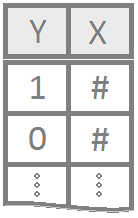
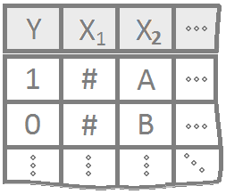

<script type="text/javascript">
 function showhide(id) {
    var e = document.getElementById(id);
    e.style.display = (e.style.display == 'block') ? 'none' : 'block';
 }
  
 function openTab(evt, tabName) {
    var i, tabcontent, tablinks;
    tabcontent = document.getElementsByClassName("tabcontent");
    for (i = 0; i < tabcontent.length; i++) {
        tabcontent[i].style.display = "none";
    }
    tablinks = document.getElementsByClassName("tablinks");
    for (i = 0; i < tablinks.length; i++) {
        tablinks[i].className = tablinks[i].className.replace(" active", "");
    }
    document.getElementById(tabName).style.display = "block";
    evt.currentTarget.className += " active";
 }
</script>

```{r, include=FALSE}
library(plotly)
library(ResourceSelection)
```


----

Regression for a qualitative binary response variable $(Y_i = 0$ or $1)$. The explanatory variables can be either quantitative or qualitative.

----

## Simple Logistic Regression Model {.tabset .tabset-pills .tabset-fade}

<div style="float:left;width:125px;" align=center>

</div>

Regression for a qualitative binary response variable $(Y_i = 0$ or $1)$ using a single (typically quantitative) explanatory variable.

### Overview

<div style="padding-left:125px;">

The probability that $Y_i = 1$ given the observed value of $x_i$ is called $\pi_i$ and is modeled by the equation

<div style="float:right;font-size:.8em;background-color:lightgray;padding:5px;border-radius:4px;"><a style="color:darkgray;" href="javascript:showhide('simplelogisticlatexrcode')">Math Code</a></div>


<div id="simplelogisticlatexrcode" style="display:none;">
```{}
$$
  P(Y_i = 1|\, x_i) = \frac{e^{\beta_0 + \beta_1 x_i}}{1+e^{\beta_0 + \beta_1 x_i}} = \pi_i
$$
```
</div>

<center>
<span class="tooltipr">
$P($
  <span class="tooltiprtext">The "P" stands for "Probability that..."</span>
</span><span class="tooltipr">
$Y_i$
  <span class="tooltiprtext">The response variable. The "i" denotes that this is the y-value for individual "i", where "i" is 1, 2, 3,... and so on up to $n$, the sample size.</span>
</span><span class="tooltipr">
$= 1$
  <span class="tooltiprtext">Equals 1... This states that we are assuming that the probability that the response variable $Y_i$ is a 1 for the current individual.</span>
</span><span class="tooltipr">
$| x_i)$
  <span class="tooltiprtext">Given $x_i$... in other words, the "|" says "given" and $x_i$ means the x-value of the current individual.</span>
</span><span class="tooltipr">
$=$
  <span class="tooltiprtext">Equals sign.</span>
</span><span class="tooltipr">
$\displaystyle\frac{e^{\beta_0 + \beta_1 x_i}}{1 + e^{\beta_0 + \beta_1 x_i}}$
  <span class="tooltiprtext">The logistic regression equation where $e=2.71828...$ is the "natural constant" number and $\beta_0$ is the y-intercept and $\beta_1$ is teh slope.</span>
</span><span class="tooltipr">
$= \pi_i$
  <span class="tooltiprtext">The $\pi_i$ stands for the probability of individual $i$ having a y-value equal to 1 given their $x_i$ value. It is the short hand notation for $P(Y_i = 1 |x_i)$. (It is NOT the number 3.14...)</span>
</span>
</center>

<br/>


The coefficents $\beta_0$ and $\beta_1$ are difficult to interpret directly. Typicall $e^{\beta_0}$ and $e^{\beta_1}$ are interpreted instead. The value of $e^{\beta_0}$ or $e^{\beta_1}$ denotes the relative change in the odds that $Y_i=1$. The odds that $Y_i=1$ are $\frac{\pi_i}{1-\pi_i}$.


----

**Examples:** [challenger](./Analyses/Logistic Regression/Examples/challengerLogisticReg.html) | [mouse](./Analyses/Logistic Regression/Examples/mouseLogisticReg.html) 

----

</div>

### R Instructions

<div style="padding-left:125px;">

**Console** Help Command: `?glm()`

#### Perform a Logistic Regression

<a href="javascript:showhide('logistic1')">
<div class="hoverchunk">
<span class="tooltipr">
YourGlmName
  <span class="tooltiprtext">This is some name you come up with that will become the R object that stores the results of your logistic regression `glm()` command.</span>
</span><span class="tooltipr">
&nbsp;<-&nbsp;
  <span class="tooltiprtext">This is the "left arrow" assignment operator that stores the results of your `glm()` code into `YourGlmName`.</span>
</span><span class="tooltipr">
glm(
  <span class="tooltiprtext">glm( is an R function that stands for "General Linear Model". It works in a similar way that the `lm(` function works except that it requires a `family=` option to be specified at the end of the command.</span>
</span><span class="tooltipr">
Y&nbsp;
  <span class="tooltiprtext">Y is your binary response variable. It must consist of only 0's and 1's. Since TRUE's = 1's and FALSE's = 0's in R, Y could be a logical statement like (Price > 100) or (Animal == "Cat") if your Y-variable wasn't currently coded as 0's and 1's.</span>
</span><span class="tooltipr">
~&nbsp;
  <span class="tooltiprtext">The tilde symbol ~ is used to tell R that Y should be treated as a function of the explanatory variable X.</span>
</span><span class="tooltipr">
X, 
  <span class="tooltiprtext">X is the explanatory variable (typically quantitative) that will be used to explain the probability that the response variable Y is a 1.</span>
</span><span class="tooltipr">
&nbsp;data = NameOfYourDataset,  
  <span class="tooltiprtext">NameOfYourDataset is the name of the dataset that contains Y and X. In other words, one column of your dataset would be called Y and another column would be called X.</span>
</span><span class="tooltipr">
&nbsp;family=binomial)
  <span class="tooltiprtext">The family=binomial command tells the `glm(` function to perform a logistic regression. It turns out that `glm` can perform many different types of regressions, but we only study it as a tool to perform a logistic regression in this course.</span>
</span><br/><span class="tooltipr">
summary(YourGlmName)
  <span class="tooltiprtext">The `summary` command allows you to print the results of your logistic regression that were previously saved in `YourGlmName`.</span>
</span>
</div>
</a>

<div id="logistic1" style="display:none;">

Example output from a regression. Hover each piece to learn more.

<table class="rconsole">
<tr>
<td>
<span class="tooltiprout">
  Call:<br/>
  glm(formula = am ~ disp, family = binomial, data = mtcars)
    <span class="tooltiprouttext">This is simply a statement of your original glm(...) "call" that you made when performing your regression. It allows you to verify that you ran what you thought you ran in the glm(...).</span>
</span>
</td>
</tr>
</table>
      

<br/>

<table class="rconsole">
<tr>
<td colspan="2">
  <span class="tooltiprout">
    Deviance Residuals:
      <span class="tooltiprouttext">Deviance residuals are a measure of how far the fitted probability for $\pi_i$ has differed from the actual outcome of $Y_i$ in terms of the log of the fitted probability space. (This is a fairly complicated idea.)
  </span>
</td>
</tr>
<tr>
<td align="right">
  <span class="tooltiprout">
    Min<br/>
    &nbsp; -1.5651
      <span class="tooltiprouttext">"min" gives the value of the residual that is furthest below the regression line. Ideally, the magnitude of this value would be about equal to the magnitude of the largest positive residual (the max) because the hope is that the residuals are normally distributed around the line.</span>
  </span>
</td><td align="right">   
  <span class="tooltiprout">
    1Q<br/>
    &nbsp; -0.6648
      <span class="tooltiprouttext">"1Q" gives the first quartile of the residuals, which will always be negative, and ideally would be about equal in magnitude to the third quartile.</span>
  </span>
</td><td align="right"> 
  <span class="tooltiprout">
    Median<br/>
    &nbsp; -0.2460
      <span class="tooltiprouttext">"Median" gives the median of the residuals, which would ideally would be about equal to zero. Note that because the regression line is the least squares line, the mean of the residuals will ALWAYS be zero, so it is never included in the output summary. This particular median value of -0.2460 is a little smaller than zero than we would hope for and suggests a right skew in the data because the mean (0) is greater than the median (-0.2460) witnessing the residuals are right skewed. This can also be seen in the maximum being much larger in magnitude than the minimum.</span>
  </span>
</td><td align="right">
  <span class="tooltiprout">
    3Q<br/>
    &nbsp; 0.7276
      <span class="tooltiprouttext">"3Q" gives the third quartile of the residuals, which would ideally would be about equal in magnitude to the first quartile. In this case, it is pretty close, which helps us see that the first quartile of residuals on either side of the line is behaving fairly normally.</span>
  </span>
</td><td align="right">
  <span class="tooltiprout">
    Max</br>
    &nbsp; 2.2691
      <span class="tooltiprouttext">"Max" gives the maximum positive residuals, which would ideally would be about equal in magnitude to the minimum residual. In this case, it is much larger than the minimum, which helps us see that the residuals are likely right skewed.</span>
  </span>
</td>
</tr>
</table>

<br/>


<table class="rconsole">
<tr>
<td colspan="2">
  <span class="tooltiprout">
    Coefficients:
      <span class="tooltiprouttext">Notice that in your glm(...) you used only $Y$ and $X$. You did type out any coefficients, i.e., the $\beta_0$ or $\beta_1$ of the regression model. These coefficients are estimated by the glm(...) function and displayed in this part of the output along with standard errors, t-values, and p-values.</span>
  </span>
</td>
</tr><tr>
<td align="left"></td>
<td align="right">
  <span class="tooltiprout">
    &nbsp; Estimate
      <span class="tooltiprouttext">To learn more about the "Estimates" of the "Coefficients" see the "Explanation" tab, "Estimating the Model Parameters" section for details.</span>
</td><td align="right">
  <span class="tooltiprout">
    &nbsp; Std. Error
      <span class="tooltiprouttext">To learn more about the "Standard Errors" of the "Coefficients" see the "Explanation" tab, "Inference for the Model Parameters" section.</span>
  </span>    
</td><td align="right">
  <span class="tooltiprout">
    &nbsp; z value 
      <span class="tooltiprouttext">The test statistic is a regular old z-score. It is most reliable when the sample size is "large." It is a measurement of the number of standard errors the estimate is from 0.</span>
  </span>
</td><td align="right">
  <span class="tooltiprout">
    &nbsp; Pr(>|z|)
      <span class="tooltiprouttext">This is the p-value, the probability of observing a test statistic more extreme than Z. </span>
  </span>
</td>
</tr><tr>
<td align="left">
  <span class="tooltiprout">
    (Intercept)
      <span class="tooltiprouttext">This always says "Intercept" for any glm(...) you run in R. That is because R always assumes there is a y-intercept for your regression function.</span>
  </span>
</td><td align="right">
  <span class="tooltiprout">
    &nbsp; 2.630849
      <span class="tooltiprouttext">This is the estimate of the y-intercept, $\beta_0$. It is called $b_0$. It is the value of the log of the odds that $Y_i=1$ when $x_i$ is zero. Remember to use $e^{b_0}$ to interpret this values actual effect on the odds.</span>
  </span>
</td><td align="right">
  <span class="tooltiprout">
    &nbsp; 1.050170
      <span class="tooltiprouttext">This is the standard error of $b_0$. It tells you how much $b_0$ varies from sample to sample. The closer to zero, the better.</span>
  </span>
</td><td align="right">
  <span class="tooltiprout">
    2.505
      <span class="tooltiprouttext">The test statistic for testing the hypothesis that $\beta_0 = 0$.</span>
  </span>
</td><td align="right">
  <span class="tooltiprout">
    0.01224
      <span class="tooltiprouttext">This is the p-value of the test of the hypothesis that $\beta_0 = 0$. It measures the probability of observing a z-score as extreme as the one observed. To compute it yourself in R, use `pnorm(-abs(your z-value))*2`.</span>
  </span>
</td><td align="left">
  <span class="tooltiprout">
    *
      <span class="tooltiprouttext">This is called a "star". One star means significant at the 0.1 level of $\alpha$.</span>
  </span>
</td>
</tr><tr>
<td align="left">
  <span class="tooltiprout">
    disp
      <span class="tooltiprouttext">This is always the name of your X-variable in your glm(Y ~ X, ...).</span>
  </span>
</td><td align="right">
  <span class="tooltiprout">
    &nbsp; -0.014604
      <span class="tooltiprouttext">This is the estimate of the slope, $\beta_1$. It is called $b_1$. It is the change in the log of the odds that $Y_i = 1$ as X is increased by 1 unit. Remember to use $e^{b_1}$ to compute the actual effect on the odds.</span>
  </span>
</td><td align="right">
  <span class="tooltiprout">
    &nbsp; 0.005168
      <span class="tooltiprouttext">This is the standard error of $b_1$. It tells you how much $b_1$ varies from sample to sample. The closer to zero, the better.</span>
  </span>
</td><td align="right">
  <span class="tooltiprout">
    -2.826
      <span class="tooltiprouttext">This is the test statistic for testing the hypothesis that $\beta_1 = 0$.</span>
  </span>
</td><td align="right">
  <span class="tooltiprout">
    0.00471
      <span class="tooltiprouttext">This is the p-value of the test of the hypothesis that $\beta_1 = 0$. To compute it yourself in R, use `pnorm(-abs(your z-value))*2`</span>
  </span>
</td><td align="left">
<span class="tooltiprout">
    \*\*
      <span class="tooltiprouttext">This is called a "star". Three stars means significant at the 0.001 level of $\alpha$.</span>
  </span>
</td>
</tr>
</table>

<table class="rconsole">
<tr>
<td>
  <span>
  \-\-\-
  </span>
</td>
</tr>
</table>

<table class="rconsole">
<tr>
<td>
  <span class="tooltiprout">
    Signif. codes:  0 ‘\*\*\*’ 0.001 ‘\*\*’ 0.01 ‘*’ 0.05 ‘.’ 0.1 ‘ ’ 1
      <span class="tooltiprouttext">These "codes" explain what significance level the p-value is smaller than based on how many "stars" * the p-value is labeled with in the Coefficients table above.</span>
  </span>
</td>
</tr>
</table>

<br/>

<table class="rconsole">
<tr>
<td>
  <span class="tooltiprout">
    (Dispersion parameter for binomial family taken to be 1)
      <span class="tooltiprouttext">This is a simplifying assumption of the logistic regression. Overdispersion is a common problem with logistic regression data, but is typically ignored. Unless you become an expert in statistics, this is not something you need to worry about.</span>
  </span>
</td>
</tr>
</table>

<br/>

<table class="rconsole">
<tr>
<td>
  <span class="tooltiprout">
    &nbsp; Null Deviance:
      <span class="tooltiprouttext">The deviance of the null model. This is the model that excludes any information from the x-variable, i.e., $\beta_1=0$.</span>
  </span>
</td><td align="right">
  <span class="tooltiprout">
    &nbsp;43.230
      <span class="tooltiprouttext"></span>
  </span>    
</td><td align="right">
  <span class="tooltiprout">
    &nbsp;on 31 degrees of freedom 
      <span class="tooltiprouttext">The residual degrees of freedom. The higher this number, the more reliable the p-values will be from the logistic regression.</span>
  </span> 
</td> 
</tr>
</table>

<table class="rconsole">
<tr>
<td>
  <span class="tooltiprout">
   Residual deviance:
      <span class="tooltiprouttext">The sum of log of the squared residuals. Essentially the resulting statistic of a goodness of fit test measuring how well the data works with the logistic regression model. Using pchisq(residual deviance, df residual deviance, lower.tail=FALSE) gives the p-value for this goodness of fit test. However, the residual deviance only follows a chi-squared distribution with df residual deviance when there are many repeated x-values, and all x-values have at least a few replicates.</span>
  </span>
</td><td align="right">
  <span class="tooltiprout">
    &nbsp;29.732
      <span class="tooltiprouttext">This can be calculated by `sum(log(myglm$res^2))`.</span>
  </span>    
</td><td align="right">
  <span class="tooltiprout">
    &nbsp;on 30 degrees of freedom 
      <span class="tooltiprouttext">This is $n-p$ where $n$ is the sample size and $p$ is the number of parameters in the regression model. In this case, there is a sample size of 32 and two parameters, $\beta_0$ and $\beta_1$, so 32-2 = 30.</span>
  </span> 
</td> 
</tr>
</table>

<table class="rconsole">
<tr>
<td>
  <span class="tooltiprout">
   AIC:
      <span class="tooltiprouttext">As stated in the R Help file for ?glm, "A version of Akaike's An Information Criterion..." The AIC is useful for comparing different models for the same Y-variable. The glm model with the lowest AIC (which can go negative) is the best model.</span>
  </span>
</td><td align="right">
  <span class="tooltiprout">
    &nbsp;33.732
      <span class="tooltiprouttext">The AIC for this particular model is 33.732. So if a different model (using the same Y-variable as this model) can get a lower AIC, it is a better model.</span>
  </span>    
</td> 
</tr>
</table>

<br/>

<table class="rconsole">
<tr>
<td>
  <span class="tooltiprout">
   Number of Fisher Scoring iterations:
      <span class="tooltiprouttext">If you have taken a class in Numerical Analysis, this tells you how many iterations of the maximization algorithm were required before converging to the "Estimates" of the parameters $\beta_0$ and $\beta_1$ found in the summary.</span>
  </span>
</td><td align="right">
  <span class="tooltiprout">
    &nbsp;5
      <span class="tooltiprouttext">This implementation of glm required 5 Fisher Scoring iterations to converge. Fewer iterations hints that the model is a better fit than when many iterations are required.</span>
  </span>    
</td> 
</tr>
</table>


</div>

<br/>

#### Diagnose the Goodness-of-Fit

There are two ways to check the **goodness of fit** of a logistic regression model.

<div style="padding-left:25px;">
**Option 1**: Hosmer-Lemeshow Goodness-of-Fit Test (Most Common)

To check the **goodness of fit** of a logistic regression model where there are **few or no replicated $x$-values** use the Hosmer-Lemeshow Test.

<a href="javascript:showhide('goodnessoffit2')">
<div class="hoverchunk">
<span class="tooltipr">
library(ResourceSelection)
  <span class="tooltiprtext">This loads the ResourceSelection R package so that you can access the hoslem.test() function. You may need to run the code: install.packages("ResourceSelection") first.</span>
</span><br/><span class="tooltipr">
hoslem.test(
  <span class="tooltiprtext">This R function performs the Hosmer-Lemeshow Goodness of Fit Test. See the "Explanation" file to learn about this test.</span>
</span><span class="tooltipr">
YourGlmName
  <span class="tooltiprtext">`YourGlmName` is the name of your glm(...) code that you created previously.</span>
</span><span class="tooltipr">
\$y,&nbsp;
  <span class="tooltiprtext">ALWAYS type a "y" here. This gives you the actual binary (0,1) y-values of your logistic regression. The goodness of fit test will compare these actual values to your predicted probabilities for each value in order to see if the model is a "good fit."</span>
</span><span class="tooltipr">
YourGlmName
  <span class="tooltiprtext">`YourGlmName` is the name you used to save the results of your glm(...) code.</span>
</span><span class="tooltipr">
\$fitted,&nbsp;
  <span class="tooltiprtext">ALWAYS type "fitted" here. This gives you the fitted probabilities $\pi_i$ of your logistic regression.</span>
</span><span class="tooltipr">
g=10)
  <span class="tooltiprtext">The "g=10" is the default option for the value of g. The g is the number of groups to run the goodness of fit test on. Just leave it at 10 unless you are told to do otherwise. Ask your teacher for more information if you are interested.</span>
</span>
</div>
</a>

<div id="goodnessoffit2" style="display:none;">
```{r, echo=FALSE}
myglm <- glm(am ~ disp, data = mtcars, family = binomial)
library(ResourceSelection)
hoslem.test(myglm$y, myglm$fitted)
```

Note that the null hypothesis of the goodness-of-fit test is that "the logistic regression is a good fit." So we actually don't want to "reject the null" in this case. So a large p-value here means our logistic regression fits the data satisfactorily. A small p-value implies a poor fit and the results of the logistic regression should not be fully trusted.

</div>

<br/>

**Option 2**: Deviance Goodness-of-fit Test (Less Common)

In some cases, there are **many replicated $x$-values** for **all** x-values, i.e.,  each value of x is repeated more than 50 times. Though this is rare, it is good to use the *deviance goodness-of-fit test* whenever this happens.

<a href="javascript:showhide('goodnessoffit1')">
<div class="hoverchunk">
<span class="tooltipr">
pchisq(
  <span class="tooltiprtext">The `pchisq` command allows you to compute p-values from the chi-squared distribution.</span>
</span><span class="tooltipr">
residual deviance,&nbsp;
  <span class="tooltiprtext">The residual deviance is shown at the bottom of the output of your `summary(YourGlmName)` and should be typed in here as a number like 25.3.</span>
</span><span class="tooltipr">
df for residual deviance,&nbsp;
  <span class="tooltiprtext">The df for the residual deviance is also shown at the bottom of the output of your `summary(YourGlmName)`.</span>
</span><span class="tooltipr">
lower.tail=FALSE)
<span class="tooltiprtext">This command ensures you find the probability of the chi-squared distribution being as extreme or more extreme than the observed value of residual deviance.</span>
</span>
</div>
</a>


<div id="goodnessoffit1" style="display:none;">
```{r, echo=FALSE}
myglm <- glm(am ~ disp, data = mtcars, family = binomial)
summary(myglm)
pchisq(29.732, 30, lower.tail = FALSE)
```

The null hypothesis of the goodness-of-fit test is that the logistic regression is a good fit of the data. So a large p-value (like 0.479) is good because it allows us to trust the results of our logistic regression. When the p-value becomes very small, we must "reject the null" and conclude a poor fit, which implies that we should not trust the results of the logistic regression.

</div>

</div>
<br/>

#### Plot the Regression

<div class="tab">
  <button class="tablinks" onclick="openTab(event, 'LogisticBaseplot')">Base R</button>
  <button class="tablinks" onclick="openTab(event, 'Logisticggplot')">ggplot2</button>
</div>

<div id="LogisticBaseplot" class="tabcontent">
  <p>
<a href="javascript:showhide('LogisticBaseplot2')">
<div class="hoverchunk"><span class="tooltipr">
plot(
  <span class="tooltiprtext">The plot function allows us to draw a scatterplot where the y-axis is only 0's or 1's and the x-axis is quantitative.</span>
</span><span class="tooltipr">
Y
  <span class="tooltiprtext">Y should be some logical statement like Fail > 0 or sex == "B" or height < 68. In other words, Y needs to be a collection of 0's and 1's.</span>
</span><span class="tooltipr">
&nbsp;~&nbsp;
  <span class="tooltiprtext">The tilde is read "Y on X."</span>
</span><span class="tooltipr">
X,
  <span class="tooltiprtext">X is some quantitative variable.</span>
</span><span class="tooltipr">
&nbsp;data=
  <span class="tooltiprtext">Tell the plot which data set to use. X and Y are columns of that data set.</span>
</span><span class="tooltipr">
YourDataSet
  <span class="tooltiprtext">The name of your data set.</span>
</span><span class="tooltipr">
)
  <span class="tooltiprtext">Closing parenthesis for plot(...) function.</span>
</span><br/><span class="tooltipr">
curve(
  <span class="tooltiprtext">A function in R that draws a "curve" on a plot. Using add=TRUE puts the curve onto the current plot.</span>
</span><span class="tooltipr">
exp(
  <span class="tooltiprtext">This allows you to compute e to the power of something. So exp(1) = e, exp(2) = e^2 and so on.</span>
</span><span class="tooltipr">
$b_0$ +
  <span class="tooltiprtext">This is the "Intercept" estimate from your logistic regression summary output.</span>
</span><span class="tooltipr">
&nbsp;$b_1$
  <span class="tooltiprtext">This is the slope estimate from your logistic regression summary output.</span>
</span><span class="tooltipr">
\*x
  <span class="tooltiprtext">The curve function demands you ALWAYS use a lower-case "x" in this function.</span>
</span><span class="tooltipr">
)
  <span class="tooltiprtext">Closing parenthesis.</span>
</span><span class="tooltipr">
/
  <span class="tooltiprtext">The division symbol.</span>
</span><span class="tooltipr">
(1 + 
  <span class="tooltiprtext">Required for the formula.</span>
</span><span class="tooltipr">
&nbsp;exp($b_0$ + $b_1$*x)
  <span class="tooltiprtext">This needs to match exactly the first version of this statement.</span>
</span><span class="tooltipr">
),
  <span class="tooltiprtext">Closing parenthesis for the denominator.</span>
</span><span class="tooltipr">
&nbsp;add = TRUE)
  <span class="tooltiprtext">This makes the curve be added to the current plot. If it is left out, the curve will be drawn in a new plot.</span>
</span>
</div>
</a>

<div id="LogisticBaseplot2" style="display:none;">
```{r, echo=FALSE}
myglm <- glm(am ~ disp, data = mtcars, family = binomial)
plot(am ~ disp, data = mtcars, pch=16)
curve(exp(2.631-0.015*x)/(1+exp(2.631-0.015*x)), add=TRUE)
```
</div>

  </p>
</div>

<div id="Logisticggplot" class="tabcontent">
  <p>
<a href="javascript:showhide('Logisticggplot2')">
<div class="hoverchunk"><span class="tooltipr">
ggplot(
  <span class="tooltiprtext">The ggplot(...) function is used to create a basic ggplot frame.</span>
</span><span class="tooltipr">
data=YourDataSetName,
  <span class="tooltiprtext">Use this to specify the name of your data set.</span>
</span><span class="tooltipr">
&nbsp;aes(
  <span class="tooltiprtext">The aes(...) function stands for "aesthetics" and tells the ggplot which variables to match up with the x-axis and y-axis of the graph as well as other visual things like the type of plotting characters, size of plotting characters, color, fill, and so on.</span>
</span><span class="tooltipr">
x=X,
  <span class="tooltiprtext">Use x=nameOfYourXvariable to declare the x-axis of your graph.</span>
</span><span class="tooltipr">
y=Y
  <span class="tooltiprtext">Use y=nameOfYourYvariable to declare the y-axis of your graph. If your y-variable is a logical expression, like height>60 then you must use y=as.numeric(height>60).</span>
</span><span class="tooltipr">
)
  <span class="tooltiprtext">Closing parenthesis for aes(...) function.</span>
</span><span class="tooltipr">
)
  <span class="tooltiprtext">Closing parenthesis for ggplot(...) function.</span>
</span><span class="tooltipr">
&nbsp;+
  <span class="tooltiprtext">The plus sign adds a new layer to the ggplot.</span>
</span><br/><span class="tooltipr">
&nbsp; geom_point(
  <span class="tooltiprtext">Tells the plot to add the physical geometry of "points" to the plot.</span>
</span><span class="tooltipr">
)
  <span class="tooltiprtext">Closing parenthesis for the geom_point() function.</span>
</span><span class="tooltipr">
&nbsp;+
  <span class="tooltiprtext">Add another layer to the plot.</span>
</span><br/><span class="tooltipr">
&nbsp; geom_smooth(
  <span class="tooltiprtext">Add a smoothing line to the graph.</span>
</span><span class="tooltipr">
method="glm",
  <span class="tooltiprtext">This adds a general linear model to the graph.</span>
</span><span class="tooltipr">
method.args = list(family="binomial"),
  <span class="tooltiprtext">This tells the method="glm" to choose specifically the "binomial" model, otherwise known as the "logistic regression" model.</span>
</span><span class="tooltipr">
&nbsp;se=FALSE
  <span class="tooltiprtext">Turn off the displaying of the confidence band around the logistic regression. You can turn this on if you know what it means.</span>
</span><span class="tooltipr">
)
  <span class="tooltiprtext">Closing parenthesis for the geom_smooth() function.</span>
</span><span class="tooltipr">
&nbsp;+
  <span class="tooltiprtext">Add another layer to the ggplot.</span>
</span><br/><span class="tooltipr">
&nbsp; theme_bw()
  <span class="tooltiprtext">Give the graph a basic black and white theme. Other themes are possible, see ?theme_ in your Console.</span>
</span>
</div>
</a>

<div id="Logisticggplot2" style="display:none;">
```{r, echo=FALSE}
ggplot(mtcars, aes(disp, am)) +
  geom_point() +
  geom_smooth(method = "glm", method.args = list(family = "binomial"), se = FALSE) +
  theme_bw()
```
</div>

  </p>
</div>

<br/>

#### Predict Probabilities 

To predict the probability that $Y_i=1$ for a given $x$-value, use the code

<a href="javascript:showhide('LogisticPredict')">
<div class="hoverchunk">
<span class="tooltipr">
predict(
  <span class="tooltiprtext">The predict() function allows us to use the regression model that was obtained from glm() to predict the probability that $Y_i = 1$ for a given $X_i$.</span>
</span><span class="tooltipr">
YourGlmName,&nbsp;
  <span class="tooltiprtext">`YourGlmName` is the name of the object you created when you performed your logistic regression using glm().</span>
</span><span class="tooltipr">
newdata =&nbsp;
<span class="tooltiprtext">The `newdata = ` command allows you to specify the x-values for which you want to obtain predicted probabilities that $Y_i=1$.</span>
</span><span class="tooltipr">
data.frame(xVariableName = someNumericValue),&nbsp;
<span class="tooltiprtext">The xVariableName is the same one you used in your glm(y ~ x, ...) statement for "x". Input any desired value for the "someNumericValue" spot. Then, the predict code uses the logistic regression model equation to calculate a predicted probability that $Y_i = 1$ for the given $x_i$ value that you specify.</span>
</span><span class="tooltipr">
type = "response")
  <span class="tooltiprtext">The type = "response" options specifies that you want predicted probabilities. There are other options available. See ?predict.glm for details.</span>
</span>
</div>
</a>

<div id="LogisticPredict" style="display:none;">
```{r}
myglm <- glm(am ~ disp, data = mtcars, family = binomial)
predict(myglm, newdata = data.frame(disp = 200), type = "response")
```
</div>


----

</div>

### Explanation

<div style="padding-left:125px;">


Simple Logistic Regression is used when 

* the response variable is binary $(Y_i=0$ or $1)$, and
* there is a single explanatory variable $X$ that is typically quantitative but could be qualitative (if $X$ is binary or ordinal).


#### The Model 

Since $Y_i$ is binary (can only be 0 or 1) the model focuses on describing the probability that $Y_i=1$ for a given scenario. The probability that $Y_i = 1$ given the observed value of $x_i$ is called $\pi_i$ and is modeled by the equation

$$
  P(Y_i = 1|\, x_i) = \frac{e^{\beta_0 + \beta_1 x_i}}{1+e^{\beta_0 + \beta_1 x_i}} = \pi_i
$$

The assumption is that for certain values of $X$ the probability that $Y_i=1$ is higher than for other values of $X$. 


#### Interpretation

This model for $\pi_i$ comes from modeling the *log of the odds* that $Y_i=1$ using a linear regression, i.e., 
$$
  \log\underbrace{\left(\frac{\pi_i}{1-\pi_i}\right)}_{\text{Odds for}\ Y_i=1} = \underbrace{\beta_0 + \beta_1 x_i}_{\text{linear regression}}
$$ 
Beginning to solve this equation for $\pi_i$ leads to the intermediate, but important result that
$$
    \underbrace{\frac{\pi_i}{1-\pi_i}}_{\text{Odds for}\ Y_i=1} = e^{\overbrace{\beta_0 + \beta_1 x_i}^{\text{linear regression}}} = e^{\beta_0}e^{\beta_1 x_i}
$$
Thus, while the coefficients $\beta_0$ and $\beta_1$ are difficult to interpret directly, $e^{\beta_0}$ and $e^{\beta_1}$ have a valuable interpretation. The value of $e^{\beta_0}$ is interpreted as the odds for $Y_i=1$ when $x_i = 0$. It may not be possible for a given model to have $x_i=0$, in which case $e^{\beta_0}$ has no interpretation. The value of $e^{\beta_1}$ denotes the proportional change in the odds that $Y_i=1$ for every one unit increase in $x_i$. 

Notice that solving the last equation for $\pi_i$ results in the logistic regression model presented at the beginning of this page.


#### Hypothesis Testing

Similar to linear regression, the hypothesis that
$$
  H_0: \beta_1 = 0 \\
  H_a: \beta_1 \neq 0
$$
can be tested with a logistic regression. If $\beta_1 = 0$, then there is no relationship between $x_i$ and the log of the odds that $Y_i = 1$. In other words, $x_i$ is not useful in predicting the probability that $Y_i = 1$. If $\beta_1 \neq 0$, then there is information in $x_i$ that can be utilized to predict the probability that $Y_i = 1$, i.e., the logistic regression is meaningful.


#### Checking Model Assumptions {#diagnostics}

The model assumptions are not as clear in logistic regression as they are in linear regression. For our purposes we will focus only on considering the goodness of fit of the logistic regression model. If the model appears to fit the data well, then it will be assumed to be appropriate.

<div style="padding-left:15px;">

##### Deviance Goodness of Fit Test

If there are replicated values of each $x_i$, then the deviance goodness of fit test tests the hypotheses
$$
  H_0: \pi_i = \frac{e^{\beta_0 + \beta_1 x_i}}{1+e^{\beta_0 + \beta_1 x_i}}
$$
$$
  H_a: \pi_i \neq \frac{e^{\beta_0 + \beta_1 x_i}}{1+e^{\beta_0 + \beta_1 x_i}}
$$


##### Hosmer-Lemeshow Goodness of Fit Test

If there are very few or no replicated values of each $x_i$, then the Hosmer-Lemeshow goodness of fit test can be used to test these same hypotheses. In each case, the null assumes that logistic regression is a good fit for the data while the alternative is that logistic regression is not a good fit. 

</div>

#### Prediction

One of the great uses of Logistic Regression is that it provides an estimate of the probability that $Y_i=1$ for a given value of $x_i$. This probability is often referred to as the *risk* that $Y_i=1$ for a certain individual. For example, if $Y_i=1$ implies a person has a disease, then $\pi_i=P(Y_i=1)$ represents the risk of individual $i$ having the disease based on their value of $x_i$, perhaps a measure of their cholesterol or some other predictor of the disease. 

</div>

----


###


----


## Multiple Logistic Regression Model {.tabset .tabset-pills .tabset-fade}


<div style="float:left;width:125px;" align=center>

</div>

Logistic regression for multiple explanatory variables that can either be quantitative or qualitative or a mixture of the two.


### Overview

<div style="padding-left:125px;">

The probability that $Y_i = 1$ given the observed data $(x_{i1},\ldots,x_{ip})$ is called $\pi_i$ and is modeled by the equation

$$
  P(Y_i = 1|\, x_{i1},\ldots,x_{ip}) = \frac{e^{\beta_0 + \beta_1 x_{i1} + \ldots + \beta_p x_{ip}}}{1+e^{\beta_0 + \beta_1 x_{i1} + \ldots + \beta_p x_{ip} }} = \pi_i
$$

The coefficents $\beta_0,\beta_1,\ldots,\beta_p$ are difficult to interpret directly. Typically $e^{\beta_k}$ for $k=0,1,\ldots,p$ is interpreted instead. The value of $e^{\beta_k}$ denotes the relative change in the odds that $Y_i=1$. The odds that $Y_i=1$ are $\frac{\pi_i}{1-\pi_i}$.

----


**Examples:** [GSS](./Analyses/Logistic Regression/Examples/GSSMultipleLogisticReg.html) 

----

</div>

### R Instructions

<div style="padding-left:125px;">


**Console** Help Command: `?glm()`

#### Perform the Logistic Regression

To perform a logistic regression in R use the commands

<a href="javascript:showhide('logistic2')">
<div class="hoverchunk">
<span class="tooltipr">
YourGlmName
  <span class="tooltiprtext">This is some name you come up with that will become the R object that stores the results of your logistic regression `glm()` command.</span>
</span><span class="tooltipr">
&nbsp;<-&nbsp;
  <span class="tooltiprtext">This is the "left arrow" assignment operator that stores the results of your `glm()` code into `YourGlmName`.</span>
</span><span class="tooltipr">
glm(
  <span class="tooltiprtext">glm( is an R function that stands for "General Linear Model". It works in a similar way that the `lm(` function works except that it requires a `family=` option to be specified at the end of the command.</span>
</span><span class="tooltipr">
Y&nbsp;
  <span class="tooltiprtext">Y is your binary response variable. It must consist of only 0's and 1's. Since TRUE's = 1's and FALSE's = 0's in R, Y could be a logical statement like (Price > 100) or (Animal == "Cat") if your Y-variable wasn't currently coded as 0's and 1's.</span>
</span><span class="tooltipr">
~&nbsp;
  <span class="tooltiprtext">The tilde symbol ~ is used to tell R that Y should be treated as a function of the explanatory variable X.</span>
</span><span class="tooltipr">
X1
  <span class="tooltiprtext">X1 is the first explanatory variable (typically quantitative) that will be used to explain the probability that the response variable Y is a 1.</span>
</span><span class="tooltipr">
\*
  <span class="tooltiprtext">The times symbol allows a shortcut for writing X1 + X2 + X1:X2 = X1*X2.</span>
</span><span class="tooltipr">
X2&nbsp;
  <span class="tooltiprtext">X2 is second the explanatory variable either quantitative or qualitative that will be used to explain the probability that the response variable Y is a 1.</span>
</span><span class="tooltipr">
..., 
  <span class="tooltiprtext">In theory, you could have many other explanatory variables, interaction terms, or even squared, cubed, or other transformations of terms added to this model.</span>
</span><span class="tooltipr">
&nbsp;data = NameOfYourDataset,  
  <span class="tooltiprtext">NameOfYourDataset is the name of the dataset that contains Y and X. In other words, one column of your dataset would be called Y and another column would be called X.</span>
</span><span class="tooltipr">
&nbsp;family=binomial)
  <span class="tooltiprtext">The family=binomial command tells the `glm(` function to perform a logistic regression. It turns out that `glm` can perform many different types of regressions, but we only study it as a tool to perform a logistic regression in this course.</span>
</span><br/><span class="tooltipr">
summary(YourGlmName)
  <span class="tooltiprtext">The `summary` command allows you to print the results of your logistic regression that were previously saved in `YourGlmName`.</span>
</span>
</div>
</a>

<div id="logistic2" style="display:none;">

Example output from a regression. Hover each piece to learn more.

<table class="rconsole">
<tr>
<td>
<span class="tooltiprout">
  Call:<br/>
 glm(formula = weight > 100 ~ Time*Diet, family = binomial, 
    data = ChickWeight)
    <span class="tooltiprouttext">This is simply a statement of your original glm(...) "call" that you made when performing your regression. It allows you to verify that you ran what you thought you ran in the glm(...).</span>
</span>
</td>
</tr>
</table>
      

<br/>

<table class="rconsole">
<tr>
<td colspan="2">
  <span class="tooltiprout">
    Deviance Residuals:
      <span class="tooltiprouttext">Deviance residuals are a measure of how far the fitted probability for $\pi_i$ has differed from the actual outcome of $Y_i$ in terms of the log of the fitted probability space. (This is a fairly complicated idea.)
  </span>
</td>
</tr>
<tr>
<td align="right">
  <span class="tooltiprout">
    Min<br/>
    &nbsp; -2.9446
      <span class="tooltiprouttext">"min" gives the value of the residual that is furthest below the regression line. Ideally, the magnitude of this value would be about equal to the magnitude of the largest positive residual (the max) because the hope is that the residuals are normally distributed around the line.</span>
  </span>
</td><td align="right">   
  <span class="tooltiprout">
    1Q<br/>
    &nbsp; -0.2364
      <span class="tooltiprouttext">"1Q" gives the first quartile of the residuals, which will always be negative, and ideally would be about equal in magnitude to the third quartile.</span>
  </span>
</td><td align="right"> 
  <span class="tooltiprout">
    Median<br/>
    &nbsp; 0.0000
      <span class="tooltiprouttext">"Median" gives the median of the residuals, which would ideally would be about equal to zero. Note that because the regression line is the least squares line, the mean of the residuals will ALWAYS be zero, so it is never included in the output summary.</span>
  </span>
</td><td align="right">
  <span class="tooltiprout">
    3Q<br/>
    &nbsp; 0.2776
      <span class="tooltiprouttext">"3Q" gives the third quartile of the residuals, which would ideally would be about equal in magnitude to the first quartile. In this case, it is pretty close, which helps us see that the first quartile of residuals on either side of the line is behaving fairly normally.</span>
  </span>
</td><td align="right">
  <span class="tooltiprout">
    Max</br>
    &nbsp; 1.9968
      <span class="tooltiprouttext">"Max" gives the maximum positive residuals, which would ideally would be about equal in magnitude to the minimum residual. In this case, it is much larger than the minimum, which helps us see that the residuals are likely right skewed.</span>
  </span>
</td>
</tr>
</table>

<br/>


<table class="rconsole">
<tr>
<td colspan="2">
  <span class="tooltiprout">
    Coefficients:
      <span class="tooltiprouttext">Notice that in your glm(...) you used only $Y$ and $X$. You did type out any coefficients, i.e., the $\beta_0$ or $\beta_1$ of the regression model. These coefficients are estimated by the glm(...) function and displayed in this part of the output along with standard errors, t-values, and p-values.</span>
  </span>
</td>
</tr><tr>
<td align="left"></td>
<td align="right">
  <span class="tooltiprout">
    &nbsp; Estimate
      <span class="tooltiprouttext">To learn more about the "Estimates" of the "Coefficients" see the "Explanation" tab, "Estimating the Model Parameters" section for details.</span>
</td><td align="right">
  <span class="tooltiprout">
    &nbsp; Std. Error
      <span class="tooltiprouttext">To learn more about the "Standard Errors" of the "Coefficients" see the "Explanation" tab, "Inference for the Model Parameters" section.</span>
  </span>    
</td><td align="right">
  <span class="tooltiprout">
    &nbsp; z value 
      <span class="tooltiprouttext">The Z-score testing the hypothesis that $\beta_j=0$</span>
  </span>
</td><td align="right">
  <span class="tooltiprout">
    &nbsp; Pr(>|z|)
      <span class="tooltiprouttext">The p-value for the corresponding Z-score.</span>
  </span>
</td>
</tr><tr>
<td align="left">
  <span class="tooltiprout">
    (Intercept)
      <span class="tooltiprouttext">This always says "Intercept" for any glm(...) you run in R. That is because R always assumes there is a y-intercept for your regression function.</span>
  </span>
</td><td align="right">
  <span class="tooltiprout">
    &nbsp; -4.97603
      <span class="tooltiprouttext">This is the estimate of the y-intercept, $\beta_0$. It is called $b_0$. It is the average y-value when X is zero.</span>
  </span>
</td><td align="right">
  <span class="tooltiprout">
    &nbsp; 0.65316
      <span class="tooltiprouttext">This is the standard error of $b_0$. It tells you how much $b_0$ varies from sample to sample. The closer to zero, the better.</span>
  </span>
</td><td align="right">
  <span class="tooltiprout">
    -7.618
      <span class="tooltiprouttext">Z-score for $b_0$.</span>
  </span>
</td><td align="right">
  <span class="tooltiprout">
    2.57e-14
      <span class="tooltiprouttext">This is the p-value of the test of the hypothesis that $\beta_0 = 0$. It measures the probability of observing a Z-value as extreme as the one observed. To compute it yourself in R, use `pnorm(-abs(your z-value))*2`.</span>
  </span>
</td><td align="left">
<span class="tooltiprout">
    \*\*\*
      <span class="tooltiprouttext">This is called a "star". Three stars means significant at the 0.01 level of $\alpha$.</span>
  </span>
</td>
</tr><tr>
<td align="left">
  <span class="tooltiprout">
    Time
      <span class="tooltiprouttext">This is always the name of your X-variable in your glm(Y ~ X, ...).</span>
  </span>
</td><td align="right">
  <span class="tooltiprout">
    &nbsp; 0.39111 
      <span class="tooltiprouttext">This is the estimate of the slope, $\beta_1$. It is called $b_1$. It is the change in the average y-value as X is increased by 1 unit.</span>
  </span>
</td><td align="right">
  <span class="tooltiprout">
    &nbsp; 0.04979
      <span class="tooltiprouttext">This is the standard error of $b_1$. It tells you how much $b_1$ varies from sample to sample. The closer to zero, the better.</span>
  </span>
</td><td align="right">
  <span class="tooltiprout">
    7.854
      <span class="tooltiprouttext">Z-score for $b_1$.</span>
  </span>
</td><td align="right">
  <span class="tooltiprout">
    4.02e-15
      <span class="tooltiprouttext">This is the p-value of the test of the hypothesis that $\beta_1 = 0$. To compute it yourself in R, use `pt(-abs(your t-value), df of your regression)*2`</span>
  </span>
</td><td align="left">
<span class="tooltiprout">
    \*\*\*
      <span class="tooltiprouttext">This is called a "star". Three stars means significant at the 0.01 level of $\alpha$.</span>
  </span>
</td>
</tr><tr>
<td align="left">
  <span class="tooltiprout">
    Diet2
      <span class="tooltiprouttext">This is always the name of your X-variable in your glm(Y ~ X, ...).</span>
  </span>
</td><td align="right">
  <span class="tooltiprout">
    &nbsp; 0.58283
      <span class="tooltiprouttext">This is the estimate of the change in the intercept, $\beta_2$. It is called $b_2$.</span>
  </span>
</td><td align="right">
  <span class="tooltiprout">
    &nbsp; 1.04061
      <span class="tooltiprouttext">This is the standard error of $b_2$. It tells you how much $b_2$ varies from sample to sample. The closer to zero, the better.</span>
  </span>
</td><td align="right">
  <span class="tooltiprout">
    0.560
      <span class="tooltiprouttext">Z-score for $b_2$.</span>
  </span>
</td><td align="right">
  <span class="tooltiprout">
    0.5754
      <span class="tooltiprouttext">This is the p-value of the test of the hypothesis that $\beta_2 = 0$. To compute it yourself in R, use `pt(-abs(your t-value), df of your regression)*2`</span>
  </span>
</td>
</tr><tr>
<td align="left">
  <span class="tooltiprout">
    Diet3
      <span class="tooltiprouttext">This is always the name of your X-variable in your glm(Y ~ X, ...).</span>
  </span>
</td><td align="right">
  <span class="tooltiprout">
    &nbsp; -8.44476
      <span class="tooltiprouttext">This is the estimate of the change in the intercept, $\beta_3$. It is called $b_3$.</span>
  </span>
</td><td align="right">
  <span class="tooltiprout">
    &nbsp; 4.32324
      <span class="tooltiprouttext">This is the standard error of $b_3$. It tells you how much $b_3$ varies from sample to sample. The closer to zero, the better.</span>
  </span>
</td><td align="right">
  <span class="tooltiprout">
    -1.953
      <span class="tooltiprouttext">Z-score for $b_3$.</span>
  </span>
</td><td align="right">
  <span class="tooltiprout">
    0.0508
      <span class="tooltiprouttext">This is the p-value of the test of the hypothesis that $\beta_3 = 0$. To compute it yourself in R, use `pt(-abs(your t-value), df of your regression)*2`</span>
  </span>
</td><td align="left">
<span class="tooltiprout">
    .
      <span class="tooltiprouttext">This is called a period. It means significant at the 0.1 level of $\alpha$.</span>
  </span>
</td>
</tr><tr>
<td align="left">
  <span class="tooltiprout">
    Diet4
      <span class="tooltiprouttext">This is always the name of your X-variable in your glm(Y ~ X, ...).</span>
  </span>
</td><td align="right">
  <span class="tooltiprout">
    &nbsp; -67.41995
      <span class="tooltiprouttext">This is the estimate of the change in the intercept, $\beta_4$. It is called $b_4$.</span>
  </span>
</td><td align="right">
  <span class="tooltiprout">
    &nbsp; 3768.10023
      <span class="tooltiprouttext">This is the standard error of $b_4$. It tells you how much $b_4$ varies from sample to sample. The closer to zero, the better.</span>
  </span>
</td><td align="right">
  <span class="tooltiprout">
    -0.018
      <span class="tooltiprouttext">Z-score for $b_4$.</span>
  </span>
</td><td align="right">
  <span class="tooltiprout">
    0.9857
      <span class="tooltiprouttext">This is the p-value of the test of the hypothesis that $\beta_2 = 0$. To compute it yourself in R, use `pt(-abs(your t-value), df of your regression)*2`</span>
  </span>
</td>
</td>
</tr><tr>
<td align="left">
  <span class="tooltiprout">
    Time:Diet2
      <span class="tooltiprouttext">This is always the name of your X-variable in your glm(Y ~ X, ...).</span>
  </span>
</td><td align="right">
  <span class="tooltiprout">
    &nbsp; 0.02391
      <span class="tooltiprouttext">This is the estimate of the change in the slope, $\beta_5$. It is called $b_5$.</span>
  </span>
</td><td align="right">
  <span class="tooltiprout">
    &nbsp; 0.08679
      <span class="tooltiprouttext">This is the standard error of $b_5$. It tells you how much $b_5$ varies from sample to sample. The closer to zero, the better.</span>
  </span>
</td><td align="right">
  <span class="tooltiprout">
    0.275
      <span class="tooltiprouttext">Z-score for $b_5$.</span>
  </span>
</td><td align="right">
  <span class="tooltiprout">
    0.7830
      <span class="tooltiprouttext">This is the p-value of the test of the hypothesis that $\beta_2 = 0$. To compute it yourself in R, use `pt(-abs(your t-value), df of your regression)*2`</span>
  </span>
</td>
</td>
</tr><tr>
<td align="left">
  <span class="tooltiprout">
    Time:Diet3
      <span class="tooltiprouttext">This is always the name of your X-variable in your glm(Y ~ X, ...).</span>
  </span>
</td><td align="right">
  <span class="tooltiprout">
    &nbsp; 1.20955
      <span class="tooltiprouttext">This is the estimate of the change in the slope, $\beta_6$. It is called $b_6$.</span>
  </span>
</td><td align="right">
  <span class="tooltiprout">
    &nbsp; 0.51249
      <span class="tooltiprouttext">This is the standard error of $b_6$. It tells you how much $b_6$ varies from sample to sample. The closer to zero, the better.</span>
  </span>
</td><td align="right">
  <span class="tooltiprout">
    2.360
      <span class="tooltiprouttext">Z-score for $b_6$.</span>
  </span>
</td><td align="right">
  <span class="tooltiprout">
    0.0183
      <span class="tooltiprouttext">This is the p-value of the test of the hypothesis that $\beta_2 = 0$. To compute it yourself in R, use `pt(-abs(your t-value), df of your regression)*2`</span>
  </span>
</td><td align="left">
<span class="tooltiprout">
    \*
      <span class="tooltiprouttext">This is called a "star". One star means significant at the 0.05 level of $\alpha$.</span>
  </span>
</td>
</td>
</tr><tr>
<td align="left">
  <span class="tooltiprout">
    Time:Diet4
      <span class="tooltiprouttext">This is always the name of your X-variable in your glm(Y ~ X, ...).</span>
  </span>
</td><td align="right">
  <span class="tooltiprout">
    &nbsp; 8.83168
      <span class="tooltiprouttext">This is the estimate of the change in the slope, $\beta_7$. It is called $b_7$.</span>
  </span>
</td><td align="right">
  <span class="tooltiprout">
    &nbsp; 471.01259
      <span class="tooltiprouttext">This is the standard error of $b_7$. It tells you how much $b_7$ varies from sample to sample. The closer to zero, the better.</span>
  </span>
</td><td align="right">
  <span class="tooltiprout">
    0.019
      <span class="tooltiprouttext">Z-score for $b_7$.</span>
  </span>
</td><td align="right">
  <span class="tooltiprout">
    0.9850
      <span class="tooltiprouttext">This is the p-value of the test of the hypothesis that $\beta_2 = 0$. To compute it yourself in R, use `pt(-abs(your t-value), df of your regression)*2`</span>
  </span>
</td>
</td>
</tr>
</table>

<table class="rconsole">
<tr>
<td>
  <span>
  \-\-\-
  </span>
</td>
</tr>
</table>

<table class="rconsole">
<tr>
<td>
  <span class="tooltiprout">
    Signif. codes:  0 ‘\*\*\*’ 0.001 ‘\*\*’ 0.01 ‘*’ 0.05 ‘.’ 0.1 ‘ ’ 1
      <span class="tooltiprouttext">These "codes" explain what significance level the p-value is smaller than based on how many "stars" * the p-value is labeled with in the Coefficients table above.</span>
  </span>
</td>
</tr>
</table>

<br/>

<table class="rconsole">
<tr>
<td>
  <span class="tooltiprout">
    (Dispersion parameter for binomial family taken to be 1)
      <span class="tooltiprouttext">A simplifying assumption of the logistic regression. This can be changed if you know what you are doing. See ?summary.glm and look at the dispersion option for details. Unless you are pursuing an advanced degree in statistics, it is not recommended that you explore this option.</span>
  </span>
</td>
</tr>
</table>

<br/>

<table class="rconsole">
<tr>
<td>
  <span class="tooltiprout">
    &nbsp; Null Deviance:
      <span class="tooltiprouttext">The deviance of the null model.</span>
  </span>
</td><td align="right">
  <span class="tooltiprout">
    &nbsp;800.44
      <span class="tooltiprouttext">In this case, the null deviance is 800.44</span>
  </span>    
</td><td align="right">
  <span class="tooltiprout">
    &nbsp;on 577 degrees of freedom 
      <span class="tooltiprouttext">The residual degrees of freedom for the null model.</span>
  </span> 
</td> 
</tr>
</table>

<table class="rconsole">
<tr>
<td>
  <span class="tooltiprout">
   Residual deviance:
      <span class="tooltiprouttext">The test statistic from the chi-squared goodness of fit test of the logistic regression.</span>
  </span>
</td><td align="right">
  <span class="tooltiprout">
    &nbsp;256.30
      <span class="tooltiprouttext">This is computed by the sum(log(myglm$res^2)). As long as this value is similar in size to the degrees of freedom, then the model is a good fit.</span>
  </span>    
</td><td align="right">
  <span class="tooltiprout">
    &nbsp;on 570 degrees of freedom 
      <span class="tooltiprouttext">This is $n-p$ where $n$ is the sample size and $p$ is the number of parameters in the regression model. In this case, there is a sample size of 578 and five parameters, $\beta_0$, $\beta_1$, $\beta_2$, $\beta_3$, $\beta_4$, $\beta_5$,$\beta_6$, and $\beta_7$ so 578-8 = 570.</span>
  </span> 
</td> 
</tr>
</table>

<table class="rconsole">
<tr>
<td>
  <span class="tooltiprout">
   AIC:
      <span class="tooltiprouttext">A form of the Akiake Information Criterion. Smaller values of the AIC indicate a better fitting model.</span>
  </span>
</td><td align="right">
  <span class="tooltiprout">
    &nbsp;272.3
      <span class="tooltiprouttext">If a model for the same Y-variable can be found with an AIC value lower than 272.3, then it is a better fit of the data.</span>
  </span>    
</td> 
</tr>
</table>

<br/>

<table class="rconsole">
<tr>
<td>
  <span class="tooltiprout">
   Number of Fisher Scoring iterations:
      <span class="tooltiprouttext">If you have taken a class in Numerical Analysis, this tells you how many iterations of the maximization algorithm were required before converging to the "Estimates" of the parameters $\beta_0$ and $\beta_1$ found in the summary.</span>
  </span>
</td><td align="right">
  <span class="tooltiprout">
    &nbsp;20
      <span class="tooltiprouttext">This implementation of glm required 20 Fisher Scoring iterations to converge. Fewer iterations hints that the model is a better fit than when many iterations are required.</span>
  </span>    
</td> 
</tr>
</table>


</div>
<br/>


#### Diagnose the Goodness-of-Fit

There are two ways to check the **goodness of fit** of a logistic regression model.

<div style="padding-left:25px;">
**Option 1**: Hosmer-Lemeshow Goodness-of-Fit Test

To check the **goodness of fit** of a logistic regression model where there are **few or no replicated $x$-values** use the Hosmer-Lemeshow Test.

<a href="javascript:showhide('goodnessoffit2')">
<div class="hoverchunk">
<span class="tooltipr">
library(ResourceSelection)
  <span class="tooltiprtext">This loads the ResourceSelection R package so that you can access the hoslem.test() function. You may need to run the code: install.packages("ResourceSelection") first.</span>
</span><br/><span class="tooltipr">
hoslem.test(
  <span class="tooltiprtext">This R function performs the Hosmer-Lemeshow Goodness of Fit Test. See the "Explanation" file to learn about this test.</span>
</span><span class="tooltipr">
YourGlmName
  <span class="tooltiprtext">`YourGlmName` is the name of your glm(...) code that you created previously.</span>
</span><span class="tooltipr">
\$y,&nbsp;
  <span class="tooltiprtext">ALWAYS type a "y" here. This gives you the actual binary (0,1) y-values of your logistic regression. The goodness of fit test will compare these actual values to your predicted probabilities for each value in order to see if the model is a "good fit."</span>
</span><span class="tooltipr">
YourGlmName
  <span class="tooltiprtext">`YourGlmName` is the name you used to save the results of your glm(...) code.</span>
</span><span class="tooltipr">
\$fitted,&nbsp;
  <span class="tooltiprtext">ALWAYS type "fitted" here. This gives you the fitted probabilities $\pi_i$ of your logistic regression.</span>
</span><span class="tooltipr">
g=10)
  <span class="tooltiprtext">The "g=10" is the default option for the value of g. The g is the number of groups to run the goodness of fit test on. Just leave it at 10 unless you are told to do otherwise. Ask your teacher for more information if you are interested.</span>
</span>
</div>
</a>

<div id="goodnessoffit2" style="display:none;">
```{r, echo=FALSE}
myglm <- glm(weight>100 ~ Time*Diet, data = ChickWeight, family = binomial)
library(ResourceSelection)
hoslem.test(myglm$y, myglm$fitted)
```

Note that the null hypothesis of the goodness-of-fit test is that "the logistic regression is a good fit." So we actually don't want to "reject the null" in this case. So a large p-value here means our logistic regression fits the data satisfactorily. A small p-value implies a poor fit and the results of the logistic regression should not be fully trusted.

</div>

<br/>

**Option 2**: Deviance Goodness-of-fit Test

In some cases, there are **many replicated $x$-values** for **all** x-values. Though this is rare, it is good to use the *deviance goodness-of-fit test* whenever this happens.

<a href="javascript:showhide('goodnessoffit1')">
<div class="hoverchunk">
<span class="tooltipr">
pchisq(
  <span class="tooltiprtext">The `pchisq` command allows you to compute p-values from the chi-squared distribution.</span>
</span><span class="tooltipr">
residual deviance,&nbsp;
  <span class="tooltiprtext">The residual deviance is shown at the bottom of the output of your `summary(YourGlmName)` and should be typed in here as a number like 25.3.</span>
</span><span class="tooltipr">
df for residual deviance,&nbsp;
  <span class="tooltiprtext">The df for the residual deviance is also shown at the bottom of the output of your `summary(YourGlmName)`.</span>
</span><span class="tooltipr">
lower.tail=FALSE)
<span class="tooltiprtext">This command ensures you find the probability of the chi-squared distribution being as extreme or more extreme than the observed value of residual deviance.</span>
</span>
</div>
</a>


<div id="multipleGOF2" style="display:none;">
```{r, warning=FALSE}
myglm <- glm(weight>100 ~ Time*Diet, data = ChickWeight, family = binomial)
summary(myglm)

pchisq(256.30, 570, lower.tail = TRUE)
```
</div>


The null hypothesis of the goodness-of-fit test is that the logistic regression is a good fit of the data. So a large p-value (like 0.479) is good because it allows us to trust the results of our logistic regression. When the p-value becomes very small, we must "reject the null" and conclude a poor fit, which implies that we should not trust the results of the logistic regression.

</div>


<br/>

#### Predict Probabilities

To predict the probability that $Y_i=1$ for a given $x$-value, use the code

<a href="javascript:showhide('MultipleLogisticPredict')">
<div class="hoverchunk">
<span class="tooltipr">
predict(
  <span class="tooltiprtext">The predict() function allows us to use the regression model that was obtained from glm() to predict the probability that $Y_i = 1$ for a given $X_i$.</span>
</span><span class="tooltipr">
YourGlmName,&nbsp;
  <span class="tooltiprtext">`YourGlmName` is the name of the object you created when you performed your logistic regression using glm().</span>
</span><span class="tooltipr">
newdata =&nbsp;
<span class="tooltiprtext">The `newdata = ` command allows you to specify the x-values for which you want to obtain predicted probabilities that $Y_i=1$.</span>
</span><span class="tooltipr">
NewDataFrame,&nbsp;
<span class="tooltiprtext">Typically, NewDataFrame is created in real time using the data.frame( X1 = c(Value 1, Value 2, ...), X2 = c(Value 1, Value 2, ...), ...) command. You should see the GSS example file for an example of how to use this function.</span>
</span><span class="tooltipr">
type = "response")
  <span class="tooltiprtext">The type = "response" options specifies that you want predicted probabilities. There are other options available. See ?predict.glm for details.</span>
</span>
</div>
</a>

<div id="MultipleLogisticPredict" style="display:none;">
```{r, echo=FALSE, warning=FALSE}
myglm <- glm(weight>100 ~ Time*Diet, data = ChickWeight, family = binomial)
predict(myglm, newdata = data.frame(Time = 13, Diet = "2"), type = "response")
```
</div>

<br/>

#### Plot the Regression

<div class="tab">
  <button class="tablinks" onclick="openTab(event, 'MultipleLogisticBaseplot')">Base R</button>
  <button class="tablinks" onclick="openTab(event, 'MultipleLogisticggplot')">ggplot2</button>
</div>

<div id="MultipleLogisticBaseplot" class="tabcontent">
  <p>
<a href="javascript:showhide('MultipleLogisticBaseplot2')">
<div class="hoverchunk"><span class="tooltipr">
b <- coef(myglm)
  <span class="tooltiprtext">This stores the estimated coefficients from the regression into the "b" vector.</span>
</span><br/><span class="tooltipr">
palette(
  <span class="tooltiprtext">The palette() function allows you to specify the colors R chooses for the plot.</span>
</span><span class="tooltipr">
c("SomeColor","DifferentColor",...)
  <span class="tooltiprtext">Specify as many colors for the palette as you wish. R will choose a color for each group that you specify later on in your plot(...) code.</span>
</span><span class="tooltipr">
))
  <span class="tooltiprtext">Closing parentheses.</span>
</span><br/><span class="tooltipr">
plot(
  <span class="tooltiprtext">Create the binary scatterplot for the logistic regression.</span>
</span><span class="tooltipr">
Y
  <span class="tooltiprtext">Note that Y must be binary (0,1) values. If it is not, use a logical statement to make it binary, like height>60 or sex=="B".</span>
</span><span class="tooltipr">
&nbsp;~&nbsp;
  <span class="tooltiprtext">The formula operator in R.</span>
</span><span class="tooltipr">
X1,
  <span class="tooltiprtext">The first x-variable in your glm code.</span>
</span><span class="tooltipr">
&nbsp;data = YourDataSet,
  <span class="tooltiprtext">Specify the name of your data set.</span>
</span><span class="tooltipr">
&nbsp;pch = 16)
  <span class="tooltiprtext">Select the type of plotting characters to use for the plot.</span>
</span><br/><span class="tooltipr">
curve(
  <span class="tooltiprtext">Use the curve function to add the logistic regression curve to the plot.</span>
</span><span class="tooltipr">
exp(
  <span class="tooltiprtext">The exp(...) function computes e^(stuff) in R and stands for the "exponential function."</span>
</span><span class="tooltipr">
(b[1]+
  <span class="tooltiprtext">The first coefficient found in b is the y-intercept.</span>
</span><span class="tooltipr">
b[2]
  <span class="tooltiprtext">The second coefficient found in b is the slope term.</span>
</span><span class="tooltipr">
\*x)
  <span class="tooltiprtext">The curve(...) function requires that you call the x-variable "x" although you can change this behavior using xname="SomeOtherName" if you want.</span>
</span><span class="tooltipr">
/
  <span class="tooltiprtext">The logistic model is e^(stuff) / (1 + e^(stuff)).</span>
</span><span class="tooltipr">
(1+exp(b[1]+b[2]*x))
  <span class="tooltiprtext">The denominator of the logistic regression. Be careful to group the entire denominator (1+exp(stuff)).</span>
</span><span class="tooltipr">
&nbsp;col = palette()[1],
  <span class="tooltiprtext">Pull the first color from the color palette for the first curve.</span>
</span><span class="tooltipr">
&nbsp;add = TRUE)
  <span class="tooltiprtext">Add the curve to the current plot.</span>
</span><br/><span class="tooltipr">
curve(exp((b[1]+b[3])+(b[2]+b[4])*x)
  <span class="tooltiprtext">Note how the numerator of this second logistic curve uses and adjusted y-intercept (b[1]+b[3]) and an adjusted slope (b[2]+b[4])*x.</span>
</span><span class="tooltipr">
/
  <span class="tooltiprtext">Begin the denominator.</span>
</span><span class="tooltipr">
(1+exp((b[1]+b[3])+(b[2]+b[4])*x))
  <span class="tooltiprtext">The denominator consists of (1+exp(stuff)).</span>
</span><span class="tooltipr">
,
  <span class="tooltiprtext">Begin optional parameters.</span>
</span><span class="tooltipr">
&nbsp;col = palette()[2],
  <span class="tooltiprtext">Set the color of this second curve to the second color in the palette.</span>
</span><span class="tooltipr">
&nbsp;add = TRUE)
  <span class="tooltiprtext">Add the curve to the current plot.</span>
</span><br/><span class="tooltipr">
legend(
  <span class="tooltiprtext">The legend function adds a legend to the current plot.</span>
</span><span class="tooltipr">
"topright",
  <span class="tooltiprtext">Typically the legend is placed in the top-right corner of the graph. But it could be placed "top", "topleft", "left", "bottomleft", "bottom", "center", "right", or "bottomright".</span>
</span><span class="tooltipr">
&nbsp;legend =
  <span class="tooltiprtext">Why you have to write legend again, no one knows, but you do.</span>
</span><span class="tooltipr">
c("Lable 1", "Label 2"),
  <span class="tooltiprtext">These are the values that will appear in the legend, one entry on each line of the legend.</span>
</span><span class="tooltipr">
&nbsp;col = palette(),
  <span class="tooltiprtext">This specifies the colors of the symbols in the legend. First color goes with "Label 1", and second goes with "Label 2" and so on.</span>
</span><span class="tooltipr">
&nbsp;lty = 1,
  <span class="tooltiprtext">Specifies that solid lines should be used in the legend. If you wanted dots instead, use pch=16. If you wanted dashed lines, use lty=2. Many other options exist.</span>
</span><span class="tooltipr">
&nbsp;bty =
  <span class="tooltiprtext">Specifies the "box type" (bty) that should be drawn around the legend.</span>
</span><span class="tooltipr">
'n')
  <span class="tooltiprtext">By placing a "no" option ('n') here, no box is drawn around the legend.</span>
</span>
</div>
</a>

<div id="MultipleLogisticBaseplot2" style="display:none;">
```{r, warning=FALSE}
myglm <- glm(weight>100 ~ Time*Diet, data = ChickWeight, family = binomial)
palette(c("firebrick", "green", "skyblue", "darkorchid4"))
b <- myglm$coefficients
plot(weight>100 ~ Time, data = ChickWeight, pch=16)
curve(exp(b[1]+b[2]*x)/(1+exp(b[1]+b[2]*x)), add=TRUE, col = palette()[1])
curve(exp((b[1]+b[3])+(b[2]+b[6])*x)/(1+exp((b[1]+b[3])+(b[2]+b[6])*x)), add=TRUE, col = palette()[2])
curve(exp((b[1]+b[4])+(b[2]+b[7])*x)/(1+exp((b[1]+b[4])+(b[2]+b[7])*x)), add=TRUE, col = palette()[3])
curve(exp((b[1]+b[5])+(b[2]+b[8])*x)/(1+exp((b[1]+b[5])+(b[2]+b[8])*x)), add=TRUE, col = palette()[4])
legend("topleft", legend = c("Diet 1", "Diet 2", "Diet 3", "Diet 4"), col = palette(), lty = 1, bty = 'n')
```
</div>

  </p>
</div>

<div id="MultipleLogisticggplot" class="tabcontent">
  <p>
<a href="javascript:showhide('MultipleLogisticggplot2')">
<div class="hoverchunk"><span class="tooltipr">
ggplot(data=YourDataName,
  <span class="tooltiprtext">Initialize a ggplot.</span>
</span><span class="tooltipr">
&nbsp;aes(
  <span class="tooltiprtext">Declare the aesthetics of the graph.</span>
</span><span class="tooltipr">
x=X1,
  <span class="tooltiprtext">Set the x-axis to be your X1 variable.</span>
</span><span class="tooltipr">
y=Y
  <span class="tooltiprtext">Set the y-axis to be your Y-variable.</span>
</span><span class="tooltipr">
)
  <span class="tooltiprtext">Closing parenthesis for aes(...) function.</span>
</span><span class="tooltipr">
)
  <span class="tooltiprtext">Closing parenthesis for ggplot(...) function.</span>
</span><span class="tooltipr">
&nbsp;+
  <span class="tooltiprtext">Add a layer to the ggplot.</span>
</span><br/><span class="tooltipr">
&nbsp; geom_point(
  <span class="tooltiprtext">Add dots to the ggplot.</span>
</span><span class="tooltipr">
)
  <span class="tooltiprtext">Closing parenthesis for the geom_point() function.</span>
</span><span class="tooltipr">
&nbsp;+
  <span class="tooltiprtext">Add a layer to the ggplot.</span>
</span><br/><span class="tooltipr">
&nbsp; geom_smooth(method="glm", method.args=list(family="binomial"), se=FALSE,
  <span class="tooltiprtext">Add the logistic regression curve to the plot.</span>
</span><span class="tooltipr">
&nbsp; aes(color="X2)
  <span class="tooltiprtext">Create a different logistic regression curve for each group found in X2, and give each curve a different color.</span>
</span><span class="tooltipr">
)
  <span class="tooltiprtext">Closing parenthesis for the geom_smooth() function.</span>
</span><span class="tooltipr">
&nbsp;+
  <span class="tooltiprtext">Add a layer to the plot.</span>
</span><br/><span class="tooltipr">
&nbsp; theme_bw()
  <span class="tooltiprtext">Add a black and white them to the plot.</span>
</span>
</div>
</a>

<div id="MultipleLogisticggplot2" style="display:none;">
```{r, warning = FALSE}
ggplot(ChickWeight, aes(Time, as.numeric(weight>100))) +
  geom_point() +
  stat_smooth(aes(color = Diet), method = "glm", method.args = list(family = "binomial"), se = FALSE) +
  theme_bw() +
  labs(y = "weight>100")
```
</div>

  </p>
</div>

----

</div>

### Explanation

<div style="padding-left:125px;">


Multiple Logistic Regression is used when 

* the response variable is binary $(Y_i=0$ or $1)$, and
* there are multiple explanatory variables $X_1,\ldots,X_p$ that can be either quantitative or qualitative. 


#### The Model

Very little changes in multiple logistic regression from Simple Logistic Regression. The probability that $Y_i = 1$ given the observed data $(x_{i1},\ldots,x_{ip})$ is called $\pi_i$ and is modeled by the expanded equation

$$
  P(Y_i = 1|\, x_{i1},\ldots,x_{ip}) = \frac{e^{\beta_0 + \beta_1 x_{i1} + \ldots + \beta_p x_{ip}}}{1+e^{\beta_0 + \beta_1 x_{i1} + \ldots + \beta_p x_{ip} }} = \pi_i
$$

The assumption is that for certain combinations of $X_1,\ldots,X_p$ the probability that $Y_i=1$ is higher than for other combinations. 


#### Interpretation

The model for $\pi_i$ comes from modeling the *log of the odds* that $Y_i=1$ using a linear regression, i.e., 
$$
  \log\underbrace{\left(\frac{\pi_i}{1-\pi_i}\right)}_{\text{Odds for}\ Y_i=1} = \underbrace{\beta_0 + \beta_1 x_{i1} + \ldots + \beta_p x_{ip}}_{\text{linear regression}}
$$ 
Beginning to solve this equation for $\pi_i$ leads to the intermediate, but important result that
$$
    \underbrace{\frac{\pi_i}{1-\pi_i}}_{\text{Odds for}\ Y_i=1} = e^{\overbrace{\beta_0 + \beta_1 x_{i1} + \ldots + \beta_p x_{ip}}^{\text{liear regression}}} = e^{\beta_0}e^{\beta_1 x_{i1}}\cdots e^{\beta_p x_{ip}}
$$
As in Simple Linear Regression, the values of $e^{\beta_0}$, $e^{\beta_1}$, $\ldots$, $e^{\beta_p}$ are interpreted as the proportional change in odds for $Y_i=1$ when a given $x$-variable experiences a unit change, *all other variables being held constant*. 


#### Checking the Model Assumptions

Diagnostics are the same in multiple logistic regression as they are in simple logistic regression. 

#### Prediction

The idea behind prediction in multiple logistic regression is the same as in simple logistic regression. The only difference is that more than one explanatory variable is used to make the prediction of the *risk* that $Y_i=1$.

----

</div>

### 


----


<footer></footer>


