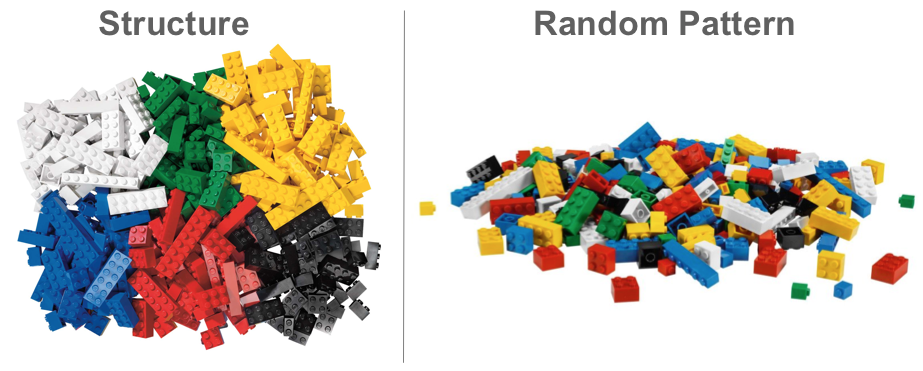

<script type="text/javascript">
 function showhide(id) {
    var e = document.getElementById(id);
    e.style.display = (e.style.display == 'block') ? 'none' : 'block';
 }
</script>

```{r, include=FALSE}
library(mosaic)
library(car)
```
----

A nonparametric approach to computing the p-value for any test statistic in just about any scenario. 

----

### {.tabset .tabset-pills .tabset-fade}


#### Overview

<div style="padding-left:30px;">
In almost all hypothesis testing scenarios, the null hypothesis can be interpreted as follows. 

<div style="padding-left:15px;padding-right:15px;">
$H_0$: Any pattern that has been witnessed in the sampled data is simply due to random chance.
</div>

Permutation Tests depend completely on this single idea. If all patterns in the data really are simply due to random chance, then the null hypothesis is true. Further, random **re**-samples of the data should show similar lack of patterns. However, if the pattern in the data is *real*, then random **re**-samples of the data will show very different patterns from the original.

Consider the following image. In that image, the toy blocks on the left show a clear pattern or structure. They are nicely organized into colored piles. This suggests a *real* pattern that is not random. Someone certainly organized those blocks into that pattern. The blocks didn't land that way by random chance. On the other hand, the pile of toy blocks shown on the right is certainly a random pattern. This is a pattern that would result if the toy blocks were put into a bag, shaken up, and dumped out. This is the idea of the permutation test. If there is structure in the data, then "mixing up the data and dumping it out again" will show very different patterns from the original. However, if the data was just random to begin with, then we would see a similar pattern by "mixing up the data and dumping it out again."

<center>

</center>

The process of a permutation test is:

1. Compute a test statistic for the original data.
2. Re-sample the data ("shake it up and dump it out") thousands of times, computing a new test statistic each time, to create a sampling distribution of the test statistic.
3. Compute the p-value of the permutation test as the percentage of test statistics that are as extreme or more extreme than the one originally observed.

In review, the sampling distribution is created by permuting (randomly rearranging) the data thousands of times and calculating a test statistic on each permuted version of the data. A histogram of the test statistics then provides the sampling distribution of the test statistic needed to compute the p-value of the original test statistic.

</div>

----


#### R Instructions

<div style="padding-left:50px;">

Any permutation test can be performed in R with a `for` loop.


<div style="padding-left:80px;">

<a href="javascript:showhide('perm1')">
<div class="hoverchunk">
<span class="tooltipr">
\#Step 1
  <span class="tooltiprtext">Compute a test statistic for the original data.</span>
</span><br/><span class="tooltipr">
myTest <- ...perform the initial test... 
  <span class="tooltiprtext">This could be a `t.test`, `wilcox.test`, `aov`, `kruskal.test`, `lm`, `glm`, `chisq.test`, or any other R code that results in a test statistic. It could even simply be the mean or standard deviation of the data.</span>
</span><br/><span class="tooltipr">
observedTestStat <- ...get the test statistic...
  <span class="tooltiprtext">Save the test statistic of your test into the object called `observedTestStat`. For tests that always result in a single test statistic like a `t.test`, `wilcox.test`, `kruskal.test`, and `chisq.test` it is `myTest$statistic`. For an `aov`, `lm`, or `glm` try printing `summary(myTest)[]` to see what values you are interested in using.</span>
</span><br/><span class="tooltipr">
observedTestStat
  <span class="tooltiprtext">Print the value of the test statistic of your test to the screen. This is the value that we now need to use to compute the P-value from by finding the probability that a randomly computed test statistic would be "more extreme" than this originally observed value.</span>
</span><br/><br/><span class="tooltipr">
\#Step 2
  <span class="tooltiprtext">Re-sample the data (“shake it up and dump it out”) thousands of times, computing a new test statistic each time, to create a sampling distribution of the test statistic.</span>
</span><br/><span class="tooltipr">
N <- 2000&nbsp;&nbsp;&nbsp;&nbsp;&nbsp;&nbsp;
  <span class="tooltiprtext">N is the number of times you will reuse the data to create the sampling distribution of the test statistic. A typical choice is 2000, but sometimes 10000, or 100000 reuses are needed before useful answers can be obtained.</span>
</span><br/><span class="tooltipr">
permutedTestStats <-&nbsp;
  <span class="tooltiprtext">This is a storage container that will be used to store the test statistics from each of the thousands of reuses of the data.</span>
</span><span class="tooltipr">
rep(NA, N)
  <span class="tooltiprtext">The rep() function repeats a given value N times. This particular statement repeats NA's or "missing values" N times. This gives us N "empty" storage spots inside of `permutedTestStats` that we can use to store the N test statistics from the N reuses of the data we will make in our `for` loop.</span>
</span><br/><span class="tooltipr">
for
  <span class="tooltiprtext">The `for` loop is a programming tool that lets us tell R to run a certain code over and over again for a certain number of times.</span>
</span><span class="tooltipr">
&nbsp;(i in &nbsp; 
  <span class="tooltiprtext">In R, the `for` loop must be followed by a space, then an opening parenthesis, then a variable name (in this case the variable is called "i"), then the word "in" then a list of values.</span>
</span><span class="tooltipr">
1:N
  <span class="tooltiprtext">The 1:N gives R the list of values 1, 2, 3, ... and so on all the way up to N. These values are passed into `i` one at a time and the code inside the `for` loop is performed first for `i=1`, then again for `i=2`, then again for `i=3` and so on until finally `i=N`. At that point, the `for` loop ends.</span>
</span><span class="tooltipr">
)
  <span class="tooltiprtext">Required closing parenthesis on the `for (i in 1:N)` statement.</span>
</span><span class="tooltipr">
\{
  <span class="tooltiprtext">This bracket opens the code section of the `for` loop. Any code placed between the opening \{ and closing \} brackets will be performed over and over again for each value of `i=1`, `i=2`, ...  up through `i=N`.</span>
</span><br/><span class="tooltipr">
&nbsp;&nbsp;
  <span class="tooltiprtext">Two spaces in front of every line inside of the opening \{ and closing \} brackets helps keep your code organized.</span>
</span><span class="tooltipr">
permutedTest <- ...perform test with permutedData...
  <span class="tooltiprtext">The same test that was performed on the original data, should be performed again but with randomly permuted data. The easiest way to permute data is with sample(y-variable-name) inside your test. See the Explanation tab for details.</span>
</span><br/><span class="tooltipr">
&nbsp;&nbsp;
  <span class="tooltiprtext">Two spaces in front of every line inside of the opening \{ and closing \} brackets helps keep your code organized.</span>
</span><span class="tooltipr">
permutedTestStats
  <span class="tooltiprtext">This is the storage container that was built prior to the `for (i in 1:N)` code. Inside the `for` loop, this container is filled value by value using the square brackets `[i]`.</span>
</span><span class="tooltipr">
[i]
  <span class="tooltiprtext">The square brackets `[i]` allows us to access the "i"th position of `permutedTestStats`. Remember, since this code is inside of the `for` loop, `i=1` the first time through the code, then `i=2` the second time through the code, `i=3` the third time through, and so on up until `i=N` the `N`th time through the code.</span>
</span><span class="tooltipr">
&nbsp;<- ...get test statistic...
  <span class="tooltiprtext">The test statistic from `permutedTest` is accessed here and stored into `permutedTestStats[i]`.</span>
</span><br/><span class="tooltipr">
\}
  <span class="tooltiprtext">The closing \} bracket ends the code that is repeated over and over again inside the `for` loop.</span>
</span><br/><span class="tooltipr">
hist(permutedTestStats)
  <span class="tooltiprtext">Creating a histogram of the sampling distribution of the test statistics obtained from the reused and permuted data allows us to visually compare the `observedTestStat` to the distribution of test statistics to visually see the percentage of test statistics that are as extreme or more extreme than the observed test statistic value. This is the p-value.</span>
</span><br/><span class="tooltipr">
abline(v=observedTestStat)
  <span class="tooltiprtext">This adds the `observedTestStat` to the distribution of test statistics to visually see the percentage of test statistics that are as extreme or more extreme than the observed test statistic value. This is the p-value.</span>
</span><br/><br/><span class="tooltipr">
\#Step 3
  <span class="tooltiprtext">Compute the p-value of the permutation test as the percentage of test statistics that are as extreme or more extreme than the one originally observed.</span>
</span><br/><span class="tooltipr">
sum(permutedTestStats >= observedTestStat)/N
  <span class="tooltiprtext">This computes a "greater than" p-value. A two-sided p-value could be obtained by multiplying this value by 2 if the observed test statistic was on the right hand side of the histogram.</span>
</span><br/><span class="tooltipr">
sum(permutedTestStats <= observedTestStat)/N
  <span class="tooltiprtext">This computes a "less than" p-value. A two-sided p-value could be obtained by multiplying this value by 2 if the observed test statistic was on the left hand side of the histogram.</span>
</span>
</div>
</a>

<div id="perm1" style="display:none;">

* `myTest <- ...perform the initial test...` 

    This could be a `t.test`, `wilcox.test`, `aov`, `kruskal.test`, `lm`, `glm`, `chisq.test`, or any other R code that results in a test statistic. It could even simply be the mean or standard deviation of the data.

* `observedTestStat <- ...get the test statistic...`

    Save the test statistic of your test into the object called `observedTestStat`. For tests that always result in a single test statistic like a `t.test`, `wilcox.test`, `kruskal.test`, and `chisq.test` it is `myTest$statistic`. For an `aov`, `lm`, or `glm` try printing `summary(myTest)[]` to see what values you are interested in using.

* `N <- 2000` N is the number of times you will reuse the data to create the sampling distribution of the test statistic. A typical choice is 2000, but sometimes 10000, or 100000 reuses are needed before useful answers can be obtained.

* `permutedTestStats <- rep(NA, N)` This is a storage container that will be used to store the test statistics from each of the thousands of reuses of the data. The `rep()` function repeats a given value N times. This particular statement repeats NA's or "missing values" N times. This gives us N "empty" storage spots inside of `permutedTestStats` that we can use to store the N test statistics from the N reuses of the data we will make in our `for` loop.

* `for (i in 1:N)\{` The `for` loop is a programming tool that lets us tell R to run a certain code over and over again for a certain number of times. In R, the `for` loop must be followed by a space, then an opening parenthesis, then a variable name (in this case the variable is called "i"), then the word "in" then a list of values. The `1:N` gives R the list of values 1, 2, 3, ... and so on all the way up to N. These values are passed into `i` one at a time and the code inside the `for` loop is performed first for `i=1`, then again for `i=2`, then again for `i=3` and so on until finally `i=N`. At that point, the `for` loop ends. There is a required closing parenthesis on the `for (i in 1:N)` statement. Any code placed between the opening \{ and closing \} brackets will be performed over and over again for each value of `i=1`, `i=2`, ...  up through `i=N`.

* Two spaces in front of every line inside of the opening \{ and closing \} brackets helps keep your code organized.

* `permutedData <- ...randomly permute the data...` This is the most important part of the permutation test and takes some thinking. The data must be randomly reorganized in a way consistent with the null hypothesis. What that means exactly is specific to each scenario. Read the Explanation tab for further details on the logic you should use here.

* `permutedTest <- ...perform test with permutedData...` The same test that was performed on the original data, should be performed again on the randomly permuted data.

* `permutedTestStats[i] <- ...get test statistic...` This is the storage container that was built prior to the `for (i in 1:N)` code. Inside the `for` loop, this container is filled value by value using the square brackets `[i]`. The square brackets `[i]` allows us to access the "i"th position of `permutedTestStats`. Remember, since this code is inside of the `for` loop, `i=1` the first time through the code, then `i=2` the second time through the code, `i=3` the third time through, and so on up until `i=N` the `N`th time through the code. The test statistic from `permutedTest` is accessed here and stored into `permutedTestStats[i]`.

* `}` The closing \} bracket ends the code that is repeated over and over again inside the `for` loop.


* `hist(permutedTestStats)` Creating a histogram of the sampling distribution of the test statistics obtained from the reused and permuted data allows us to visually compare the `observedTestStat` to the distribution of test statistics to visually see the percentage of test statistics that are as extreme or more extreme than the observed test statistic value. This is the p-value.

* `abline(v=observedTestStat)` This adds the `observedTestStat` to the distribution of test statistics to visually see the percentage of test statistics that are as extreme or more extreme than the observed test statistic value. This is the p-value.

* `sum(permutedTestStats >= observedTestStat)/N` This computes a "greater than" p-value. A two-sided p-value could be obtained by multiplying this value by 2 if the observed test statistic was on the right hand side of the histogram.

* `sum(permutedTestStats <= observedTestStat)/N` This computes a "less than" p-value. A two-sided p-value could be obtained by multiplying this value by 2 if the observed test statistic was on the left hand side of the histogram.


</div>


</div>


</div>

----


#### Explanation

<div style="padding-left:30px;">

The most difficult part of a permutation test is in the random permuting of the data. How the permuting is performed depends on the type of hypothesis test being performed. It is important to remember that the permutation test only changes the way the p-value is calculated. Everything else about the original test is unchanged when switching to a permutation test.


##### Independent Samples t Test

For the independent sample t Test, we will use the data from the [independent sleep](Analyses/t Tests/Examples/SleepIndependentt.html) analysis. In that analysis, we were using the `sleep` data to test the hypotheses:

$$
  H_0: \mu_\text{Extra Hours of Sleep with Drug 1} - \mu_\text{Extra Hours of Sleep with Drug 2} = 0
$$
$$
H_a: \mu_\text{Extra Hours of Sleep with Drug 1} - \mu_\text{Extra Hours of Sleep with Drug 2} \neq 0
$$

We used a significance level of $\alpha = 0.05$ and obtained a P-value of $0.07939$. Let's demonstrate how a permutation test could be used to obtain this same p-value. (Technically you only need to use a permutation test when the requirements of the original test were not satisfied. However, it is also reasonable to perform a permutation test anytime you want. No requirements need to be checked when performing a permutation test.)

```{r, eval=FALSE}
# First run the initial test and gain the test statistic:
myTest <- t.test(extra ~ group, data = sleep, mu = 0)
observedTestStat <- myTest$statistic

# Now we run the permutations to create a distribution of test statistics
N <- 2000
permutedTestStats <- rep(NA, N)
for (i in 1:N){
  permutedTest <- t.test(sample(extra) ~ group, data = sleep, mu = 0)
  permutedTestStats[i] <- permutedTest$statistic
}

# Now we show a histogram of that distribution
hist(permutedTestStats, col = "skyblue")
abline(v = observedTestStat, col = "red", lwd = 3)

#Greater-Than p-value: Not the correct one in this case
sum(permutedTestStats >= observedTestStat)/N

# Less-Than p-value: Not the correct one for this data
sum(permutedTestStats <= observedTestStat)/N

# Two-Sided p-value: This is the one we want based on our alternative hypothesis.
2*sum(permutedTestStats <= observedTestStat)/N
```

**Note** The Wilcoxon Rank Sum test is run using the same code except with `myTest <- wilcox.test(y ~ x, data=...)` instead of `t.test(...)` in both Step's 1 and 2.


##### Other Examples

<a href="javascript:showhide('ptTest')">Paired Samples t Test (and Wilcoxon Signed-Rank) <span style="font-size:8pt;">(click to show/hide)</span></a>

<div id="ptTest" style="display:none;">

##### Paired Data Example

See the [Sleep Paired t Test](./Analyses/t Tests/Examples/SleepPairedt.html) example for the background and context of the study. Here is how to perform the test as a permutation test instead of a t test.

The question that this `sleep` data can answer concerns which drug is more effective at increasing the amount of extra sleep an individual receives. The associated hypotheses would be
$$
  H_0: \mu_d = 0
$$
$$
  H_a: \mu_d \neq 0
$$
where $\mu_d$ denotes the true mean of the differences between the observations for each drug obtained from each individual. Differences would be obtained by $d_i = \text{extra}_{1i} - \text{extra}_{2i}$. 

To perform a permutation test of the hypothesis that the drugs are equally effective, we use the following code.

```{r}
# Perform the initial test:
myTest <- with(sleep, t.test(extra[group==1], extra[group==2], paired = TRUE, mu = 0))
# Get the test statistic from the test:
observedTestStat <- myTest$statistic


# Obtain the permutation sampling distribution 
N <- 2000
permutedTestStats <- rep(NA, N)
for (i in 1:N){
  permuteValues <- sample(c(-1,1), size=10, replace=TRUE) 
  permutedTest <- with(sleep, t.test(permuteValues*(extra[group==1] - extra[group==2]), mu = 0))
  #Note, t.test(group1 - group2) is the same as t.test(group1, group2, paired=TRUE).
  permutedTestStats[i] <- permutedTest$statistic
}
hist(permutedTestStats)
abline(v=observedTestStat, col='skyblue', lwd=3)

# Greater than p-value: (not what we want here)
sum(permutedTestStats >= observedTestStat)/N


# Less than p-value:
sum(permutedTestStats <= observedTestStat)/N
# Correct two sided p-value for this study:
2*sum(permutedTestStats <= observedTestStat)/N

```


**Note**: 

</div>

<a href="javascript:showhide('ANOVA')">ANOVA <span style="font-size:8pt;">(click to show/hide)</span></a>

<div id="ANOVA" style="display:none;">

##### One-Way ANOVA

For this example, we will use the data from the [chick weights](Analyses/chickwtsOneWayANOVA.html) analysis.

```{r, eval=FALSE}
# Again, we run the initial test and find the test statistic
myTest <- aov(weight ~ feed, data = chickwts)
observedTestStat <- summary(myTest)[[1]]$`F value`[1]

# For this permutation, we need to shake up the groups similar to the Independent Sample example
N <- 2000
permutedTestStats <- rep(NA, N)
for (i in 1:N){
  permutedTest <- aov(sample(weight) ~ feed, data = chickwts)
  permutedTestStats[i] <- summary(permutedTest)[[1]]$`F value`[1]
}

# The histogram of this distribution gives an interesting insight into the results
hist(permutedTestStats, col = "skyblue", xlim = c(0,16))
abline(v = observedTestStat, col = "red", lwd = 3)

# Here is the greater-than p-value (since the F-distribution is right skewed
# this is the only p-value of interest.)
sum(permutedTestStats >= observedTestStat)/N

```

##### Two-Way ANOVA

For the two-way ANOVA, I will use the data from the [warpbreaks](Analyses/warpbreaksTwoWayANOVA.html) analysis.

```{r, eval=FALSE}
# The initial test is done in the same way as one-way ANOVA but there is a little more to find the test statistic
myTest <- aov(breaks ~ wool + tension + wool:tension, data=warpbreaks)

# This first test statistic is the comparison between the two types of wool
observedTestStatW <- summary(myTest)[[1]]$`F value`[1]

# This second test statistic is the comparison between the three types of tension
observedTestStatT <- summary(myTest)[[1]]$`F value`[2]

# The third test statistic is the comparison of the interaction of wool types and tension
observedTestStatWT <- summary(myTest)[[1]]$`F value`[3]

# Now comes three different permutations for the test. First is for wool, second is for tension, and third is the interaction
N <- 2000
permutedTestStatsW <- rep(NA, N)
permutedTestStatsT <- rep(NA, N)
permutedTestStatsWT <- rep(NA, N)
for (i in 1:N){
  permutedTest <- aov(sample(breaks) ~ wool + tension + wool:tension, data=warpbreaks)
  permutedTestStatsW[i] <- summary(permutedTest)[[1]]$`F value`[1]
  permutedTestStatsT[i] <- summary(permutedTest)[[1]]$`F value`[2]
  permutedTestStatsWT[i] <- summary(permutedTest)[[1]]$`F value`[3]
}

# We likewise need three differenct plots to show the distribution. First is wool, second is tension, and third is the interaction
hist(permutedTestStatsW, col = "skyblue", xlim = c(3,14))
abline(v = observedTestStatW, col = "red", lwd = 3)

hist(permutedTestStatsT, col = "skyblue")
abline(v = observedTestStatT, col = "red", lwd = 3)

hist(permutedTestStatsWT, col = "skyblue")
abline(v = observedTestStatWT, col = "red", lwd = 3)

# Greater-than p-value: the three situations are in order
sum(permutedTestStatsW >= observedTestStatW)/N

sum(permutedTestStatsT >= observedTestStatT)/N

sum(permutedTestStatsWT >= observedTestStatWT)/N

# Less-than p-value: again, they are in order
sum(permutedTestStatsW <= observedTestStatW)/N

sum(permutedTestStatsT <= observedTestStatT)/N

sum(permutedTestStatsWT <= observedTestStatWT)/N

# Two-sided p-values:
2*sum(permutedTestStatsW >= observedTestStatW)/N

2*sum(permutedTestStatsT >= observedTestStatT)/N

2*sum(permutedTestStatsWT >= observedTestStatWT)/N
```

</div>

<a href="javascript:showhide('LinR')">Simple Linear Regression <span style="font-size:8pt;">(click to show/hide)</span></a>

<div id="LinR" style="display:none;">

For this example, I will use the `trees` dataset to compare the `Girth` and `Height` of black cherry trees.

```{r, eval=FALSE}
# The test and then the test statistic is found in a similar way to that of an ANOVA (this is the t statistic)
myTest <- lm(Height ~ Girth, data = trees)
observedTestStat <- summary(myTest)[[4]][2,3]

# The permutation part is set up in this way
N <- 2000
permutedTestStats <- rep(NA, N)
for (i in 1:N){
  permutedTest <- lm(sample(Height) ~ Girth, data = trees)
  permutedTestStats[i] <- summary(permutedTest)[[4]][2,3]
}

# Here, as before, is the histogram of the distribution of the test statistics
hist(permutedTestStats, col = "skyblue")
abline(v = observedTestStat, col = "red", lwd = 3)

# Less-than p-value:
sum(permutedTestStats <= observedTestStat)/N

# Greater-than p-value:
sum(permutedTestStats >= observedTestStat)/N

# Two-Sided p-value:
2*sum(permutedTestStats >= observedTestStat)/N
```

</div>


</div>

----

<footer></footer>