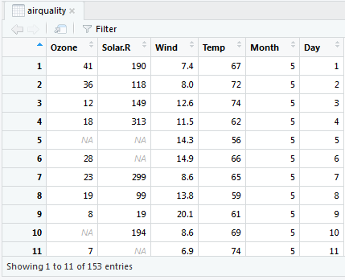
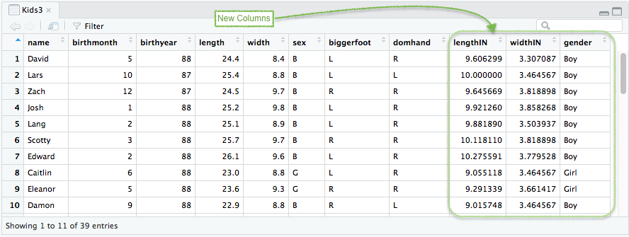

<script type="text/javascript">
 function showhide(id) {
    var e = document.getElementById(id);
    e.style.display = (e.style.display == 'block') ? 'none' : 'block';
 }
</script>


----

The best way to learn R is to open RStudio and try all the **Example** codes yourself.

Click on a code to learn more.

----

## data( )

<div style="padding-left:15px;">

R allows you to work with data. So, the first step to understanding R is to open a dataset.

**Usage**

`data()`

* This command lists the available datasets in R.

**Examples**

Click to view. Hover to learn.

<a href="javascript:showhide('DataOutput')">
<div class="hoverchunk">
<span class="tooltipr">
data
  <span class="tooltipRtext">An R function "data" used to bring up a list of available datasets in R.</span>
</span><span class="tooltipr">
()
  <span class="tooltipRtext">Functions always have parantheses following the function name. For this function we do not put anything inside the parantheses.</span>
</span><span class="tooltipr">
&nbsp;&nbsp;&nbsp;&nbsp;  
  <span class="tooltipRtext">Press Enter to run the code.</span>
</span><span class="tooltipr" style="float:right;">
&nbsp;...&nbsp; 
  <span class="tooltiprtext">Click to View Output.</span>
</span>
</div>
</a>
<div id="DataOutput" style="display:none;padding-left:20px;">


</div>


</div>
<br />
<hr />


## `?` The Help Command

<div style="padding-left:15px;">

Getting help in R is easy.

**Usage**

`?something`

* This command pulls up the help file for whatever you write in the place of `something`.

**Examples**

Click to view. Hover to learn.

<a href="javascript:showhide('HelpOutput')">
<div class="hoverchunk">
<span class="tooltipr">
?
  <span class="tooltipRtext">The quick way to access the help function in R.</span>
</span><span class="tooltipr">
cars
  <span class="tooltipRtext">The name of a dataset can be typed to open the help file for that dataset.</span>
</span><span class="tooltipr">
&nbsp;&nbsp;&nbsp;&nbsp;  
  <span class="tooltipRtext">Press Enter to run the code.</span>
</span><span class="tooltipr" style="float:right;">
&nbsp;...&nbsp; 
  <span class="tooltiprtext">Click to View Output.</span>
</span>
</div>
</a>
<div id="HelpOutput" style="display:none;padding-left:20px;">


</div>


<a href="javascript:showhide('HelpOutput2')">
<div class="hoverchunk">
<span class="tooltipr">
?
  <span class="tooltipRtext">The quick way to access the help function in R.</span>
</span><span class="tooltipr">
data
  <span class="tooltipRtext">The name of an R function, like `data` can also be used to open the help file for that function.</span>
</span><span class="tooltipr">
&nbsp;&nbsp;&nbsp;&nbsp;  
  <span class="tooltipRtext">Press Enter to run the code.</span>
</span><span class="tooltipr" style="float:right;">
&nbsp;...&nbsp; 
  <span class="tooltiprtext">Click to View Output.</span>
</span>
</div>
</a>
<div id="HelpOutput2" style="display:none;padding-left:20px;">


</div>


</div>
<br />
<hr />


## View( ) {#view}

<div style="padding-left:15px;">
Once you have selected a dataset, this is how you look at it.

**Usage**

`View(datasetName)`

* `datasetName` is the name of a dataset in R.

**Example Code**

Click to view. Hover to learn.

<a href="javascript:showhide('CarsOutput')">
<div class="hoverchunk">
<span class="tooltipr">
View(
  <span class="tooltipRtext">An R function "View" allows us to view the datset that we select. This will open up a new tab in RStudio showing the dataset. Be sure to include the opening parantheses. </span>
</span><span class="tooltipr">
cars
  <span class="tooltipRtext">`cars` is data set that is in R. R has datasets that are available for anyone to use. You can see them using the `data()` command. It would be good to explore `View()` a few different datasets. </span>
</span><span class="tooltipr">
)
  <span class="tooltipRtext">Always be sure to end your function with closing parantheses. </span>
</span><span class="tooltipr">
&nbsp;&nbsp;&nbsp;&nbsp;  
  <span class="tooltipRtext">Press Enter to run the code.</span>
</span><span class="tooltipr" style="float:right;">
&nbsp;...&nbsp; 
  <span class="tooltiprtext">Click to View Output.</span>
</span>
</div>
</a>
<div id="CarsOutput" style="display:none;padding-left:20px;">


</div>


<a href="javascript:showhide('airqualityOutput1')">
<div class="hoverchunk">
<span class="tooltipr">
View(
  <span class="tooltipRtext"> Function can work with datasets but also combinations and matrices that you create. </span>
</span><span class="tooltipr">
airquality)
  <span class="tooltipRtext"> Gives us data concerning air quality measurements around New York City, NY. For more details on this dataset type: `?airquality`</span>
</span><span class="tooltipr">
&nbsp;&nbsp;&nbsp;&nbsp;  
  <span class="tooltipRtext">Press Enter to run the code.</span>
</span><span class="tooltipr" style="float:right;">
&nbsp;...&nbsp; 
  <span class="tooltiprtext">Click to View Output.</span>
</span>
</div>
</a>
<div id="airqualityOutput1" style="display:none;padding-left:20px;">


Let's see how you are doing. Can you answer these questions about the airquality dataset?

What is the sample size of this dataset? (Answer: 153)

How many columns of data are there? (Answer: 6)

</div>

</div>

<br />
<hr />


## `$` The Selection Operator {#dollar}

<div style="padding-left:15px;">

Once you have a dataset, you need to be able to access columns from it.

**Usage**

`DataSetName$ColumnName`

* The `$` operator allows you to access the individual columns of a dataset.

**Example Code**


<a href="javascript:showhide('airqualityDollar')">
<div class="hoverchunk">
<span class="tooltipr">
airquality
  <span class="tooltipRtext">The `airqaulity` dataset. This could be the name of any dataset instead of `airquality`.</span>
  </span><span class="tooltipr">
$
  <span class="tooltipRtext"> Grabs the column, or variable, from the dataset to be used. This is typically used when computing say the mean (or other statistic) of a single column of the data. </span>
  </span><span class="tooltipr">
Wind
  <span class="tooltipRtext"> The name of any column of the dataset can be entered after the dollar sign. In the airquality dataset, this includes: `Ozone`, `Solar.R`, `Wind`, `Temp`, `Month`, or `Day` as shown by `View(airquality)`. </span>
  </span><span class="tooltipr">
&nbsp;&nbsp;&nbsp;&nbsp;  
  <span class="tooltipRtext">Press Enter to run the code.</span>
  </span><span class="tooltipr" style="float:right;">
&nbsp;...&nbsp; 
  <span class="tooltiprtext">Click to View Output.</span>
</span>
</div>
</a>

<div id="airqualityDollar" style="display:none;padding-left:20px;">


</div>

This allows you to compute things about that column, like the mean or standard deviation.

<a href="javascript:showhide('airqualityDollarCompute')">
<div class="hoverchunk">
<span class="tooltipr">
mean(
  <span class="tooltipRtext">The `mean` function computes the mean of a column of quantitative data.</span>
</span><span class="tooltipr">
airquality
  <span class="tooltipRtext">The `airqaulity` dataset. This could be the name of any dataset instead of `airquality`.</span>
</span><span class="tooltipr">
$
  <span class="tooltipRtext"> Grabs the column, or variable, from the dataset to be used. This is typically used when computing say the mean (or other statistic) of a single column of the data. </span>
  </span><span class="tooltipr">
Wind
  <span class="tooltipRtext"> The name of any column of the dataset can be entered after the dollar sign. In the airquality dataset, this includes: `Ozone`, `Solar.R`, `Wind`, `Temp`, `Month`, or `Day` as shown by `View(airquality)`. </span>
  </span><span class="tooltipr">
)
  <span class="tooltipRtext">Closing parenthesis to the mean() function.</span>
</span><span class="tooltipr">
&nbsp;&nbsp;&nbsp;&nbsp;  
  <span class="tooltipRtext">Press Enter to run the code.</span>
  </span><span class="tooltipr" style="float:right;">
&nbsp;...&nbsp; 
  <span class="tooltiprtext">Click to View Output.</span>
</span>
</div>
</a>

<div id="airqualityDollarCompute" style="display:none;padding-left:20px;">
```{r, echo=FALSE}
library(pander)
pander(mean(airquality$Wind))
```
</div>


<a href="javascript:showhide('airqualityDollarComputeSD')">
<div class="hoverchunk">
<span class="tooltipr">
sd(
  <span class="tooltipRtext">The `sd` function computes the standard deviation of a column of quantitative data.</span>
</span><span class="tooltipr">
airquality
  <span class="tooltipRtext">The `airqaulity` dataset. This could be the name of any dataset instead of `airquality`.</span>
</span><span class="tooltipr">
$
  <span class="tooltipRtext"> Grabs the column, or variable, from the dataset to be used. This is typically used when computing say the mean (or other statistic) of a single column of the data. </span>
  </span><span class="tooltipr">
Wind
  <span class="tooltipRtext"> The name of any column of the dataset can be entered after the dollar sign. In the airquality dataset, this includes: `Ozone`, `Solar.R`, `Wind`, `Temp`, `Month`, or `Day` as shown by `View(airquality)`. </span>
  </span><span class="tooltipr">
)
  <span class="tooltipRtext">Closing parenthesis to the sd() function.</span>
</span><span class="tooltipr">
&nbsp;&nbsp;&nbsp;&nbsp;  
  <span class="tooltipRtext">Press Enter to run the code.</span>
  </span><span class="tooltipr" style="float:right;">
&nbsp;...&nbsp; 
  <span class="tooltiprtext">Click to View Output.</span>
</span>
</div>
</a>

<div id="airqualityDollarComputeSD" style="display:none;padding-left:20px;">
```{r, echo=FALSE}
pander(sd(airquality$Wind))
```
</div>

See [Numerical Summaries](NumericalSummaries.html) for more stats functions like `mean()` and `sd()`.

</div>

<br />
<hr />


## `<-` The Assignment Operator {#assignment}

<div style="padding-left:15px;">
Being able to save your work is important!

**Usage**

`NameYouCreate <- some R commands`

* `<-` (Less than symbol `<` with a hyphen `-`) is called the assignment operator and lets you store the results of the `some R commands` into an object called `NameYouCreate`.
* `NameYouCreate` is any name that *begins with a letter*, but can use numbers, periods, and underscores thereafter. To use spaces in the name, you must use \``your Name`\` encased in back-ticks, but this is not recommended.

**Example Code**

<a href="javascript:showhide('NamingCars1')">
<div class="hoverchunk">
<span class="tooltipr">
cars2
  <span class="tooltipRtext">First we name the object we are creating. In this case, we are making a copy of the cars dataset, so it is logical to call it `cars2`, but it could be `bob`, `c2` or any name you wanted to use. Just be careful to not use names that are already in use! </span>
 </span><span class="tooltipr">
&nbsp; <- &nbsp;
  <span class="tooltipRtext"> The `<-` assignment operator will take whatever is on the right hand side and save it into the name written on the left hand side. </span>
  </span><span class="tooltipr">
cars
  <span class="tooltipRtext">In this case the `cars` dataset is being copied to `cars2` so that we can change `cars2` without changing the original `cars` dataset.</span>
 </span><span class="tooltipr">
&nbsp;&nbsp;&nbsp;&nbsp;  
  <span class="tooltipRtext">Press Enter to run the code.</span>
  
</span><span class="tooltipr">
cars2
  <span class="tooltipRtext">The new copy of the `cars` dataset that we just created</span>
</span><span class="tooltipr">
\$ftpersec
  <span class="tooltipRtext">The `$` selection operator can be used to create a new column in a dataset when used with the `<-` assignment operator. </span>
</span><span class="tooltipr">
&nbsp;<-&nbsp;
  <span class="tooltipRtext">The `<-` assignment operator will take the results of the right-hand-side and save them into the name on the left-hand-side. </span>
</span><span class="tooltipr">
cars2$speed \* 5280 / 3600
  <span class="tooltipRtext">This calculation converts the miles per hour of the `cars2` `speed` column into feet per seconds because there are 5280 feet in a mile and 60 minutes in an hour and 60 seconds in a minute.</span>
</span>

</span><span class="tooltipr">
View(cars2)
  <span class="tooltipRtext">The `cars2` dataset now contains a 3rd column called `feetpersec`. Compare this to the original `cars` dataset to see how it changed.</span>
</span><span class="tooltipr" style="float:right;">
&nbsp;...&nbsp; 
  <span class="tooltiprtext">Click to View Output.</span>
</span>
</div>
</a>  

<div id="NamingCars1" style="display:none;padding-left:20px;">

</div>


</div>


<br />
<hr />


## c( ) The Combine Function {#cvector}

<div style="padding-left:15px;">
Think of this function as the "back-pack" function, just like putting different books into one back-pack.

**Usage** 

`c(value 1, value 2, value 3, ... )`

* The `c( )` function combines `values` into a single object called a "vector". 
* `values 1, 2, 3, ...` can be numbers or characters, i.e., words, but must be all of one type or the other.

**Example Code**


<a href="javascript:showhide('cVector')">
<div class="hoverchunk">
<span class="tooltipr">
Classlist <- 
  <span class="tooltipRtext">`Classlist` is a new object being created using the assignment operator `<-` that will contain the four names listed above.</span>
 </span><span class="tooltipr">
&nbsp;c(
  <span class="tooltipRtext">The combine function `c( )` is being used in this case to group character values representing names of students into a single object named "Classlist".  </span>
  </span><span class="tooltipr">
"Jackson", "Jared", "Jill", "Jane")
  <span class="tooltipRtext"> These are the values we are grouping into the object named `Classlist`.  </span>
 </span><span class="tooltipr">
&nbsp;&nbsp;&nbsp;&nbsp;  
  <span class="tooltipRtext">Press Enter to run the code.</span>
</span>

<span class="tooltipr">
Ages <- &nbsp;
  <span class="tooltipRtext">The assignment operator `<-` is being used to create the object called `Ages` that will contain the ages of each student on the `Classlist`. </span>
 </span><span class="tooltipr">
c(
  <span class="tooltipRtext">The R function "c()" allows us to group together values in order to save them into an object. </span>
 </span><span class="tooltipr">
8, 9, 7, 8
  <span class="tooltipRtext"> The values, separated by comma's, that are being grouped together. In this case, numbers are being grouped together. </span>
  </span><span class="tooltipr">
) 
  <span class="tooltipRtext">Always close off your functions in R with a closing parathesis.</span>
 </span><span class="tooltipr">
&nbsp;&nbsp;&nbsp;&nbsp;  
  <span class="tooltipRtext">Press Enter to run the code.</span>

<span class="tooltipr">
Colors <- &nbsp;
  <span class="tooltipRtext">The assignment operator `<-` is being used to create the object called `Colors` that will have one color for each student on the `Classlist`. </span>
 </span><span class="tooltipr">
c(
  <span class="tooltipRtext">The R function "c()" allows us to group together values in order to save them into an object. </span>
 </span><span class="tooltipr">
"red", "blue", "green", "yellow"
  <span class="tooltipRtext"> The values, separated by comma's, that are being grouped together. In this case, characters are being grouped together. </span>
  </span><span class="tooltipr">
) 
  <span class="tooltipRtext">Always close off your functions in R with a closing parathesis.</span>
 </span><span class="tooltipr">
&nbsp;&nbsp;&nbsp;&nbsp;  
  <span class="tooltipRtext">Press Enter to run the code.</span>
  
  

</span>
</div>
</a> 

<div id="cVector" style="display:none;padding-left:20px;">

</div>

  
  

</div>
<br />
<hr />


## filter( ) 

<div style="padding-left:15px;">

Used to reduce a dataset to a smaller set of rows than the original dataset contained.

**Usage** 

`filter(NameOfDataset, columnName filteringRules)`

* `filter()` is the function that filters out certain rows of the dataset.
* `NameOfDataset` is the name of a dataset, like `cars` or `airquality` or `KidsFeet`.
* `columnName` is the name of one of the columns from the dataset. You can use `colnames(NameOfDataset)` or `View(NameOfDataset)` to see the names.
* `filteringRules` consists of some <a href="javascript:showhide('logicals')">**Logical Expression**</a> (click to view) that selects only the rows from the original dataset that meet the criterion.

<div id="logicals" style="display:none;">

<div style="padding-left:30px;">
| **Logical Expression** | **Syntax** | 
|--------------------|--------|
| Equals (one value) | `==` |
| Equals (several values) | `%in%` |
| Not Equal | `!=` |
| Less Than | `<` |
| Less Then or Equal to | `<=` |
| Greater Than | `>` |
| Greater Than or Equal to | `>=` |
| AND | `&` | 
| OR | `|` |
| Equals `NA` | `is.na(columnName)` | 
</div>

</div>

**Example Code**

<a href="javascript:showhide('filterEqual')">
<div class="hoverchunk">
<span class="tooltipr">
Kids87 <-&nbsp;
  <span class="tooltipRtext">Kids87 is a name we made up. The assignment operator `<-` will save the reduced version of the `KidsFeet` dataset created by the `filter(...)` function into this name.</span>
</span><span class="tooltipr">
filter(KidsFeet, &nbsp;
  <span class="tooltipRtext">"filter" is a function from library(tidyverse) that reduces the number of rows in the KidsFeet dataset by filtering according to certain criteria. Click on this code to see the original and filtered datasets.</span>
</span><span class="tooltipr">
birthyear
  <span class="tooltipRtext">The column of the KidsFeet dataset that we want to use to reduce the dataset.</span>
</span><span class="tooltipr">
&nbsp;== 87
  <span class="tooltipRtext">This is the "filtering rule". It will filter the data down to just those children who had a birthyear equal to 87.</span>
  </span><span class="tooltipr">
) 
  <span class="tooltipRtext">Always close off your functions in R with a closing parathesis.</span>
 </span><span class="tooltipr">
&nbsp;&nbsp;&nbsp;&nbsp;  
  <span class="tooltipRtext">Press Enter to run the code.</span>
</span><span class="tooltipr" style="float:right;">
&nbsp;...&nbsp; 
  <span class="tooltiprtext">Click to View Output.</span>
</span>
</div>
</a>
<div id="filterEqual" style="display:none;padding-left:20px;">

</div>

<a href="javascript:showhide('filterIN')">
<div class="hoverchunk">
<span class="tooltipr">
KidsSummer <-&nbsp;
  <span class="tooltipRtext">KidsSummer is a name we made up. The assignment operator `<-` will save the reduced version of the `KidsFeet` dataset created by the `filter(...)` function into this name.</span>
</span><span class="tooltipr">
filter(KidsFeet, &nbsp;
  <span class="tooltipRtext">"filter" is a function from library(tidyverse) that reduces the number of rows in the KidsFeet dataset by filtering according to certain criteria. Click on this code to see the original and filtered datasets.</span>
</span><span class="tooltipr">
birthmonth
  <span class="tooltipRtext">The column of the KidsFeet dataset that we want to use to reduce the dataset.</span>
</span><span class="tooltipr">
&nbsp;%in% c(6,7,8)
  <span class="tooltipRtext">This is the "filtering rule". It will filter the data down to just those children who were born during the summer, i.e., birthmonth equal to either 6, 7, or 8. Notice how the c( ) function is being used to combine the values of 6, 7, and 8 together into a single list of numbers.</span>
  </span><span class="tooltipr">
) 
  <span class="tooltipRtext">Always close off your functions in R with a closing parathesis.</span>
 </span><span class="tooltipr">
&nbsp;&nbsp;&nbsp;&nbsp;  
  <span class="tooltipRtext">Press Enter to run the code.</span>
</span><span class="tooltipr" style="float:right;">
&nbsp;...&nbsp; 
  <span class="tooltiprtext">Click to View Output.</span>
</span>
</div>
</a>
<div id="filterIN" style="display:none;padding-left:20px;">

</div>


<a href="javascript:showhide('filterNotEqual')">
<div class="hoverchunk">
<span class="tooltipr">
KidsNotJosh <-&nbsp;
  <span class="tooltipRtext">KidsNotJosh is a name we made up. The assignment operator `<-` will save the reduced version of the `KidsFeet` dataset created by the `filter(...)` function into this name.</span>
</span><span class="tooltipr">
filter(KidsFeet, &nbsp;
  <span class="tooltipRtext">"filter" is a function from library(tidyverse) that reduces the number of rows in the KidsFeet dataset by filtering according to certain criteria. Click on this code to see the original and filtered datasets.</span>
</span><span class="tooltipr">
name
  <span class="tooltipRtext">The column of the KidsFeet dataset that we want to use to reduce the dataset.</span>
</span><span class="tooltipr">
&nbsp;!= "Josh"
  <span class="tooltipRtext">This is the "filtering rule". It will filter the data down to just those children who are NOT named "Josh". In this case, it removed just two students who were named "Josh".</span>
  </span><span class="tooltipr">
) 
  <span class="tooltipRtext">Always close off your functions in R with a closing parathesis.</span>
 </span><span class="tooltipr">
&nbsp;&nbsp;&nbsp;&nbsp;  
  <span class="tooltipRtext">Press Enter to run the code.</span>
</span><span class="tooltipr" style="float:right;">
&nbsp;...&nbsp; 
  <span class="tooltiprtext">Click to View Output.</span>
</span>
</div>
</a>
<div id="filterNotEqual" style="display:none;padding-left:20px;">

</div>


<a href="javascript:showhide('LessThan')">
<div class="hoverchunk">
<span class="tooltipr">
KidsLength24 <-&nbsp;
  <span class="tooltipRtext">KidsLength24 is a name we made up. The assignment operator `<-` will save the reduced version of the `KidsFeet` dataset created by the `filter(...)` function into this name.</span>
</span><span class="tooltipr">
filter(KidsFeet, &nbsp;
  <span class="tooltipRtext">"filter" is a function from library(tidyverse) that reduces the number of rows in the KidsFeet dataset by filtering according to certain criteria. Click on this code to see the original and filtered datasets.</span>
</span><span class="tooltipr">
length
  <span class="tooltipRtext">The column of the KidsFeet dataset that we want to use to reduce the dataset.</span>
</span><span class="tooltipr">
&nbsp;< 24
  <span class="tooltipRtext">This is the "filtering rule". It will filter the data down to just those children who have a foot length less than 24 cm.</span>
  </span><span class="tooltipr">
) 
  <span class="tooltipRtext">Always close off your functions in R with a closing parathesis.</span>
 </span><span class="tooltipr">
&nbsp;&nbsp;&nbsp;&nbsp;  
  <span class="tooltipRtext">Press Enter to run the code.</span>
</span><span class="tooltipr" style="float:right;">
&nbsp;...&nbsp; 
  <span class="tooltiprtext">Click to View Output.</span>
</span>
</div>
</a>

<div id="LessThan" style="display:none;padding-left:20px;">

</div>


<a href="javascript:showhide('LessThanorEqualTo')">
<div class="hoverchunk">
<span class="tooltipr">
KidsLessEq24 <-&nbsp;
  <span class="tooltipRtext">KidsLessEq24 is a name we made up. The assignment operator `<-` will save the reduced version of the `KidsFeet` dataset created by the `filter(...)` function into this name.</span>
</span><span class="tooltipr">
filter(KidsFeet, &nbsp;
  <span class="tooltipRtext">"filter" is a function from library(tidyverse) that reduces the number of rows in the KidsFeet dataset by filtering according to certain criteria. Click on this code to see the original and filtered datasets.</span>
</span><span class="tooltipr">
length
  <span class="tooltipRtext">The column of the KidsFeet dataset that we want to use to reduce the dataset.</span>
</span><span class="tooltipr">
&nbsp;<= 24
  <span class="tooltipRtext">This is the "filtering rule". It will filter the data down to just those children who have a foot length less than or equal to 24 cm.</span>
  </span><span class="tooltipr">
) 
  <span class="tooltipRtext">Always close off your functions in R with a closing parathesis.</span>
 </span><span class="tooltipr">
&nbsp;&nbsp;&nbsp;&nbsp;  
  <span class="tooltipRtext">Press Enter to run the code.</span>
</span><span class="tooltipr" style="float:right;">
&nbsp;...&nbsp; 
  <span class="tooltiprtext">Click to View Output.</span>
</span>
</div>
</a>

<div id="LessThanorEqualTo" style="display:none;padding-left:20px;">

</div>


<a href="javascript:showhide('GreaterThan')">
<div class="hoverchunk">
<span class="tooltipr">
KidsWider9 <-&nbsp;
  <span class="tooltipRtext">KidsNotJosh is a name we made up. The assignment operator `<-` will save the reduced version of the `KidsFeet` dataset created by the `filter(...)` function into this name.</span>
</span><span class="tooltipr">
filter(KidsFeet, &nbsp;
  <span class="tooltipRtext">"filter" is a function from library(tidyverse) that reduces the number of rows in the KidsFeet dataset by filtering according to certain criteria. Click on this code to see the original and filtered datasets.</span>
</span><span class="tooltipr">
width
  <span class="tooltipRtext">The column of the KidsFeet dataset that we want to use to reduce the dataset.</span>
</span><span class="tooltipr">
&nbsp;> 9
  <span class="tooltipRtext">This is the "filtering rule". It will filter the data down to just those children who have a foot width greater than 9 cm.</span>
  </span><span class="tooltipr">
) 
  <span class="tooltipRtext">Always close off your functions in R with a closing parathesis.</span>
 </span><span class="tooltipr">
&nbsp;&nbsp;&nbsp;&nbsp;  
  <span class="tooltipRtext">Press Enter to run the code.</span>
</span><span class="tooltipr" style="float:right;">
&nbsp;...&nbsp; 
  <span class="tooltiprtext">Click to View Output.</span>
</span>
</div>
</a>

<div id="GreaterThan" style="display:none;padding-left:20px;">

</div>


<a href="javascript:showhide('GreaterThanorEqualTo')">
<div class="hoverchunk">
<span class="tooltipr">
KidsWiderEq9 <-&nbsp;
  <span class="tooltipRtext">KidsWiderEq9 is a name we made up. The assignment operator `<-` will save the reduced version of the `KidsFeet` dataset created by the `filter(...)` function into this name.</span>
</span><span class="tooltipr">
filter(KidsFeet, &nbsp;
  <span class="tooltipRtext">"filter" is a function from library(tidyverse) that reduces the number of rows in the KidsFeet dataset by filtering according to certain criteria. Click on this code to see the original and filtered datasets.</span>
</span><span class="tooltipr">
width
  <span class="tooltipRtext">The column of the KidsFeet dataset that we want to use to reduce the dataset.</span>
</span><span class="tooltipr">
&nbsp;>= 9
  <span class="tooltipRtext">This is the "filtering rule". It will filter the data down to just those children who have a foot width greater than or equal to 9 cm.</span>
  </span><span class="tooltipr">
) 
  <span class="tooltipRtext">Always close off your functions in R with a closing parathesis.</span>
 </span><span class="tooltipr">
&nbsp;&nbsp;&nbsp;&nbsp;  
  <span class="tooltipRtext">Press Enter to run the code.</span>
</span><span class="tooltipr" style="float:right;">
&nbsp;...&nbsp; 
  <span class="tooltiprtext">Click to View Output.</span>
</span>
</div>
</a>

<div id="GreaterThanorEqualTo" style="display:none;padding-left:20px;">

</div>


<a href="javascript:showhide('And')">
<div class="hoverchunk">
<span class="tooltipr">
GirlsWide9 <-&nbsp;
  <span class="tooltipRtext">GirlsWide9 is a name we made up. The assignment operator `<-` will save the reduced version of the `KidsFeet` dataset created by the `filter(...)` function into this name.</span>
</span><span class="tooltipr">
filter(KidsFeet, &nbsp;
  <span class="tooltipRtext">"filter" is a function from library(tidyverse) that reduces the number of rows in the KidsFeet dataset by filtering according to certain criteria. Click on this code to see the original and filtered datasets.</span>
</span><span class="tooltipr">
sex
  <span class="tooltipRtext">The first column of the KidsFeet dataset that we want to use to reduce the dataset.</span>
</span><span class="tooltipr">
&nbsp;== "G"
  <span class="tooltipRtext">This is the first "filtering rule". It will filter the data down to just those children who are girls.</span>
  </span><span class="tooltipr">
&nbsp;&&nbsp;
  <span class="tooltipRtext">The & is the AND statement. It joins to filtering criteria together into a single criteria where both conditions must be met. In this case, it ensures we get only girls with foot widths greater than 9 cm.</span>
</span><span class="tooltipr">
width
  <span class="tooltipRtext">The second column of the KidsFeet dataset that we want to use to reduce the dataset.</span>
</span><span class="tooltipr">
&nbsp;> 9
  <span class="tooltipRtext">This is the second "filtering rule". It will filter the data down to just those children who have a foot width greater than 9 cm.</span>
  </span><span class="tooltipr">
) 
  <span class="tooltipRtext">Always close off your functions in R with a closing parathesis.</span>
 </span><span class="tooltipr">
&nbsp;&nbsp;&nbsp;&nbsp;  
  <span class="tooltipRtext">Press Enter to run the code.</span>
</span><span class="tooltipr" style="float:right;">
&nbsp;...&nbsp; 
  <span class="tooltiprtext">Click to View Output.</span>
</span>
</div>
</a>

<div id="And" style="display:none;padding-left:20px;">

</div>


<a href="javascript:showhide('Or')">
<div class="hoverchunk">
<span class="tooltipr">
KidsWinter <-&nbsp;
  <span class="tooltipRtext">KidsWinter is a name we made up. The assignment operator `<-` will save the reduced version of the `KidsFeet` dataset created by the `filter(...)` function into this name.</span>
</span><span class="tooltipr">
filter(KidsFeet, &nbsp;
  <span class="tooltipRtext">"filter" is a function from library(tidyverse) that reduces the number of rows in the KidsFeet dataset by filtering according to certain criteria. Click on this code to see the original and filtered datasets.</span>
</span><span class="tooltipr">
birthmonth
  <span class="tooltipRtext">The first column of the KidsFeet dataset that we want to use to reduce the dataset.</span>
</span><span class="tooltipr">
&nbsp;<= 2
  <span class="tooltipRtext">This is the first "filtering rule". It will filter the data down to just those children who are born in January or February.</span>
  </span><span class="tooltipr">
&nbsp;|&nbsp;
  <span class="tooltipRtext">The | is the OR statement. It joins to filtering criteria together into a single criteria where either condition gives us what we want. In this case, it keeps any child born in January, February, November, or December.</span>
</span><span class="tooltipr">
birthmonth
  <span class="tooltipRtext">The second column of the KidsFeet dataset that we want to use to reduce the dataset. In this case, it is the same as the first column.</span>
</span><span class="tooltipr">
&nbsp;>= 11
  <span class="tooltipRtext">This is the second "filtering rule". It will filter the data down to just those children who are born in November or December.</span>
  </span><span class="tooltipr">
) 
  <span class="tooltipRtext">Always close off your functions in R with a closing parathesis.</span>
 </span><span class="tooltipr">
&nbsp;&nbsp;&nbsp;&nbsp;  
  <span class="tooltipRtext">Press Enter to run the code.</span>
</span><span class="tooltipr" style="float:right;">
&nbsp;...&nbsp; 
  <span class="tooltiprtext">Click to View Output.</span>
</span>
</div>
</a>

<div id="Or" style="display:none;padding-left:20px;">


</div>


</div>
<br />
<hr />


### select( )

<div style="padding-left:15px;">
Used to select out certain columns from a dataset.

**Usage**

`select(NameOfDataset, listOfColumnNames)`

* `select( )` is the function that selects out certain columns of the dataset.
* `NameOfDataset` is the name of a dataset, like `cars` or `airquality` or `KidsFeet`.
* `listOfColumnNames` is a vector of names of columns from the dataset, usually supplied inside a combine `c(...)` statement.

**Example Code**

<a href="javascript:showhide('select1')">
<div class="hoverchunk">
<span class="tooltipr">
KidsNameBirth <-&nbsp;
  <span class="tooltipRtext">KidsNameBirth is a name we made up. The assignment operator `<-` will save the reduced version of the `KidsFeet` dataset created by the `select(...)` function into this name.</span>
</span><span class="tooltipr">
select(KidsFeet, &nbsp;
  <span class="tooltipRtext">"select" is a function from library(tidyverse) that selects out specified columns from the original dataset in the order specified.</span>
</span><span class="tooltipr">
c(name, birthyear, birthmonth)
  <span class="tooltipRtext">The columns of the KidsFeet dataset that we want to select out of the original dataset. Notice how the concatenation function `c(...)` is used to list out the columns we want.</span>
</span><span class="tooltipr">
) 
  <span class="tooltipRtext">Always close off your functions in R with a closing parathesis.</span>
 </span><span class="tooltipr">
&nbsp;&nbsp;&nbsp;&nbsp;  
  <span class="tooltipRtext">Press Enter to run the code.</span>
</span><span class="tooltipr" style="float:right;">
&nbsp;...&nbsp; 
  <span class="tooltiprtext">Click to View Output.</span>
</span>
</div>
</a>
  
<div id="select1" style="display:none;padding-left:20px;">

  
</div>


<a href="javascript:showhide('select2')">
<div class="hoverchunk">
<span class="tooltipr">
KidsBigLength <-&nbsp;
  <span class="tooltipRtext">KidsBigLength is a name we made up. The assignment operator `<-` will save the reduced version of the `KidsFeet` dataset created by the `select(...)` function into this name.</span>
</span><span class="tooltipr">
select(KidsFeet, &nbsp;
  <span class="tooltipRtext">"select" is a function from library(tidyverse) that selects out specified columns from the original dataset in the order specified.</span>
</span><span class="tooltipr">
c(name, length)
  <span class="tooltipRtext">The columns of the KidsFeet dataset that we want to select out of the original dataset. Notice how the concatenation function `c(...)` is used to list out the columns we want.</span>
</span><span class="tooltipr">
) 
  <span class="tooltipRtext">Always close off your functions in R with a closing parathesis.</span>
 </span><span class="tooltipr">
&nbsp;&nbsp;&nbsp;&nbsp;  
  <span class="tooltipRtext">Press Enter to run the code.</span>
</span><span class="tooltipr" style="float:right;">
&nbsp;...&nbsp; 
  <span class="tooltiprtext">Click to View Output.</span>
</span>
</div>
</a>
  
<div id="select2" style="display:none;padding-left:20px;">

  
</div>


</div>
<br />
<hr />


## %>% The Pipe Operator

<div style="padding-left:15px;">
Just like the pipes in your kitchen sink, the pipe operator takes "water from the sink" and "sends it down to somewhere else."

**Usage** 

`NameOfDataset %>% `

&nbsp;&nbsp;`some R commands that follow on the next line`

* `%>%`, the pipe operator, is created by typing percent symbols `%` on both sides of a greater than symbol `>`. It lets you take whatever is on the *left* of the symbol and "pipe it down into" `some R commands` that follow on the next line.
* `NameOfDataset` is the name of a dataset, like `cars` or `airquality` or `KidsFeet`.

**Note**: you should load `library(tidyverse)` before using the `%>%` operator.
<!-- cntrl shift   -->

**Example Code**


<a href="javascript:showhide('filterselect')">
<div class="hoverchunk">
<span class="tooltipr">
Kids2 <-&nbsp;
  <span class="tooltipRtext">This provides a name for the new reduced version of the `KidsFeet` dataset that is going to be created by the combined use of `filter(...)` and `select(...)`.</span>
</span><span class="tooltipr">
KidsFeet
  <span class="tooltipRtext">`KidsFeet` is a dataset found in  `library(mosaic)`. Click on this code to View the dataset and the resulting Kids2 dataset.</span>
</span><span class="tooltipr">
&nbsp;%>%&nbsp;
  <span class="tooltipRtext">The pipe operator that will send the `KidsFeet` dataset down inside of the code on the following line.</span>
</span><br/><span class="tooltipr">
&nbsp;&nbsp; filter(
  <span class="tooltipRtext">"filter" is a function from library(tidyverse) that allows us to reduce the number of rows in the KidsFeet dataset by filtering according to certain criteria.</span>
</span><span class="tooltipr">
birthyear
  <span class="tooltipRtext"> Represents the column of data that we want to use to reduce the rows of the dataset.</span>
</span><span class="tooltipr">
&nbsp;== 87
  <span class="tooltipRtext">This is the "filtering rule". It will filter the data down to just those children who had a birthyear equal to 87.</span>
  </span><span class="tooltipr">
) 
  <span class="tooltipRtext">Always close off your functions in R with a closing parathesis.</span>
 </span><span class="tooltipr">
&nbsp;%>%&nbsp;
  <span class="tooltipRtext">The pipe operator that will send the filtered version of the `KidsFeet` dataset down inside of the code on the following line.</span>
</span><br/><span class="tooltipr">
&nbsp;&nbsp; select(
  <span class="tooltipRtext">"select" is a function from library(tidyverse) that selects out specified columns from the current dataset in the order specified.</span>
</span><span class="tooltipr">
c(name, birthyear, length)
  <span class="tooltipRtext">The columns of the filtered KidsFeet dataset that we want to select. Notice how the concatenation function `c(...)` is used to list out the columns we want.</span>
</span><span class="tooltipr">
) 
  <span class="tooltipRtext">Always close off your functions in R with a closing parathesis.</span>
 </span><span class="tooltipr">
&nbsp;&nbsp;&nbsp;&nbsp;  
  <span class="tooltipRtext">Press Enter to run the code.</span>
</span><span class="tooltipr" style="float:right;">
&nbsp;...&nbsp; 
  <span class="tooltiprtext">Click to View Output.</span>
</span>
</div>
</a>
<div id="filterselect" style="display:none;padding-left:20px;">

</div>


</div>
<br />
<hr />


## summarise( ) and group_by( )

<div style="padding-left:15px;">

Compute numerical summaries on data or on groupings within the data.

**Usage** 

`NameofDataset %>%`

&nbsp;&nbsp; `summarise(nameYouLike = some_stats_function(columnName))`

OR

`NameofDataset %>%`

&nbsp;&nbsp; `group_by(columnGroupsName) %>%`

&nbsp;&nbsp; `summarise(nameYouLike = some_stats_function(columnName))`


* `NameOfDataset` is the name of a dataset, like `cars` or `airquality` or `KidsFeet`.
* `%>%` is the pipe operator that "pipes data" down into R commands on the next line.
* `group_by(...)` is an R function from `library(tidyverse)` that groups data according to a specified column (or columns).
* `summarise(...)` is an R function from `library(tidyverse)` that computes numerical summaries on data or groups of data.
* `columnGroupsName` is the name of a column that represents qualitative (categorical) data. This column is used to separate the dataset into little datasets, one "little dataset" for each group or category in the `columnGroupsName` column.
* `nameYouLike` is just that. Some name you come up with.
* `some_stats_function(...)` is a stats function like `mean(...)`, `sd(...)`, `n(...)` or so on.
* `columnName` is the name of a column from the dataset that you want to compute numerical summaries on.


**Example Code**

<a href="javascript:showhide('summarisegroupby1')">
<div class="hoverchunk">
<span class="tooltipr">
KidsFeet
  <span class="tooltipRtext">`KidsFeet` is a dataset found in  `library(mosaic)`.</span>
</span><span class="tooltipr">
&nbsp;%>%&nbsp;
  <span class="tooltipRtext">The pipe operator that will send the `KidsFeet` dataset down inside of the code on the following line.</span>
</span><br/><span class="tooltipr">
&nbsp;&nbsp; summarise(
  <span class="tooltipRtext">"summarise" is a function from library(tidyverse) that allows us to compute numerical summaries on data.</span>
</span><span class="tooltipr">
aveLength
  <span class="tooltipRtext">A name we came up with that will store the results of the numerical summary.</span>
</span><span class="tooltipr">
&nbsp;= mean(length)
  <span class="tooltipRtext">This computes the `mean(...)` of the `length` column from the KidsFeet dataset.</span>
  </span><span class="tooltipr">
) 
  <span class="tooltipRtext">Always close off your functions in R with a closing parathesis.</span>
 </span><span class="tooltipr">
&nbsp;&nbsp;&nbsp;&nbsp;  
  <span class="tooltipRtext">Press Enter to run the code.</span>
</span><span class="tooltipr" style="float:right;">
&nbsp;...&nbsp; 
  <span class="tooltiprtext">Click to View Output.</span>
</span>
</div>
</a> 
  
<div id="summarisegroupby1" style="display:none;padding-left:20px;">
```{r, echo=FALSE, warning=FALSE, message=FALSE, comment=NA}
library(tidyverse)
library(mosaic)
library(pander)
KidsFeet %>%
  summarise(aveLength = mean(length)) %>%
  pander( ) 
```
</div>


<a href="javascript:showhide('summarisegroupby2')">
<div class="hoverchunk">
<span class="tooltipr">
KidsFeet
  <span class="tooltipRtext">`KidsFeet` is a dataset found in  `library(mosaic)`.</span>
</span><span class="tooltipr">
&nbsp;%>%&nbsp;
  <span class="tooltipRtext">The pipe operator that will send the `KidsFeet` dataset down inside of the code on the following line.</span>
</span><br/><span class="tooltipr">
&nbsp;&nbsp; summarise(
  <span class="tooltipRtext">"summarise" is a function from library(tidyverse) that allows us to compute numerical summaries on data.</span>
</span><span class="tooltipr">
aveLength
  <span class="tooltipRtext">A name we came up with that will store the results of the numerical summary.</span>
</span><span class="tooltipr">
&nbsp;= mean(length),&nbsp;
  <span class="tooltipRtext">This computes the `mean(...)` of the `length` column from the KidsFeet dataset.</span>
</span><br/><span class="tooltipr">
&nbsp;&nbsp;&nbsp;&nbsp;&nbsp;&nbsp;&nbsp;&nbsp;&nbsp;&nbsp;&nbsp;&nbsp; sdLength
  <span class="tooltipRtext">A name we came up with that will store the results of the numerical summary.</span>
</span><span class="tooltipr">
&nbsp;= sd(length),&nbsp;
  <span class="tooltipRtext">This computes the `sd(...)` of the `length` column from the KidsFeet dataset.</span>
  </span><br/><span class="tooltipr">
&nbsp;&nbsp;&nbsp;&nbsp;&nbsp;&nbsp;&nbsp;&nbsp;&nbsp;&nbsp;&nbsp;&nbsp; sampleSize
  <span class="tooltipRtext">A name we came up with that will store the results of the numerical summary.</span>
</span><span class="tooltipr">
&nbsp;= n( )
  <span class="tooltipRtext">This computes the `n(...)`, or sample size, of the `length` column from the KidsFeet dataset.</span>
  </span><span class="tooltipr">
) 
  <span class="tooltipRtext">Always close off your functions in R with a closing parathesis.</span>
 </span><span class="tooltipr">
&nbsp;&nbsp;&nbsp;&nbsp;  
  <span class="tooltipRtext">Press Enter to run the code.</span>
</span><span class="tooltipr" style="float:right;">
&nbsp;...&nbsp; 
  <span class="tooltiprtext">Click to View Output.</span>
</span>
</div>
</a> 
  
<div id="summarisegroupby2" style="display:none;padding-left:20px;">
```{r, echo=FALSE, warning=FALSE, message=FALSE, comment=NA}
KidsFeet %>%
  summarise(aveLength = mean(length), sdLength = sd(length), sampleSize = n()) %>%
  pander( )
```
</div>


<a href="javascript:showhide('summarisegroupby3')">
<div class="hoverchunk">
<span class="tooltipr">
KidsFeet
  <span class="tooltipRtext">`KidsFeet` is a dataset found in  `library(mosaic)`.</span>
</span><span class="tooltipr">
&nbsp;%>%&nbsp;
  <span class="tooltipRtext">The pipe operator that will send the `KidsFeet` dataset down inside of the code on the following line.</span>
</span><br/><span class="tooltipr">
&nbsp;&nbsp; group_by(
  <span class="tooltipRtext">"group_by" is a function from library(tidyverse) that allows us to split the dataset up into "little groups" according to the column specified.</span>
</span><span class="tooltipr">
sex
  <span class="tooltipRtext">"sex" is a column from the KidsFeet dataset that records the gender of each child.</span>
</span><span class="tooltipr">
) 
  <span class="tooltipRtext">Always close off your functions in R with a closing parathesis.</span>
 </span><span class="tooltipr">
&nbsp;%>%&nbsp;
  <span class="tooltipRtext">The pipe operator that will send the grouped according to gender version of the `KidsFeet` dataset down inside of the code on the following line.</span>
</span><br/><span class="tooltipr">
&nbsp;&nbsp; summarise(
  <span class="tooltipRtext">"summarise" is a function from library(tidyverse) that allows us to compute numerical summaries on data.</span>
</span><span class="tooltipr">
aveLength
  <span class="tooltipRtext">A name we came up with that will store the results of the numerical summary.</span>
</span><span class="tooltipr">
&nbsp;= mean(length),&nbsp;
  <span class="tooltipRtext">This computes the `mean(...)` of the `length` column from the KidsFeet dataset.</span>
</span><br/><span class="tooltipr">
&nbsp;&nbsp;&nbsp;&nbsp;&nbsp;&nbsp;&nbsp;&nbsp;&nbsp;&nbsp;&nbsp;&nbsp; sdLength
  <span class="tooltipRtext">A name we came up with that will store the results of the numerical summary.</span>
</span><span class="tooltipr">
&nbsp;= sd(length),&nbsp;
  <span class="tooltipRtext">This computes the `sd(...)` of the `length` column from the KidsFeet dataset.</span>
  </span><br/><span class="tooltipr">
&nbsp;&nbsp;&nbsp;&nbsp;&nbsp;&nbsp;&nbsp;&nbsp;&nbsp;&nbsp;&nbsp;&nbsp; sampleSize
  <span class="tooltipRtext">A name we came up with that will store the results of the numerical summary.</span>
</span><span class="tooltipr">
&nbsp;= n( )
  <span class="tooltipRtext">This computes the `n(...)`, or sample size, of the `length` column from the KidsFeet dataset.</span>
  </span><span class="tooltipr">
) 
  <span class="tooltipRtext">Always close off your functions in R with a closing parathesis.</span>
 </span><span class="tooltipr">
&nbsp;&nbsp;&nbsp;&nbsp;  
  <span class="tooltipRtext">Press Enter to run the code.</span>
</span><span class="tooltipr" style="float:right;">
&nbsp;...&nbsp; 
  <span class="tooltiprtext">Click to View Output.</span>
</span>
</div>
</a> 
  
<div id="summarisegroupby3" style="display:none;padding-left:20px;">
```{r, echo=FALSE, warning=FALSE, message=FALSE, comment=NA}
KidsFeet %>%
  group_by(sex) %>%
  summarise(aveLength = mean(length), sdLength = sd(length), sampleSize = n()) %>%
  pander( )
```
</div>


</div>
<br />
<hr />


## mutate( )

<div style="padding-left:15px;">

Transform a column of data.

**Usage** 

`NameofDataset %>%`

&nbsp;&nbsp; `mutate(nameYouLike = some_transformation)`


* `NameOfDataset` is the name of a dataset, like `cars` or `airquality` or `KidsFeet`.
* `%>%` is the pipe operator that "pipes data" down into R commands on the next line.
* `nameYouLike` is just that. Some name you come up with that will be the name of a new column in the dataset.
* `some_transformation` is just that. See the example codes for ideas.

**Example Code**

<a href="javascript:showhide('mutate1')">
<div class="hoverchunk">
<span class="tooltipr">
Kids3 <-&nbsp;
  <span class="tooltipRtext">`Kids3` is a new dataset we are creating that will contain all of `KidsFeet` data set along with a couple new columns we are creating.</span>
</span><span class="tooltipr">
KidsFeet
  <span class="tooltipRtext">`KidsFeet` is a dataset found in  `library(mosaic)`.</span>
</span><span class="tooltipr">
&nbsp;%>%&nbsp;
  <span class="tooltipRtext">The pipe operator that will send the `KidsFeet` dataset down inside of the code on the following line.</span>
</span><br/><span class="tooltipr">
&nbsp;&nbsp; mutate(
  <span class="tooltipRtext">"mutate" is a function from library(tidyverse) that allows us to transform columns of data.</span>
</span><span class="tooltipr">
lengthIN = length / 2.54,
  <span class="tooltipRtext">"lengthIN" is a name we came up with that will store the results of the transformation of the "length" column. This is just converting the length data from cm to inches.</span>
</span><br/><span class="tooltipr">
&nbsp;&nbsp;&nbsp;&nbsp;&nbsp;&nbsp;&nbsp;&nbsp;&nbsp;widthIN = width / 2.54,
  <span class="tooltipRtext">"widthIN" is a name we came up with that will store the results of the transformation of the "width" column. This is just converting the width data from cm to inches.</span>
</span><br/><span class="tooltipr">
&nbsp;&nbsp;&nbsp;&nbsp;&nbsp;&nbsp;&nbsp;&nbsp;&nbsp;gender = recode(sex, B = "Boy", G = "Girl")
  <span class="tooltipRtext">"gender" is a name we came up with that will store the results of the transformation of the "sex" column. The recode(...) function is being used to change the values of "B" to "Boy" and the values of "G" to "Girl".</span>
</span><span class="tooltipr">
) 
  <span class="tooltipRtext">Always close off your functions in R with a closing parathesis.</span>
 </span><span class="tooltipr">
&nbsp;&nbsp;&nbsp;&nbsp;  
  <span class="tooltipRtext">Press Enter to run the code.</span>
</span><span class="tooltipr" style="float:right;">
&nbsp;...&nbsp; 
  <span class="tooltiprtext">Click to View Output.</span>
</span>
</div>
</a> 
  
<div id="mutate1" style="display:none;padding-left:20px;">
```{r, echo=FALSE, eval=FALSE}
Kids3 <- KidsFeet %>%
  mutate(lengthIN = length / 2.54,
         widthIN = width / 2.54,
         gender = recode(sex, B = "Boy", G = "Girl"))
```

</div>


</div>
<br />
<hr />


<!--

### ... {#}

<div style="padding-left:15px;">
**Console** Help Command: `?`

`()`

* 

**Example Code**

```{r, eval=FALSE, comment=NA}
...
```

</div>
<br />
<hr />


<br />
<br />
<br />


-->

</div>

</div>

----

<br/>
 

<footer></footer>