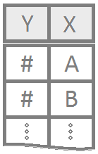

<script type="text/javascript">
 function showhide(id) {
    var e = document.getElementById(id);
    e.style.display = (e.style.display == 'block') ? 'none' : 'block';
 }
</script>

```{r, include=FALSE}
library(mosaic)
library(car)
```

----

Much of statistical inference concerns the location of the population mean $\mu$ for a given parametric distribution. Some of the most common approaches to making inference about $\mu$ utilize a test statistic that follows a t distribution.

----


### One Sample t Test {.tabset .tabset-fade .tabset-pills}


<div style="float:left;width:125px;" align=center>

</div>

A one sample t test is used when there is a hypothesized value for the population mean $\mu$ of a single quantitative variable. 

#### Overview 

<div style="padding-left:125px;">
This test is only appropriate when both of the following are satisfied.

(1) The sample is **representative** of the population. (Having a simple random sample is the best way to do this.)

(2) The sampling distribution of the sample mean $\bar{x}$ *can be assumed to be normal*. This is a safe assumption when either (a) the population data can be assumed to be normally distributed using a Q-Q Plot or (b) the size of the sample (n) that was taken from the population is large (at least n > 30, but "large" really depends on how badly the data is skewed).

**Hypotheses** 

<div style="padding-left:15px;">

<div style="float:right;font-size:.8em;background-color:lightgray;padding:5px;border-radius:4px;"><a style="color:darkgray;" href="javascript:showhide('onesampletlatex')">Math Code</a></div>


<div id="onesampletlatex" style="display:none;">
```{}
$$
  H_0: \mu = 5.2
$$

$$
  H_a: \mu \neq 5.2
$$
```
</div>

$H_0: \mu = \text{some number}$

$H_a: \mu \ \left\{\underset{<}{\stackrel{>}{\neq}}\right\} \ \text{some number}$
</div>

**Examples**: [sleepOne](./Analyses/t Tests/Examples/SleepOneSamplet.html)

</div>


----

#### R Instructions

<div style="padding-left:125px;">

**Console** Help Command: `?t.test()`

`t.test(NameOfYourData$Y, mu = YourNull, alternative = YourAlternative, conf.level = 0.95)`

* `NameOfYourData` is the name of your data set, like `mtcars` or `KidsFeet`.
* `Y` must be a "numeric" vector of quantitative data.
* `YourNull` is the numeric value from your null hypothesis for $\mu$.
* `YourAlternative` is one of the three options: `"two.sided"`, `"greater"`, `"less"` and should correspond to your alternative hypothesis.
* The value for `conf.level = 0.95` can be changed to any desired confidence level, like 0.90 or 0.99. It should correspond to $1-\alpha$.

Testing Assumptions

`library(car)`

`qqPlot(NameOfYourData$Y)`

<br>

**Example Code** 

Hover your mouse over the example codes to learn more.

<a href="javascript:showhide('tTest')">
<div class="hoverchunk">
<span class="tooltipr">
t.test(
  <span class="tooltiprtext">'t.test' is an R function that performs one and two sample t-tests.</span>
</span><span class="tooltipr">
mtcars
  <span class="tooltiprtext">'mtcars' is a dataset. Type 'View(mtcars)' in R to view the dataset.</span>
</span><span class="tooltipr">
$
  <span class="tooltiprtext">The $ allows us to access any variable from the mtcars dataset.</span>
</span><span class="tooltipr">
mpg,&nbsp;
  <span class="tooltiprtext">'mpg' is Y, a quantitative variable (numeric vector) from the mtcars dataset.</span>
</span><span class="tooltipr">
mu = 20,&nbsp; 
  <span class="tooltiprtext"> The numeric value from the null hypothesis is 20 meaning $\mu=20$. </span>
</span><span class="tooltipr">
alternative = "two.sided",&nbsp; 
  <span class="tooltiprtext"> The alternative hypothesis is "two.sided" meaning the alternative hypothesis is $\mu\neq20$.</span>
  </span><span class="tooltipr">
conf.level = 0.95)
  <span class="tooltiprtext">This test has a 0.95 confidence level which corresponds to 1−α. </span>
</span><span class="tooltipr">
&nbsp;&nbsp;&nbsp;&nbsp;  
  <span class="tooltiprtext">Press Enter to run the code if you have typed it in yourself. You can also click here to view the output.</span>
</span><span class="tooltipr" style="float:right;font-size:.8em;">
&nbsp;Click to Show Output&nbsp; 
  <span class="tooltiprtext">Click to View Output.</span>
</span>
</div>
</a>

<div id="tTest" style="display:none;">
<table class="rconsole">
<tr>
<td>
<span class="tooltiprout">
 One Sample t-test
    <span class="tooltiprouttext">EXPLANATION.</span>
</span>
</td>
</tr>
</table>
<br/>

<table class="rconsole">
<tr>
<td>
  <span class="tooltiprout">
    data:  mtcars$mpg
      <span class="tooltiprouttext">EXPLANATION.</span>
</td>
</tr><tr>
<td>
  <span class="tooltiprout">
    t = 0.08506,
      <span class="tooltiprouttext">EXPLANATION.</span>
</td><td>
  <span class="tooltiprout">
    &nbsp;df = 31,
      <span class="tooltiprouttext">EXPLANATION.</span>
</td><td>
  <span class="tooltiprout">
    &nbsp;p-value = 0.9328
      <span class="tooltiprouttext">EXPLANATION.</span>
</td>
</tr><tr>
<td>
  <span class="tooltiprout">
    alternative hypothesis: true mean is not equal to 20
      <span class="tooltiprouttext">EXPLANATION.</span>
</td>
</tr><tr>
<td>
  <span class="tooltiprout">
    95 percent confidence interval:
      <span class="tooltiprouttext">EXPLANATION.</span>
</td>
</tr><tr>
<td>
  <span class="tooltiprout">
    &nbsp;17.91768
      <span class="tooltiprouttext">EXPLANATION.</span>
</td><td align="left">
  <span class="tooltiprout">
    &nbsp;22.26357
      <span class="tooltiprouttext">EXPLANATION.</span>
</td>
</tr><tr>
<td>
  <span class="tooltiprout">
    sample estimates:
      <span class="tooltiprouttext">EXPLANATION.</span>
</td>
</tr><tr>
<td>
  <span class="tooltiprout">
    mean of x
      <span class="tooltiprouttext">EXPLANATION.</span>
</td>
</tr><tr>
<td>
  <span class="tooltiprout">
    &nbsp;20.09062
      <span class="tooltiprouttext">EXPLANATION.</span>
</td>
</tr>
</table>

</div>


<a href="javascript:showhide('onesampleQQplot')">
<div class="hoverchunk">
<span class="tooltipr">
qqPlot(
<span class="tooltiprtext">'qqPlot' is a R function from library(car) that creates a qqPlot.</span>
</span><span class="tooltipr">
mtcars
  <span class="tooltiprtext">'mtcars' is a dataset. Type 'View(mtcars)' in R to view the dataset.</span>
</span><span class="tooltipr">
$
  <span class="tooltiprtext">The $ allows us to access any variable from the mtcars dataset.</span>
</span><span class="tooltipr">
mpg)
  <span class="tooltiprtext">'mpg' is a quantitative variable (numeric vector) from the mtcars dataset.</span>
  </span><span class="tooltipr" style="float:right;font-size:.8em;">
&nbsp;Click to Show Output&nbsp; 
  <span class="tooltiprtext">Click to View Output.</span>
</span>
</div>
</a>
<div id="onesampleQQplot" style="display:none;">
```{r, echo=FALSE}
qqPlot(mtcars$mpg)
```


</div>


</div>


----

#### Explanation

<div style="padding-left:125px;">

In many cases where it is of interest to test a claim about a single population mean $\mu$, the one sample t test is used. This is an appropriate decision whenever the sampling distribution of the sample mean can be assumed to be normal and the data represents a simple random sample from the population. 

In the figure below, the null hypothesis $H_0: \mu = \mu_0$ is represented by the normal distribution (gray) centered at $\mu_0$. Note that $\mu_0$ is just some specified number. This shows how the null hypothesis represents the assumption about the center of the distribution of the data. 

```{r, echo=FALSE}
x <- seq(9,21, length.out=500)
sig <- 1.2
mu <- 13
y <- dnorm(x, mu, sig)
set.seed(15)
s <- rnorm(10, mu+5, sig)
plot(x, y, type='l', lty=1, lwd=2, col='darkgray', yaxt='n', xaxt='n',
     ylab=' ', xlab='', ylim=c(-.05,max(y)+.03))
abline(h=0, col='gray')
lines(c(mu,mu),c(0,dnorm(mu,mu,sig)), lty=1, col='darkgray')
points(s, rep(0,length(s)), pch=16, col='skyblue3')
text(mu,-0.025, expression(mu[0]), col='darkgray')
sbar <- mean(s)
lines(c(sbar,sbar), c(-0.01,0.01), col='skyblue3', lwd=2)
text(sbar, -0.025, expression(bar(x)), col='skyblue3')
x2 <- seq(14,22, length.out=100)
lines(x2,dnorm(x2,sbar,sig), lty=2, col='skyblue')
```

After a hypothesis (null) is established and an alternative hypothesis similarly declared, a simple random sample of data of size $n$ is obtained from the population of interest. In the plot above, this is depicted by the points (blue dots) which are centered around their sample mean $\bar{x}$.

Above the points (blue dots) is shown a second normal distribution (blue dashed line) which represents the idea that the alternative hypothesis allows for a normal distribution which is potentially more consistent with the data than the one specified under the null hypothesis. 

The role of the one sample t test is to measure the probability of a sample mean being as extreme or more extreme from the hypothesized value of $\mu_0$ than the one observed assuming the null hypothesis is true. This probability is of course the p-value of the test. This works because the sampling distribution of the sample mean has been assumed to be normal. In this case, the distribution of the test statistic t, 
$$
  t = \frac{\bar{x}-\mu}{s/\sqrt{n}}
$$  
is known to follow a t distribution with $n-1$ degrees of freedom. (The mathematics that provide this result are phenominal! You can consult any advanced statistical textbook for the details.)

The p-value of the one sample t test represents the probability that the test statistic $t$ is as extreme or more extreme than the one observed according to a t-distribution with $n-1$ degrees of freedom.

If the probability (the p-value) is close enough to zero (smaller than $\alpha$) then it is determined that the most *plausible* hypothesis is the alternative hypothesis, and thus the null is "rejected" in favor of the alternative. 

</div>

----


### Paired Samples t Test {.tabset .tabset-fade .tabset-pills}

<div style="float:left;width:125px;" align=center>

</div>

The paired samples t test is used when a value is hypothesized for the popluation mean of the differences, $\mu_d$, obtained from paired observations. 

#### Overview

<div style="padding-left:125px;">

Paired samples include pre-test post-test scenarios and matched-pairs scenarios, where the only interest is in the difference between the two scores. Such scenarios begin with two sets of measurements for each individual (or each matched-pair). However, in the end, these two measurements are reduced to a single set of "differences". Thus, paired data is essentially one sample of differences. 

**Requirements**

The test is only appropriate when both of the following are satisfied.

(1) The sample of differences is representative of the population differences.

(2) The sampling distribution of the sample mean of the differences $\bar{d}$ ($\bar{x}$ of the differences) can be assumed to be normal. (This second requirement can be assumed to be satisfied when (a) the differences themselves can be assumed to be normal from a Q-Q Plot, or (b) when the sample size $n$ of the differences is large.)


**Hypotheses**

<div style="padding-left:15px;">

<div style="float:right;font-size:.8em;background-color:lightgray;padding:5px;border-radius:4px;"><a style="color:darkgray;" href="javascript:showhide('pairedsampletlatex')">Math Code</a></div>


<div id="pairedsampletlatex" style="display:none;">
```{}
$$
  H_0: \mu_d = 0
$$

$$
  H_a: \mu_d \neq 0
$$
```
</div>

$H_0: \mu_d = \text{some number, but typically 0}$  
$H_a: \mu_d \ \left\{\underset{<}{\stackrel{>}{\neq}}\right\} \ \text{some number, but typically 0}$
</div>

**Examples**: [sleepPaired](./Analyses/t Tests/Examples/SleepPairedt.html) [studentPaired](./Analyses/t Tests/Examples/Student1Paired.html)

</div>

----

#### R Instructions

<div style="padding-left:125px;">
**Console** Help Command: `?t.test()`

**Option 1:**

`t.test(NameOfYourData$Y1, NameOfYourData$Y2, paired = TRUE, mu = YourNull, alternative = YourAlternative, conf.level = 0.95)`

* `NameOfYourData` is the name of your data set like `sleep` or `mtcars` or `KidsFeet`.
* `Y1` must be a "numeric" vector that represents the quantitative data from the first sample of data.
* `Y2` must be a "numeric" vector that represents the quantitative data from the second sample of data. This vector must be in the same order as the first sample so that the pairing can take place.
* `YourNull` is the numeric value from your null hypothesis for $\mu_d$.
* `YourAlternative` is one of the three options: `"two.sided"`, `"greater"`, `"less"` and should correspond to your alternative hypothesis.
* The value for `conf.level = 0.95` can be changed to any desired confidence level, like 0.90 or 0.99. It should correspond to $1-\alpha$.

Testing Assumptions

`library(car)`

`qqPlot(Y1 - Y2)`


**Example Code** 

Hover your mouse over the example codes to learn more.

<a href="javascript:showhide('tTestPaired')">
<div class="hoverchunk">
<span class="tooltipr">
sleep1 <- filter(sleep, group==1)
  <span class="tooltiprtext">This splits out the "group1" data from the sleep data set.</span>
</span><br/><span class="tooltipr">
sleep2 <- filter(sleep, group==2)
  <span class="tooltiprtext">This splits out the "group2" data from the sleep data set</span>
</span><br/><span class="tooltipr">
t.test(
  <span class="tooltiprtext">'t.test' is an R function that performs one and two sample t-tests.</span>
</span><span class="tooltipr">
sleep2\$extra,&nbsp;
  <span class="tooltiprtext">A numeric vector that represents the hours of extra sleep that the group had with drug 2.</span>
</span><span class="tooltipr">
 sleep1\$extra,&nbsp;
  <span class="tooltiprtext">A numeric vector that represents the hours of extra sleep that the same group had with drug 1.</span>
  </span><br><span class="tooltipr">
paired=TRUE,&nbsp;
  <span class="tooltiprtext">Indicates that this is a paired t-Test. This will cause the subtraction of sleep2\$extra - sleep1\$extra to be performed to obtain the paired differences. To cause the subtraction to occur in the other order, reverse the order sleep1\$extra, sleep2\$extra occur in the t.test(...) function.</span>
</span><span class="tooltipr">
mu = 0,&nbsp; 
  <span class="tooltiprtext">The numeric value from the null hypothesis 0 meaning the null hypothesis is $\mu_d=0$.</span>
</span><span class="tooltipr">
alternative = "two.sided",&nbsp; 
  <span class="tooltiprtext">The alternative hypothesis is "two.sided" meaning the alternative hypothesis is $\mu_d\neq0$.</span>
  </span><span class="tooltipr">
conf.level = 0.95)
  <span class="tooltiprtext">This test has a 0.95 confidence level which corresponds to 1 - $\alpha$.</span>
</span><span class="tooltipr">
&nbsp;&nbsp;&nbsp;&nbsp;  
  <span class="tooltiprtext">Press Enter to run the code if you have typed it in yourself. You can also click here to view the output.</span>
</span><span class="tooltipr" style="float:right;font-size:.8em;">
&nbsp;Click to Show Output&nbsp; 
  <span class="tooltiprtext">Click to View Output.</span>
</span>
</div>
</a>
<div id="tTestPaired" style="display:none;">
```{r, echo=FALSE}
sleep1 <- filter(sleep, group==1)
sleep2 <- filter(sleep, group==2)
```

<table class="rconsole">
<tr>
<td>
<span class="tooltiprout">
 Paired t-test
    <span class="tooltiprouttext">EXPLANATION.</span>
</span>
</td>
</tr>
</table>
<br/>

<table class="rconsole">
<tr>
<td>
  <span class="tooltiprout">
    data:  sleep2\$extra and sleep1\$extra
      <span class="tooltiprouttext">EXPLANATION.</span>
</td>
</tr><tr>
<td>
  <span class="tooltiprout">
    t = 4.0621,
      <span class="tooltiprouttext">EXPLANATION.</span>
</td><td>
  <span class="tooltiprout">
    &nbsp;df = 9,
      <span class="tooltiprouttext">EXPLANATION.</span>
</td><td>
  <span class="tooltiprout">
    &nbsp;p-value = 0.002833
      <span class="tooltiprouttext">EXPLANATION.</span>
</td>
</tr><tr>
<td>
  <span class="tooltiprout">
    alternative hypothesis: true mean is not equal to 0
      <span class="tooltiprouttext">EXPLANATION.</span>
</td>
</tr><tr>
<td>
  <span class="tooltiprout">
    95 percent confidence interval:
      <span class="tooltiprouttext">EXPLANATION.</span>
</td>
</tr><tr>
<td>
  <span class="tooltiprout">
    &nbsp;0.7001142
      <span class="tooltiprouttext">EXPLANATION.</span>
</td><td align="left">
  <span class="tooltiprout">
    &nbsp;2.4598858
      <span class="tooltiprouttext">EXPLANATION.</span>
</td>
</tr><tr>
<td>
  <span class="tooltiprout">
    sample estimates:
      <span class="tooltiprouttext">EXPLANATION.</span>
</td>
</tr><tr>
<td>
  <span class="tooltiprout">
    mean of the differences
      <span class="tooltiprouttext">EXPLANATION.</span>
</td>
</tr><tr>
<td align="right">
  <span class="tooltiprout">
    &nbsp; 1.58
      <span class="tooltiprouttext">EXPLANATION.</span>
</td>
</tr>
</table>

</div>

<a href="javascript:showhide('pairedQQplot')">
<div class="hoverchunk">
<span class="tooltipr">
qqPlot(
<span class="tooltiprtext">'qqPlot' is a R function from library(car) that creates a qqPlot.</span>
</span><span class="tooltipr">
sleep2\$extra
  <span class="tooltiprtext">The hours of extra sleep that the group had with drug 2.</span>
  </span><span class="tooltipr">
&nbsp;-&nbsp;
  <span class="tooltiprtext">Subtract the hours of extra sleep with drug 1 from the hours of extra sleep with drug 2 to get the difference.</span>
  </span><span class="tooltipr">
 sleep1\$extra
  <span class="tooltiprtext">The hours of extra sleep that the same group had with drug 1.</span>
  </span><span class="tooltipr">
 )
  <span class="tooltiprtext">Closing parenthesis for qqPlot(...) function.</span>
  </span><span class="tooltipr" style="float:right;font-size:.8em;">
&nbsp;Click to Show Output&nbsp; 
  <span class="tooltiprtext">Click to View Output.</span>
</span>
</div>
</a>
<div id="pairedQQplot" style="display:none;">
```{r, echo=FALSE}
qqPlot(sleep2$extra - sleep1$extra)
```


</div>

<br />

<br>

**Option 2:**

Compute the differences yourself instead of using `paired=TRUE`.

`differences = NameOfYourData$Y1 - NameOfYourData$Y2`

`t.test(differences, mu = YourNull, alternative = YourAlternative, conf.level = 0.95)`

* `NameOfYourData` is the name of your data set.
* `Y1` must be a "numeric" vector that represents the quantitative data from the first sample of data.
* `Y2` must be a "numeric" vector that represents the quantitative data from the second sample of data. This vector must be in the same order as the first sample so that the pairing can take place.
* `differences` are the resulting differences obtained from subtracting `Y1 - Y2`.
* `YourNull` is the numeric value from your null hypothesis for $\mu_d$.
* `YourAlternative` is one of the three options: `"two.sided"`, `"greater"`, `"less"` and should correspond to your alternative hypothesis.
* The value for `conf.level = 0.95` can be changed to any desired confidence level, like 0.90 or 0.99. It should correspond to $1-\alpha$.


Testing Assumptions

`library(car)`

`qqPlot(differences)`


**Example Code** 

Hover your mouse over the example codes to learn more.

<a href="javascript:showhide('tTestPaired2')">
<div class="hoverchunk">
<span class="tooltipr">
sleep1 <- filter(sleep, group==1)
  <span class="tooltiprtext">This splits out the "group1" data from the sleep data set.</span>
</span><br/><span class="tooltipr">
sleep2 <- filter(sleep, group==2)
  <span class="tooltiprtext">This splits out the "group2" data from the sleep data set</span>
</span><br/><span class="tooltipr">
differences&nbsp;<-&nbsp;
  <span class="tooltiprtext"> Saved the computed differences to an object called 'differences'.</span>
  </span><span class="tooltipr">
sleep2\$extra
  <span class="tooltiprtext">The hours of extra sleep that the group had with drug 2.</span>
  </span><span class="tooltipr">
&nbsp;-&nbsp;
  <span class="tooltiprtext">Subtract the hours of extra sleep with drug 1 from the hours of extra sleep with drug 2 to get the difference.</span>
  </span><span class="tooltipr">
 sleep1\$extra
  <span class="tooltiprtext">The hours of extra sleep that the same group had with drug 1.</span>
  </span><br><span class="tooltipr">
t.test(
  <span class="tooltiprtext">'t.test' is an R function that performs one and two sample t-tests.</span>
</span><span class="tooltipr">
differences,&nbsp;
  <span class="tooltiprtext">'differences' are the resulting differences of the hours of extra sleep with drug 1 and the hours of extra sleep with drug 2.</span>
</span><span class="tooltipr">
mu = 0,&nbsp; 
  <span class="tooltiprtext">The numeric value from the null hypothesis 0 meaning the null hypothesis is $\mu_d=0$.</span>
</span><span class="tooltipr">
alternative = "two.sided",&nbsp; 
  <span class="tooltiprtext">The alternative hypothesis is "two.sided" meaning the alternative hypothesis is $\mu_d\neq0$.</span>
  </span><span class="tooltipr">
conf.level = 0.95)
  <span class="tooltiprtext">This test has a 0.95 confidence level which corresponds to 1 - $\alpha$.</span>
</span><span class="tooltipr">
&nbsp;&nbsp;&nbsp;&nbsp;  
  <span class="tooltiprtext">Press Enter to run the code if you have typed it in yourself. You can also click here to view the output.</span>
</span><span class="tooltipr" style="float:right;font-size:.8em;">
&nbsp;Click to Show Output&nbsp; 
  <span class="tooltiprtext">Click to View Output.</span>
</span>
</div>
</a>
<div id="tTestPaired2" style="display:none;">
```{r, echo=FALSE}
differences <- sleep$extra[sleep$group==2] - sleep$extra[sleep$group==1]
```

<table class="rconsole">
<tr>
<td>
<span class="tooltiprout">
 One Sample t-test
    <span class="tooltiprouttext">EXPLANATION.</span>
</span>
</td>
</tr>
</table>
<br/>

<table class="rconsole">
<tr>
<td>
  <span class="tooltiprout">
    data:  differences
      <span class="tooltiprouttext">EXPLANATION.</span>
</td>
</tr><tr>
<td>
  <span class="tooltiprout">
    t = 4.0621,
      <span class="tooltiprouttext">EXPLANATION.</span>
</td><td>
  <span class="tooltiprout">
    &nbsp;df = 9,
      <span class="tooltiprouttext">EXPLANATION.</span>
</td><td>
  <span class="tooltiprout">
    &nbsp;p-value = 0.002833
      <span class="tooltiprouttext">EXPLANATION.</span>
</td>
</tr><tr>
<td>
  <span class="tooltiprout">
    alternative hypothesis: true mean is not equal to 0
      <span class="tooltiprouttext">EXPLANATION.</span>
</td>
</tr><tr>
<td>
  <span class="tooltiprout">
    95 percent confidence interval:
      <span class="tooltiprouttext">EXPLANATION.</span>
</td>
</tr><tr>
<td>
  <span class="tooltiprout">
    &nbsp;0.7001142
      <span class="tooltiprouttext">EXPLANATION.</span>
</td><td align="left">
  <span class="tooltiprout">
    &nbsp;2.4598858
      <span class="tooltiprouttext">EXPLANATION.</span>
</td>
</tr><tr>
<td>
  <span class="tooltiprout">
    sample estimates:
      <span class="tooltiprouttext">EXPLANATION.</span>
</td>
</tr><tr>
<td>
  <span class="tooltiprout">
    mean of x
      <span class="tooltiprouttext">EXPLANATION.</span>
</td>
</tr><tr>
<td align="right">
  <span class="tooltiprout">
    &nbsp; 1.58
      <span class="tooltiprouttext">EXPLANATION.</span>
</td>
</tr>
</table>

</div>

<a href="javascript:showhide('pairedQQplot2')">
<div class="hoverchunk">
<span class="tooltipr">
qqPlot(
<span class="tooltiprtext">'qqPlot' is a R function from library(car) that creates a qqPlot.</span>
</span><span class="tooltipr">
differences)
  <span class="tooltiprtext">'differences' are the resulting differences of the hours of extra sleep with drug 1 and the hours of extra sleep with drug 2.</span>
  </span><span class="tooltipr" style="float:right;font-size:.8em;">
&nbsp;Click to Show Output&nbsp; 
  <span class="tooltiprtext">Click to View Output.</span>
</span>
</div>
</a>
<div id="pairedQQplot2" style="display:none;">
```{r, echo=FALSE}
qqPlot(differences)
```


</div>


</div>

---- 

#### Explanation

<div style="padding-left:125px;">

The paired samples t test considers the single mean of all the differences from the paired values. Thus, the paired samples t test essentially becomes a one sample t test on the differences between paired observations. Hence the requirement is that the sampling distribution of the sample mean of the differences, $\bar{d}$, can be assumed to be normally distributed. (It is also required that the obtained differences represent a simple random sample of the full population of possible differences.) 

The paired samples t test is similar to the independent samples t test scenario, except that there is extra information that allows values from one sample to be paired with a value from the other sample. This pairing of values allows for a more direct analysis of the change or difference individuals experience between the two samples. 

The points in the plot below demonstrate how points are paired together, and the only thing of interest are the differences between the paired points.

```{r, echo=FALSE}
x <- seq(9,21, length.out=500)
sig <- .8
mu1 <- 13
mu2 <- 14.25
y1 <- dnorm(x, mu1, sig)
plot(x, y1, type='l', lty=2, lwd=1, col='darkgray', yaxt='n', xaxt='n',
     ylab=' ', xlab='', ylim=c(-.05,max(y1)+.03))
abline(h=0, col='gray')
lines(c(mu1,mu1),c(-0.015,dnorm(mu1,mu1,sig)), lty=2, col='darkgray')
y2 <- dnorm(x, mu2, sig) 
lines(x, y2, lty=2, lwd=1, col='darkgray', yaxt='n', xaxt='n',
     ylab=' ', xlab='')
lines(c(mu2,mu2),c(-0.015,dnorm(mu2,mu2,sig)), lty=2, col='darkgray')

set.seed(123)
s1 <- rnorm(5, mu1, sig)
s2 <- rnorm(5, mu2, sig)
plot(rep(0,length(s1)), s1, pch=16, col='skyblue3', xlim=c(-1,2), ylim=c(min(s1),max(s2)), xaxt='n', yaxt='n', xlab="", ylab="")
points(rep(1,length(s2)), s2, pch=16, col='skyblue')
text(mu1,-0.04, expression(mu[1]), col='darkgray')
text(mu2,-0.04, expression(mu[2]), col='darkgray')
for (i in 1:length(s1)){
  lines(c(0,1), c(s1[i],s2[i]), col='skyblue3')
  text(1,s2[i], paste("differece = ",round(s2[i]-s1[i],2)), pos=4, col=rgb(.41,.41,.41))
}

```

</div>

----


### Independent Samples t Test {.tabset .tabset-fade .tabset-pills}

<div style="float:left;width:125px;" align=center>

</div>

The independent samples t test is used when a value is hypothesized for the difference between two (possibly) different population means, $\mu_1 - \mu_2$. 


#### Overview 

<div style="padding-left:125px;">

The test is only appropriate when both of the following are satisfied.

(1) Both samples are **representative** of the population. (Simple random samples are the best way to do this.) 

(2) The sampling distribution of the difference of the sample means $(\bar{x}_1 - \bar{x}_2)$ *can be assumed to be normal*. (This is a safe assumption when the sample size of each group is $30$ or greater or when the population data from each group can be assumed to be normal with a Q-Q Plot.)

**Hypotheses**

<div style="padding-left:15px;">


<div style="float:right;font-size:.8em;background-color:lightgray;padding:5px;border-radius:4px;"><a style="color:darkgray;" href="javascript:showhide('independentsampletlatex')">Math Code</a></div>


<div id="independentsampletlatex" style="display:none;">
```{}
$$
  H_0: \mu_\text{label 1} - \mu_\text{label 2} = 13.2
$$

$$
  H_a: \mu_\text{label 1} - \mu_\text{label 2} \neq 13.2
$$
```
</div>

$H_0: \mu_1 - \mu_2 = \text{some number, but typically 0}$

$H_a: \mu_1 - \mu_2 \ \left\{\underset{<}{\stackrel{>}{\neq}}\right\} \ \text{some number, but typically 0}$

</div>

**Examples**: [sleepInd](./Analyses/t Tests/Examples/SleepIndependentt.html) [student1](./Analyses/t Tests/Examples/Student1Independent.html) [student2](./Analyses/t Tests/Examples/Student2Independent.html)


</div>

----

#### R Instructions

<div style="padding-left:125px;">

**Console** Help Command: `?t.test()`

There are two ways to perform the test.

**Option 1:**

`t.test(Y ~ X, data = YourData, mu = YourNull, alternative = YourAlternative, conf.level = 0.95)`

* `Y` must be a "numeric" vector from `YourData` that represents the data for both samples.
* `X` must be a "factor" or "character" vector from `YourData` that represents the group assignment for each observation. There can only be two groups specified in this column of data.
* `YourNull` is the numeric value from your null hypothesis for $\mu_1-\mu_2$.
* `YourAlternative` is one of the three options: `"two.sided"`, `"greater"`, `"less"` and should correspond to your alternative hypothesis.
* The value for `conf.level = 0.95` can be changed to any desired confidence level, like 0.90 or 0.99. It should correspond to $1-\alpha$.

Testing Assumptions

`library(car)`

`qqPlot(Y ~ X, data=YourData)`


**Example Code** 

Hover your mouse over the example codes to learn more.

<a href="javascript:showhide('indptTest1')">
<div class="hoverchunk">
<span class="tooltipr">
t.test(
  <span class="tooltiprtext">'t.test' is an R function that performs one and two sample t-tests.</span>
</span><span class="tooltipr">
length&nbsp;
  <span class="tooltiprtext">'length' is a quantitative variable (numeric vector).</span>
</span><span class="tooltipr">
~&nbsp;
  <span class="tooltiprtext">'~' is the tilde symbol.</span>
</span><span class="tooltipr">
sex,&nbsp;
  <span class="tooltiprtext">'sex' is a 'factor' or 'character' vector that represents the group assignment for each observation. There are two groups.</span>
</span><span class="tooltipr">
data=KidsFeet,&nbsp; 
  <span class="tooltiprtext">'KidsFeet' is a dataset in library(mosaic). Type View(KidsFeet) to view it.</span>
</span><span class="tooltipr">
mu = 0,&nbsp; 
  <span class="tooltiprtext">The numeric value from the null hypothesis for μ1-μ2 is 0 meaning the null hypothesis is $\mu1-\mu2 = 0$</span>
</span><span class="tooltipr">
alternative = "two.sided",&nbsp; 
  <span class="tooltiprtext"> The alternative is "two-sided" meaning the alternative hypothesis is $\mu1-\mu2 \neq 0$.</span>
  </span><span class="tooltipr">
conf.level = 0.95)
  <span class="tooltiprtext">This test has a 0.95 confidence level which corresponds to $1-\alpha$</span>
</span><span class="tooltipr">
&nbsp;&nbsp;&nbsp;&nbsp;  
  <span class="tooltiprtext">Press Enter to run the code if you have typed it in yourself. You can also click here to view the output.</span>
</span><span class="tooltipr" style="float:right;font-size:.8em;">
&nbsp;Click to Show Output&nbsp; 
  <span class="tooltiprtext">Click to View Output.</span>
</span>
</div>
</a>

<div id="indptTest1" style="display:none;">
<table class="rconsole">
<tr>
<td>
<span class="tooltiprout">
 Welch Two Sample t-test
    <span class="tooltiprouttext">EXPLANATION.</span>
</span>
</td>
</tr>
</table>
<br/>

<table class="rconsole">
<tr>
<td>
  <span class="tooltiprout">
    data:  length by sex
      <span class="tooltiprouttext">EXPLANATION.</span>
</td>
</tr><tr>
<td>
  <span class="tooltiprout">
    t = 1.9174,
      <span class="tooltiprouttext">EXPLANATION.</span>
</td><td>
  <span class="tooltiprout">
    &nbsp;df = 36.275,
      <span class="tooltiprouttext">EXPLANATION.</span>
</td><td>
  <span class="tooltiprout">
    &nbsp;p-value = 0.06308
      <span class="tooltiprouttext">EXPLANATION.</span>
</td>
</tr><tr>
<td>
  <span class="tooltiprout">
    alternative hypothesis: true difference in means is not equal to 0
      <span class="tooltiprouttext">EXPLANATION.</span>
</td>
</tr><tr>
<td>
  <span class="tooltiprout">
    95 percent confidence interval:
      <span class="tooltiprouttext">EXPLANATION.</span>
</td>
</tr><tr>
<td>
  <span class="tooltiprout">
    &nbsp;-0.04502067
      <span class="tooltiprouttext">EXPLANATION.</span>
</td><td align="left">
  <span class="tooltiprout">
    &nbsp;1.61291541
      <span class="tooltiprouttext">EXPLANATION.</span>
</td>
</tr><tr>
<td>
  <span class="tooltiprout">
    sample estimates:
      <span class="tooltiprouttext">EXPLANATION.</span>
</td>
</tr><tr>
<td>
  <span class="tooltiprout">
    mean in group B mean in group G
      <span class="tooltiprouttext">EXPLANATION.</span>
</td>
</tr><tr>
<td align="left">
  <span class="tooltiprout">
    &nbsp; 25.10500
      <span class="tooltiprouttext">EXPLANATION.</span>
</td><td align="left">
  <span class="tooltiprout">
    &nbsp;  24.32105
      <span class="tooltiprouttext">EXPLANATION.</span>
</td>
</tr>
</table>

</div>

<a href="javascript:showhide('indptTest1qqPlot')">
<div class="hoverchunk">
<span class="tooltipr">
qqPlot(
<span class="tooltiprtext">'qqPlot' is a R function from library(car) that creates a qqPlot.</span>
</span><span class="tooltipr">
length&nbsp;
  <span class="tooltiprtext">'length' is a quantitative variable (numeric vector).</span>
</span><span class="tooltipr">
~&nbsp;
  <span class="tooltiprtext">'~' is the tilde symbol.</span>
</span><span class="tooltipr">
sex,&nbsp;
  <span class="tooltiprtext">'sex' is a “factor” or “character” vector that represents the group assignment for each observation. There are two groups.</span>
</span><span class="tooltipr">
data=KidsFeet) 
  <span class="tooltiprtext">'KidsFeet' is a dataset in library(mosaic). Type View(KidsFeet) to view it.</span>
</span><span class="tooltipr" style="float:right;font-size:.8em;">
&nbsp;Click to Show Output&nbsp; 
  <span class="tooltiprtext">Click to View Output.</span>
</span>
</div>
</a>
<div id="indptTest1qqPlot" style="display:none;">
```{r, echo=FALSE}
qqPlot(length ~ sex, data=KidsFeet)
```


</div>

<br />


**Option 2:**

`t.test(NameOfYourData$Y1, NameOfYourData$Y2, mu = YourNull, alternative = YourAlternative, conf.level = 0.95)`

* `NameOfYourData` is the name of your data set.
* `Y1` must be a "numeric" vector that represents the quantitative data from the first sample.
* `Y2` must be a "numeric" vector that represents the quantitative data from the second sample.
* `YourNull` is the numeric value from your null hypothesis for the difference of $\mu_1-\mu_2$. This is typically zero.
* `YourAlternative` is one of the three options: `"two.sided"`, `"greater"`, `"less"` and should correspond to your alternative hypothesis.
* The value for `conf.level = 0.95` can be changed to any desired confidence level, like 0.90 or 0.99. It should correspond to $1-\alpha$.

Testing Assumptions

`library(car)`

`par(mfrow=c(1,2))`

`qqPlot(NameOfYourData$Y1)`

`qqPlot(NameOfYourData$Y2)`


**Example Code** 

Hover your mouse over the example codes to learn more.

<a href="javascript:showhide('indptTest2')">
<div class="hoverchunk">
<span class="tooltipr">
t.test(
  <span class="tooltiprtext">'t.test' is an R function that performs one and two sample t-tests.</span>
</span><span class="tooltipr">
KidsFeet\$length[KidsFeet\$sex&nbsp;==&nbsp;"B"],&nbsp;
  <span class="tooltiprtext">A numeric vector that represents the quantitative data or the foot length for the first sample of data which in this case is the boys.</span>
</span><span class="tooltipr">
KidsFeet\$length[KidsFeet\$sex&nbsp;==&nbsp;"G"],&nbsp;
  <span class="tooltiprtext">A numeric vector that represents the quantitative data or the foot length for the second sample of data which in this case is the girls.</span>
</span><span class="tooltipr">
mu = 0,&nbsp; 
  <span class="tooltiprtext">The numeric value from the null hypothesis for μ1-μ2 is 0 meaning the null hypothesis is $\mu1-\mu2 = 0$</span>
</span><span class="tooltipr">
alternative = "two.sided",&nbsp; 
  <span class="tooltiprtext"> The alternative is "two-sided" meaning the alternative hypothesis is $\mu1-\mu2 \neq 0$.</span>
  </span><span class="tooltipr">
conf.level = 0.95)
  <span class="tooltiprtext">This test has a 0.95 confidence level which corresponds to $1-\alpha$</span>
</span><span class="tooltipr">
&nbsp;&nbsp;&nbsp;&nbsp;  
  <span class="tooltiprtext">Press Enter to run the code if you have typed it in yourself. You can also click here to view the output.</span>
</span><span class="tooltipr" style="float:right;">
&nbsp;...&nbsp; 
  <span class="tooltiprtext">Click to View Output.</span>
</span>
</div>
</a>

<div id="indptTest2" style="display:none;">
<table class="rconsole">
<tr>
<td>
<span class="tooltiprout">
 Welch Two Sample t-test
    <span class="tooltiprouttext">EXPLANATION.</span>
</span>
</td>
</tr>
</table>
<br/>

<table class="rconsole">
<tr>
<td>
  <span class="tooltiprout">
    data:  KidsFeet\$length[KidsFeet\$sex == "B"] and KidsFeet\$length[KidsFeet\$sex == "G"]
      <span class="tooltiprouttext">EXPLANATION.</span>
</td>
</tr><tr>
<td>
  <span class="tooltiprout">
    t = 1.9174,
      <span class="tooltiprouttext">EXPLANATION.</span>
</td><td>
  <span class="tooltiprout">
    &nbsp;df = 36.275,
      <span class="tooltiprouttext">EXPLANATION.</span>
</td><td>
  <span class="tooltiprout">
    &nbsp;p-value = 0.06308
      <span class="tooltiprouttext">EXPLANATION.</span>
</td>
</tr><tr>
<td>
  <span class="tooltiprout">
    alternative hypothesis: true difference in means is not equal to 0
      <span class="tooltiprouttext">EXPLANATION.</span>
</td>
</tr><tr>
<td>
  <span class="tooltiprout">
    95 percent confidence interval:
      <span class="tooltiprouttext">EXPLANATION.</span>
</td>
</tr><tr>
<td>
  <span class="tooltiprout">
    &nbsp;-0.04502067
      <span class="tooltiprouttext">EXPLANATION.</span>
</td><td align="left">
  <span class="tooltiprout">
    &nbsp;1.61291541
      <span class="tooltiprouttext">EXPLANATION.</span>
</td>
</tr><tr>
<td>
  <span class="tooltiprout">
    sample estimates:
      <span class="tooltiprouttext">EXPLANATION.</span>
</td>
</tr><tr>
<td>
  <span class="tooltiprout">
    mean of x mean of y
      <span class="tooltiprouttext">EXPLANATION.</span>
</td>
</tr><tr>
<td align="left">
  <span class="tooltiprout">
    &nbsp; 25.10500
      <span class="tooltiprouttext">EXPLANATION.</span>
</td><td align="left">
  <span class="tooltiprout">
    &nbsp; 24.32105
      <span class="tooltiprouttext">EXPLANATION.</span>
</td>
</tr>
</table>

</div>

<a href="javascript:showhide('indptTest2qqPlot')">
<div class="hoverchunk">
<span class="tooltipr">
par(
<span class="tooltiprtext">'par' is a R function that can be used to set or query graphical parameters.</span>
</span><span class="tooltipr">
mfrow=c(1,2))
<span class="tooltiprtext">Parameter is being set. The first item inside the combine function c() is the number of rows and the second is the number of columns. </span>
</span><br><span class="tooltipr">
qqPlot(
<span class="tooltiprtext">'qqPlot' is a R function from library(car) that creates a qqPlot.</span>
</span><span class="tooltipr">
KidsFeet\$length[KidsFeet\$sex&nbsp;==&nbsp;"B"])
  <span class="tooltiprtext">A numeric vector that represents the quantitative data or the foot length for the first sample of data which in this case is the boys.</span>
</span><br><span class="tooltipr">
qqPlot(
<span class="tooltiprtext">'qqPlot' is a R function from library(car) that creates a qqPlot.</span>
</span><span class="tooltipr">
KidsFeet\$length[KidsFeet\$sex&nbsp;==&nbsp;"G"])
  <span class="tooltiprtext">A numeric vector that represents the quantitative data or the foot length for the second sample of data which in this case is the girls.</span>
</span><span class="tooltipr" style="float:right;">
&nbsp;...&nbsp; 
  <span class="tooltiprtext">Click to View Output.</span>
</span>
</div>
</a>
<div id="indptTest2qqPlot" style="display:none;">
```{r, echo=FALSE}
par(mfrow=c(1,2))
qqPlot(KidsFeet$length[KidsFeet$sex=="B"])
qqPlot(KidsFeet$length[KidsFeet$sex=="G"])
```


</div>

</div>

----

#### Explanation

<div style="padding-left:125px;">

The first figure below depicts the scenario where the difference in means of two separate normal distributions is non-zero. In other words, the two distributions have different means, $\mu_1$ and $\mu_2$, respectively. It is worth emphasizing that the values of $\mu_1$ and $\mu_2$ are unknown to the researcher. The only thing observed are two separate samples of data (blue dots) of sizes $n_1$ and $n_2$, respectively. For the scenario depicted, the null hypothesis that $H_0: \mu_1 - \mu_2 = 0$ (i.e., that $\mu_1=\mu_2$) is rejected in favor of the alternative that $H_a: \mu_1 - \mu_2 \neq 0$ based on the sample data observed. This dicision would be correct as the true difference in means, $\mu_1-\mu_2$ is non-zero in this case.

```{r, echo=FALSE}
x <- seq(9,21, length.out=500)
sig <- .8
mu1 <- 13
mu2 <- 17.25
y1 <- dnorm(x, mu1, sig)
plot(x, y1, type='l', lty=2, lwd=1, col='darkgray', yaxt='n', xaxt='n',
     ylab=' ', xlab='', ylim=c(-.05,max(y1)+.03))
abline(h=0, col='gray')
lines(c(mu1,mu1),c(-0.015,dnorm(mu1,mu1,sig)), lty=2, col='darkgray')
y2 <- dnorm(x, mu2, sig) 
lines(x, y2, lty=2, lwd=1, col='darkgray', yaxt='n', xaxt='n',
     ylab=' ', xlab='')
lines(c(mu2,mu2),c(-0.015,dnorm(mu2,mu2,sig)), lty=2, col='darkgray')

set.seed(123)
s1 <- rnorm(10, mu1, sig)
points(s1, rep(0,length(s1)), pch=16, col='skyblue3')
s2 <- rnorm(10, mu2, sig)
points(s2, rep(0,length(s2)), pch=16, col='skyblue')
text(mu1,-0.04, expression(mu[1]), col='darkgray')
text(mu2,-0.04, expression(mu[2]), col='darkgray')
sbar1 <- mean(s1)
sbar2 <- mean(s2)
lines(c(sbar1,sbar1), c(-0.01,0.02), col='skyblue3', lwd=2)
lines(c(sbar2,sbar2), c(-0.01,0.02), col='skyblue', lwd=2)
text(sbar1+.25, 0.04, expression(bar(x)[1]), col='skyblue3')
text(sbar2+.25, 0.04, expression(bar(x)[2]), col='skyblue')
```

When the null hypothesis is true, that $H_0: \mu_1 - \mu_2 = 0$, then it follows that the test statistic $t$ that is obtained by measuring the distance between the two sample means, $\bar{x}_1-\bar{x}_2$, and appropriately standardizing the result follows a $t$ distribution with degrees of freedom less than or equal to $n_1+n_2-2$. Thus, the $p$-value of the independent samples $t$ test is obtained by using this $t$ distribution to calculate the probability of a test statistic $t$ being as extreme or more extreme than the one observed assuming the null hypothesis is true. 
$$
  t = \frac{(\bar{x}_1 - \bar{x}_2) - (\mu_1 - \mu_2)}{\sqrt{s_1/n_1+s_2/n_2 }}
$$

The plot below demonstrates what data might look like when the null hypothesis is actually true. In other words, when both samples come from the same distribution.

```{r, echo=FALSE}
x <- seq(9,21, length.out=500)
sig <- 2.1
mu1 <- 15
mu2 <- 15
y1 <- dnorm(x, mu1, sig)
plot(x, y1, type='l', lty=2, lwd=1, col='darkgray', yaxt='n', xaxt='n',
     ylab=' ', xlab='', ylim=c(-.05,max(y1)+.03))
abline(h=0, col='gray')
lines(c(mu1,mu1),c(-0.015,dnorm(mu1,mu1,sig)), lty=2, col='darkgray')
y2 <- dnorm(x, mu2, sig) 
lines(x, y2, lty=2, lwd=1, col='darkgray', yaxt='n', xaxt='n',
     ylab=' ', xlab='')
lines(c(mu2,mu2),c(-0.015,dnorm(mu2,mu2,sig)), lty=2, col='darkgray')

set.seed(23)
s1 <- rnorm(10, mu1, sig)
points(s1, rep(0.0025,length(s1)), pch=16, col='skyblue3', cex=0.8)
s2 <- rnorm(10, mu2, sig)
points(s2, rep(-0.0025,length(s2)), pch=16, col='skyblue', cex=0.8)
text(mu1,-0.04, expression(mu[1]==mu[2]), col='darkgray')
sbar1 <- mean(s1)
sbar2 <- mean(s2)
lines(c(sbar1,sbar1), c(-0.005,0.02), col='skyblue3', lwd=2)
lines(c(sbar2,sbar2), c(-0.01,0.015), col='skyblue', lwd=2)
text(sbar1+.25, 0.04, expression(bar(x)[1]), col='skyblue3')
text(sbar2-.25, 0.04, expression(bar(x)[2]), col='skyblue')
```

</div>

----


<footer></footer>


